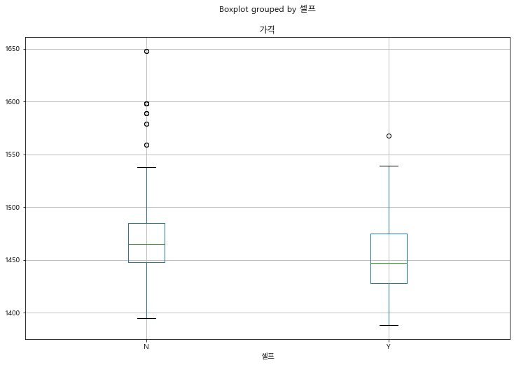
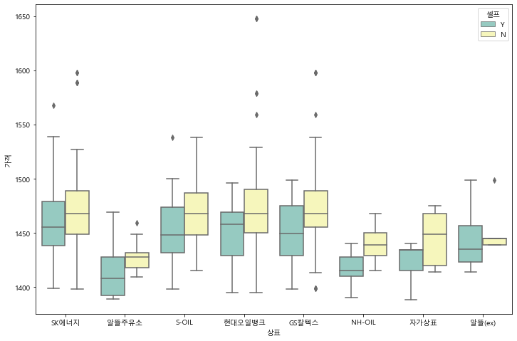
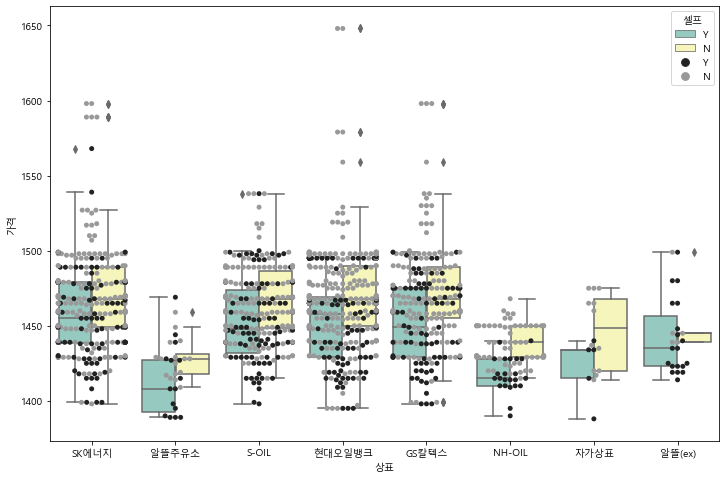

```python
from selenium import webdriver
```


```python
driver = webdriver.Chrome('../driver/chromedriver')
driver.get('https://www.google.com/webhp?hl=ko&sa=X&ved=0ahUKEwiYi-yV5JzpAhUCat4KHcf8DgkQPAgH')
```


```python
driver.save_screenshot('../images/001.jpg')
```

    C:\Users\Administrator\anaconda3\lib\site-packages\selenium\webdriver\remote\webdriver.py:1031: UserWarning: name used for saved screenshot does not match file type. It should end with a `.png` extension
      "type. It should end with a `.png` extension", UserWarning)
    


    True


```python
xpath ="""//*[@id="gb"]/div/div[2]/a"""
driver.find_element_by_xpath(xpath).click()
```


```python
elem_login = driver.find_element_by_id("identifierId")
elem_login.clear()
elem_login.send_keys("jeongho2712@gmail.com")
```


```python
xpath ="""//*[@id="identifierNext"]/div/button/div[2]"""
driver.find_element_by_xpath(xpath).click()
```


```python
driver.close()
```


```python
from selenium import webdriver
from selenium.webdriver import ActionChains
from selenium.webdriver.support.wait import WebDriverWait
from selenium.webdriver.common.by import By
from selenium.webdriver.support import expected_conditions as EC

driver = webdriver.Chrome('../driver/chromedriver')

driver.get('https://www.opinet.co.kr/searRgSelect.do')
```


```python
# xpath ="""//*[@id="header"]/div/ul/li[1]/ul/li[1]/a"""
# driver.find_element_by_xpath(xpath).click()
wait = WebDriverWait(driver, 10)


xpath = wait.until(EC.visibility_of_element_located((By.XPATH, """//*[@id="header"]/div/ul/li[1]/a""")))
ActionChains(driver).move_to_element(xpath).perform()

# benefits = wait.until(EC.visibility_of_element_located((By.XPATH, "//li[@class='item']/a[span='Benefits']")))
# ActionChains(driver).move_to_element(benefits).click().perform()
```


```python
xpath ="""//*[@id="header"]/div/ul/li[1]/ul/li[1]/a"""
driver.find_element_by_xpath(xpath).click()
```


```python
gu_list_raw = driver.find_element_by_xpath("""//*[@id="SIGUNGU_NM0"]""")
gu_list = gu_list_raw.find_elements_by_tag_name("option")
```


```python
gu_names = [option.get_attribute("value") for option in gu_list]
gu_names.remove('')
gu_names
```


    ['계룡시',
     '공주시',
     '금산군',
     '논산시',
     '당진시',
     '보령시',
     '부여군',
     '서산시',
     '서천군',
     '아산시',
     '예산군',
     '천안시',
     '천안시동남구',
     '천안시서북구',
     '청양군',
     '태안군',
     '홍성군']


```python
element = driver.find_element_by_id("SIGUNGU_NM0")
element.send_keys(gu_names[13])
```


```python
xpath ="""//*[@id="searRgSelect"]/span"""
element_sel_gu = driver.find_element_by_xpath(xpath).click()
```


```python
xpath ="""//*[@id="glopopd_excel"]/span"""
element_get_excel = driver.find_element_by_xpath(xpath).click()
```


```python
import time
from tqdm import tqdm_notebook


for gu in tqdm_notebook(gu_names):
    element = driver.find_element_by_id("SIGUNGU_NM0")
    element.send_keys(gu)
    
    time.sleep(2)
    
    xpath ="""//*[@id="searRgSelect"]/span"""
    element_sel_gu = driver.find_element_by_xpath(xpath).click()
    
    time.sleep(1)
    
    xpath ="""//*[@id="glopopd_excel"]/span"""
    element_get_excel = driver.find_element_by_xpath(xpath).click()
    
    time.sleep(1)
```

    C:\Users\Administrator\anaconda3\lib\site-packages\ipykernel_launcher.py:5: TqdmDeprecationWarning: This function will be removed in tqdm==5.0.0
    Please use `tqdm.notebook.tqdm` instead of `tqdm.tqdm_notebook`
      """
    


    HBox(children=(FloatProgress(value=0.0, max=17.0), HTML(value='')))


    
    


```python
driver.close()
```


```python
import pandas as pd
from glob import glob
```


```python
glob('../data/지역*.xls')
```


    ['../data\\지역_위치별(주유소) (1).xls',
     '../data\\지역_위치별(주유소) (10).xls',
     '../data\\지역_위치별(주유소) (11).xls',
     '../data\\지역_위치별(주유소) (12).xls',
     '../data\\지역_위치별(주유소) (13).xls',
     '../data\\지역_위치별(주유소) (14).xls',
     '../data\\지역_위치별(주유소) (15).xls',
     '../data\\지역_위치별(주유소) (16).xls',
     '../data\\지역_위치별(주유소) (17).xls',
     '../data\\지역_위치별(주유소) (2).xls',
     '../data\\지역_위치별(주유소) (3).xls',
     '../data\\지역_위치별(주유소) (4).xls',
     '../data\\지역_위치별(주유소) (5).xls',
     '../data\\지역_위치별(주유소) (6).xls',
     '../data\\지역_위치별(주유소) (7).xls',
     '../data\\지역_위치별(주유소) (8).xls',
     '../data\\지역_위치별(주유소) (9).xls',
     '../data\\지역_위치별(주유소).xls']


```python
stations_files = glob('../data/지역*.xls')
stations_files
```


    ['../data\\지역_위치별(주유소) (1).xls',
     '../data\\지역_위치별(주유소) (10).xls',
     '../data\\지역_위치별(주유소) (11).xls',
     '../data\\지역_위치별(주유소) (12).xls',
     '../data\\지역_위치별(주유소) (13).xls',
     '../data\\지역_위치별(주유소) (14).xls',
     '../data\\지역_위치별(주유소) (15).xls',
     '../data\\지역_위치별(주유소) (16).xls',
     '../data\\지역_위치별(주유소) (17).xls',
     '../data\\지역_위치별(주유소) (2).xls',
     '../data\\지역_위치별(주유소) (3).xls',
     '../data\\지역_위치별(주유소) (4).xls',
     '../data\\지역_위치별(주유소) (5).xls',
     '../data\\지역_위치별(주유소) (6).xls',
     '../data\\지역_위치별(주유소) (7).xls',
     '../data\\지역_위치별(주유소) (8).xls',
     '../data\\지역_위치별(주유소) (9).xls',
     '../data\\지역_위치별(주유소).xls']


```python
tmp_raw = []


for file_name in stations_files:
    tmp = pd.read_excel(file_name, header=2)
    tmp_raw.append(tmp)
    
stations_raw = pd.concat(tmp_raw)
```


```python
stations_raw.info()
```

    <class 'pandas.core.frame.DataFrame'>
    Int64Index: 1302 entries, 0 to 80
    Data columns (total 10 columns):
     #   Column  Non-Null Count  Dtype 
    ---  ------  --------------  ----- 
     0   지역      1302 non-null   object
     1   상호      1302 non-null   object
     2   주소      1302 non-null   object
     3   상표      1302 non-null   object
     4   전화번호    1302 non-null   object
     5   셀프여부    1302 non-null   object
     6   고급휘발유   1302 non-null   object
     7   휘발유     1302 non-null   object
     8   경유      1302 non-null   object
     9   실내등유    1302 non-null   object
    dtypes: object(10)
    memory usage: 111.9+ KB
    


```python
stations_raw
```


<div>
<style scoped>
    .dataframe tbody tr th:only-of-type {
        vertical-align: middle;
    }

    .dataframe tbody tr th {
        vertical-align: top;
    }

    .dataframe thead th {
        text-align: right;
    }
</style>
<table border="1" class="dataframe">
  <thead>
    <tr style="text-align: right;">
      <th></th>
      <th>지역</th>
      <th>상호</th>
      <th>주소</th>
      <th>상표</th>
      <th>전화번호</th>
      <th>셀프여부</th>
      <th>고급휘발유</th>
      <th>휘발유</th>
      <th>경유</th>
      <th>실내등유</th>
    </tr>
  </thead>
  <tbody>
    <tr>
      <th>0</th>
      <td>충청남도</td>
      <td>대운셀프주유소</td>
      <td>충남 계룡시 신도안면 계룡대로 663</td>
      <td>SK에너지</td>
      <td>042-551-3289</td>
      <td>Y</td>
      <td>-</td>
      <td>1415</td>
      <td>1215</td>
      <td>-</td>
    </tr>
    <tr>
      <th>1</th>
      <td>충청남도</td>
      <td>우체국물류주유소</td>
      <td>충남 계룡시 두마면 왕대로 102</td>
      <td>알뜰주유소</td>
      <td>070-7202-1376</td>
      <td>Y</td>
      <td>-</td>
      <td>1439</td>
      <td>1239</td>
      <td>-</td>
    </tr>
    <tr>
      <th>2</th>
      <td>충청남도</td>
      <td>양정주유소</td>
      <td>충남 계룡시 엄사면 계백로 3107</td>
      <td>S-OIL</td>
      <td>042-841-5148</td>
      <td>Y</td>
      <td>-</td>
      <td>1439</td>
      <td>1239</td>
      <td>-</td>
    </tr>
    <tr>
      <th>3</th>
      <td>충청남도</td>
      <td>두마주유소</td>
      <td>충청남도 계룡시 엄사면 계백로 3025</td>
      <td>SK에너지</td>
      <td>042-841-1313</td>
      <td>N</td>
      <td>-</td>
      <td>1449</td>
      <td>1259</td>
      <td>840</td>
    </tr>
    <tr>
      <th>4</th>
      <td>충청남도</td>
      <td>참좋은셀프주유소</td>
      <td>충남 계룡시 엄사면 계룡대로 449</td>
      <td>S-OIL</td>
      <td>042-841-6699</td>
      <td>Y</td>
      <td>-</td>
      <td>1489</td>
      <td>1289</td>
      <td>850</td>
    </tr>
    <tr>
      <th>...</th>
      <td>...</td>
      <td>...</td>
      <td>...</td>
      <td>...</td>
      <td>...</td>
      <td>...</td>
      <td>...</td>
      <td>...</td>
      <td>...</td>
      <td>...</td>
    </tr>
    <tr>
      <th>76</th>
      <td>충청남도</td>
      <td>구도일아시아주유소</td>
      <td>충남 천안시 서북구 서부대로 421</td>
      <td>S-OIL</td>
      <td>041-577-1868</td>
      <td>N</td>
      <td>-</td>
      <td>1538</td>
      <td>1298</td>
      <td>-</td>
    </tr>
    <tr>
      <th>77</th>
      <td>충청남도</td>
      <td>창성주유소</td>
      <td>충남 천안시 서북구 성환읍 성환1로 201</td>
      <td>SK에너지</td>
      <td>041-581-5151</td>
      <td>N</td>
      <td>-</td>
      <td>1589</td>
      <td>1389</td>
      <td>970</td>
    </tr>
    <tr>
      <th>78</th>
      <td>충청남도</td>
      <td>태양주유소/충전소</td>
      <td>충남 천안시 서북구 번영로 613</td>
      <td>GS칼텍스</td>
      <td>041-621-5185</td>
      <td>N</td>
      <td>-</td>
      <td>1598</td>
      <td>1398</td>
      <td>-</td>
    </tr>
    <tr>
      <th>79</th>
      <td>충청남도</td>
      <td>신직산주유소</td>
      <td>충남 천안시 서북구 직산읍 송기길 90</td>
      <td>GS칼텍스</td>
      <td>041-583-2031</td>
      <td>N</td>
      <td>-</td>
      <td>-</td>
      <td>-</td>
      <td>-</td>
    </tr>
    <tr>
      <th>80</th>
      <td>충청남도</td>
      <td>성환농협남부지점주유소</td>
      <td>충남 천안시 서북구 성환읍 성환중앙로 8</td>
      <td>NH-OIL</td>
      <td>041-581-0212</td>
      <td>N</td>
      <td>-</td>
      <td>-</td>
      <td>-</td>
      <td>-</td>
    </tr>
  </tbody>
</table>
<p>1302 rows × 10 columns</p>
</div>


```python
stations = pd.DataFrame({'Oil_store':stations_raw['상호'],
                        '주소':stations_raw['주소'],
                        '가격':stations_raw['휘발유'],
                        '셀프':stations_raw['셀프여부'],
                        '상표':stations_raw['상표']})

stations
```


<div>
<style scoped>
    .dataframe tbody tr th:only-of-type {
        vertical-align: middle;
    }

    .dataframe tbody tr th {
        vertical-align: top;
    }

    .dataframe thead th {
        text-align: right;
    }
</style>
<table border="1" class="dataframe">
  <thead>
    <tr style="text-align: right;">
      <th></th>
      <th>Oil_store</th>
      <th>주소</th>
      <th>가격</th>
      <th>셀프</th>
      <th>상표</th>
    </tr>
  </thead>
  <tbody>
    <tr>
      <th>0</th>
      <td>대운셀프주유소</td>
      <td>충남 계룡시 신도안면 계룡대로 663</td>
      <td>1415</td>
      <td>Y</td>
      <td>SK에너지</td>
    </tr>
    <tr>
      <th>1</th>
      <td>우체국물류주유소</td>
      <td>충남 계룡시 두마면 왕대로 102</td>
      <td>1439</td>
      <td>Y</td>
      <td>알뜰주유소</td>
    </tr>
    <tr>
      <th>2</th>
      <td>양정주유소</td>
      <td>충남 계룡시 엄사면 계백로 3107</td>
      <td>1439</td>
      <td>Y</td>
      <td>S-OIL</td>
    </tr>
    <tr>
      <th>3</th>
      <td>두마주유소</td>
      <td>충청남도 계룡시 엄사면 계백로 3025</td>
      <td>1449</td>
      <td>N</td>
      <td>SK에너지</td>
    </tr>
    <tr>
      <th>4</th>
      <td>참좋은셀프주유소</td>
      <td>충남 계룡시 엄사면 계룡대로 449</td>
      <td>1489</td>
      <td>Y</td>
      <td>S-OIL</td>
    </tr>
    <tr>
      <th>...</th>
      <td>...</td>
      <td>...</td>
      <td>...</td>
      <td>...</td>
      <td>...</td>
    </tr>
    <tr>
      <th>76</th>
      <td>구도일아시아주유소</td>
      <td>충남 천안시 서북구 서부대로 421</td>
      <td>1538</td>
      <td>N</td>
      <td>S-OIL</td>
    </tr>
    <tr>
      <th>77</th>
      <td>창성주유소</td>
      <td>충남 천안시 서북구 성환읍 성환1로 201</td>
      <td>1589</td>
      <td>N</td>
      <td>SK에너지</td>
    </tr>
    <tr>
      <th>78</th>
      <td>태양주유소/충전소</td>
      <td>충남 천안시 서북구 번영로 613</td>
      <td>1598</td>
      <td>N</td>
      <td>GS칼텍스</td>
    </tr>
    <tr>
      <th>79</th>
      <td>신직산주유소</td>
      <td>충남 천안시 서북구 직산읍 송기길 90</td>
      <td>-</td>
      <td>N</td>
      <td>GS칼텍스</td>
    </tr>
    <tr>
      <th>80</th>
      <td>성환농협남부지점주유소</td>
      <td>충남 천안시 서북구 성환읍 성환중앙로 8</td>
      <td>-</td>
      <td>N</td>
      <td>NH-OIL</td>
    </tr>
  </tbody>
</table>
<p>1302 rows × 5 columns</p>
</div>


```python
tmp_station = []

for eachAddress in stations['주소']:
    if eachAddress.split()[1][:2] != "천안":
        tmp_station.append(eachAddress.split()[1][:-1])
    else:
        if eachAddress.split()[2] == "서북구":
            tmp_station.append("천안 서북")
        else:
            tmp_station.append("천안 동남")
#         tmp_station.append(eachAddress.split()[1]+' '+eachAddress.split()[2])
#     [eachAddress.split()[1][:-1] for eachAddress in stations['주소']]

# print(tmp_station)
stations['시군구'] = tmp_station
stations.tail(10)
```


<div>
<style scoped>
    .dataframe tbody tr th:only-of-type {
        vertical-align: middle;
    }

    .dataframe tbody tr th {
        vertical-align: top;
    }

    .dataframe thead th {
        text-align: right;
    }
</style>
<table border="1" class="dataframe">
  <thead>
    <tr style="text-align: right;">
      <th></th>
      <th>Oil_store</th>
      <th>주소</th>
      <th>가격</th>
      <th>셀프</th>
      <th>상표</th>
      <th>시군구</th>
    </tr>
  </thead>
  <tbody>
    <tr>
      <th>71</th>
      <td>삼성테크노2주유소</td>
      <td>충남 천안시 서북구 직산읍 천안대로 1712</td>
      <td>1498</td>
      <td>N</td>
      <td>현대오일뱅크</td>
      <td>천안 서북</td>
    </tr>
    <tr>
      <th>72</th>
      <td>현대오일뱅크(주)직영 번영주유소</td>
      <td>충남 천안시 서북구 2공단1로 10 (성성동)</td>
      <td>1498</td>
      <td>N</td>
      <td>현대오일뱅크</td>
      <td>천안 서북</td>
    </tr>
    <tr>
      <th>73</th>
      <td>SK에너지㈜ 훼미리주유소</td>
      <td>충남 천안시 서북구 망향로 244</td>
      <td>1498</td>
      <td>N</td>
      <td>SK에너지</td>
      <td>천안 서북</td>
    </tr>
    <tr>
      <th>74</th>
      <td>대성주유소</td>
      <td>충남 천안시 서북구 성환읍 천안대로 2021</td>
      <td>1498</td>
      <td>N</td>
      <td>GS칼텍스</td>
      <td>천안 서북</td>
    </tr>
    <tr>
      <th>75</th>
      <td>명성주유소</td>
      <td>충남 천안시 서북구 직산읍 상덕로 174</td>
      <td>1518</td>
      <td>N</td>
      <td>GS칼텍스</td>
      <td>천안 서북</td>
    </tr>
    <tr>
      <th>76</th>
      <td>구도일아시아주유소</td>
      <td>충남 천안시 서북구 서부대로 421</td>
      <td>1538</td>
      <td>N</td>
      <td>S-OIL</td>
      <td>천안 서북</td>
    </tr>
    <tr>
      <th>77</th>
      <td>창성주유소</td>
      <td>충남 천안시 서북구 성환읍 성환1로 201</td>
      <td>1589</td>
      <td>N</td>
      <td>SK에너지</td>
      <td>천안 서북</td>
    </tr>
    <tr>
      <th>78</th>
      <td>태양주유소/충전소</td>
      <td>충남 천안시 서북구 번영로 613</td>
      <td>1598</td>
      <td>N</td>
      <td>GS칼텍스</td>
      <td>천안 서북</td>
    </tr>
    <tr>
      <th>79</th>
      <td>신직산주유소</td>
      <td>충남 천안시 서북구 직산읍 송기길 90</td>
      <td>-</td>
      <td>N</td>
      <td>GS칼텍스</td>
      <td>천안 서북</td>
    </tr>
    <tr>
      <th>80</th>
      <td>성환농협남부지점주유소</td>
      <td>충남 천안시 서북구 성환읍 성환중앙로 8</td>
      <td>-</td>
      <td>N</td>
      <td>NH-OIL</td>
      <td>천안 서북</td>
    </tr>
  </tbody>
</table>
</div>


```python
stations = stations.drop("시", axis=1)

stations.head()
```


    ---------------------------------------------------------------------------

    KeyError                                  Traceback (most recent call last)

    <ipython-input-34-1d1aee267abf> in <module>
    ----> 1 stations = stations.drop("시", axis=1)
          2 
          3 stations.head()
    

    ~\anaconda3\lib\site-packages\pandas\core\frame.py in drop(self, labels, axis, index, columns, level, inplace, errors)
       4310             level=level,
       4311             inplace=inplace,
    -> 4312             errors=errors,
       4313         )
       4314 
    

    ~\anaconda3\lib\site-packages\pandas\core\generic.py in drop(self, labels, axis, index, columns, level, inplace, errors)
       4150         for axis, labels in axes.items():
       4151             if labels is not None:
    -> 4152                 obj = obj._drop_axis(labels, axis, level=level, errors=errors)
       4153 
       4154         if inplace:
    

    ~\anaconda3\lib\site-packages\pandas\core\generic.py in _drop_axis(self, labels, axis, level, errors)
       4185                 new_axis = axis.drop(labels, level=level, errors=errors)
       4186             else:
    -> 4187                 new_axis = axis.drop(labels, errors=errors)
       4188             result = self.reindex(**{axis_name: new_axis})
       4189 
    

    ~\anaconda3\lib\site-packages\pandas\core\indexes\base.py in drop(self, labels, errors)
       5589         if mask.any():
       5590             if errors != "ignore":
    -> 5591                 raise KeyError(f"{labels[mask]} not found in axis")
       5592             indexer = indexer[~mask]
       5593         return self.delete(indexer)
    

    KeyError: "['시'] not found in axis"


```python
# stations['시군구'].unique()
# print(set(stations['시군구']))
stations['시군구'].unique()
```


    array(['계룡', '아산', '예산', '천안 동남', '천안 서북', '청양', '태안', '홍성', '공주', '금산',
           '논산', '당진', '보령', '부여', '서산', '서천'], dtype=object)


```python
stations.loc[stations['시군구']=='천안', '시군구'] = '천안 서북'


# stations.loc[stations['시군구'][:2]=='천안' and  stations['시군구'][4]=='동', '시군구'] = '천안 동남'
# stations.loc[stations['시군구'][:2]=='천안', '시군구'] = '천안 서북'
# stations.loc[stations['시군구'][:2]=='천안' and  stations['시군구'][4]!='동' and  stations['시군구'][4]!='서', '시군구'] = '천안 서북'


stations['시군구'].unique()
```


    array(['계룡', '아산', '예산', '천안 동남', '천안 서북', '청양', '태안', '홍성', '공주', '금산',
           '논산', '당진', '보령', '부여', '서산', '서천'], dtype=object)


```python
stations[stations['가격']=="-"]
```


<div>
<style scoped>
    .dataframe tbody tr th:only-of-type {
        vertical-align: middle;
    }

    .dataframe tbody tr th {
        vertical-align: top;
    }

    .dataframe thead th {
        text-align: right;
    }
</style>
<table border="1" class="dataframe">
  <thead>
    <tr style="text-align: right;">
      <th></th>
      <th>Oil_store</th>
      <th>주소</th>
      <th>가격</th>
      <th>셀프</th>
      <th>상표</th>
      <th>시군구</th>
    </tr>
  </thead>
  <tbody>
    <tr>
      <th>114</th>
      <td>영일주유소</td>
      <td>충남 아산시 충무로 62</td>
      <td>-</td>
      <td>N</td>
      <td>자가상표</td>
      <td>아산</td>
    </tr>
    <tr>
      <th>115</th>
      <td>성원주유소</td>
      <td>충남 아산시 영인면 아산호로 772</td>
      <td>-</td>
      <td>N</td>
      <td>자가상표</td>
      <td>아산</td>
    </tr>
    <tr>
      <th>116</th>
      <td>문방스타주유소</td>
      <td>충남 아산시 아산만로 1504</td>
      <td>-</td>
      <td>N</td>
      <td>현대오일뱅크</td>
      <td>아산</td>
    </tr>
    <tr>
      <th>117</th>
      <td>온양주유소</td>
      <td>충남 아산시 온천대로 1530 (온천동)</td>
      <td>-</td>
      <td>N</td>
      <td>자가상표</td>
      <td>아산</td>
    </tr>
    <tr>
      <th>62</th>
      <td>국민에너지㈜평화주유소</td>
      <td>충남 예산군 예산읍 예산산업단지로 8-1</td>
      <td>-</td>
      <td>Y</td>
      <td>자가상표</td>
      <td>예산</td>
    </tr>
    <tr>
      <th>63</th>
      <td>선진주유소</td>
      <td>충남 예산군 고덕면 상덕로 515</td>
      <td>-</td>
      <td>N</td>
      <td>자가상표</td>
      <td>예산</td>
    </tr>
    <tr>
      <th>64</th>
      <td>태영주유소</td>
      <td>충남 예산군 신암면 추사로 508</td>
      <td>-</td>
      <td>N</td>
      <td>자가상표</td>
      <td>예산</td>
    </tr>
    <tr>
      <th>65</th>
      <td>광시주유소</td>
      <td>충남 예산군 광시면 하장대서길 20</td>
      <td>-</td>
      <td>N</td>
      <td>자가상표</td>
      <td>예산</td>
    </tr>
    <tr>
      <th>171</th>
      <td>명품주유소</td>
      <td>충남 천안시 동남구 광덕면 차령고개로 788</td>
      <td>-</td>
      <td>N</td>
      <td>SK에너지</td>
      <td>천안 동남</td>
    </tr>
    <tr>
      <th>172</th>
      <td>성환농협남부지점주유소</td>
      <td>충남 천안시 서북구 성환읍 성환중앙로 8</td>
      <td>-</td>
      <td>N</td>
      <td>NH-OIL</td>
      <td>천안 서북</td>
    </tr>
    <tr>
      <th>173</th>
      <td>우리들주유소</td>
      <td>충남 천안시 동남구 풍세로 990 (청수동)</td>
      <td>-</td>
      <td>N</td>
      <td>현대오일뱅크</td>
      <td>천안 동남</td>
    </tr>
    <tr>
      <th>174</th>
      <td>대현주유소</td>
      <td>충남 천안시 동남구 목천읍 충절로 704</td>
      <td>-</td>
      <td>N</td>
      <td>GS칼텍스</td>
      <td>천안 동남</td>
    </tr>
    <tr>
      <th>175</th>
      <td>신직산주유소</td>
      <td>충남 천안시 서북구 직산읍 송기길 90</td>
      <td>-</td>
      <td>N</td>
      <td>GS칼텍스</td>
      <td>천안 서북</td>
    </tr>
    <tr>
      <th>92</th>
      <td>명품주유소</td>
      <td>충남 천안시 동남구 광덕면 차령고개로 788</td>
      <td>-</td>
      <td>N</td>
      <td>SK에너지</td>
      <td>천안 동남</td>
    </tr>
    <tr>
      <th>93</th>
      <td>대현주유소</td>
      <td>충남 천안시 동남구 목천읍 충절로 704</td>
      <td>-</td>
      <td>N</td>
      <td>GS칼텍스</td>
      <td>천안 동남</td>
    </tr>
    <tr>
      <th>94</th>
      <td>우리들주유소</td>
      <td>충남 천안시 동남구 풍세로 990 (청수동)</td>
      <td>-</td>
      <td>N</td>
      <td>현대오일뱅크</td>
      <td>천안 동남</td>
    </tr>
    <tr>
      <th>79</th>
      <td>신직산주유소</td>
      <td>충남 천안시 서북구 직산읍 송기길 90</td>
      <td>-</td>
      <td>N</td>
      <td>GS칼텍스</td>
      <td>천안 서북</td>
    </tr>
    <tr>
      <th>80</th>
      <td>성환농협남부지점주유소</td>
      <td>충남 천안시 서북구 성환읍 성환중앙로 8</td>
      <td>-</td>
      <td>N</td>
      <td>NH-OIL</td>
      <td>천안 서북</td>
    </tr>
    <tr>
      <th>28</th>
      <td>칠갑산주유소</td>
      <td>충청남도 청양군 정산면 칠갑산로 1580</td>
      <td>-</td>
      <td>N</td>
      <td>GS칼텍스</td>
      <td>청양</td>
    </tr>
    <tr>
      <th>29</th>
      <td>운곡주유소</td>
      <td>충청남도 청양군 청신로 452</td>
      <td>-</td>
      <td>Y</td>
      <td>자가상표</td>
      <td>청양</td>
    </tr>
    <tr>
      <th>30</th>
      <td>혜선주유소</td>
      <td>충남 청양군 화성면 대청로 64</td>
      <td>-</td>
      <td>N</td>
      <td>SK에너지</td>
      <td>청양</td>
    </tr>
    <tr>
      <th>31</th>
      <td>구봉주유소</td>
      <td>충남 청양군 화성면 대청로 737</td>
      <td>-</td>
      <td>N</td>
      <td>SK에너지</td>
      <td>청양</td>
    </tr>
    <tr>
      <th>39</th>
      <td>소원주유소</td>
      <td>충남 태안군 소원면 서해로 678</td>
      <td>-</td>
      <td>N</td>
      <td>SK에너지</td>
      <td>태안</td>
    </tr>
    <tr>
      <th>40</th>
      <td>몽산포주유소</td>
      <td>충남 태안군 남면 남면로 12</td>
      <td>-</td>
      <td>N</td>
      <td>SK에너지</td>
      <td>태안</td>
    </tr>
    <tr>
      <th>55</th>
      <td>홍성에너지</td>
      <td>충남 홍성군 홍성읍 충서로 1447</td>
      <td>-</td>
      <td>Y</td>
      <td>현대오일뱅크</td>
      <td>홍성</td>
    </tr>
    <tr>
      <th>56</th>
      <td>옥계주유소</td>
      <td>충남 홍성군 장곡면 무한로 803</td>
      <td>-</td>
      <td>N</td>
      <td>자가상표</td>
      <td>홍성</td>
    </tr>
    <tr>
      <th>57</th>
      <td>갈산주유소</td>
      <td>충남 홍성군 갈산면 갈산로 124</td>
      <td>-</td>
      <td>N</td>
      <td>현대오일뱅크</td>
      <td>홍성</td>
    </tr>
    <tr>
      <th>83</th>
      <td>가산주유소</td>
      <td>충청남도 공주시 의당면 의당전의로 887</td>
      <td>-</td>
      <td>N</td>
      <td>현대오일뱅크</td>
      <td>공주</td>
    </tr>
    <tr>
      <th>84</th>
      <td>대한주유소</td>
      <td>충남 공주시 소학동길 155 (소학동)</td>
      <td>-</td>
      <td>N</td>
      <td>GS칼텍스</td>
      <td>공주</td>
    </tr>
    <tr>
      <th>85</th>
      <td>중장주유소</td>
      <td>충남 공주시 계룡면 갑사로 347</td>
      <td>-</td>
      <td>N</td>
      <td>자가상표</td>
      <td>공주</td>
    </tr>
    <tr>
      <th>86</th>
      <td>영정대성주유소</td>
      <td>충남 공주시 신풍면 영정길 284</td>
      <td>-</td>
      <td>N</td>
      <td>현대오일뱅크</td>
      <td>공주</td>
    </tr>
    <tr>
      <th>40</th>
      <td>대둔산주유소</td>
      <td>충남 금산군 진산면 태고사로 450</td>
      <td>-</td>
      <td>N</td>
      <td>GS칼텍스</td>
      <td>금산</td>
    </tr>
    <tr>
      <th>41</th>
      <td>대양주유소</td>
      <td>충남 금산군 부리면 무금로 1831</td>
      <td>-</td>
      <td>N</td>
      <td>SK에너지</td>
      <td>금산</td>
    </tr>
    <tr>
      <th>42</th>
      <td>월석주유소</td>
      <td>충남 금산군 진산면 휴양림로 2111</td>
      <td>-</td>
      <td>N</td>
      <td>SK에너지</td>
      <td>금산</td>
    </tr>
    <tr>
      <th>79</th>
      <td>딸기주유소</td>
      <td>충남 논산시 강변로 61(등화동)</td>
      <td>-</td>
      <td>N</td>
      <td>현대오일뱅크</td>
      <td>논산</td>
    </tr>
    <tr>
      <th>80</th>
      <td>OK주유소</td>
      <td>충남 논산시 연무읍 동안로 961</td>
      <td>-</td>
      <td>N</td>
      <td>자가상표</td>
      <td>논산</td>
    </tr>
    <tr>
      <th>81</th>
      <td>덕암주유소</td>
      <td>충남 논산시 부적면 계백로 1760</td>
      <td>-</td>
      <td>N</td>
      <td>SK에너지</td>
      <td>논산</td>
    </tr>
    <tr>
      <th>82</th>
      <td>가득주유소</td>
      <td>충청남도 논산시 시민로 243(내동)</td>
      <td>-</td>
      <td>N</td>
      <td>S-OIL</td>
      <td>논산</td>
    </tr>
    <tr>
      <th>83</th>
      <td>우전산업주유소</td>
      <td>충남 논산시 연산면 선비로 496</td>
      <td>-</td>
      <td>N</td>
      <td>자가상표</td>
      <td>논산</td>
    </tr>
    <tr>
      <th>84</th>
      <td>태성주유소</td>
      <td>충남 논산시 벌곡면 수락로 865</td>
      <td>-</td>
      <td>N</td>
      <td>S-OIL</td>
      <td>논산</td>
    </tr>
    <tr>
      <th>98</th>
      <td>코멕스GS주유소</td>
      <td>충남 당진시 송악읍 복운로 7</td>
      <td>-</td>
      <td>N</td>
      <td>GS칼텍스</td>
      <td>당진</td>
    </tr>
    <tr>
      <th>99</th>
      <td>서야주유소</td>
      <td>충남 당진시 합덕읍 덕평로 319</td>
      <td>-</td>
      <td>N</td>
      <td>현대오일뱅크</td>
      <td>당진</td>
    </tr>
    <tr>
      <th>100</th>
      <td>당진(상)휴게소주유소</td>
      <td>충남 당진시 정미면 서해로 4912</td>
      <td>-</td>
      <td>N</td>
      <td>S-OIL</td>
      <td>당진</td>
    </tr>
    <tr>
      <th>54</th>
      <td>(주)우리주유소</td>
      <td>충청남도 보령시 남포방조제로 791 (신흑동)</td>
      <td>-</td>
      <td>N</td>
      <td>SK에너지</td>
      <td>보령</td>
    </tr>
    <tr>
      <th>55</th>
      <td>보령주유소</td>
      <td>충남 보령시 웅천읍 충서로 1350</td>
      <td>-</td>
      <td>N</td>
      <td>자가상표</td>
      <td>보령</td>
    </tr>
    <tr>
      <th>56</th>
      <td>주교고송영농회</td>
      <td>충청남도 보령시 주교면 토정로 886</td>
      <td>-</td>
      <td>N</td>
      <td>SK에너지</td>
      <td>보령</td>
    </tr>
    <tr>
      <th>57</th>
      <td>웅천주유소</td>
      <td>충남 보령시 웅천읍 충서로 1049</td>
      <td>-</td>
      <td>N</td>
      <td>SK에너지</td>
      <td>보령</td>
    </tr>
    <tr>
      <th>47</th>
      <td>123주유소</td>
      <td>충남 부여군 석성면 왕릉로 422</td>
      <td>-</td>
      <td>N</td>
      <td>SK에너지</td>
      <td>부여</td>
    </tr>
    <tr>
      <th>48</th>
      <td>제일주유소</td>
      <td>충남 부여군 부여읍 삼충로 372</td>
      <td>-</td>
      <td>N</td>
      <td>자가상표</td>
      <td>부여</td>
    </tr>
    <tr>
      <th>49</th>
      <td>죽림주유소</td>
      <td>충남 부여군 내산면 성충로 932</td>
      <td>-</td>
      <td>N</td>
      <td>현대오일뱅크</td>
      <td>부여</td>
    </tr>
    <tr>
      <th>50</th>
      <td>구두래주유소</td>
      <td>충남 부여군 부여읍 삼충로 184</td>
      <td>-</td>
      <td>N</td>
      <td>자가상표</td>
      <td>부여</td>
    </tr>
    <tr>
      <th>51</th>
      <td>대성주유소</td>
      <td>충남 부여군 은산면 충절로 3065</td>
      <td>-</td>
      <td>N</td>
      <td>SK에너지</td>
      <td>부여</td>
    </tr>
    <tr>
      <th>86</th>
      <td>하나주유소</td>
      <td>충남 서산시 안견로 115 (동문동)</td>
      <td>-</td>
      <td>N</td>
      <td>SK에너지</td>
      <td>서산</td>
    </tr>
    <tr>
      <th>87</th>
      <td>서산톨게이트주유소</td>
      <td>충남 서산시 운산면 운암로 895</td>
      <td>-</td>
      <td>Y</td>
      <td>SK에너지</td>
      <td>서산</td>
    </tr>
    <tr>
      <th>88</th>
      <td>하이츠제2주유소</td>
      <td>충남 서산시 대산읍 충의로 1869</td>
      <td>-</td>
      <td>N</td>
      <td>GS칼텍스</td>
      <td>서산</td>
    </tr>
    <tr>
      <th>79</th>
      <td>신직산주유소</td>
      <td>충남 천안시 서북구 직산읍 송기길 90</td>
      <td>-</td>
      <td>N</td>
      <td>GS칼텍스</td>
      <td>천안 서북</td>
    </tr>
    <tr>
      <th>80</th>
      <td>성환농협남부지점주유소</td>
      <td>충남 천안시 서북구 성환읍 성환중앙로 8</td>
      <td>-</td>
      <td>N</td>
      <td>NH-OIL</td>
      <td>천안 서북</td>
    </tr>
  </tbody>
</table>
</div>


```python
stations = stations[stations['가격'] != '-']
stations.head()
```


<div>
<style scoped>
    .dataframe tbody tr th:only-of-type {
        vertical-align: middle;
    }

    .dataframe tbody tr th {
        vertical-align: top;
    }

    .dataframe thead th {
        text-align: right;
    }
</style>
<table border="1" class="dataframe">
  <thead>
    <tr style="text-align: right;">
      <th></th>
      <th>Oil_store</th>
      <th>주소</th>
      <th>가격</th>
      <th>셀프</th>
      <th>상표</th>
      <th>시군구</th>
    </tr>
  </thead>
  <tbody>
    <tr>
      <th>0</th>
      <td>대운셀프주유소</td>
      <td>충남 계룡시 신도안면 계룡대로 663</td>
      <td>1415</td>
      <td>Y</td>
      <td>SK에너지</td>
      <td>계룡</td>
    </tr>
    <tr>
      <th>1</th>
      <td>우체국물류주유소</td>
      <td>충남 계룡시 두마면 왕대로 102</td>
      <td>1439</td>
      <td>Y</td>
      <td>알뜰주유소</td>
      <td>계룡</td>
    </tr>
    <tr>
      <th>2</th>
      <td>양정주유소</td>
      <td>충남 계룡시 엄사면 계백로 3107</td>
      <td>1439</td>
      <td>Y</td>
      <td>S-OIL</td>
      <td>계룡</td>
    </tr>
    <tr>
      <th>3</th>
      <td>두마주유소</td>
      <td>충청남도 계룡시 엄사면 계백로 3025</td>
      <td>1449</td>
      <td>N</td>
      <td>SK에너지</td>
      <td>계룡</td>
    </tr>
    <tr>
      <th>4</th>
      <td>참좋은셀프주유소</td>
      <td>충남 계룡시 엄사면 계룡대로 449</td>
      <td>1489</td>
      <td>Y</td>
      <td>S-OIL</td>
      <td>계룡</td>
    </tr>
  </tbody>
</table>
</div>


```python
stations['가격'] = [float(value) for value in stations['가격']]
```

    C:\Users\Administrator\anaconda3\lib\site-packages\ipykernel_launcher.py:1: SettingWithCopyWarning: 
    A value is trying to be set on a copy of a slice from a DataFrame.
    Try using .loc[row_indexer,col_indexer] = value instead
    
    See the caveats in the documentation: https://pandas.pydata.org/pandas-docs/stable/user_guide/indexing.html#returning-a-view-versus-a-copy
      """Entry point for launching an IPython kernel.
    


```python
stations.reset_index(inplace=True)
del stations['index']
```


```python
stations.info()
```

    <class 'pandas.core.frame.DataFrame'>
    RangeIndex: 1245 entries, 0 to 1244
    Data columns (total 6 columns):
     #   Column     Non-Null Count  Dtype  
    ---  ------     --------------  -----  
     0   Oil_store  1245 non-null   object 
     1   주소         1245 non-null   object 
     2   가격         1245 non-null   float64
     3   셀프         1245 non-null   object 
     4   상표         1245 non-null   object 
     5   시군구        1245 non-null   object 
    dtypes: float64(1), object(5)
    memory usage: 58.5+ KB
    


```python
import matplotlib.pyplot as plt
import seaborn as sns
%matplotlib inline

import platform

path = "c:/Windows/Fonts/malgun.ttf"
from matplotlib import font_manager, rc

font_name = font_manager.FontProperties(fname=path).get_name()
rc('font', family=font_name)
```


```python
stations.boxplot(column='가격', by='셀프', figsize=(12,8))
```


    <matplotlib.axes._subplots.AxesSubplot at 0x1b8cc793488>





```python
plt.figure(figsize=(12,8))

sns.boxplot(x="상표", y="가격", hue="셀프", data=stations, palette="Set3")

plt.show()
```





```python
plt.figure(figsize=(12,8))

sns.boxplot(x="상표", y="가격", hue="셀프", data=stations, palette="Set3")
sns.swarmplot(x="상표", y="가격", hue="셀프", data=stations, color=".6")

plt.show()
```





```python
import json
import folium
import googlemaps
import warnings

warnings.simplefilter(action="ignore", category=FutureWarning)
```


```python
stations.sort_values(by='가격', ascending=False).head()
```


<div>
<style scoped>
    .dataframe tbody tr th:only-of-type {
        vertical-align: middle;
    }

    .dataframe tbody tr th {
        vertical-align: top;
    }

    .dataframe thead th {
        text-align: right;
    }
</style>
<table border="1" class="dataframe">
  <thead>
    <tr style="text-align: right;">
      <th></th>
      <th>Oil_store</th>
      <th>주소</th>
      <th>가격</th>
      <th>셀프</th>
      <th>상표</th>
      <th>시군구</th>
    </tr>
  </thead>
  <tbody>
    <tr>
      <th>945</th>
      <td>CJ대한통운(주)직영 행담도(상행)주유소</td>
      <td>충남 당진시 신평면 서해안고속도로 275</td>
      <td>1648.0</td>
      <td>N</td>
      <td>현대오일뱅크</td>
      <td>당진</td>
    </tr>
    <tr>
      <th>944</th>
      <td>CJ대한통운(주)직영 행담도(하행)주유소</td>
      <td>충남 당진시 신평면 서해안고속도로 275</td>
      <td>1648.0</td>
      <td>N</td>
      <td>현대오일뱅크</td>
      <td>당진</td>
    </tr>
    <tr>
      <th>1244</th>
      <td>태양주유소/충전소</td>
      <td>충남 천안시 서북구 번영로 613</td>
      <td>1598.0</td>
      <td>N</td>
      <td>GS칼텍스</td>
      <td>천안 서북</td>
    </tr>
    <tr>
      <th>523</th>
      <td>태양주유소/충전소</td>
      <td>충남 천안시 서북구 번영로 613</td>
      <td>1598.0</td>
      <td>N</td>
      <td>GS칼텍스</td>
      <td>천안 서북</td>
    </tr>
    <tr>
      <th>444</th>
      <td>맘모스주유소</td>
      <td>충남 천안시 동남구 만남로 126 (신부동)</td>
      <td>1598.0</td>
      <td>N</td>
      <td>SK에너지</td>
      <td>천안 동남</td>
    </tr>
  </tbody>
</table>
</div>


```python
stations.sort_values(by='가격', ascending=True).head()
```


<div>
<style scoped>
    .dataframe tbody tr th:only-of-type {
        vertical-align: middle;
    }

    .dataframe tbody tr th {
        vertical-align: top;
    }

    .dataframe thead th {
        text-align: right;
    }
</style>
<table border="1" class="dataframe">
  <thead>
    <tr style="text-align: right;">
      <th></th>
      <th>Oil_store</th>
      <th>주소</th>
      <th>가격</th>
      <th>셀프</th>
      <th>상표</th>
      <th>시군구</th>
    </tr>
  </thead>
  <tbody>
    <tr>
      <th>946</th>
      <td>백두산주유소</td>
      <td>충남 보령시 대해로 498 (요암동)</td>
      <td>1388.0</td>
      <td>Y</td>
      <td>자가상표</td>
      <td>보령</td>
    </tr>
    <tr>
      <th>947</th>
      <td>24시 충청주유소</td>
      <td>충남 보령시 대해로 294 (남곡동)</td>
      <td>1389.0</td>
      <td>Y</td>
      <td>알뜰주유소</td>
      <td>보령</td>
    </tr>
    <tr>
      <th>552</th>
      <td>태안주유소</td>
      <td>충남 태안군 태안읍 안면대로 334</td>
      <td>1389.0</td>
      <td>Y</td>
      <td>알뜰주유소</td>
      <td>태안</td>
    </tr>
    <tr>
      <th>948</th>
      <td>24시 대천주유소</td>
      <td>충남 보령시 중앙로 172 (대천동)</td>
      <td>1389.0</td>
      <td>Y</td>
      <td>알뜰주유소</td>
      <td>보령</td>
    </tr>
    <tr>
      <th>120</th>
      <td>광시농협주유소</td>
      <td>충남 예산군 광시면 예당로 187</td>
      <td>1390.0</td>
      <td>Y</td>
      <td>NH-OIL</td>
      <td>예산</td>
    </tr>
  </tbody>
</table>
</div>


```python
import numpy as np


gu_data = pd.pivot_table(stations,
                        index = ['시군구'],
                        values=['가격'],
                        aggfunc=np.mean)

gu_data.head()
```


<div>
<style scoped>
    .dataframe tbody tr th:only-of-type {
        vertical-align: middle;
    }

    .dataframe tbody tr th {
        vertical-align: top;
    }

    .dataframe thead th {
        text-align: right;
    }
</style>
<table border="1" class="dataframe">
  <thead>
    <tr style="text-align: right;">
      <th></th>
      <th>가격</th>
    </tr>
    <tr>
      <th>시군구</th>
      <th></th>
    </tr>
  </thead>
  <tbody>
    <tr>
      <th>계룡</th>
      <td>1455.000000</td>
    </tr>
    <tr>
      <th>공주</th>
      <td>1449.349398</td>
    </tr>
    <tr>
      <th>금산</th>
      <td>1463.550000</td>
    </tr>
    <tr>
      <th>논산</th>
      <td>1441.620253</td>
    </tr>
    <tr>
      <th>당진</th>
      <td>1465.295918</td>
    </tr>
  </tbody>
</table>
</div>


```python
geo_path = '../data/05. skorea_municipalities_geo_simple.json'
geo_str = json.load(open(geo_path, encoding='utf-8'))


map = folium.Map(location=[36.799791, 127.134545],
                zoom_start = 10.5,
                tiles="Stamen Toner")

map.choropleth(geo_data = geo_str,
               data = gu_data,
               columns = [gu_data.index, '가격'],
               fill_color='PuRd',
               key_on='feature.id')

map
```


<div style="width:100%;"><div style="position:relative;width:100%;height:0;padding-bottom:60%;"><span style="color:#565656">Make this Notebook Trusted to load map: File -> Trust Notebook</span><iframe src="about:blank" style="position:absolute;width:100%;height:100%;left:0;top:0;border:none !important;" data-html=%3C%21DOCTYPE%20html%3E%0A%3Chead%3E%20%20%20%20%0A%20%20%20%20%3Cmeta%20http-equiv%3D%22content-type%22%20content%3D%22text/html%3B%20charset%3DUTF-8%22%20/%3E%0A%20%20%20%20%0A%20%20%20%20%20%20%20%20%3Cscript%3E%0A%20%20%20%20%20%20%20%20%20%20%20%20L_NO_TOUCH%20%3D%20false%3B%0A%20%20%20%20%20%20%20%20%20%20%20%20L_DISABLE_3D%20%3D%20false%3B%0A%20%20%20%20%20%20%20%20%3C/script%3E%0A%20%20%20%20%0A%20%20%20%20%3Cstyle%3Ehtml%2C%20body%20%7Bwidth%3A%20100%25%3Bheight%3A%20100%25%3Bmargin%3A%200%3Bpadding%3A%200%3B%7D%3C/style%3E%0A%20%20%20%20%3Cstyle%3E%23map%20%7Bposition%3Aabsolute%3Btop%3A0%3Bbottom%3A0%3Bright%3A0%3Bleft%3A0%3B%7D%3C/style%3E%0A%20%20%20%20%3Cscript%20src%3D%22https%3A//cdn.jsdelivr.net/npm/leaflet%401.6.0/dist/leaflet.js%22%3E%3C/script%3E%0A%20%20%20%20%3Cscript%20src%3D%22https%3A//code.jquery.com/jquery-1.12.4.min.js%22%3E%3C/script%3E%0A%20%20%20%20%3Cscript%20src%3D%22https%3A//maxcdn.bootstrapcdn.com/bootstrap/3.2.0/js/bootstrap.min.js%22%3E%3C/script%3E%0A%20%20%20%20%3Cscript%20src%3D%22https%3A//cdnjs.cloudflare.com/ajax/libs/Leaflet.awesome-markers/2.0.2/leaflet.awesome-markers.js%22%3E%3C/script%3E%0A%20%20%20%20%3Clink%20rel%3D%22stylesheet%22%20href%3D%22https%3A//cdn.jsdelivr.net/npm/leaflet%401.6.0/dist/leaflet.css%22/%3E%0A%20%20%20%20%3Clink%20rel%3D%22stylesheet%22%20href%3D%22https%3A//maxcdn.bootstrapcdn.com/bootstrap/3.2.0/css/bootstrap.min.css%22/%3E%0A%20%20%20%20%3Clink%20rel%3D%22stylesheet%22%20href%3D%22https%3A//maxcdn.bootstrapcdn.com/bootstrap/3.2.0/css/bootstrap-theme.min.css%22/%3E%0A%20%20%20%20%3Clink%20rel%3D%22stylesheet%22%20href%3D%22https%3A//maxcdn.bootstrapcdn.com/font-awesome/4.6.3/css/font-awesome.min.css%22/%3E%0A%20%20%20%20%3Clink%20rel%3D%22stylesheet%22%20href%3D%22https%3A//cdnjs.cloudflare.com/ajax/libs/Leaflet.awesome-markers/2.0.2/leaflet.awesome-markers.css%22/%3E%0A%20%20%20%20%3Clink%20rel%3D%22stylesheet%22%20href%3D%22https%3A//cdn.jsdelivr.net/gh/python-visualization/folium/folium/templates/leaflet.awesome.rotate.min.css%22/%3E%0A%20%20%20%20%0A%20%20%20%20%20%20%20%20%20%20%20%20%3Cmeta%20name%3D%22viewport%22%20content%3D%22width%3Ddevice-width%2C%0A%20%20%20%20%20%20%20%20%20%20%20%20%20%20%20%20initial-scale%3D1.0%2C%20maximum-scale%3D1.0%2C%20user-scalable%3Dno%22%20/%3E%0A%20%20%20%20%20%20%20%20%20%20%20%20%3Cstyle%3E%0A%20%20%20%20%20%20%20%20%20%20%20%20%20%20%20%20%23map_13037b8d6b6a420c80401e4f78505eee%20%7B%0A%20%20%20%20%20%20%20%20%20%20%20%20%20%20%20%20%20%20%20%20position%3A%20relative%3B%0A%20%20%20%20%20%20%20%20%20%20%20%20%20%20%20%20%20%20%20%20width%3A%20100.0%25%3B%0A%20%20%20%20%20%20%20%20%20%20%20%20%20%20%20%20%20%20%20%20height%3A%20100.0%25%3B%0A%20%20%20%20%20%20%20%20%20%20%20%20%20%20%20%20%20%20%20%20left%3A%200.0%25%3B%0A%20%20%20%20%20%20%20%20%20%20%20%20%20%20%20%20%20%20%20%20top%3A%200.0%25%3B%0A%20%20%20%20%20%20%20%20%20%20%20%20%20%20%20%20%7D%0A%20%20%20%20%20%20%20%20%20%20%20%20%3C/style%3E%0A%20%20%20%20%20%20%20%20%0A%20%20%20%20%3Cscript%20src%3D%22https%3A//cdnjs.cloudflare.com/ajax/libs/d3/3.5.5/d3.min.js%22%3E%3C/script%3E%0A%3C/head%3E%0A%3Cbody%3E%20%20%20%20%0A%20%20%20%20%0A%20%20%20%20%20%20%20%20%20%20%20%20%3Cdiv%20class%3D%22folium-map%22%20id%3D%22map_13037b8d6b6a420c80401e4f78505eee%22%20%3E%3C/div%3E%0A%20%20%20%20%20%20%20%20%0A%3C/body%3E%0A%3Cscript%3E%20%20%20%20%0A%20%20%20%20%0A%20%20%20%20%20%20%20%20%20%20%20%20var%20map_13037b8d6b6a420c80401e4f78505eee%20%3D%20L.map%28%0A%20%20%20%20%20%20%20%20%20%20%20%20%20%20%20%20%22map_13037b8d6b6a420c80401e4f78505eee%22%2C%0A%20%20%20%20%20%20%20%20%20%20%20%20%20%20%20%20%7B%0A%20%20%20%20%20%20%20%20%20%20%20%20%20%20%20%20%20%20%20%20center%3A%20%5B36.799791%2C%20127.134545%5D%2C%0A%20%20%20%20%20%20%20%20%20%20%20%20%20%20%20%20%20%20%20%20crs%3A%20L.CRS.EPSG3857%2C%0A%20%20%20%20%20%20%20%20%20%20%20%20%20%20%20%20%20%20%20%20zoom%3A%2010.5%2C%0A%20%20%20%20%20%20%20%20%20%20%20%20%20%20%20%20%20%20%20%20zoomControl%3A%20true%2C%0A%20%20%20%20%20%20%20%20%20%20%20%20%20%20%20%20%20%20%20%20preferCanvas%3A%20false%2C%0A%20%20%20%20%20%20%20%20%20%20%20%20%20%20%20%20%7D%0A%20%20%20%20%20%20%20%20%20%20%20%20%29%3B%0A%0A%20%20%20%20%20%20%20%20%20%20%20%20%0A%0A%20%20%20%20%20%20%20%20%0A%20%20%20%20%0A%20%20%20%20%20%20%20%20%20%20%20%20var%20tile_layer_34fe29ea8a414cbf816cdaa20676b0bf%20%3D%20L.tileLayer%28%0A%20%20%20%20%20%20%20%20%20%20%20%20%20%20%20%20%22https%3A//stamen-tiles-%7Bs%7D.a.ssl.fastly.net/toner/%7Bz%7D/%7Bx%7D/%7By%7D.png%22%2C%0A%20%20%20%20%20%20%20%20%20%20%20%20%20%20%20%20%7B%22attribution%22%3A%20%22Map%20tiles%20by%20%5Cu003ca%20href%3D%5C%22http%3A//stamen.com%5C%22%5Cu003eStamen%20Design%5Cu003c/a%5Cu003e%2C%20under%20%5Cu003ca%20href%3D%5C%22http%3A//creativecommons.org/licenses/by/3.0%5C%22%5Cu003eCC%20BY%203.0%5Cu003c/a%5Cu003e.%20Data%20by%20%5Cu0026copy%3B%20%5Cu003ca%20href%3D%5C%22http%3A//openstreetmap.org%5C%22%5Cu003eOpenStreetMap%5Cu003c/a%5Cu003e%2C%20under%20%5Cu003ca%20href%3D%5C%22http%3A//www.openstreetmap.org/copyright%5C%22%5Cu003eODbL%5Cu003c/a%5Cu003e.%22%2C%20%22detectRetina%22%3A%20false%2C%20%22maxNativeZoom%22%3A%2018%2C%20%22maxZoom%22%3A%2018%2C%20%22minZoom%22%3A%200%2C%20%22noWrap%22%3A%20false%2C%20%22opacity%22%3A%201%2C%20%22subdomains%22%3A%20%22abc%22%2C%20%22tms%22%3A%20false%7D%0A%20%20%20%20%20%20%20%20%20%20%20%20%29.addTo%28map_13037b8d6b6a420c80401e4f78505eee%29%3B%0A%20%20%20%20%20%20%20%20%0A%20%20%20%20%0A%20%20%20%20%20%20%20%20%20%20%20%20var%20choropleth_a5228892ba5544e7bad5a156de9eb08a%20%3D%20L.featureGroup%28%0A%20%20%20%20%20%20%20%20%20%20%20%20%20%20%20%20%7B%7D%0A%20%20%20%20%20%20%20%20%20%20%20%20%29.addTo%28map_13037b8d6b6a420c80401e4f78505eee%29%3B%0A%20%20%20%20%20%20%20%20%0A%20%20%20%20%0A%20%20%20%20%20%20%20%20function%20geo_json_5dc16d09bbef4cc3ba28d5636235790b_styler%28feature%29%20%7B%0A%20%20%20%20%20%20%20%20%20%20%20%20switch%28feature.id%29%20%7B%0A%20%20%20%20%20%20%20%20%20%20%20%20%20%20%20%20case%20%22%5Cud0dc%5Cuc548%22%3A%20case%20%22%5Cuccad%5Cuc591%22%3A%20case%20%22%5Cuc11c%5Cucc9c%22%3A%20case%20%22%5Cubd80%5Cuc5ec%22%3A%20case%20%22%5Cuacc4%5Cub8e1%22%3A%20%0A%20%20%20%20%20%20%20%20%20%20%20%20%20%20%20%20%20%20%20%20return%20%7B%22color%22%3A%20%22black%22%2C%20%22fillColor%22%3A%20%22%23df65b0%22%2C%20%22fillOpacity%22%3A%200.6%2C%20%22opacity%22%3A%201%2C%20%22weight%22%3A%201%7D%3B%0A%20%20%20%20%20%20%20%20%20%20%20%20%20%20%20%20case%20%22%5Cuc608%5Cuc0b0%22%3A%20%0A%20%20%20%20%20%20%20%20%20%20%20%20%20%20%20%20%20%20%20%20return%20%7B%22color%22%3A%20%22black%22%2C%20%22fillColor%22%3A%20%22%23c994c7%22%2C%20%22fillOpacity%22%3A%200.6%2C%20%22opacity%22%3A%201%2C%20%22weight%22%3A%201%7D%3B%0A%20%20%20%20%20%20%20%20%20%20%20%20%20%20%20%20case%20%22%5Cud64d%5Cuc131%22%3A%20case%20%22%5Cub17c%5Cuc0b0%22%3A%20case%20%22%5Cubcf4%5Cub839%22%3A%20%0A%20%20%20%20%20%20%20%20%20%20%20%20%20%20%20%20%20%20%20%20return%20%7B%22color%22%3A%20%22black%22%2C%20%22fillColor%22%3A%20%22%23f1eef6%22%2C%20%22fillOpacity%22%3A%200.6%2C%20%22opacity%22%3A%201%2C%20%22weight%22%3A%201%7D%3B%0A%20%20%20%20%20%20%20%20%20%20%20%20%20%20%20%20case%20%22%5Cuae08%5Cuc0b0%22%3A%20%0A%20%20%20%20%20%20%20%20%20%20%20%20%20%20%20%20%20%20%20%20return%20%7B%22color%22%3A%20%22black%22%2C%20%22fillColor%22%3A%20%22%23dd1c77%22%2C%20%22fillOpacity%22%3A%200.6%2C%20%22opacity%22%3A%201%2C%20%22weight%22%3A%201%7D%3B%0A%20%20%20%20%20%20%20%20%20%20%20%20%20%20%20%20case%20%22%5Cub2f9%5Cuc9c4%22%3A%20case%20%22%5Cuc11c%5Cuc0b0%22%3A%20case%20%22%5Cuc544%5Cuc0b0%22%3A%20case%20%22%5Cucc9c%5Cuc548%20%5Cuc11c%5Cubd81%22%3A%20case%20%22%5Cucc9c%5Cuc548%20%5Cub3d9%5Cub0a8%22%3A%20%0A%20%20%20%20%20%20%20%20%20%20%20%20%20%20%20%20%20%20%20%20return%20%7B%22color%22%3A%20%22black%22%2C%20%22fillColor%22%3A%20%22%23980043%22%2C%20%22fillOpacity%22%3A%200.6%2C%20%22opacity%22%3A%201%2C%20%22weight%22%3A%201%7D%3B%0A%20%20%20%20%20%20%20%20%20%20%20%20%20%20%20%20case%20%22%5Cuacf5%5Cuc8fc%22%3A%20%0A%20%20%20%20%20%20%20%20%20%20%20%20%20%20%20%20%20%20%20%20return%20%7B%22color%22%3A%20%22black%22%2C%20%22fillColor%22%3A%20%22%23d4b9da%22%2C%20%22fillOpacity%22%3A%200.6%2C%20%22opacity%22%3A%201%2C%20%22weight%22%3A%201%7D%3B%0A%20%20%20%20%20%20%20%20%20%20%20%20%20%20%20%20default%3A%0A%20%20%20%20%20%20%20%20%20%20%20%20%20%20%20%20%20%20%20%20return%20%7B%22color%22%3A%20%22black%22%2C%20%22fillColor%22%3A%20%22black%22%2C%20%22fillOpacity%22%3A%200.6%2C%20%22opacity%22%3A%201%2C%20%22weight%22%3A%201%7D%3B%0A%20%20%20%20%20%20%20%20%20%20%20%20%7D%0A%20%20%20%20%20%20%20%20%7D%0A%0A%20%20%20%20%20%20%20%20function%20geo_json_5dc16d09bbef4cc3ba28d5636235790b_onEachFeature%28feature%2C%20layer%29%20%7B%0A%20%20%20%20%20%20%20%20%20%20%20%20layer.on%28%7B%0A%20%20%20%20%20%20%20%20%20%20%20%20%7D%29%3B%0A%20%20%20%20%20%20%20%20%7D%3B%0A%20%20%20%20%20%20%20%20var%20geo_json_5dc16d09bbef4cc3ba28d5636235790b%20%3D%20L.geoJson%28null%2C%20%7B%0A%20%20%20%20%20%20%20%20%20%20%20%20%20%20%20%20onEachFeature%3A%20geo_json_5dc16d09bbef4cc3ba28d5636235790b_onEachFeature%2C%0A%20%20%20%20%20%20%20%20%20%20%20%20%0A%20%20%20%20%20%20%20%20%20%20%20%20%20%20%20%20style%3A%20geo_json_5dc16d09bbef4cc3ba28d5636235790b_styler%2C%0A%20%20%20%20%20%20%20%20%7D%29%3B%0A%0A%20%20%20%20%20%20%20%20function%20geo_json_5dc16d09bbef4cc3ba28d5636235790b_add%20%28data%29%20%7B%0A%20%20%20%20%20%20%20%20%20%20%20%20geo_json_5dc16d09bbef4cc3ba28d5636235790b%0A%20%20%20%20%20%20%20%20%20%20%20%20%20%20%20%20.addData%28data%29%0A%20%20%20%20%20%20%20%20%20%20%20%20%20%20%20%20.addTo%28choropleth_a5228892ba5544e7bad5a156de9eb08a%29%3B%0A%20%20%20%20%20%20%20%20%7D%0A%20%20%20%20%20%20%20%20%20%20%20%20geo_json_5dc16d09bbef4cc3ba28d5636235790b_add%28%7B%22features%22%3A%20%5B%7B%22geometry%22%3A%20%7B%22coordinates%22%3A%20%5B%5B%5B126.1701670531016%2C%2033.27833920373795%5D%2C%20%5B126.17796199822318%2C%2033.28904450342792%5D%2C%20%5B126.20366562455006%2C%2033.292582069125935%5D%2C%20%5B126.23227804627976%2C%2033.28054651709448%5D%2C%20%5B126.27081469983565%2C%2033.29305651947374%5D%2C%20%5B126.28692516789717%2C%2033.3095121006344%5D%2C%20%5B126.32582807936741%2C%2033.32307849544494%5D%2C%20%5B126.33863040850332%2C%2033.33700002289742%5D%2C%20%5B126.37692773779688%2C%2033.34348978209229%5D%2C%20%5B126.42008790072302%2C%2033.33448285889923%5D%2C%20%5B126.43967991919219%2C%2033.34042205120408%5D%2C%20%5B126.44742456956253%2C%2033.35529267692266%5D%2C%20%5B126.4918716225209%2C%2033.351283204155564%5D%2C%20%5B126.54001194569452%2C%2033.35949354681064%5D%2C%20%5B126.55310458705854%2C%2033.368769331336765%5D%2C%20%5B126.5830715764017%2C%2033.368027779973275%5D%2C%20%5B126.65655971322707%2C%2033.39658294968576%5D%2C%20%5B126.68911351796443%2C%2033.39691133705054%5D%2C%20%5B126.70784071345439%2C%2033.41819831436605%5D%2C%20%5B126.73472429940135%2C%2033.422146338653775%5D%2C%20%5B126.75951968887561%2C%2033.41497179862364%5D%2C%20%5B126.79074582138537%2C%2033.43825351998022%5D%2C%20%5B126.82385785054652%2C%2033.44338028367965%5D%2C%20%5B126.8898274152664%2C%2033.47823603716075%5D%2C%20%5B126.90529687529418%2C%2033.480086403367224%5D%2C%20%5B126.91451306461225%2C%2033.46996423390579%5D%2C%20%5B126.93834260748045%2C%2033.47055272752707%5D%2C%20%5B126.91017277435895%2C%2033.402610687558585%5D%2C%20%5B126.90919306806411%2C%2033.3879255679562%5D%2C%20%5B126.87535882585192%2C%2033.36822409322237%5D%2C%20%5B126.8705501162605%2C%2033.34975159885652%5D%2C%20%5B126.84671810776004%2C%2033.33005904428782%5D%2C%20%5B126.83805963301805%2C%2033.30541883125935%5D%2C%20%5B126.81058128765947%2C%2033.29810905802241%5D%2C%20%5B126.78058721090692%2C%2033.30348117728641%5D%2C%20%5B126.74744517061241%2C%2033.27477917807315%5D%2C%20%5B126.69397491052028%2C%2033.26589785324775%5D%2C%20%5B126.66139509103422%2C%2033.26764883602634%5D%2C%20%5B126.64370899012728%2C%2033.26176379473827%5D%2C%20%5B126.62124671799259%2C%2033.238001461003755%5D%2C%20%5B126.60023270919079%2C%2033.23253794499945%5D%2C%20%5B126.58793276547512%2C%2033.24078903556731%5D%2C%20%5B126.55000275643071%2C%2033.233994617394124%5D%2C%20%5B126.52287888872885%2C%2033.237410624439875%5D%2C%20%5B126.5112182224236%2C%2033.226741039104716%5D%2C%20%5B126.47233571972863%2C%2033.219241198557235%5D%2C%20%5B126.45245786615838%2C%2033.23676200849374%5D%2C%20%5B126.43326944303328%2C%2033.22862021392413%5D%2C%20%5B126.41456422346796%2C%2033.24077765309614%5D%2C%20%5B126.38663415314419%2C%2033.2281960784446%5D%2C%20%5B126.32186188505729%2C%2033.2348134021202%5D%2C%20%5B126.29961093191966%2C%2033.219470994774156%5D%2C%20%5B126.29462959454436%2C%2033.20325737472914%5D%2C%20%5B126.27360444082919%2C%2033.19065258266024%5D%2C%20%5B126.2344607950971%2C%2033.231192587887506%5D%2C%20%5B126.20182608174507%2C%2033.242644947267415%5D%2C%20%5B126.18421578146823%2C%2033.2556336839387%5D%2C%20%5B126.1701670531016%2C%2033.27833920373795%5D%5D%5D%2C%20%22type%22%3A%20%22Polygon%22%7D%2C%20%22id%22%3A%20%22%5Cuc11c%5Cuadc0%5Cud3ec%22%2C%20%22properties%22%3A%20%7B%22base_year%22%3A%20%222013%22%2C%20%22code%22%3A%20%2239020%22%2C%20%22name%22%3A%20%22%5Cuc11c%5Cuadc0%5Cud3ec%5Cuc2dc%22%2C%20%22name_eng%22%3A%20%22Seogwipo-si%22%7D%2C%20%22type%22%3A%20%22Feature%22%7D%2C%20%7B%22geometry%22%3A%20%7B%22coordinates%22%3A%20%5B%5B%5B%5B126.95749379080732%2C%2033.52245641440839%5D%2C%20%5B126.9731989684708%2C%2033.498754077952555%5D%2C%20%5B126.94954584507536%2C%2033.4895447597362%5D%2C%20%5B126.94279608187666%2C%2033.50103054337929%5D%2C%20%5B126.95749379080732%2C%2033.52245641440839%5D%5D%5D%2C%20%5B%5B%5B126.90529687529418%2C%2033.480086403367224%5D%2C%20%5B126.8898274152664%2C%2033.47823603716075%5D%2C%20%5B126.82385785054652%2C%2033.44338028367965%5D%2C%20%5B126.79074582138537%2C%2033.43825351998022%5D%2C%20%5B126.75951968887561%2C%2033.41497179862364%5D%2C%20%5B126.73472429940135%2C%2033.422146338653775%5D%2C%20%5B126.70784071345439%2C%2033.41819831436605%5D%2C%20%5B126.68911351796443%2C%2033.39691133705054%5D%2C%20%5B126.65655971322707%2C%2033.39658294968576%5D%2C%20%5B126.5830715764017%2C%2033.368027779973275%5D%2C%20%5B126.55310458705854%2C%2033.368769331336765%5D%2C%20%5B126.54001194569452%2C%2033.35949354681064%5D%2C%20%5B126.4918716225209%2C%2033.351283204155564%5D%2C%20%5B126.44742456956253%2C%2033.35529267692266%5D%2C%20%5B126.43967991919219%2C%2033.34042205120408%5D%2C%20%5B126.42008790072302%2C%2033.33448285889923%5D%2C%20%5B126.37692773779688%2C%2033.34348978209229%5D%2C%20%5B126.33863040850332%2C%2033.33700002289742%5D%2C%20%5B126.32582807936741%2C%2033.32307849544494%5D%2C%20%5B126.28692516789717%2C%2033.3095121006344%5D%2C%20%5B126.27081469983565%2C%2033.29305651947374%5D%2C%20%5B126.23227804627976%2C%2033.28054651709448%5D%2C%20%5B126.20366562455006%2C%2033.292582069125935%5D%2C%20%5B126.17796199822318%2C%2033.28904450342792%5D%2C%20%5B126.1701670531016%2C%2033.27833920373795%5D%2C%20%5B126.16319295942347%2C%2033.32059642402829%5D%2C%20%5B126.1692541537235%2C%2033.34310558958249%5D%2C%20%5B126.21461375807213%2C%2033.37309156042842%5D%2C%20%5B126.2619192214544%2C%2033.413737972061774%5D%2C%20%5B126.26197058380335%2C%2033.43142547688364%5D%2C%20%5B126.3070400569873%2C%2033.44823091074929%5D%2C%20%5B126.31005406486322%2C%2033.463098336550836%5D%2C%20%5B126.33749501698236%2C%2033.46367421762971%5D%2C%20%5B126.38761176138898%2C%2033.4865145900699%5D%2C%20%5B126.39670361974751%2C%2033.4811364736424%5D%2C%20%5B126.48208433034038%2C%2033.50677622835366%5D%2C%20%5B126.49529547568828%2C%2033.5184121837681%5D%2C%20%5B126.51667984271614%2C%2033.51331402436857%5D%2C%20%5B126.54176863235955%2C%2033.527562476211756%5D%2C%20%5B126.55087422195945%2C%2033.51759024881304%5D%2C%20%5B126.58362236141552%2C%2033.523927713435334%5D%2C%20%5B126.59940627536525%2C%2033.53451980393117%5D%2C%20%5B126.63484958960886%2C%2033.53527429124482%5D%2C%20%5B126.64568938881722%2C%2033.553414822717535%5D%2C%20%5B126.66008979414049%2C%2033.548871831149306%5D%2C%20%5B126.75800613842082%2C%2033.55555170516014%5D%2C%20%5B126.78655545465347%2C%2033.562854180697364%5D%2C%20%5B126.80185825451599%2C%2033.553702356637885%5D%2C%20%5B126.82997198815602%2C%2033.55685083846837%5D%2C%20%5B126.8331417008821%2C%2033.543008206988866%5D%2C%20%5B126.85956040111658%2C%2033.5237459631211%5D%2C%20%5B126.87389326759744%2C%2033.52840985278047%5D%2C%20%5B126.9044869524447%2C%2033.52306487335703%5D%2C%20%5B126.91799070617053%2C%2033.498337310154%5D%2C%20%5B126.90529687529418%2C%2033.480086403367224%5D%5D%5D%5D%2C%20%22type%22%3A%20%22MultiPolygon%22%7D%2C%20%22id%22%3A%20%22%5Cuc81c%5Cuc8fc%22%2C%20%22properties%22%3A%20%7B%22base_year%22%3A%20%222013%22%2C%20%22code%22%3A%20%2239010%22%2C%20%22name%22%3A%20%22%5Cuc81c%5Cuc8fc%5Cuc2dc%22%2C%20%22name_eng%22%3A%20%22Jeju-si%22%7D%2C%20%22type%22%3A%20%22Feature%22%7D%2C%20%7B%22geometry%22%3A%20%7B%22coordinates%22%3A%20%5B%5B%5B128.16624529480816%2C%2035.77401846166936%5D%2C%20%5B128.1664702916369%2C%2035.75973538713466%5D%2C%20%5B128.1894575867061%2C%2035.751146695515%5D%2C%20%5B128.20376038881219%2C%2035.71979380237135%5D%2C%20%5B128.20429067824932%2C%2035.68136577618283%5D%2C%20%5B128.16631648353624%2C%2035.67023484769286%5D%2C%20%5B128.1659217940842%2C%2035.650471858798795%5D%2C%20%5B128.18707873977326%2C%2035.65477072180895%5D%2C%20%5B128.20320925841966%2C%2035.64077141381145%5D%2C%20%5B128.26329705154626%2C%2035.63966480980178%5D%2C%20%5B128.2805996850208%2C%2035.64872993618149%5D%2C%20%5B128.30824855773733%2C%2035.652120313603305%5D%2C%20%5B128.35712252872025%2C%2035.63944851830449%5D%2C%20%5B128.36455141800863%2C%2035.60886521477258%5D%2C%20%5B128.35409802241534%2C%2035.60371927292992%5D%2C%20%5B128.36393478624836%2C%2035.574975399652736%5D%2C%20%5B128.3524935496341%2C%2035.55000008227065%5D%2C%20%5B128.35496578489835%2C%2035.531894795852615%5D%2C%20%5B128.3744422383229%2C%2035.515918290232825%5D%2C%20%5B128.37407817895624%2C%2035.49890497146474%5D%2C%20%5B128.34872680409157%2C%2035.497321764508584%5D%2C%20%5B128.31804497181153%2C%2035.51223556949818%5D%2C%20%5B128.27145497185825%2C%2035.507959905286114%5D%2C%20%5B128.25718580241585%2C%2035.49069085259646%5D%2C%20%5B128.21164046549285%2C%2035.47987941280686%5D%2C%20%5B128.20932135887128%2C%2035.44514848238987%5D%2C%20%5B128.18760031125066%2C%2035.416098144676965%5D%2C%20%5B128.19163963328742%2C%2035.395600668867864%5D%2C%20%5B128.15025100085697%2C%2035.3829356736949%5D%2C%20%5B128.13122380773524%2C%2035.38470212549547%5D%2C%20%5B128.0974979573329%2C%2035.36509977790733%5D%2C%20%5B128.08252050187886%2C%2035.367071488869165%5D%2C%20%5B128.0911919700177%2C%2035.376295973942185%5D%2C%20%5B128.06149064233767%2C%2035.40249128057027%5D%2C%20%5B128.0370495961085%2C%2035.412354291679875%5D%2C%20%5B127.98909413543431%2C%2035.44239897076061%5D%2C%20%5B127.9644438069297%2C%2035.49708390818465%5D%2C%20%5B127.96199110121547%2C%2035.515544170593%5D%2C%20%5B127.9572157884059%2C%2035.54689130661954%5D%2C%20%5B127.98168204634861%2C%2035.5604840613817%5D%2C%20%5B128.00000000005576%2C%2035.62512172418849%5D%2C%20%5B128.02274033148038%2C%2035.648851589143554%5D%2C%20%5B128.04669466251949%2C%2035.65846299958867%5D%2C%20%5B128.05252951106863%2C%2035.67512928831512%5D%2C%20%5B128.09341425381487%2C%2035.679002127942525%5D%2C%20%5B128.04635387023492%2C%2035.7491552480925%5D%2C%20%5B128.0530956577539%2C%2035.775203641092915%5D%2C%20%5B128.03781558941037%2C%2035.78313812768474%5D%2C%20%5B128.05675234917973%2C%2035.80278899493612%5D%2C%20%5B128.07162436990026%2C%2035.803127367997455%5D%2C%20%5B128.09285821427525%2C%2035.82781190417947%5D%2C%20%5B128.12631731840716%2C%2035.81934758210269%5D%2C%20%5B128.13099154092245%2C%2035.78636777785382%5D%2C%20%5B128.16624529480816%2C%2035.77401846166936%5D%5D%5D%2C%20%22type%22%3A%20%22Polygon%22%7D%2C%20%22id%22%3A%20%22%5Cud569%5Cucc9c%22%2C%20%22properties%22%3A%20%7B%22base_year%22%3A%20%222013%22%2C%20%22code%22%3A%20%2238400%22%2C%20%22name%22%3A%20%22%5Cud569%5Cucc9c%5Cuad70%22%2C%20%22name_eng%22%3A%20%22Hapcheon-gun%22%7D%2C%20%22type%22%3A%20%22Feature%22%7D%2C%20%7B%22geometry%22%3A%20%7B%22coordinates%22%3A%20%5B%5B%5B128.0808946019517%2C%2035.83592789823322%5D%2C%20%5B128.09285821427525%2C%2035.82781190417947%5D%2C%20%5B128.07162436990026%2C%2035.803127367997455%5D%2C%20%5B128.05675234917973%2C%2035.80278899493612%5D%2C%20%5B128.03781558941037%2C%2035.78313812768474%5D%2C%20%5B128.0530956577539%2C%2035.775203641092915%5D%2C%20%5B128.04635387023492%2C%2035.7491552480925%5D%2C%20%5B128.09341425381487%2C%2035.679002127942525%5D%2C%20%5B128.05252951106863%2C%2035.67512928831512%5D%2C%20%5B128.04669466251949%2C%2035.65846299958867%5D%2C%20%5B128.02274033148038%2C%2035.648851589143554%5D%2C%20%5B128.00000000005576%2C%2035.62512172418849%5D%2C%20%5B127.98168204634861%2C%2035.5604840613817%5D%2C%20%5B127.9572157884059%2C%2035.54689130661954%5D%2C%20%5B127.96199110121547%2C%2035.515544170593%5D%2C%20%5B127.92733789712166%2C%2035.512295323871264%5D%2C%20%5B127.90636658609272%2C%2035.531237100923796%5D%2C%20%5B127.88572598527269%2C%2035.52674793116807%5D%2C%20%5B127.87971758127198%2C%2035.54748046711532%5D%2C%20%5B127.8584771352235%2C%2035.56639407905894%5D%2C%20%5B127.83883935445412%2C%2035.58167726997778%5D%2C%20%5B127.8642285488878%2C%2035.60242817105692%5D%2C%20%5B127.87931611191121%2C%2035.63632191323443%5D%2C%20%5B127.87903439543761%2C%2035.66632785604621%5D%2C%20%5B127.85959869699167%2C%2035.654558929921755%5D%2C%20%5B127.84013086288222%2C%2035.65791408945248%5D%2C%20%5B127.80554976526314%2C%2035.68283612565876%5D%2C%20%5B127.78670628822648%2C%2035.70224660574283%5D%2C%20%5B127.75004260239912%2C%2035.727774833190544%5D%2C%20%5B127.73626058342799%2C%2035.7159811280101%5D%2C%20%5B127.71710264829723%2C%2035.72807414799062%5D%2C%20%5B127.71167148293574%2C%2035.74423910588158%5D%2C%20%5B127.68117959125036%2C%2035.76626337169757%5D%2C%20%5B127.701802319878%2C%2035.78521403230135%5D%2C%20%5B127.72169757530648%2C%2035.794401661864065%5D%2C%20%5B127.74771260259949%2C%2035.840231148337296%5D%2C%20%5B127.77430805818344%2C%2035.835931201088876%5D%2C%20%5B127.79002262574487%2C%2035.84863700680608%5D%2C%20%5B127.81086035788745%2C%2035.850585966055256%5D%2C%20%5B127.85367091213554%2C%2035.88650302484426%5D%2C%20%5B127.88977573951732%2C%2035.911587829722514%5D%2C%20%5B127.88702736928099%2C%2035.8900214278366%5D%2C%20%5B127.9181488268422%2C%2035.88882079085176%5D%2C%20%5B127.93266492586233%2C%2035.87516485795083%5D%2C%20%5B127.93452067606925%2C%2035.85279314719248%5D%2C%20%5B127.95300566143057%2C%2035.85825652751344%5D%2C%20%5B127.97345746271034%2C%2035.84813131360324%5D%2C%20%5B127.98754018176862%2C%2035.85439265559927%5D%2C%20%5B128.0143198192375%2C%2035.825861917061715%5D%2C%20%5B128.0337944079462%2C%2035.832712716585775%5D%2C%20%5B128.05301880025073%2C%2035.82625866369297%5D%2C%20%5B128.0808946019517%2C%2035.83592789823322%5D%5D%5D%2C%20%22type%22%3A%20%22Polygon%22%7D%2C%20%22id%22%3A%20%22%5Cuac70%5Cucc3d%22%2C%20%22properties%22%3A%20%7B%22base_year%22%3A%20%222013%22%2C%20%22code%22%3A%20%2238390%22%2C%20%22name%22%3A%20%22%5Cuac70%5Cucc3d%5Cuad70%22%2C%20%22name_eng%22%3A%20%22Geochang-gun%22%7D%2C%20%22type%22%3A%20%22Feature%22%7D%2C%20%7B%22geometry%22%3A%20%7B%22coordinates%22%3A%20%5B%5B%5B127.68117959125036%2C%2035.76626337169757%5D%2C%20%5B127.71167148293574%2C%2035.74423910588158%5D%2C%20%5B127.71710264829723%2C%2035.72807414799062%5D%2C%20%5B127.73626058342799%2C%2035.7159811280101%5D%2C%20%5B127.75004260239912%2C%2035.727774833190544%5D%2C%20%5B127.78670628822648%2C%2035.70224660574283%5D%2C%20%5B127.80554976526314%2C%2035.68283612565876%5D%2C%20%5B127.84013086288222%2C%2035.65791408945248%5D%2C%20%5B127.85959869699167%2C%2035.654558929921755%5D%2C%20%5B127.87903439543761%2C%2035.66632785604621%5D%2C%20%5B127.87931611191121%2C%2035.63632191323443%5D%2C%20%5B127.8642285488878%2C%2035.60242817105692%5D%2C%20%5B127.83883935445412%2C%2035.58167726997778%5D%2C%20%5B127.8584771352235%2C%2035.56639407905894%5D%2C%20%5B127.82647959022646%2C%2035.52630497499644%5D%2C%20%5B127.82547086301373%2C%2035.49666854384417%5D%2C%20%5B127.80760710148745%2C%2035.486815563144994%5D%2C%20%5B127.81669501190471%2C%2035.46912803212254%5D%2C%20%5B127.78547790733566%2C%2035.456878790474384%5D%2C%20%5B127.79163783350509%2C%2035.442497401264085%5D%2C%20%5B127.74150928022797%2C%2035.37005907056049%5D%2C%20%5B127.73314475788736%2C%2035.33416016437907%5D%2C%20%5B127.7028018525535%2C%2035.31317331334318%5D%2C%20%5B127.69093497481566%2C%2035.31609860653267%5D%2C%20%5B127.64241396882525%2C%2035.321590761582186%5D%2C%20%5B127.62255357551241%2C%2035.32927181793541%5D%2C%20%5B127.62499983755144%2C%2035.34089464357375%5D%2C%20%5B127.61239063783061%2C%2035.36273904340445%5D%2C%20%5B127.64237176030026%2C%2035.4019251607235%5D%2C%20%5B127.66411926799725%2C%2035.413610051109025%5D%2C%20%5B127.6692394228911%2C%2035.44502861676517%5D%2C%20%5B127.64664890913163%2C%2035.4469007356311%5D%2C%20%5B127.6389097994206%2C%2035.475425315441605%5D%2C%20%5B127.6548636399853%2C%2035.48263157109243%5D%2C%20%5B127.62626024808586%2C%2035.530815877858245%5D%2C%20%5B127.58754154895051%2C%2035.55155610121074%5D%2C%20%5B127.59683579169358%2C%2035.57112497612402%5D%2C%20%5B127.61272622271566%2C%2035.581834971793434%5D%2C%20%5B127.61454267406016%2C%2035.60392998899467%5D%2C%20%5B127.63022870610416%2C%2035.6151118326467%5D%2C%20%5B127.62231674271511%2C%2035.63930859338237%5D%2C%20%5B127.64107637082431%2C%2035.66687730924716%5D%2C%20%5B127.64701792240557%2C%2035.695351291284126%5D%2C%20%5B127.66331488462136%2C%2035.70701918782875%5D%2C%20%5B127.6636402151408%2C%2035.75576399105268%5D%2C%20%5B127.68117959125036%2C%2035.76626337169757%5D%5D%5D%2C%20%22type%22%3A%20%22Polygon%22%7D%2C%20%22id%22%3A%20%22%5Cud568%5Cuc591%22%2C%20%22properties%22%3A%20%7B%22base_year%22%3A%20%222013%22%2C%20%22code%22%3A%20%2238380%22%2C%20%22name%22%3A%20%22%5Cud568%5Cuc591%5Cuad70%22%2C%20%22name_eng%22%3A%20%22Hamyang-gun%22%7D%2C%20%22type%22%3A%20%22Feature%22%7D%2C%20%7B%22geometry%22%3A%20%7B%22coordinates%22%3A%20%5B%5B%5B127.8584771352235%2C%2035.56639407905894%5D%2C%20%5B127.87971758127198%2C%2035.54748046711532%5D%2C%20%5B127.88572598527269%2C%2035.52674793116807%5D%2C%20%5B127.90636658609272%2C%2035.531237100923796%5D%2C%20%5B127.92733789712166%2C%2035.512295323871264%5D%2C%20%5B127.96199110121547%2C%2035.515544170593%5D%2C%20%5B127.9644438069297%2C%2035.49708390818465%5D%2C%20%5B127.98909413543431%2C%2035.44239897076061%5D%2C%20%5B128.0370495961085%2C%2035.412354291679875%5D%2C%20%5B128.06149064233767%2C%2035.40249128057027%5D%2C%20%5B128.0911919700177%2C%2035.376295973942185%5D%2C%20%5B128.08252050187886%2C%2035.367071488869165%5D%2C%20%5B128.0995928201349%2C%2035.33864919262178%5D%2C%20%5B128.11687378252063%2C%2035.32779793427036%5D%2C%20%5B128.08262173488154%2C%2035.33391370725174%5D%2C%20%5B128.06094962016707%2C%2035.33061911871106%5D%2C%20%5B128.0548096774713%2C%2035.31022559201209%5D%2C%20%5B128.01725560680936%2C%2035.30031544184489%5D%2C%20%5B127.98526279201724%2C%2035.26761099826563%5D%2C%20%5B127.96928868717279%2C%2035.24350740576714%5D%2C%20%5B127.9402095821842%2C%2035.24658300150516%5D%2C%20%5B127.91492160712303%2C%2035.24143385644232%5D%2C%20%5B127.91115468339237%2C%2035.22098970008665%5D%2C%20%5B127.8924765679516%2C%2035.22342502039741%5D%2C%20%5B127.89409579054586%2C%2035.247274341381676%5D%2C%20%5B127.86645560944062%2C%2035.255304160081984%5D%2C%20%5B127.85940410332486%2C%2035.23721104278759%5D%2C%20%5B127.82784704564068%2C%2035.21887367004633%5D%2C%20%5B127.77826308383216%2C%2035.21647348488036%5D%2C%20%5B127.75542617197208%2C%2035.233295818740004%5D%2C%20%5B127.751303321126%2C%2035.24639911493246%5D%2C%20%5B127.7071802407449%2C%2035.26164973051596%5D%2C%20%5B127.6926496009535%2C%2035.28163952853893%5D%2C%20%5B127.69093497481566%2C%2035.31609860653267%5D%2C%20%5B127.7028018525535%2C%2035.31317331334318%5D%2C%20%5B127.73314475788736%2C%2035.33416016437907%5D%2C%20%5B127.74150928022797%2C%2035.37005907056049%5D%2C%20%5B127.79163783350509%2C%2035.442497401264085%5D%2C%20%5B127.78547790733566%2C%2035.456878790474384%5D%2C%20%5B127.81669501190471%2C%2035.46912803212254%5D%2C%20%5B127.80760710148745%2C%2035.486815563144994%5D%2C%20%5B127.82547086301373%2C%2035.49666854384417%5D%2C%20%5B127.82647959022646%2C%2035.52630497499644%5D%2C%20%5B127.8584771352235%2C%2035.56639407905894%5D%5D%5D%2C%20%22type%22%3A%20%22Polygon%22%7D%2C%20%22id%22%3A%20%22%5Cuc0b0%5Cuccad%22%2C%20%22properties%22%3A%20%7B%22base_year%22%3A%20%222013%22%2C%20%22code%22%3A%20%2238370%22%2C%20%22name%22%3A%20%22%5Cuc0b0%5Cuccad%5Cuad70%22%2C%20%22name_eng%22%3A%20%22Sancheong-gun%22%7D%2C%20%22type%22%3A%20%22Feature%22%7D%2C%20%7B%22geometry%22%3A%20%7B%22coordinates%22%3A%20%5B%5B%5B127.69093497481566%2C%2035.31609860653267%5D%2C%20%5B127.6926496009535%2C%2035.28163952853893%5D%2C%20%5B127.7071802407449%2C%2035.26164973051596%5D%2C%20%5B127.751303321126%2C%2035.24639911493246%5D%2C%20%5B127.75542617197208%2C%2035.233295818740004%5D%2C%20%5B127.77826308383216%2C%2035.21647348488036%5D%2C%20%5B127.82784704564068%2C%2035.21887367004633%5D%2C%20%5B127.85940410332486%2C%2035.23721104278759%5D%2C%20%5B127.86645560944062%2C%2035.255304160081984%5D%2C%20%5B127.89409579054586%2C%2035.247274341381676%5D%2C%20%5B127.8924765679516%2C%2035.22342502039741%5D%2C%20%5B127.89563261061504%2C%2035.19381579291404%5D%2C%20%5B127.94000431345326%2C%2035.16662595752856%5D%2C%20%5B127.94456433890068%2C%2035.15251361073343%5D%2C%20%5B127.88314215780191%2C%2035.13647520526402%5D%2C%20%5B127.91250585022131%2C%2035.11684934335774%5D%2C%20%5B127.90682590412113%2C%2035.07637301337006%5D%2C%20%5B127.93351349025966%2C%2035.04470395532574%5D%2C%20%5B127.92585088856953%2C%2035.038786416919955%5D%2C%20%5B127.9247121509133%2C%2035.01094552325906%5D%2C%20%5B127.90500405807323%2C%2034.967183389884994%5D%2C%20%5B127.90610345544165%2C%2034.95522852665841%5D%2C%20%5B127.87701666137329%2C%2034.94379898007951%5D%2C%20%5B127.83891427244511%2C%2034.94650928065336%5D%2C%20%5B127.78734616904073%2C%2034.937095528490254%5D%2C%20%5B127.76723341473074%2C%2034.969692134340335%5D%2C%20%5B127.77992174699216%2C%2034.98501237922331%5D%2C%20%5B127.78930306401567%2C%2035.014156267367376%5D%2C%20%5B127.77410976002916%2C%2035.02639161374947%5D%2C%20%5B127.77084118106403%2C%2035.04735517487035%5D%2C%20%5B127.74246434265035%2C%2035.05887476074519%5D%2C%20%5B127.73961183100337%2C%2035.0750004882331%5D%2C%20%5B127.7210162269397%2C%2035.078548072726164%5D%2C%20%5B127.69674169362222%2C%2035.10000006121108%5D%2C%20%5B127.69724601781206%2C%2035.126683300768015%5D%2C%20%5B127.6615250195796%2C%2035.15527458546599%5D%2C%20%5B127.64743915244925%2C%2035.158229160802804%5D%2C%20%5B127.6268774266599%2C%2035.181418200842195%5D%2C%20%5B127.61932122583441%2C%2035.20700221686294%5D%2C%20%5B127.62053090469021%2C%2035.23414059506307%5D%2C%20%5B127.61215751707601%2C%2035.25884968329884%5D%2C%20%5B127.59793454993918%2C%2035.26509831056045%5D%2C%20%5B127.57958308106805%2C%2035.30590140072674%5D%2C%20%5B127.59443183145093%2C%2035.30847576309812%5D%2C%20%5B127.62255357551241%2C%2035.32927181793541%5D%2C%20%5B127.64241396882525%2C%2035.321590761582186%5D%2C%20%5B127.69093497481566%2C%2035.31609860653267%5D%5D%5D%2C%20%22type%22%3A%20%22Polygon%22%7D%2C%20%22id%22%3A%20%22%5Cud558%5Cub3d9%22%2C%20%22properties%22%3A%20%7B%22base_year%22%3A%20%222013%22%2C%20%22code%22%3A%20%2238360%22%2C%20%22name%22%3A%20%22%5Cud558%5Cub3d9%5Cuad70%22%2C%20%22name_eng%22%3A%20%22Hadong-gun%22%7D%2C%20%22type%22%3A%20%22Feature%22%7D%2C%20%7B%22geometry%22%3A%20%7B%22coordinates%22%3A%20%5B%5B%5B%5B128.03557300211216%2C%2034.91641436824548%5D%2C%20%5B128.03931841280408%2C%2034.89545072932928%5D%2C%20%5B128.06917275741617%2C%2034.86722877773087%5D%2C%20%5B128.06562117115837%2C%2034.82722801123564%5D%2C%20%5B128.02534613507106%2C%2034.835937401563655%5D%2C%20%5B127.9894367248561%2C%2034.83329097011279%5D%2C%20%5B127.97078317956345%2C%2034.840451347711394%5D%2C%20%5B127.96359226777956%2C%2034.866629176120696%5D%2C%20%5B127.98045276246754%2C%2034.87698403095819%5D%2C%20%5B128.0091773609462%2C%2034.91644567659888%5D%2C%20%5B128.03557300211216%2C%2034.91641436824548%5D%5D%5D%2C%20%5B%5B%5B127.89758139784885%2C%2034.94331107286024%5D%2C%20%5B127.92014425187527%2C%2034.93650645247182%5D%2C%20%5B127.93244296812351%2C%2034.91149664315565%5D%2C%20%5B127.9005492120558%2C%2034.86947473016224%5D%2C%20%5B127.92634960213488%2C%2034.82755615935358%5D%2C%20%5B127.94472880656821%2C%2034.82345135944615%5D%2C%20%5B127.9565427891179%2C%2034.80213030355785%5D%2C%20%5B127.9921741301316%2C%2034.82992672870008%5D%2C%20%5B128.03452049232595%2C%2034.8273103656319%5D%2C%20%5B128.06273380354537%2C%2034.81875280058967%5D%2C%20%5B128.06376769573112%2C%2034.79633183663036%5D%2C%20%5B128.05345691903028%2C%2034.79170934123589%5D%2C%20%5B128.05913146212396%2C%2034.74228659694756%5D%2C%20%5B128.0279828760633%2C%2034.715819454986125%5D%2C%20%5B128.0161250854622%2C%2034.72084321708546%5D%2C%20%5B127.98768060353535%2C%2034.707882144729474%5D%2C%20%5B127.95842450599794%2C%2034.706331157224376%5D%2C%20%5B127.9480697239386%2C%2034.7295324147021%5D%2C%20%5B127.9513223979442%2C%2034.7741702777419%5D%2C%20%5B127.90629936933237%2C%2034.76255072633004%5D%2C%20%5B127.91495413199529%2C%2034.73316175787218%5D%2C%20%5B127.88878431880482%2C%2034.71866259378943%5D%2C%20%5B127.86932132180657%2C%2034.722973198890834%5D%2C%20%5B127.85753329063189%2C%2034.74042945689467%5D%2C%20%5B127.83833555024074%2C%2034.74718109205451%5D%2C%20%5B127.85418474851778%2C%2034.766144107843076%5D%2C%20%5B127.836971482941%2C%2034.79971439319492%5D%2C%20%5B127.8147456550853%2C%2034.831540949879425%5D%2C%20%5B127.8086509816053%2C%2034.854266562540836%5D%2C%20%5B127.82887887009753%2C%2034.87104222996254%5D%2C%20%5B127.83262204115691%2C%2034.89362149869837%5D%2C%20%5B127.8525186889116%2C%2034.899726662232375%5D%2C%20%5B127.85673356749469%2C%2034.9227007624382%5D%2C%20%5B127.87257017083125%2C%2034.93922940846913%5D%2C%20%5B127.89758139784885%2C%2034.94331107286024%5D%5D%5D%5D%2C%20%22type%22%3A%20%22MultiPolygon%22%7D%2C%20%22id%22%3A%20%22%5Cub0a8%5Cud574%22%2C%20%22properties%22%3A%20%7B%22base_year%22%3A%20%222013%22%2C%20%22code%22%3A%20%2238350%22%2C%20%22name%22%3A%20%22%5Cub0a8%5Cud574%5Cuad70%22%2C%20%22name_eng%22%3A%20%22Namhae-gun%22%7D%2C%20%22type%22%3A%20%22Feature%22%7D%2C%20%7B%22geometry%22%3A%20%7B%22coordinates%22%3A%20%5B%5B%5B128.3501462403701%2C%2035.123752999089135%5D%2C%20%5B128.3551011894467%2C%2035.10666560865374%5D%2C%20%5B128.37536036254102%2C%2035.10663043950627%5D%2C%20%5B128.3921821695617%2C%2035.09563049204173%5D%2C%20%5B128.43048737864098%2C%2035.081549702807145%5D%2C%20%5B128.4246270426242%2C%2035.05320106571546%5D%2C%20%5B128.41365969799813%2C%2035.05881991752415%5D%2C%20%5B128.3827202563208%2C%2035.04563274266894%5D%2C%20%5B128.39137009545823%2C%2035.031981341070136%5D%2C%20%5B128.4474122993492%2C%2035.048472303275645%5D%2C%20%5B128.4499083953275%2C%2035.066842363871416%5D%2C%20%5B128.48508782716263%2C%2035.061262244535065%5D%2C%20%5B128.4738070250308%2C%2035.03784469221501%5D%2C%20%5B128.5050408918306%2C%2035.01124382660743%5D%2C%20%5B128.4807703785846%2C%2034.98949390663695%5D%2C%20%5B128.46548594400096%2C%2034.984266811449686%5D%2C%20%5B128.44145852496908%2C%2034.99056092951222%5D%2C%20%5B128.44515033314093%2C%2034.96971334121971%5D%2C%20%5B128.42566712906267%2C%2034.97222470168363%5D%2C%20%5B128.39126437813874%2C%2034.95789703139036%5D%2C%20%5B128.38492240752123%2C%2034.944314219976455%5D%2C%20%5B128.34635357120695%2C%2034.93424745087135%5D%2C%20%5B128.3426622477344%2C%2034.945256030290345%5D%2C%20%5B128.3021829663372%2C%2034.93269087803251%5D%2C%20%5B128.30274298939287%2C%2034.90903597536395%5D%2C%20%5B128.28533240127666%2C%2034.901255281391364%5D%2C%20%5B128.26770635345443%2C%2034.90953500267269%5D%2C%20%5B128.27169307679958%2C%2034.93076441243482%5D%2C%20%5B128.24336637285634%2C%2034.940640970958555%5D%2C%20%5B128.1981677638699%2C%2034.93359150494541%5D%2C%20%5B128.20466268401998%2C%2034.89104449616762%5D%2C%20%5B128.12397582124674%2C%2034.9013116641999%5D%2C%20%5B128.1215779153891%2C%2034.91878422271976%5D%2C%20%5B128.11650647187184%2C%2034.93063969235098%5D%2C%20%5B128.13385738818567%2C%2034.955052573580765%5D%2C%20%5B128.13569880302404%2C%2034.97605377798209%5D%2C%20%5B128.1603032641432%2C%2035.00268846173246%5D%2C%20%5B128.1648187817241%2C%2035.024298243468785%5D%2C%20%5B128.18674106167052%2C%2035.047208432163785%5D%2C%20%5B128.19672792125562%2C%2035.06040527783647%5D%2C%20%5B128.19327418582188%2C%2035.095193006822704%5D%2C%20%5B128.21144329111968%2C%2035.11147173414888%5D%2C%20%5B128.22930719710263%2C%2035.110816395813394%5D%2C%20%5B128.24563012897383%2C%2035.12383197118603%5D%2C%20%5B128.29115186504472%2C%2035.128330001418306%5D%2C%20%5B128.30901273710384%2C%2035.12213111144997%5D%2C%20%5B128.3501462403701%2C%2035.123752999089135%5D%5D%5D%2C%20%22type%22%3A%20%22Polygon%22%7D%2C%20%22id%22%3A%20%22%5Cuace0%5Cuc131%28%5Cuacbd%5Cub0a8%29%22%2C%20%22properties%22%3A%20%7B%22base_year%22%3A%20%222013%22%2C%20%22code%22%3A%20%2238340%22%2C%20%22name%22%3A%20%22%5Cuacbd%5Cub0a8%5Cuace0%5Cuc131%5Cuad70%22%2C%20%22name_eng%22%3A%20%22Goseong-gun%22%7D%2C%20%22type%22%3A%20%22Feature%22%7D%2C%20%7B%22geometry%22%3A%20%7B%22coordinates%22%3A%20%5B%5B%5B128.5286342203543%2C%2035.67935833727238%5D%2C%20%5B128.54000982439635%2C%2035.64835000792829%5D%2C%20%5B128.53872284216956%2C%2035.620625612338934%5D%2C%20%5B128.56059229628514%2C%2035.61173898171863%5D%2C%20%5B128.561800076401%2C%2035.600446794513076%5D%2C%20%5B128.5956606495156%2C%2035.58129523011187%5D%2C%20%5B128.5875246518444%2C%2035.57674765754285%5D%2C%20%5B128.59224334874585%2C%2035.54089517303503%5D%2C%20%5B128.57329233541606%2C%2035.48924434185941%5D%2C%20%5B128.58534097335118%2C%2035.45071649324255%5D%2C%20%5B128.63499968699998%2C%2035.44336494381852%5D%2C%20%5B128.6529206353771%2C%2035.41853773667712%5D%2C%20%5B128.6459289729408%2C%2035.38869048283933%5D%2C%20%5B128.6584024044086%2C%2035.369572919635864%5D%2C%20%5B128.62003007221364%2C%2035.37745601830706%5D%2C%20%5B128.5999998753467%2C%2035.39095267131028%5D%2C%20%5B128.57920526246153%2C%2035.37610836961484%5D%2C%20%5B128.5558120589126%2C%2035.37585929261057%5D%2C%20%5B128.53620555129802%2C%2035.38712844856112%5D%2C%20%5B128.50409389082796%2C%2035.39486585401843%5D%2C%20%5B128.48330568223375%2C%2035.3790689253632%5D%2C%20%5B128.44769274790585%2C%2035.382462082115445%5D%2C%20%5B128.43872661087076%2C%2035.389346263427576%5D%2C%20%5B128.4250000366674%2C%2035.41381081903025%5D%2C%20%5B128.38791178566387%2C%2035.424412694596626%5D%2C%20%5B128.3766879883199%2C%2035.44207317076255%5D%2C%20%5B128.38179071221776%2C%2035.45555487861713%5D%2C%20%5B128.41052057157717%2C%2035.464202362453484%5D%2C%20%5B128.4285646497147%2C%2035.483457155725574%5D%2C%20%5B128.41872602845388%2C%2035.4939943288427%5D%2C%20%5B128.3744422383229%2C%2035.515918290232825%5D%2C%20%5B128.35496578489835%2C%2035.531894795852615%5D%2C%20%5B128.3524935496341%2C%2035.55000008227065%5D%2C%20%5B128.36393478624836%2C%2035.574975399652736%5D%2C%20%5B128.35409802241534%2C%2035.60371927292992%5D%2C%20%5B128.36455141800863%2C%2035.60886521477258%5D%2C%20%5B128.37297053336948%2C%2035.60813448820812%5D%2C%20%5B128.3838749230851%2C%2035.6037368265918%5D%2C%20%5B128.43378639002256%2C%2035.61981529733475%5D%2C%20%5B128.44864742604173%2C%2035.6353280858213%5D%2C%20%5B128.48703079440622%2C%2035.63242210289492%5D%2C%20%5B128.50730482944152%2C%2035.63597694329145%5D%2C%20%5B128.51134543579943%2C%2035.67156260853176%5D%2C%20%5B128.5286342203543%2C%2035.67935833727238%5D%5D%5D%2C%20%22type%22%3A%20%22Polygon%22%7D%2C%20%22id%22%3A%20%22%5Cucc3d%5Cub155%22%2C%20%22properties%22%3A%20%7B%22base_year%22%3A%20%222013%22%2C%20%22code%22%3A%20%2238330%22%2C%20%22name%22%3A%20%22%5Cucc3d%5Cub155%5Cuad70%22%2C%20%22name_eng%22%3A%20%22Changnyeong-gun%22%7D%2C%20%22type%22%3A%20%22Feature%22%7D%2C%20%7B%22geometry%22%3A%20%7B%22coordinates%22%3A%20%5B%5B%5B128.43872661087076%2C%2035.389346263427576%5D%2C%20%5B128.44769274790585%2C%2035.382462082115445%5D%2C%20%5B128.48330568223375%2C%2035.3790689253632%5D%2C%20%5B128.50409389082796%2C%2035.39486585401843%5D%2C%20%5B128.53620555129802%2C%2035.38712844856112%5D%2C%20%5B128.5558120589126%2C%2035.37585929261057%5D%2C%20%5B128.57920526246153%2C%2035.37610836961484%5D%2C%20%5B128.58016249733674%2C%2035.36468345877342%5D%2C%20%5B128.56163503458717%2C%2035.35000052942184%5D%2C%20%5B128.56875461269462%2C%2035.32208498694497%5D%2C%20%5B128.58408911468325%2C%2035.30647299691988%5D%2C%20%5B128.5745182351869%2C%2035.29762246397459%5D%2C%20%5B128.593458689247%2C%2035.26851749299509%5D%2C%20%5B128.5593304120429%2C%2035.27427616582627%5D%2C%20%5B128.5370884458544%2C%2035.2637246466787%5D%2C%20%5B128.50964386847784%2C%2035.27007599826638%5D%2C%20%5B128.4931910319477%2C%2035.26250593054911%5D%2C%20%5B128.47568705933358%2C%2035.23749189075922%5D%2C%20%5B128.47756933407123%2C%2035.21644764624472%5D%2C%20%5B128.49212713730384%2C%2035.19887739853826%5D%2C%20%5B128.48118021425938%2C%2035.1846425093286%5D%2C%20%5B128.4484014159906%2C%2035.177170675589956%5D%2C%20%5B128.43221749360345%2C%2035.161136905647254%5D%2C%20%5B128.40585214953413%2C%2035.18099314702904%5D%2C%20%5B128.4030049774035%2C%2035.201775669692964%5D%2C%20%5B128.36973723907562%2C%2035.1910586407181%5D%2C%20%5B128.3547111272061%2C%2035.2063768666147%5D%2C%20%5B128.33197529361112%2C%2035.20362987000513%5D%2C%20%5B128.30579883368708%2C%2035.234381611107295%5D%2C%20%5B128.2764336931899%2C%2035.25429977127613%5D%2C%20%5B128.283821434832%2C%2035.2716133220693%5D%2C%20%5B128.30432105395738%2C%2035.280530220211716%5D%2C%20%5B128.29274221554363%2C%2035.304643348104065%5D%2C%20%5B128.31451697415423%2C%2035.31609713895982%5D%2C%20%5B128.31634071038863%2C%2035.356683567917194%5D%2C%20%5B128.34170849621339%2C%2035.35594817233546%5D%2C%20%5B128.3524500002522%2C%2035.339724495071295%5D%2C%20%5B128.38009514033985%2C%2035.33017066147538%5D%2C%20%5B128.396486092197%2C%2035.33752660021804%5D%2C%20%5B128.38780083158838%2C%2035.35614669924144%5D%2C%20%5B128.42499983816055%2C%2035.359371952828845%5D%2C%20%5B128.42244152703609%2C%2035.3756815000866%5D%2C%20%5B128.43872661087076%2C%2035.389346263427576%5D%5D%5D%2C%20%22type%22%3A%20%22Polygon%22%7D%2C%20%22id%22%3A%20%22%5Cud568%5Cuc548%22%2C%20%22properties%22%3A%20%7B%22base_year%22%3A%20%222013%22%2C%20%22code%22%3A%20%2238320%22%2C%20%22name%22%3A%20%22%5Cud568%5Cuc548%5Cuad70%22%2C%20%22name_eng%22%3A%20%22Haman-gun%22%7D%2C%20%22type%22%3A%20%22Feature%22%7D%2C%20%7B%22geometry%22%3A%20%7B%22coordinates%22%3A%20%5B%5B%5B128.3744422383229%2C%2035.515918290232825%5D%2C%20%5B128.41872602845388%2C%2035.4939943288427%5D%2C%20%5B128.4285646497147%2C%2035.483457155725574%5D%2C%20%5B128.41052057157717%2C%2035.464202362453484%5D%2C%20%5B128.38179071221776%2C%2035.45555487861713%5D%2C%20%5B128.3766879883199%2C%2035.44207317076255%5D%2C%20%5B128.38791178566387%2C%2035.424412694596626%5D%2C%20%5B128.4250000366674%2C%2035.41381081903025%5D%2C%20%5B128.43872661087076%2C%2035.389346263427576%5D%2C%20%5B128.42244152703609%2C%2035.3756815000866%5D%2C%20%5B128.42499983816055%2C%2035.359371952828845%5D%2C%20%5B128.38780083158838%2C%2035.35614669924144%5D%2C%20%5B128.396486092197%2C%2035.33752660021804%5D%2C%20%5B128.38009514033985%2C%2035.33017066147538%5D%2C%20%5B128.3524500002522%2C%2035.339724495071295%5D%2C%20%5B128.34170849621339%2C%2035.35594817233546%5D%2C%20%5B128.31634071038863%2C%2035.356683567917194%5D%2C%20%5B128.31451697415423%2C%2035.31609713895982%5D%2C%20%5B128.29274221554363%2C%2035.304643348104065%5D%2C%20%5B128.30432105395738%2C%2035.280530220211716%5D%2C%20%5B128.283821434832%2C%2035.2716133220693%5D%2C%20%5B128.2764336931899%2C%2035.25429977127613%5D%2C%20%5B128.23569905468668%2C%2035.25112547886236%5D%2C%20%5B128.2213780593968%2C%2035.261660119996854%5D%2C%20%5B128.19776655548668%2C%2035.26292177169879%5D%2C%20%5B128.1807931961538%2C%2035.278592278280904%5D%2C%20%5B128.1748561913373%2C%2035.310657094666425%5D%2C%20%5B128.17944618917554%2C%2035.32116430236022%5D%2C%20%5B128.15666156660515%2C%2035.34801945308357%5D%2C%20%5B128.11687378252063%2C%2035.32779793427036%5D%2C%20%5B128.0995928201349%2C%2035.33864919262178%5D%2C%20%5B128.08252050187886%2C%2035.367071488869165%5D%2C%20%5B128.0974979573329%2C%2035.36509977790733%5D%2C%20%5B128.13122380773524%2C%2035.38470212549547%5D%2C%20%5B128.15025100085697%2C%2035.3829356736949%5D%2C%20%5B128.19163963328742%2C%2035.395600668867864%5D%2C%20%5B128.18760031125066%2C%2035.416098144676965%5D%2C%20%5B128.20932135887128%2C%2035.44514848238987%5D%2C%20%5B128.21164046549285%2C%2035.47987941280686%5D%2C%20%5B128.25718580241585%2C%2035.49069085259646%5D%2C%20%5B128.27145497185825%2C%2035.507959905286114%5D%2C%20%5B128.31804497181153%2C%2035.51223556949818%5D%2C%20%5B128.34872680409157%2C%2035.497321764508584%5D%2C%20%5B128.37407817895624%2C%2035.49890497146474%5D%2C%20%5B128.3744422383229%2C%2035.515918290232825%5D%5D%5D%2C%20%22type%22%3A%20%22Polygon%22%7D%2C%20%22id%22%3A%20%22%5Cuc758%5Cub839%22%2C%20%22properties%22%3A%20%7B%22base_year%22%3A%20%222013%22%2C%20%22code%22%3A%20%2238310%22%2C%20%22name%22%3A%20%22%5Cuc758%5Cub839%5Cuad70%22%2C%20%22name_eng%22%3A%20%22Uiryeong-gun%22%7D%2C%20%22type%22%3A%20%22Feature%22%7D%2C%20%7B%22geometry%22%3A%20%7B%22coordinates%22%3A%20%5B%5B%5B128.74342173830925%2C%2035.163933102810184%5D%2C%20%5B128.7650273417269%2C%2035.16531753345044%5D%2C%20%5B128.7958560372421%2C%2035.153972356796615%5D%2C%20%5B128.8043734876297%2C%2035.138834028483025%5D%2C%20%5B128.8342725962651%2C%2035.126445167398565%5D%2C%20%5B128.84432256870383%2C%2035.103944196538606%5D%2C%20%5B128.82500291365196%2C%2035.09572741741101%5D%2C%20%5B128.8042454053251%2C%2035.086462916079604%5D%2C%20%5B128.78120270396496%2C%2035.099479017138194%5D%2C%20%5B128.73546699217997%2C%2035.08850235138778%5D%2C%20%5B128.70537038589063%2C%2035.10165382738412%5D%2C%20%5B128.6908783356425%2C%2035.14671696968531%5D%2C%20%5B128.66520884279262%2C%2035.12730493457538%5D%2C%20%5B128.63703604047964%2C%2035.146276049281326%5D%2C%20%5B128.61385697080408%2C%2035.14515168702371%5D%2C%20%5B128.6391607000134%2C%2035.17284435908962%5D%2C%20%5B128.6650334522952%2C%2035.17699540161514%5D%2C%20%5B128.74063854055785%2C%2035.15360865708651%5D%2C%20%5B128.74342173830925%2C%2035.163933102810184%5D%5D%5D%2C%20%22type%22%3A%20%22Polygon%22%7D%2C%20%22id%22%3A%20%22%5Cucc3d%5Cuc6d0%20%5Cuc9c4%5Cud574%22%2C%20%22properties%22%3A%20%7B%22base_year%22%3A%20%222013%22%2C%20%22code%22%3A%20%2238115%22%2C%20%22name%22%3A%20%22%5Cucc3d%5Cuc6d0%5Cuc2dc%5Cuc9c4%5Cud574%5Cuad6c%22%2C%20%22name_eng%22%3A%20%22Jinhaegu%22%7D%2C%20%22type%22%3A%20%22Feature%22%7D%2C%20%7B%22geometry%22%3A%20%7B%22coordinates%22%3A%20%5B%5B%5B128.593458689247%2C%2035.26851749299509%5D%2C%20%5B128.5901298941554%2C%2035.260447478340915%5D%2C%20%5B128.61780508408722%2C%2035.232304160386335%5D%2C%20%5B128.62787610316767%2C%2035.21152143479323%5D%2C%20%5B128.62172989441817%2C%2035.20944032448248%5D%2C%20%5B128.58871683399875%2C%2035.20650535203444%5D%2C%20%5B128.5629120229689%2C%2035.213890207489385%5D%2C%20%5B128.53775551748365%2C%2035.20682970678366%5D%2C%20%5B128.54342661960135%2C%2035.18821951704816%5D%2C%20%5B128.51951198449353%2C%2035.173970753082614%5D%2C%20%5B128.48118021425938%2C%2035.1846425093286%5D%2C%20%5B128.49212713730384%2C%2035.19887739853826%5D%2C%20%5B128.47756933407123%2C%2035.21644764624472%5D%2C%20%5B128.47568705933358%2C%2035.23749189075922%5D%2C%20%5B128.4931910319477%2C%2035.26250593054911%5D%2C%20%5B128.50964386847784%2C%2035.27007599826638%5D%2C%20%5B128.5370884458544%2C%2035.2637246466787%5D%2C%20%5B128.5593304120429%2C%2035.27427616582627%5D%2C%20%5B128.593458689247%2C%2035.26851749299509%5D%5D%5D%2C%20%22type%22%3A%20%22Polygon%22%7D%2C%20%22id%22%3A%20%22%5Cucc3d%5Cuc6d0%20%5Cud68c%5Cuc6d0%22%2C%20%22properties%22%3A%20%7B%22base_year%22%3A%20%222013%22%2C%20%22code%22%3A%20%2238114%22%2C%20%22name%22%3A%20%22%5Cucc3d%5Cuc6d0%5Cuc2dc%5Cub9c8%5Cuc0b0%5Cud68c%5Cuc6d0%5Cuad6c%22%2C%20%22name_eng%22%3A%20%22Masanhoewongu%22%7D%2C%20%22type%22%3A%20%22Feature%22%7D%2C%20%7B%22geometry%22%3A%20%7B%22coordinates%22%3A%20%5B%5B%5B128.58871683399875%2C%2035.20650535203444%5D%2C%20%5B128.56698199323554%2C%2035.18145015544884%5D%2C%20%5B128.60319470030424%2C%2035.1302761358014%5D%2C%20%5B128.60529232045295%2C%2035.1010615719179%5D%2C%20%5B128.6253524289974%2C%2035.08737670771505%5D%2C%20%5B128.63897080717908%2C%2035.064651554318395%5D%2C%20%5B128.60636608337717%2C%2035.05201594896829%5D%2C%20%5B128.57982185124413%2C%2035.04846209391988%5D%2C%20%5B128.56238705983384%2C%2035.066252397051024%5D%2C%20%5B128.5637449645304%2C%2035.08022238170525%5D%2C%20%5B128.53641726994007%2C%2035.10921558095855%5D%2C%20%5B128.52089439643814%2C%2035.09380894640425%5D%2C%20%5B128.4907394587297%2C%2035.10377777453211%5D%2C%20%5B128.47008673981088%2C%2035.09449112659547%5D%2C%20%5B128.4638026881691%2C%2035.06841696948675%5D%2C%20%5B128.4427456460389%2C%2035.06877866967995%5D%2C%20%5B128.4246270426242%2C%2035.05320106571546%5D%2C%20%5B128.43048737864098%2C%2035.081549702807145%5D%2C%20%5B128.3921821695617%2C%2035.09563049204173%5D%2C%20%5B128.37536036254102%2C%2035.10663043950627%5D%2C%20%5B128.3551011894467%2C%2035.10666560865374%5D%2C%20%5B128.3501462403701%2C%2035.123752999089135%5D%2C%20%5B128.35919069980503%2C%2035.135463064284174%5D%2C%20%5B128.36973723907562%2C%2035.1910586407181%5D%2C%20%5B128.4030049774035%2C%2035.201775669692964%5D%2C%20%5B128.40585214953413%2C%2035.18099314702904%5D%2C%20%5B128.43221749360345%2C%2035.161136905647254%5D%2C%20%5B128.4484014159906%2C%2035.177170675589956%5D%2C%20%5B128.48118021425938%2C%2035.1846425093286%5D%2C%20%5B128.51951198449353%2C%2035.173970753082614%5D%2C%20%5B128.54342661960135%2C%2035.18821951704816%5D%2C%20%5B128.53775551748365%2C%2035.20682970678366%5D%2C%20%5B128.5629120229689%2C%2035.213890207489385%5D%2C%20%5B128.58871683399875%2C%2035.20650535203444%5D%5D%5D%2C%20%22type%22%3A%20%22Polygon%22%7D%2C%20%22id%22%3A%20%22%5Cucc3d%5Cuc6d0%20%5Cud569%5Cud3ec%22%2C%20%22properties%22%3A%20%7B%22base_year%22%3A%20%222013%22%2C%20%22code%22%3A%20%2238113%22%2C%20%22name%22%3A%20%22%5Cucc3d%5Cuc6d0%5Cuc2dc%5Cub9c8%5Cuc0b0%5Cud569%5Cud3ec%5Cuad6c%22%2C%20%22name_eng%22%3A%20%22Masanhappogu%22%7D%2C%20%22type%22%3A%20%22Feature%22%7D%2C%20%7B%22geometry%22%3A%20%7B%22coordinates%22%3A%20%5B%5B%5B128.72576177502748%2C%2035.23048609037882%5D%2C%20%5B128.73135318342784%2C%2035.20347851109961%5D%2C%20%5B128.75426704122444%2C%2035.191600890286594%5D%2C%20%5B128.74342173830925%2C%2035.163933102810184%5D%2C%20%5B128.74063854055785%2C%2035.15360865708651%5D%2C%20%5B128.6650334522952%2C%2035.17699540161514%5D%2C%20%5B128.6391607000134%2C%2035.17284435908962%5D%2C%20%5B128.61385697080408%2C%2035.14515168702371%5D%2C%20%5B128.59623073584183%2C%2035.16898433189676%5D%2C%20%5B128.59145206118305%2C%2035.19655357370596%5D%2C%20%5B128.62172989441817%2C%2035.20944032448248%5D%2C%20%5B128.62787610316767%2C%2035.21152143479323%5D%2C%20%5B128.65352710363322%2C%2035.216561023152565%5D%2C%20%5B128.67539190408803%2C%2035.228780854579675%5D%2C%20%5B128.6939579267863%2C%2035.21722657359478%5D%2C%20%5B128.70961129417282%2C%2035.23150288754589%5D%2C%20%5B128.72576177502748%2C%2035.23048609037882%5D%5D%5D%2C%20%22type%22%3A%20%22Polygon%22%7D%2C%20%22id%22%3A%20%22%5Cucc3d%5Cuc6d0%20%5Cuc131%5Cuc0b0%22%2C%20%22properties%22%3A%20%7B%22base_year%22%3A%20%222013%22%2C%20%22code%22%3A%20%2238112%22%2C%20%22name%22%3A%20%22%5Cucc3d%5Cuc6d0%5Cuc2dc%5Cuc131%5Cuc0b0%5Cuad6c%22%2C%20%22name_eng%22%3A%20%22Seongsangu%22%7D%2C%20%22type%22%3A%20%22Feature%22%7D%2C%20%7B%22geometry%22%3A%20%7B%22coordinates%22%3A%20%5B%5B%5B128.57920526246153%2C%2035.37610836961484%5D%2C%20%5B128.5999998753467%2C%2035.39095267131028%5D%2C%20%5B128.62003007221364%2C%2035.37745601830706%5D%2C%20%5B128.6584024044086%2C%2035.369572919635864%5D%2C%20%5B128.69338751702298%2C%2035.375473260307636%5D%2C%20%5B128.73671003315602%2C%2035.34559259045138%5D%2C%20%5B128.7644192912254%2C%2035.34432549055089%5D%2C%20%5B128.73525873522038%2C%2035.31263103667493%5D%2C%20%5B128.7158486983462%2C%2035.31963143779592%5D%2C%20%5B128.70561105607737%2C%2035.29075237958097%5D%2C%20%5B128.72576177502748%2C%2035.23048609037882%5D%2C%20%5B128.70961129417282%2C%2035.23150288754589%5D%2C%20%5B128.6939579267863%2C%2035.21722657359478%5D%2C%20%5B128.67539190408803%2C%2035.228780854579675%5D%2C%20%5B128.65352710363322%2C%2035.216561023152565%5D%2C%20%5B128.62787610316767%2C%2035.21152143479323%5D%2C%20%5B128.61780508408722%2C%2035.232304160386335%5D%2C%20%5B128.5901298941554%2C%2035.260447478340915%5D%2C%20%5B128.593458689247%2C%2035.26851749299509%5D%2C%20%5B128.5745182351869%2C%2035.29762246397459%5D%2C%20%5B128.58408911468325%2C%2035.30647299691988%5D%2C%20%5B128.56875461269462%2C%2035.32208498694497%5D%2C%20%5B128.56163503458717%2C%2035.35000052942184%5D%2C%20%5B128.58016249733674%2C%2035.36468345877342%5D%2C%20%5B128.57920526246153%2C%2035.37610836961484%5D%5D%5D%2C%20%22type%22%3A%20%22Polygon%22%7D%2C%20%22id%22%3A%20%22%5Cucc3d%5Cuc6d0%20%5Cuc758%5Cucc3d%22%2C%20%22properties%22%3A%20%7B%22base_year%22%3A%20%222013%22%2C%20%22code%22%3A%20%2238111%22%2C%20%22name%22%3A%20%22%5Cucc3d%5Cuc6d0%5Cuc2dc%5Cuc758%5Cucc3d%5Cuad6c%22%2C%20%22name_eng%22%3A%20%22Uichanggu%22%7D%2C%20%22type%22%3A%20%22Feature%22%7D%2C%20%7B%22geometry%22%3A%20%7B%22coordinates%22%3A%20%5B%5B%5B128.99675821737537%2C%2035.52594774125254%5D%2C%20%5B129.02538478344317%2C%2035.52197732250317%5D%2C%20%5B129.10897360666704%2C%2035.49173405065241%5D%2C%20%5B129.11190244693586%2C%2035.47665146177197%5D%2C%20%5B129.14206417481162%2C%2035.44594824556097%5D%2C%20%5B129.16304824511172%2C%2035.432113451740406%5D%2C%20%5B129.1986339699424%2C%2035.43636621407609%5D%2C%20%5B129.22213709418838%2C%2035.40610980947303%5D%2C%20%5B129.2052495079534%2C%2035.384810829415144%5D%2C%20%5B129.19576785879062%2C%2035.35784840037249%5D%2C%20%5B129.17680621659036%2C%2035.3484027015526%5D%2C%20%5B129.1506336662476%2C%2035.36110436695007%5D%2C%20%5B129.129539414005%2C%2035.34198080167179%5D%2C%20%5B129.11118519837342%2C%2035.3020008422989%5D%2C%20%5B129.0912145467259%2C%2035.30000060706805%5D%2C%20%5B129.05282907958596%2C%2035.27698602567222%5D%2C%20%5B129.01486888917074%2C%2035.2702075133084%5D%2C%20%5B128.9858921498222%2C%2035.292889517147046%5D%2C%20%5B128.9684209088158%2C%2035.32760612299606%5D%2C%20%5B128.94312582904033%2C%2035.33719034526944%5D%2C%20%5B128.92089727325043%2C%2035.35805769494532%5D%2C%20%5B128.89425871981405%2C%2035.36152659161358%5D%2C%20%5B128.87478657050897%2C%2035.3774629887443%5D%2C%20%5B128.89364628151927%2C%2035.41148109888338%5D%2C%20%5B128.91354542619737%2C%2035.41286445109714%5D%2C%20%5B128.9094309637058%2C%2035.433135252296665%5D%2C%20%5B128.9211848067881%2C%2035.44873703867535%5D%2C%20%5B128.9692915297098%2C%2035.45874523775258%5D%2C%20%5B128.96960137044405%2C%2035.48752108333683%5D%2C%20%5B128.99675821737537%2C%2035.52594774125254%5D%5D%5D%2C%20%22type%22%3A%20%22Polygon%22%7D%2C%20%22id%22%3A%20%22%5Cuc591%5Cuc0b0%22%2C%20%22properties%22%3A%20%7B%22base_year%22%3A%20%222013%22%2C%20%22code%22%3A%20%2238100%22%2C%20%22name%22%3A%20%22%5Cuc591%5Cuc0b0%5Cuc2dc%22%2C%20%22name_eng%22%3A%20%22Yangsan-si%22%7D%2C%20%22type%22%3A%20%22Feature%22%7D%2C%20%7B%22geometry%22%3A%20%7B%22coordinates%22%3A%20%5B%5B%5B128.68238850065666%2C%2035.0368501205452%5D%2C%20%5B128.71480449237012%2C%2035.029228835094656%5D%2C%20%5B128.72407102269665%2C%2035.01503378829796%5D%2C%20%5B128.70469504128778%2C%2035.00291914969369%5D%2C%20%5B128.69752713535448%2C%2034.97607292237207%5D%2C%20%5B128.72956444176603%2C%2034.943860262343534%5D%2C%20%5B128.72128782267885%2C%2034.93310177121812%5D%2C%20%5B128.72624762957886%2C%2034.91169545294103%5D%2C%20%5B128.7191994156835%2C%2034.89697163999542%5D%2C%20%5B128.6984483884584%2C%2034.88641933837776%5D%2C%20%5B128.71677491659156%2C%2034.871728757600394%5D%2C%20%5B128.73718157644547%2C%2034.88795675441712%5D%2C%20%5B128.74555332726607%2C%2034.86478831247178%5D%2C%20%5B128.70397600228733%2C%2034.837473714604%5D%2C%20%5B128.74289911679026%2C%2034.78941260682591%5D%2C%20%5B128.7115361158612%2C%2034.79144723773963%5D%2C%20%5B128.6756861176531%2C%2034.81023378526376%5D%2C%20%5B128.6765695396508%2C%2034.78260889595802%5D%2C%20%5B128.64054107105972%2C%2034.759879982067176%5D%2C%20%5B128.65511102254055%2C%2034.73961436974001%5D%2C%20%5B128.62552231314422%2C%2034.72919091748947%5D%2C%20%5B128.63540324576508%2C%2034.71577547142372%5D%2C%20%5B128.61245126694396%2C%2034.697987225155934%5D%2C%20%5B128.58249510709936%2C%2034.71295930631774%5D%2C%20%5B128.6078130846573%2C%2034.73219905509732%5D%2C%20%5B128.57903991599824%2C%2034.737927596224935%5D%2C%20%5B128.56617317902894%2C%2034.76254455818979%5D%2C%20%5B128.5452685782263%2C%2034.771763502452075%5D%2C%20%5B128.540278247201%2C%2034.78509717378934%5D%2C%20%5B128.5812827663654%2C%2034.79131284390765%5D%2C%20%5B128.58845075133956%2C%2034.828865753159015%5D%2C%20%5B128.5801337195722%2C%2034.85057412175036%5D%2C%20%5B128.54677808500747%2C%2034.83098125131227%5D%2C%20%5B128.51857931425135%2C%2034.80500236536352%5D%2C%20%5B128.5036163782716%2C%2034.83007429462286%5D%2C%20%5B128.48403036299942%2C%2034.83724400963353%5D%2C%20%5B128.47429185869888%2C%2034.873750739445555%5D%2C%20%5B128.49852450331767%2C%2034.90191748318673%5D%2C%20%5B128.51761750235053%2C%2034.90676507778124%5D%2C%20%5B128.52946270420233%2C%2034.92066682828081%5D%2C%20%5B128.5500302516671%2C%2034.90528083273521%5D%2C%20%5B128.58543592805998%2C%2034.91117716581036%5D%2C%20%5B128.61425204147963%2C%2034.89820081251498%5D%2C%20%5B128.5994303762045%2C%2034.933290147492116%5D%2C%20%5B128.58771289683608%2C%2034.943323433026414%5D%2C%20%5B128.6221319343274%2C%2034.959317302616455%5D%2C%20%5B128.64872136605024%2C%2034.95963710560601%5D%2C%20%5B128.65228951951258%2C%2034.97627360332712%5D%2C%20%5B128.6235391780967%2C%2034.98313044375324%5D%2C%20%5B128.63313150429684%2C%2035.005764984709934%5D%2C%20%5B128.64927063918816%2C%2035.015359276704686%5D%2C%20%5B128.66973740576248%2C%2035.00338488920199%5D%2C%20%5B128.68238850065666%2C%2035.0368501205452%5D%5D%5D%2C%20%22type%22%3A%20%22Polygon%22%7D%2C%20%22id%22%3A%20%22%5Cuac70%5Cuc81c%22%2C%20%22properties%22%3A%20%7B%22base_year%22%3A%20%222013%22%2C%20%22code%22%3A%20%2238090%22%2C%20%22name%22%3A%20%22%5Cuac70%5Cuc81c%5Cuc2dc%22%2C%20%22name_eng%22%3A%20%22Geoje-si%22%7D%2C%20%22type%22%3A%20%22Feature%22%7D%2C%20%7B%22geometry%22%3A%20%7B%22coordinates%22%3A%20%5B%5B%5B129.00560690960774%2C%2035.6171101444258%5D%2C%20%5B129.02322906470891%2C%2035.61196720257043%5D%2C%20%5B129.02236087014788%2C%2035.58136336276713%5D%2C%20%5B128.9731604888864%2C%2035.557601093682095%5D%2C%20%5B128.99675821737537%2C%2035.52594774125254%5D%2C%20%5B128.96960137044405%2C%2035.48752108333683%5D%2C%20%5B128.9692915297098%2C%2035.45874523775258%5D%2C%20%5B128.9211848067881%2C%2035.44873703867535%5D%2C%20%5B128.9094309637058%2C%2035.433135252296665%5D%2C%20%5B128.91354542619737%2C%2035.41286445109714%5D%2C%20%5B128.89364628151927%2C%2035.41148109888338%5D%2C%20%5B128.87478657050897%2C%2035.3774629887443%5D%2C%20%5B128.85692374994653%2C%2035.39078443740168%5D%2C%20%5B128.81591385810472%2C%2035.377959073869%5D%2C%20%5B128.79950340404255%2C%2035.36650781779466%5D%2C%20%5B128.79113499263232%2C%2035.343160680283276%5D%2C%20%5B128.7644192912254%2C%2035.34432549055089%5D%2C%20%5B128.73671003315602%2C%2035.34559259045138%5D%2C%20%5B128.69338751702298%2C%2035.375473260307636%5D%2C%20%5B128.6584024044086%2C%2035.369572919635864%5D%2C%20%5B128.6459289729408%2C%2035.38869048283933%5D%2C%20%5B128.6529206353771%2C%2035.41853773667712%5D%2C%20%5B128.63499968699998%2C%2035.44336494381852%5D%2C%20%5B128.58534097335118%2C%2035.45071649324255%5D%2C%20%5B128.57329233541606%2C%2035.48924434185941%5D%2C%20%5B128.59224334874585%2C%2035.54089517303503%5D%2C%20%5B128.5875246518444%2C%2035.57674765754285%5D%2C%20%5B128.5956606495156%2C%2035.58129523011187%5D%2C%20%5B128.630582353395%2C%2035.583156571682046%5D%2C%20%5B128.66024524514899%2C%2035.59471194840146%5D%2C%20%5B128.69350896339026%2C%2035.59138829101771%5D%2C%20%5B128.70550254263324%2C%2035.57549210130158%5D%2C%20%5B128.72734557181204%2C%2035.577534656287135%5D%2C%20%5B128.76286014409717%2C%2035.564896660599494%5D%2C%20%5B128.78899405292577%2C%2035.56305415137379%5D%2C%20%5B128.8031071700039%2C%2035.58504657596925%5D%2C%20%5B128.83603863517146%2C%2035.59435459004807%5D%2C%20%5B128.85589372935877%2C%2035.59367289643166%5D%2C%20%5B128.8745442471218%2C%2035.617886299125466%5D%2C%20%5B128.91401438033643%2C%2035.63488455286035%5D%2C%20%5B128.93964546356509%2C%2035.63150863112848%5D%2C%20%5B128.9840157076028%2C%2035.604535812849456%5D%2C%20%5B129.00560690960774%2C%2035.6171101444258%5D%5D%5D%2C%20%22type%22%3A%20%22Polygon%22%7D%2C%20%22id%22%3A%20%22%5Cubc00%5Cuc591%22%2C%20%22properties%22%3A%20%7B%22base_year%22%3A%20%222013%22%2C%20%22code%22%3A%20%2238080%22%2C%20%22name%22%3A%20%22%5Cubc00%5Cuc591%5Cuc2dc%22%2C%20%22name_eng%22%3A%20%22Miryang-si%22%7D%2C%20%22type%22%3A%20%22Feature%22%7D%2C%20%7B%22geometry%22%3A%20%7B%22coordinates%22%3A%20%5B%5B%5B128.7644192912254%2C%2035.34432549055089%5D%2C%20%5B128.79113499263232%2C%2035.343160680283276%5D%2C%20%5B128.79950340404255%2C%2035.36650781779466%5D%2C%20%5B128.81591385810472%2C%2035.377959073869%5D%2C%20%5B128.85692374994653%2C%2035.39078443740168%5D%2C%20%5B128.87478657050897%2C%2035.3774629887443%5D%2C%20%5B128.89425871981405%2C%2035.36152659161358%5D%2C%20%5B128.92089727325043%2C%2035.35805769494532%5D%2C%20%5B128.94312582904033%2C%2035.33719034526944%5D%2C%20%5B128.9684209088158%2C%2035.32760612299606%5D%2C%20%5B128.9858921498222%2C%2035.292889517147046%5D%2C%20%5B129.01486888917074%2C%2035.2702075133084%5D%2C%20%5B128.99986284283077%2C%2035.231312646551004%5D%2C%20%5B128.92573844127983%2C%2035.212977727602485%5D%2C%20%5B128.88638886816344%2C%2035.21060309846121%5D%2C%20%5B128.8726338499594%2C%2035.19863477797376%5D%2C%20%5B128.8838805854855%2C%2035.17886601768277%5D%2C%20%5B128.8683564387216%2C%2035.16375789693625%5D%2C%20%5B128.84559739230312%2C%2035.154904365922306%5D%2C%20%5B128.7958560372421%2C%2035.153972356796615%5D%2C%20%5B128.7650273417269%2C%2035.16531753345044%5D%2C%20%5B128.74342173830925%2C%2035.163933102810184%5D%2C%20%5B128.75426704122444%2C%2035.191600890286594%5D%2C%20%5B128.73135318342784%2C%2035.20347851109961%5D%2C%20%5B128.72576177502748%2C%2035.23048609037882%5D%2C%20%5B128.70561105607737%2C%2035.29075237958097%5D%2C%20%5B128.7158486983462%2C%2035.31963143779592%5D%2C%20%5B128.73525873522038%2C%2035.31263103667493%5D%2C%20%5B128.7644192912254%2C%2035.34432549055089%5D%5D%5D%2C%20%22type%22%3A%20%22Polygon%22%7D%2C%20%22id%22%3A%20%22%5Cuae40%5Cud574%22%2C%20%22properties%22%3A%20%7B%22base_year%22%3A%20%222013%22%2C%20%22code%22%3A%20%2238070%22%2C%20%22name%22%3A%20%22%5Cuae40%5Cud574%5Cuc2dc%22%2C%20%22name_eng%22%3A%20%22Gimhae-si%22%7D%2C%20%22type%22%3A%20%22Feature%22%7D%2C%20%7B%22geometry%22%3A%20%7B%22coordinates%22%3A%20%5B%5B%5B128.18674106167052%2C%2035.047208432163785%5D%2C%20%5B128.1648187817241%2C%2035.024298243468785%5D%2C%20%5B128.1603032641432%2C%2035.00268846173246%5D%2C%20%5B128.13569880302404%2C%2034.97605377798209%5D%2C%20%5B128.13385738818567%2C%2034.955052573580765%5D%2C%20%5B128.11650647187184%2C%2034.93063969235098%5D%2C%20%5B128.1215779153891%2C%2034.91878422271976%5D%2C%20%5B128.07865784272536%2C%2034.92030887090437%5D%2C%20%5B128.0574268959943%2C%2034.92539640972622%5D%2C%20%5B128.03186641220304%2C%2034.95327716064036%5D%2C%20%5B128.05376591264158%2C%2034.97505458539149%5D%2C%20%5B128.04105150353573%2C%2034.998029145154625%5D%2C%20%5B128.05165328356713%2C%2035.013291125138075%5D%2C%20%5B128.0282263144956%2C%2035.0303227589305%5D%2C%20%5B128.01036660525514%2C%2035.02081920523012%5D%2C%20%5B128.0175522678915%2C%2034.98913395692894%5D%2C%20%5B127.96323478895518%2C%2034.984955635292366%5D%2C%20%5B127.9499487472813%2C%2034.97357679004112%5D%2C%20%5B127.93388195509473%2C%2034.98974371888718%5D%2C%20%5B127.9247121509133%2C%2035.01094552325906%5D%2C%20%5B127.92585088856953%2C%2035.038786416919955%5D%2C%20%5B127.93351349025966%2C%2035.04470395532574%5D%2C%20%5B127.90682590412113%2C%2035.07637301337006%5D%2C%20%5B127.91250585022131%2C%2035.11684934335774%5D%2C%20%5B127.88314215780191%2C%2035.13647520526402%5D%2C%20%5B127.94456433890068%2C%2035.15251361073343%5D%2C%20%5B127.98307580609372%2C%2035.15552620194592%5D%2C%20%5B128.00380977882293%2C%2035.1455159588259%5D%2C%20%5B128.0034081791753%2C%2035.114289832787364%5D%2C%20%5B128.0121890196663%2C%2035.108684040756074%5D%2C%20%5B128.07000513320736%2C%2035.12607097273557%5D%2C%20%5B128.11040581291715%2C%2035.102239034069%5D%2C%20%5B128.13634352428065%2C%2035.113956964946865%5D%2C%20%5B128.1562613797928%2C%2035.107527581593345%5D%2C%20%5B128.17560246938552%2C%2035.09105851023128%5D%2C%20%5B128.1543540641517%2C%2035.07122366929245%5D%2C%20%5B128.17481925031683%2C%2035.04884827278458%5D%2C%20%5B128.18674106167052%2C%2035.047208432163785%5D%5D%5D%2C%20%22type%22%3A%20%22Polygon%22%7D%2C%20%22id%22%3A%20%22%5Cuc0ac%5Cucc9c%22%2C%20%22properties%22%3A%20%7B%22base_year%22%3A%20%222013%22%2C%20%22code%22%3A%20%2238060%22%2C%20%22name%22%3A%20%22%5Cuc0ac%5Cucc9c%5Cuc2dc%22%2C%20%22name_eng%22%3A%20%22Sacheon-si%22%7D%2C%20%22type%22%3A%20%22Feature%22%7D%2C%20%7B%22geometry%22%3A%20%7B%22coordinates%22%3A%20%5B%5B%5B%5B128.2390228027428%2C%2034.64761328855762%5D%2C%20%5B128.26758040082368%2C%2034.64265836329023%5D%2C%20%5B128.27933447372294%2C%2034.61617808340494%5D%2C%20%5B128.2449743329351%2C%2034.61959255525016%5D%2C%20%5B128.22607647387557%2C%2034.632570328500364%5D%2C%20%5B128.2390228027428%2C%2034.64761328855762%5D%5D%5D%2C%20%5B%5B%5B128.48597696429718%2C%2034.81266111338942%5D%2C%20%5B128.49633937681486%2C%2034.77893517765559%5D%2C%20%5B128.510831585829%2C%2034.7635225057176%5D%2C%20%5B128.49330316371436%2C%2034.75409683326405%5D%2C%20%5B128.473671296998%2C%2034.75781135202763%5D%2C%20%5B128.47511636974815%2C%2034.77247276244125%5D%2C%20%5B128.46243155778353%2C%2034.784639325303566%5D%2C%20%5B128.48597696429718%2C%2034.81266111338942%5D%5D%5D%2C%20%5B%5B%5B128.23941135033525%2C%2034.83729719855401%5D%2C%20%5B128.26605594185258%2C%2034.815300827935154%5D%2C%20%5B128.24853907793008%2C%2034.796972344886214%5D%2C%20%5B128.21550505869394%2C%2034.80367112966771%5D%2C%20%5B128.20210908324592%2C%2034.82021342645303%5D%2C%20%5B128.21872734522827%2C%2034.83544876226204%5D%2C%20%5B128.23941135033525%2C%2034.83729719855401%5D%5D%5D%2C%20%5B%5B%5B128.1979855905425%2C%2034.85726730596585%5D%2C%20%5B128.21269568232697%2C%2034.84912348211417%5D%2C%20%5B128.1979717610103%2C%2034.82631686058272%5D%2C%20%5B128.18388939682626%2C%2034.82359796038799%5D%2C%20%5B128.1691946069607%2C%2034.83884346789619%5D%2C%20%5B128.17265616623948%2C%2034.850657912538296%5D%2C%20%5B128.1979855905425%2C%2034.85726730596585%5D%5D%5D%2C%20%5B%5B%5B128.44515033314093%2C%2034.96971334121971%5D%2C%20%5B128.43365035827938%2C%2034.95375217223967%5D%2C%20%5B128.43623997034675%2C%2034.92875018352669%5D%2C%20%5B128.42279574020097%2C%2034.89163422251174%5D%2C%20%5B128.43410540712964%2C%2034.87432866934987%5D%2C%20%5B128.45325360737527%2C%2034.91231167817711%5D%2C%20%5B128.47095994783797%2C%2034.884473238935016%5D%2C%20%5B128.45836094388096%2C%2034.87355984825848%5D%2C%20%5B128.45442578505822%2C%2034.84345088840947%5D%2C%20%5B128.44384119219288%2C%2034.82352292595717%5D%2C%20%5B128.44436835626854%2C%2034.799664055204566%5D%2C%20%5B128.4275984144009%2C%2034.76242897247551%5D%2C%20%5B128.40876359900008%2C%2034.75921648777662%5D%2C%20%5B128.39168987764168%2C%2034.78661657195517%5D%2C%20%5B128.37909508985098%2C%2034.792169421046545%5D%2C%20%5B128.3811086560199%2C%2034.81216667066597%5D%2C%20%5B128.34144122465113%2C%2034.82546534233081%5D%2C%20%5B128.39616616702315%2C%2034.86056002297873%5D%2C%20%5B128.3771111200946%2C%2034.87829939771974%5D%2C%20%5B128.36572048461488%2C%2034.86667945944211%5D%2C%20%5B128.3241538293824%2C%2034.881072591444514%5D%2C%20%5B128.31004698075256%2C%2034.90550958871156%5D%2C%20%5B128.35793066421382%2C%2034.90581973661428%5D%2C%20%5B128.34635357120695%2C%2034.93424745087135%5D%2C%20%5B128.38492240752123%2C%2034.944314219976455%5D%2C%20%5B128.39126437813874%2C%2034.95789703139036%5D%2C%20%5B128.42566712906267%2C%2034.97222470168363%5D%2C%20%5B128.44515033314093%2C%2034.96971334121971%5D%5D%5D%5D%2C%20%22type%22%3A%20%22MultiPolygon%22%7D%2C%20%22id%22%3A%20%22%5Cud1b5%5Cuc601%22%2C%20%22properties%22%3A%20%7B%22base_year%22%3A%20%222013%22%2C%20%22code%22%3A%20%2238050%22%2C%20%22name%22%3A%20%22%5Cud1b5%5Cuc601%5Cuc2dc%22%2C%20%22name_eng%22%3A%20%22Tongyeong-si%22%7D%2C%20%22type%22%3A%20%22Feature%22%7D%2C%20%7B%22geometry%22%3A%20%7B%22coordinates%22%3A%20%5B%5B%5B128.11687378252063%2C%2035.32779793427036%5D%2C%20%5B128.15666156660515%2C%2035.34801945308357%5D%2C%20%5B128.17944618917554%2C%2035.32116430236022%5D%2C%20%5B128.1748561913373%2C%2035.310657094666425%5D%2C%20%5B128.1807931961538%2C%2035.278592278280904%5D%2C%20%5B128.19776655548668%2C%2035.26292177169879%5D%2C%20%5B128.2213780593968%2C%2035.261660119996854%5D%2C%20%5B128.23569905468668%2C%2035.25112547886236%5D%2C%20%5B128.2764336931899%2C%2035.25429977127613%5D%2C%20%5B128.30579883368708%2C%2035.234381611107295%5D%2C%20%5B128.33197529361112%2C%2035.20362987000513%5D%2C%20%5B128.3547111272061%2C%2035.2063768666147%5D%2C%20%5B128.36973723907562%2C%2035.1910586407181%5D%2C%20%5B128.35919069980503%2C%2035.135463064284174%5D%2C%20%5B128.3501462403701%2C%2035.123752999089135%5D%2C%20%5B128.30901273710384%2C%2035.12213111144997%5D%2C%20%5B128.29115186504472%2C%2035.128330001418306%5D%2C%20%5B128.24563012897383%2C%2035.12383197118603%5D%2C%20%5B128.22930719710263%2C%2035.110816395813394%5D%2C%20%5B128.21144329111968%2C%2035.11147173414888%5D%2C%20%5B128.19327418582188%2C%2035.095193006822704%5D%2C%20%5B128.19672792125562%2C%2035.06040527783647%5D%2C%20%5B128.18674106167052%2C%2035.047208432163785%5D%2C%20%5B128.17481925031683%2C%2035.04884827278458%5D%2C%20%5B128.1543540641517%2C%2035.07122366929245%5D%2C%20%5B128.17560246938552%2C%2035.09105851023128%5D%2C%20%5B128.1562613797928%2C%2035.107527581593345%5D%2C%20%5B128.13634352428065%2C%2035.113956964946865%5D%2C%20%5B128.11040581291715%2C%2035.102239034069%5D%2C%20%5B128.07000513320736%2C%2035.12607097273557%5D%2C%20%5B128.0121890196663%2C%2035.108684040756074%5D%2C%20%5B128.0034081791753%2C%2035.114289832787364%5D%2C%20%5B128.00380977882293%2C%2035.1455159588259%5D%2C%20%5B127.98307580609372%2C%2035.15552620194592%5D%2C%20%5B127.94456433890068%2C%2035.15251361073343%5D%2C%20%5B127.94000431345326%2C%2035.16662595752856%5D%2C%20%5B127.89563261061504%2C%2035.19381579291404%5D%2C%20%5B127.8924765679516%2C%2035.22342502039741%5D%2C%20%5B127.91115468339237%2C%2035.22098970008665%5D%2C%20%5B127.91492160712303%2C%2035.24143385644232%5D%2C%20%5B127.9402095821842%2C%2035.24658300150516%5D%2C%20%5B127.96928868717279%2C%2035.24350740576714%5D%2C%20%5B127.98526279201724%2C%2035.26761099826563%5D%2C%20%5B128.01725560680936%2C%2035.30031544184489%5D%2C%20%5B128.0548096774713%2C%2035.31022559201209%5D%2C%20%5B128.06094962016707%2C%2035.33061911871106%5D%2C%20%5B128.08262173488154%2C%2035.33391370725174%5D%2C%20%5B128.11687378252063%2C%2035.32779793427036%5D%5D%5D%2C%20%22type%22%3A%20%22Polygon%22%7D%2C%20%22id%22%3A%20%22%5Cuc9c4%5Cuc8fc%22%2C%20%22properties%22%3A%20%7B%22base_year%22%3A%20%222013%22%2C%20%22code%22%3A%20%2238030%22%2C%20%22name%22%3A%20%22%5Cuc9c4%5Cuc8fc%5Cuc2dc%22%2C%20%22name_eng%22%3A%20%22Jinju-si%22%7D%2C%20%22type%22%3A%20%22Feature%22%7D%2C%20%7B%22geometry%22%3A%20%7B%22coordinates%22%3A%20%5B%5B%5B130.90845227694663%2C%2037.546305581973094%5D%2C%20%5B130.92108970626384%2C%2037.5110445038447%5D%2C%20%5B130.91563875534067%2C%2037.479251811130226%5D%2C%20%5B130.86575300460905%2C%2037.45748796962071%5D%2C%20%5B130.83381112258678%2C%2037.4627879117855%5D%2C%20%5B130.8033215862204%2C%2037.4811293068648%5D%2C%20%5B130.80624179069665%2C%2037.50022162695659%5D%2C%20%5B130.7936290651698%2C%2037.510454729034784%5D%2C%20%5B130.84843777931238%2C%2037.53271956885934%5D%2C%20%5B130.89496617644875%2C%2037.5384909072079%5D%2C%20%5B130.90845227694663%2C%2037.546305581973094%5D%5D%5D%2C%20%22type%22%3A%20%22Polygon%22%7D%2C%20%22id%22%3A%20%22%5Cuc6b8%5Cub989%22%2C%20%22properties%22%3A%20%7B%22base_year%22%3A%20%222013%22%2C%20%22code%22%3A%20%2237430%22%2C%20%22name%22%3A%20%22%5Cuc6b8%5Cub989%5Cuad70%22%2C%20%22name_eng%22%3A%20%22Ulleung-gun%22%7D%2C%20%22type%22%3A%20%22Feature%22%7D%2C%20%7B%22geometry%22%3A%20%7B%22coordinates%22%3A%20%5B%5B%5B129.42605896741253%2C%2036.64033568235686%5D%2C%20%5B129.38667569132232%2C%2036.667167769369925%5D%2C%20%5B129.35134244298203%2C%2036.65390867635795%5D%2C%20%5B129.29635371797343%2C%2036.66792021208513%5D%2C%20%5B129.2712352107473%2C%2036.6707923293328%5D%2C%20%5B129.29611567134003%2C%2036.714730669185485%5D%2C%20%5B129.2737182710403%2C%2036.72245427225008%5D%2C%20%5B129.2748057219355%2C%2036.741986961792506%5D%2C%20%5B129.30045981821476%2C%2036.75459092442759%5D%2C%20%5B129.3140066867083%2C%2036.78343143965705%5D%2C%20%5B129.29145582583993%2C%2036.805285946504405%5D%2C%20%5B129.2971781712112%2C%2036.821982411379395%5D%2C%20%5B129.27496026873942%2C%2036.830793074511874%5D%2C%20%5B129.2810159458321%2C%2036.87143385637045%5D%2C%20%5B129.26264787381956%2C%2036.86814662300351%5D%2C%20%5B129.2500001974979%2C%2036.84989258703865%5D%2C%20%5B129.22984198303195%2C%2036.86496529529467%5D%2C%20%5B129.21274431968433%2C%2036.86051343568053%5D%2C%20%5B129.1942619868536%2C%2036.87660040272416%5D%2C%20%5B129.15741808189188%2C%2036.875012533655294%5D%2C%20%5B129.1496225334738%2C%2036.90911326805285%5D%2C%20%5B129.13911816865794%2C%2036.92391434742476%5D%2C%20%5B129.11037254791748%2C%2036.94017896351406%5D%2C%20%5B129.0900350787587%2C%2036.943868366629786%5D%2C%20%5B129.09744160809385%2C%2037.004790100155894%5D%2C%20%5B129.11968367259323%2C%2037.026086208261994%5D%2C%20%5B129.14196947704215%2C%2037.030018527829924%5D%2C%20%5B129.161591398189%2C%2037.01673005371232%5D%2C%20%5B129.18773197116454%2C%2037.03921496364988%5D%2C%20%5B129.23499091773877%2C%2037.041727683213665%5D%2C%20%5B129.22788024151058%2C%2037.070534225791896%5D%2C%20%5B129.27426033033507%2C%2037.114129141834816%5D%2C%20%5B129.2967638667746%2C%2037.11154097138272%5D%2C%20%5B129.30626025292608%2C%2037.12554606683528%5D%2C%20%5B129.34219220917905%2C%2037.14245237235573%5D%2C%20%5B129.36640532794073%2C%2037.143500012556274%5D%2C%20%5B129.3838286634501%2C%2037.11730044486835%5D%2C%20%5B129.3818735987437%2C%2037.09737524187536%5D%2C%20%5B129.42950904819014%2C%2037.06117581992244%5D%2C%20%5B129.41712073668344%2C%2037.05011928754394%5D%2C%20%5B129.41273826908656%2C%2037.02120424108554%5D%2C%20%5B129.42145082378065%2C%2037.00331949396025%5D%2C%20%5B129.41124732316416%2C%2036.97720924298023%5D%2C%20%5B129.42218171436076%2C%2036.9483779500633%5D%2C%20%5B129.4236338972038%2C%2036.89407196854288%5D%2C%20%5B129.41787689306315%2C%2036.88559787179815%5D%2C%20%5B129.4317111367196%2C%2036.84537152482515%5D%2C%20%5B129.46004862107327%2C%2036.81239252888571%5D%2C%20%5B129.46561633292293%2C%2036.78525742021454%5D%2C%20%5B129.48125388825812%2C%2036.76517835908162%5D%2C%20%5B129.47029927098285%2C%2036.75505622023822%5D%2C%20%5B129.47973648435647%2C%2036.72982021727823%5D%2C%20%5B129.47858365641133%2C%2036.69582489695309%5D%2C%20%5B129.43971697702105%2C%2036.66684688989606%5D%2C%20%5B129.42605896741253%2C%2036.64033568235686%5D%5D%5D%2C%20%22type%22%3A%20%22Polygon%22%7D%2C%20%22id%22%3A%20%22%5Cuc6b8%5Cuc9c4%22%2C%20%22properties%22%3A%20%7B%22base_year%22%3A%20%222013%22%2C%20%22code%22%3A%20%2237420%22%2C%20%22name%22%3A%20%22%5Cuc6b8%5Cuc9c4%5Cuad70%22%2C%20%22name_eng%22%3A%20%22Uljin-gun%22%7D%2C%20%22type%22%3A%20%22Feature%22%7D%2C%20%7B%22geometry%22%3A%20%7B%22coordinates%22%3A%20%5B%5B%5B129.09808079870996%2C%2037.09759661766801%5D%2C%20%5B129.12106852297117%2C%2037.090050770066696%5D%2C%20%5B129.15752263889308%2C%2037.06714689275097%5D%2C%20%5B129.1687333978097%2C%2037.06660054101721%5D%2C%20%5B129.18773197116454%2C%2037.03921496364988%5D%2C%20%5B129.161591398189%2C%2037.01673005371232%5D%2C%20%5B129.14196947704215%2C%2037.030018527829924%5D%2C%20%5B129.11968367259323%2C%2037.026086208261994%5D%2C%20%5B129.09744160809385%2C%2037.004790100155894%5D%2C%20%5B129.0900350787587%2C%2036.943868366629786%5D%2C%20%5B129.11037254791748%2C%2036.94017896351406%5D%2C%20%5B129.13911816865794%2C%2036.92391434742476%5D%2C%20%5B129.1496225334738%2C%2036.90911326805285%5D%2C%20%5B129.15741808189188%2C%2036.875012533655294%5D%2C%20%5B129.1316405897865%2C%2036.862113965120756%5D%2C%20%5B129.12426654084433%2C%2036.84513762926345%5D%2C%20%5B129.08242056842928%2C%2036.815983466770604%5D%2C%20%5B129.07141785153993%2C%2036.817839833748565%5D%2C%20%5B129.0339160786522%2C%2036.78384153612369%5D%2C%20%5B128.98622562556525%2C%2036.76987510832213%5D%2C%20%5B128.9924314673428%2C%2036.744160796735784%5D%2C%20%5B128.97205710841982%2C%2036.7443300105962%5D%2C%20%5B128.96076597263547%2C%2036.76341875612707%5D%2C%20%5B128.94466284911482%2C%2036.770890147404614%5D%2C%20%5B128.92290413317969%2C%2036.7643499554496%5D%2C%20%5B128.89255285796833%2C%2036.7707211806718%5D%2C%20%5B128.86609366341804%2C%2036.79603478857537%5D%2C%20%5B128.84360518878492%2C%2036.80622734496044%5D%2C%20%5B128.77873211742096%2C%2036.801774859143684%5D%2C%20%5B128.7609392766164%2C%2036.80712366279251%5D%2C%20%5B128.74563064468117%2C%2036.793231495384816%5D%2C%20%5B128.7248440026431%2C%2036.795519547279326%5D%2C%20%5B128.73795434743815%2C%2036.83480286705256%5D%2C%20%5B128.72868718478816%2C%2036.86331212594486%5D%2C%20%5B128.6940764174406%2C%2036.858666794861335%5D%2C%20%5B128.66647947623048%2C%2036.838687671628286%5D%2C%20%5B128.6453752492851%2C%2036.85287975622155%5D%2C%20%5B128.65823133394977%2C%2036.86717857323391%5D%2C%20%5B128.63960439515643%2C%2036.88479222820713%5D%2C%20%5B128.65328895056865%2C%2036.908075438222504%5D%2C%20%5B128.6686375897073%2C%2036.92052366757293%5D%2C%20%5B128.69523332063943%2C%2036.970905873877534%5D%2C%20%5B128.69510056379633%2C%2037.00100241841215%5D%2C%20%5B128.71118809989503%2C%2037.036361430192166%5D%2C%20%5B128.76397276705256%2C%2037.03236121184078%5D%2C%20%5B128.75427390991405%2C%2037.05467104876905%5D%2C%20%5B128.7873192521792%2C%2037.08485630780093%5D%2C%20%5B128.81084916478886%2C%2037.07466945766965%5D%2C%20%5B128.8292368330876%2C%2037.07523605129932%5D%2C%20%5B128.84889165374017%2C%2037.04929258778626%5D%2C%20%5B128.89843214048605%2C%2037.04202792284534%5D%2C%20%5B128.91199751826974%2C%2037.0639996794422%5D%2C%20%5B128.92459333886953%2C%2037.0892046307935%5D%2C%20%5B128.9468586590388%2C%2037.09221876614915%5D%2C%20%5B128.9625818068253%2C%2037.07457328601938%5D%2C%20%5B128.9853317038536%2C%2037.08146349018603%5D%2C%20%5B129.0671167071953%2C%2037.06487139945041%5D%2C%20%5B129.07868175073025%2C%2037.09017157199038%5D%2C%20%5B129.09808079870996%2C%2037.09759661766801%5D%5D%5D%2C%20%22type%22%3A%20%22Polygon%22%7D%2C%20%22id%22%3A%20%22%5Cubd09%5Cud654%22%2C%20%22properties%22%3A%20%7B%22base_year%22%3A%20%222013%22%2C%20%22code%22%3A%20%2237410%22%2C%20%22name%22%3A%20%22%5Cubd09%5Cud654%5Cuad70%22%2C%20%22name_eng%22%3A%20%22Bonghwa-gun%22%7D%2C%20%22type%22%3A%20%22Feature%22%7D%2C%20%7B%22geometry%22%3A%20%7B%22coordinates%22%3A%20%5B%5B%5B128.45133497040172%2C%2036.8460255096982%5D%2C%20%5B128.48478250419322%2C%2036.82691162414879%5D%2C%20%5B128.47360857997734%2C%2036.80297606285428%5D%2C%20%5B128.48425067373836%2C%2036.77391785708862%5D%2C%20%5B128.50854088837968%2C%2036.7609117861186%5D%2C%20%5B128.53879990330344%2C%2036.770465166318694%5D%2C%20%5B128.56356110854514%2C%2036.75755732484364%5D%2C%20%5B128.57841669594973%2C%2036.72195226431505%5D%2C%20%5B128.59986149332053%2C%2036.699866595739266%5D%2C%20%5B128.6124285910351%2C%2036.681546458258104%5D%2C%20%5B128.60679151232586%2C%2036.64956184379599%5D%2C%20%5B128.5793044688415%2C%2036.646980466609186%5D%2C%20%5B128.56045153877386%2C%2036.632944382359085%5D%2C%20%5B128.52624709814722%2C%2036.62394755215485%5D%2C%20%5B128.53734748045474%2C%2036.61065065850996%5D%2C%20%5B128.53034224831433%2C%2036.59799651063143%5D%2C%20%5B128.50406256380725%2C%2036.60298435335612%5D%2C%20%5B128.49534956397332%2C%2036.59557314640389%5D%2C%20%5B128.49474874815934%2C%2036.56686374925248%5D%2C%20%5B128.46494527891585%2C%2036.55738787440635%5D%2C%20%5B128.45567286000346%2C%2036.53480658890192%5D%2C%20%5B128.43143886481658%2C%2036.519043109820075%5D%2C%20%5B128.37764359079762%2C%2036.50101847168732%5D%2C%20%5B128.36832343044162%2C%2036.524512753008295%5D%2C%20%5B128.34750769012868%2C%2036.511308191225964%5D%2C%20%5B128.3396131362625%2C%2036.48631365231857%5D%2C%20%5B128.31095655195105%2C%2036.46124874296687%5D%2C%20%5B128.31509914997565%2C%2036.4534671054142%5D%2C%20%5B128.28133138331157%2C%2036.46185591757131%5D%2C%20%5B128.26661601105255%2C%2036.50461650412303%5D%2C%20%5B128.27085404622534%2C%2036.530099050405454%5D%2C%20%5B128.26734857563022%2C%2036.54733930966615%5D%2C%20%5B128.29991744688985%2C%2036.55022187944139%5D%2C%20%5B128.29719161264362%2C%2036.575741867780344%5D%2C%20%5B128.26885487639836%2C%2036.59985726149037%5D%2C%20%5B128.2918381606554%2C%2036.62662093768785%5D%2C%20%5B128.34023204769926%2C%2036.65493819854792%5D%2C%20%5B128.32257184532938%2C%2036.67538651996856%5D%2C%20%5B128.3384015250194%2C%2036.690711312555486%5D%2C%20%5B128.33376827481942%2C%2036.71932806578471%5D%2C%20%5B128.34077006946535%2C%2036.73791743023659%5D%2C%20%5B128.35939804265828%2C%2036.73807318423359%5D%2C%20%5B128.36880585413877%2C%2036.79774947832865%5D%2C%20%5B128.3840415929567%2C%2036.81108684746552%5D%2C%20%5B128.42286783929444%2C%2036.80852368281091%5D%2C%20%5B128.45133497040172%2C%2036.8460255096982%5D%5D%5D%2C%20%22type%22%3A%20%22Polygon%22%7D%2C%20%22id%22%3A%20%22%5Cuc608%5Cucc9c%22%2C%20%22properties%22%3A%20%7B%22base_year%22%3A%20%222013%22%2C%20%22code%22%3A%20%2237400%22%2C%20%22name%22%3A%20%22%5Cuc608%5Cucc9c%5Cuad70%22%2C%20%22name_eng%22%3A%20%22Yecheon-gun%22%7D%2C%20%22type%22%3A%20%22Feature%22%7D%2C%20%7B%22geometry%22%3A%20%7B%22coordinates%22%3A%20%5B%5B%5B128.56532591545692%2C%2036.10870344240704%5D%2C%20%5B128.57205291640167%2C%2036.05747507168378%5D%2C%20%5B128.6000816081685%2C%2036.07278957227825%5D%2C%20%5B128.62695120439562%2C%2036.07776722830129%5D%2C%20%5B128.6315633375129%2C%2036.04822303816031%5D%2C%20%5B128.62353752373687%2C%2036.022971428118026%5D%2C%20%5B128.6428451648135%2C%2036.00756965258892%5D%2C%20%5B128.61971401216692%2C%2036.00346356728622%5D%2C%20%5B128.60607097955585%2C%2035.985540365998865%5D%2C%20%5B128.5920748342926%2C%2035.97573232083605%5D%2C%20%5B128.55846759225236%2C%2035.967603247732725%5D%2C%20%5B128.52923184466192%2C%2035.972838936275345%5D%2C%20%5B128.5370033781956%2C%2035.93668223615394%5D%2C%20%5B128.5255177071731%2C%2035.91475767972361%5D%2C%20%5B128.50739047215774%2C%2035.900000484368846%5D%2C%20%5B128.50636617015152%2C%2035.88759046101701%5D%2C%20%5B128.47760770680506%2C%2035.892227174145404%5D%2C%20%5B128.4695106120682%2C%2035.903531999916424%5D%2C%20%5B128.47789694384173%2C%2035.93300258983789%5D%2C%20%5B128.44342893134566%2C%2035.93205413810937%5D%2C%20%5B128.42031411749872%2C%2035.91825230420272%5D%2C%20%5B128.40554679903306%2C%2035.8861009720864%5D%2C%20%5B128.3959245438061%2C%2035.8800415747626%5D%2C%20%5B128.4061619826122%2C%2035.90705230106512%5D%2C%20%5B128.3999180457512%2C%2035.936089265922035%5D%2C%20%5B128.3714681702839%2C%2035.939312330696644%5D%2C%20%5B128.34999317029423%2C%2035.95173806268176%5D%2C%20%5B128.34132802588925%2C%2035.972790400349794%5D%2C%20%5B128.31665916127508%2C%2035.98628481169899%5D%2C%20%5B128.31291231172614%2C%2036.0251679190247%5D%2C%20%5B128.2913096383871%2C%2036.04001441296685%5D%2C%20%5B128.29969924363323%2C%2036.06275713183246%5D%2C%20%5B128.2869954792763%2C%2036.077954905467415%5D%2C%20%5B128.295436587069%2C%2036.08805612567377%5D%2C%20%5B128.3327706495482%2C%2036.088480946438864%5D%2C%20%5B128.36176134778358%2C%2036.05871244104233%5D%2C%20%5B128.38060563306803%2C%2036.062377437048376%5D%2C%20%5B128.40065841277425%2C%2036.08742406085764%5D%2C%20%5B128.46512264810966%2C%2036.06671786711118%5D%2C%20%5B128.48531146088837%2C%2036.11021690258506%5D%2C%20%5B128.56532591545692%2C%2036.10870344240704%5D%5D%5D%2C%20%22type%22%3A%20%22Polygon%22%7D%2C%20%22id%22%3A%20%22%5Cuce60%5Cuace1%22%2C%20%22properties%22%3A%20%7B%22base_year%22%3A%20%222013%22%2C%20%22code%22%3A%20%2237390%22%2C%20%22name%22%3A%20%22%5Cuce60%5Cuace1%5Cuad70%22%2C%20%22name_eng%22%3A%20%22Chilgok-gun%22%7D%2C%20%22type%22%3A%20%22Feature%22%7D%2C%20%7B%22geometry%22%3A%20%7B%22coordinates%22%3A%20%5B%5B%5B128.2913096383871%2C%2036.04001441296685%5D%2C%20%5B128.31291231172614%2C%2036.0251679190247%5D%2C%20%5B128.31665916127508%2C%2035.98628481169899%5D%2C%20%5B128.34132802588925%2C%2035.972790400349794%5D%2C%20%5B128.34999317029423%2C%2035.95173806268176%5D%2C%20%5B128.3714681702839%2C%2035.939312330696644%5D%2C%20%5B128.3999180457512%2C%2035.936089265922035%5D%2C%20%5B128.4061619826122%2C%2035.90705230106512%5D%2C%20%5B128.3959245438061%2C%2035.8800415747626%5D%2C%20%5B128.3876860982679%2C%2035.86224250126278%5D%2C%20%5B128.39229646706028%2C%2035.84736890769491%5D%2C%20%5B128.39407923058624%2C%2035.8357320459156%5D%2C%20%5B128.371612115301%2C%2035.807346148350234%5D%2C%20%5B128.37113673095615%2C%2035.79045513569925%5D%2C%20%5B128.34573971633753%2C%2035.79313467550564%5D%2C%20%5B128.3201942272971%2C%2035.81046380708937%5D%2C%20%5B128.27629072108687%2C%2035.821016424412555%5D%2C%20%5B128.2748352138733%2C%2035.78699975662269%5D%2C%20%5B128.26208545023738%2C%2035.791661684652624%5D%2C%20%5B128.24192308712838%2C%2035.779161786431686%5D%2C%20%5B128.220485304052%2C%2035.7889467768331%5D%2C%20%5B128.2131202664774%2C%2035.81214091447359%5D%2C%20%5B128.17930835346465%2C%2035.81567253710543%5D%2C%20%5B128.1622860257831%2C%2035.805447648008894%5D%2C%20%5B128.1813088757711%2C%2035.785291846616815%5D%2C%20%5B128.16624529480816%2C%2035.77401846166936%5D%2C%20%5B128.13099154092245%2C%2035.78636777785382%5D%2C%20%5B128.12631731840716%2C%2035.81934758210269%5D%2C%20%5B128.09285821427525%2C%2035.82781190417947%5D%2C%20%5B128.0808946019517%2C%2035.83592789823322%5D%2C%20%5B128.07511835714297%2C%2035.84712742995412%5D%2C%20%5B128.083806938191%2C%2035.869790507402016%5D%2C%20%5B128.07308286302992%2C%2035.87762981107196%5D%2C%20%5B128.0509471387206%2C%2035.91709114513742%5D%2C%20%5B128.05884096326122%2C%2035.93872875627606%5D%2C%20%5B128.09347057831488%2C%2035.92795008385196%5D%2C%20%5B128.09070705045633%2C%2035.94270586965787%5D%2C%20%5B128.1138800457936%2C%2035.961229323871464%5D%2C%20%5B128.13406339317729%2C%2035.95604991902618%5D%2C%20%5B128.15298854451999%2C%2035.96337768872612%5D%2C%20%5B128.16933389771933%2C%2035.98585205266217%5D%2C%20%5B128.16959962528244%2C%2036.02668546619438%5D%2C%20%5B128.1876757816457%2C%2036.030589546434314%5D%2C%20%5B128.22698777892296%2C%2036.05198119111841%5D%2C%20%5B128.2430405118418%2C%2036.04493594091111%5D%2C%20%5B128.2913096383871%2C%2036.04001441296685%5D%5D%5D%2C%20%22type%22%3A%20%22Polygon%22%7D%2C%20%22id%22%3A%20%22%5Cuc131%5Cuc8fc%22%2C%20%22properties%22%3A%20%7B%22base_year%22%3A%20%222013%22%2C%20%22code%22%3A%20%2237380%22%2C%20%22name%22%3A%20%22%5Cuc131%5Cuc8fc%5Cuad70%22%2C%20%22name_eng%22%3A%20%22Seongju-gun%22%7D%2C%20%22type%22%3A%20%22Feature%22%7D%2C%20%7B%22geometry%22%3A%20%7B%22coordinates%22%3A%20%5B%5B%5B128.39229646706028%2C%2035.84736890769491%5D%2C%20%5B128.4250000177015%2C%2035.848254929035036%5D%2C%20%5B128.46233474866105%2C%2035.838258770349995%5D%2C%20%5B128.47285368187417%2C%2035.82999117669641%5D%2C%20%5B128.4826515278031%2C%2035.81473945919236%5D%2C%20%5B128.47134286513858%2C%2035.80542840977146%5D%2C%20%5B128.42249671340053%2C%2035.80634996097081%5D%2C%20%5B128.3886440025074%2C%2035.7603336980903%5D%2C%20%5B128.39484888089197%2C%2035.742520875865594%5D%2C%20%5B128.4347083655747%2C%2035.72236204487039%5D%2C%20%5B128.43538088375806%2C%2035.70000054883555%5D%2C%20%5B128.42004758289707%2C%2035.690102179203%5D%2C%20%5B128.36185936887543%2C%2035.70448696424167%5D%2C%20%5B128.3577399749689%2C%2035.677884522193956%5D%2C%20%5B128.38381919315154%2C%2035.652263902099754%5D%2C%20%5B128.40515312309688%2C%2035.63889886223238%5D%2C%20%5B128.38762399201215%2C%2035.609051057558055%5D%2C%20%5B128.37297053336948%2C%2035.60813448820812%5D%2C%20%5B128.36455141800863%2C%2035.60886521477258%5D%2C%20%5B128.35712252872025%2C%2035.63944851830449%5D%2C%20%5B128.30824855773733%2C%2035.652120313603305%5D%2C%20%5B128.2805996850208%2C%2035.64872993618149%5D%2C%20%5B128.26329705154626%2C%2035.63966480980178%5D%2C%20%5B128.20320925841966%2C%2035.64077141381145%5D%2C%20%5B128.18707873977326%2C%2035.65477072180895%5D%2C%20%5B128.1659217940842%2C%2035.650471858798795%5D%2C%20%5B128.16631648353624%2C%2035.67023484769286%5D%2C%20%5B128.20429067824932%2C%2035.68136577618283%5D%2C%20%5B128.20376038881219%2C%2035.71979380237135%5D%2C%20%5B128.1894575867061%2C%2035.751146695515%5D%2C%20%5B128.1664702916369%2C%2035.75973538713466%5D%2C%20%5B128.16624529480816%2C%2035.77401846166936%5D%2C%20%5B128.1813088757711%2C%2035.785291846616815%5D%2C%20%5B128.1622860257831%2C%2035.805447648008894%5D%2C%20%5B128.17930835346465%2C%2035.81567253710543%5D%2C%20%5B128.2131202664774%2C%2035.81214091447359%5D%2C%20%5B128.220485304052%2C%2035.7889467768331%5D%2C%20%5B128.24192308712838%2C%2035.779161786431686%5D%2C%20%5B128.26208545023738%2C%2035.791661684652624%5D%2C%20%5B128.2748352138733%2C%2035.78699975662269%5D%2C%20%5B128.27629072108687%2C%2035.821016424412555%5D%2C%20%5B128.3201942272971%2C%2035.81046380708937%5D%2C%20%5B128.34573971633753%2C%2035.79313467550564%5D%2C%20%5B128.37113673095615%2C%2035.79045513569925%5D%2C%20%5B128.371612115301%2C%2035.807346148350234%5D%2C%20%5B128.39407923058624%2C%2035.8357320459156%5D%2C%20%5B128.39229646706028%2C%2035.84736890769491%5D%5D%5D%2C%20%22type%22%3A%20%22Polygon%22%7D%2C%20%22id%22%3A%20%22%5Cuace0%5Cub839%22%2C%20%22properties%22%3A%20%7B%22base_year%22%3A%20%222013%22%2C%20%22code%22%3A%20%2237370%22%2C%20%22name%22%3A%20%22%5Cuace0%5Cub839%5Cuad70%22%2C%20%22name_eng%22%3A%20%22Goryeong-gun%22%7D%2C%20%22type%22%3A%20%22Feature%22%7D%2C%20%7B%22geometry%22%3A%20%7B%22coordinates%22%3A%20%5B%5B%5B129.01639328205601%2C%2035.84319133851215%5D%2C%20%5B129.00562327234087%2C%2035.813352774320414%5D%2C%20%5B128.99277458574386%2C%2035.797441761110925%5D%2C%20%5B128.98983224530903%2C%2035.76941755112666%5D%2C%20%5B128.97720411215215%2C%2035.76798428814007%5D%2C%20%5B128.9748058523238%2C%2035.7341013580979%5D%2C%20%5B128.98918484339683%2C%2035.724362065204076%5D%2C%20%5B129.0061236206613%2C%2035.694960146729855%5D%2C%20%5B129.03610685262083%2C%2035.671768004350675%5D%2C%20%5B129.04957637826277%2C%2035.647118180424954%5D%2C%20%5B129.00560690960774%2C%2035.6171101444258%5D%2C%20%5B128.9840157076028%2C%2035.604535812849456%5D%2C%20%5B128.93964546356509%2C%2035.63150863112848%5D%2C%20%5B128.91401438033643%2C%2035.63488455286035%5D%2C%20%5B128.8745442471218%2C%2035.617886299125466%5D%2C%20%5B128.85589372935877%2C%2035.59367289643166%5D%2C%20%5B128.83603863517146%2C%2035.59435459004807%5D%2C%20%5B128.8031071700039%2C%2035.58504657596925%5D%2C%20%5B128.78899405292577%2C%2035.56305415137379%5D%2C%20%5B128.76286014409717%2C%2035.564896660599494%5D%2C%20%5B128.72734557181204%2C%2035.577534656287135%5D%2C%20%5B128.70550254263324%2C%2035.57549210130158%5D%2C%20%5B128.69350896339026%2C%2035.59138829101771%5D%2C%20%5B128.66024524514899%2C%2035.59471194840146%5D%2C%20%5B128.630582353395%2C%2035.583156571682046%5D%2C%20%5B128.5956606495156%2C%2035.58129523011187%5D%2C%20%5B128.561800076401%2C%2035.600446794513076%5D%2C%20%5B128.56059229628514%2C%2035.61173898171863%5D%2C%20%5B128.53872284216956%2C%2035.620625612338934%5D%2C%20%5B128.54000982439635%2C%2035.64835000792829%5D%2C%20%5B128.5286342203543%2C%2035.67935833727238%5D%2C%20%5B128.5459881504497%2C%2035.716070309811904%5D%2C%20%5B128.58225608972973%2C%2035.736073118950046%5D%2C%20%5B128.6188901570469%2C%2035.73410089372611%5D%2C%20%5B128.61243993289722%2C%2035.722483152125356%5D%2C%20%5B128.6253025105928%2C%2035.70037971120229%5D%2C%20%5B128.66631930187287%2C%2035.71739047131614%5D%2C%20%5B128.68562791957592%2C%2035.71873745282793%5D%2C%20%5B128.69661380157564%2C%2035.74086528235513%5D%2C%20%5B128.71752194471748%2C%2035.717778642909124%5D%2C%20%5B128.733372205668%2C%2035.7171293927937%5D%2C%20%5B128.7558745387362%2C%2035.697665705607065%5D%2C%20%5B128.79318435475759%2C%2035.73988938553931%5D%2C%20%5B128.8363059818497%2C%2035.74211145858777%5D%2C%20%5B128.85122758912266%2C%2035.738183569950984%5D%2C%20%5B128.92839947335662%2C%2035.75245206411675%5D%2C%20%5B128.94278319846097%2C%2035.76827901481219%5D%2C%20%5B128.9730215166705%2C%2035.832436156309846%5D%2C%20%5B129.01639328205601%2C%2035.84319133851215%5D%5D%5D%2C%20%22type%22%3A%20%22Polygon%22%7D%2C%20%22id%22%3A%20%22%5Cuccad%5Cub3c4%22%2C%20%22properties%22%3A%20%7B%22base_year%22%3A%20%222013%22%2C%20%22code%22%3A%20%2237360%22%2C%20%22name%22%3A%20%22%5Cuccad%5Cub3c4%5Cuad70%22%2C%20%22name_eng%22%3A%20%22Cheongdo-gun%22%7D%2C%20%22type%22%3A%20%22Feature%22%7D%2C%20%7B%22geometry%22%3A%20%7B%22coordinates%22%3A%20%5B%5B%5B129.2712352107473%2C%2036.6707923293328%5D%2C%20%5B129.29635371797343%2C%2036.66792021208513%5D%2C%20%5B129.35134244298203%2C%2036.65390867635795%5D%2C%20%5B129.38667569132232%2C%2036.667167769369925%5D%2C%20%5B129.42605896741253%2C%2036.64033568235686%5D%2C%20%5B129.41450377438102%2C%2036.619511324135914%5D%2C%20%5B129.41288222180305%2C%2036.5918075222756%5D%2C%20%5B129.42540045986715%2C%2036.5664262116743%5D%2C%20%5B129.44300868459726%2C%2036.54889261489093%5D%2C%20%5B129.44900938653635%2C%2036.50033388355317%5D%2C%20%5B129.43664593461315%2C%2036.4802593991065%5D%2C%20%5B129.43867254141097%2C%2036.4259552235956%5D%2C%20%5B129.42748046756964%2C%2036.40268831013302%5D%2C%20%5B129.39818349281657%2C%2036.362890575939325%5D%2C%20%5B129.38183468416955%2C%2036.33006093165586%5D%2C%20%5B129.38506052297893%2C%2036.31994491029608%5D%2C%20%5B129.37726433103248%2C%2036.285709536504235%5D%2C%20%5B129.3785726127479%2C%2036.265343372911815%5D%2C%20%5B129.35579564590842%2C%2036.27010261065852%5D%2C%20%5B129.34165808975052%2C%2036.263691074650595%5D%2C%20%5B129.30641438003238%2C%2036.26482760530009%5D%2C%20%5B129.28705817866737%2C%2036.29402371162691%5D%2C%20%5B129.3039503766292%2C%2036.31514274394883%5D%2C%20%5B129.29157521849888%2C%2036.32788186466999%5D%2C%20%5B129.25423613412744%2C%2036.31795533736135%5D%2C%20%5B129.26212021435794%2C%2036.33075602094827%5D%2C%20%5B129.2451145666599%2C%2036.3430494025074%5D%2C%20%5B129.2263297016989%2C%2036.343551757831335%5D%2C%20%5B129.22038579371664%2C%2036.369585857770105%5D%2C%20%5B129.2290629876817%2C%2036.395767998421796%5D%2C%20%5B129.2111394739827%2C%2036.41827956551355%5D%2C%20%5B129.1740398470799%2C%2036.43131926829583%5D%2C%20%5B129.15021568637766%2C%2036.474882188631085%5D%2C%20%5B129.15440417949063%2C%2036.49739425477135%5D%2C%20%5B129.18136533061582%2C%2036.504350103363215%5D%2C%20%5B129.22542857436773%2C%2036.496566758840075%5D%2C%20%5B129.23797495321287%2C%2036.52664670992509%5D%2C%20%5B129.2415944001006%2C%2036.550711918221964%5D%2C%20%5B129.23540602054095%2C%2036.578151320056584%5D%2C%20%5B129.2185727601777%2C%2036.588068701043724%5D%2C%20%5B129.23343148114745%2C%2036.602252298859845%5D%2C%20%5B129.2350092162834%2C%2036.65869432558528%5D%2C%20%5B129.2712352107473%2C%2036.6707923293328%5D%5D%5D%2C%20%22type%22%3A%20%22Polygon%22%7D%2C%20%22id%22%3A%20%22%5Cuc601%5Cub355%22%2C%20%22properties%22%3A%20%7B%22base_year%22%3A%20%222013%22%2C%20%22code%22%3A%20%2237350%22%2C%20%22name%22%3A%20%22%5Cuc601%5Cub355%5Cuad70%22%2C%20%22name_eng%22%3A%20%22Yeongdeok-gun%22%7D%2C%20%22type%22%3A%20%22Feature%22%7D%2C%20%7B%22geometry%22%3A%20%7B%22coordinates%22%3A%20%5B%5B%5B129.15741808189188%2C%2036.875012533655294%5D%2C%20%5B129.1942619868536%2C%2036.87660040272416%5D%2C%20%5B129.21274431968433%2C%2036.86051343568053%5D%2C%20%5B129.22984198303195%2C%2036.86496529529467%5D%2C%20%5B129.2500001974979%2C%2036.84989258703865%5D%2C%20%5B129.26264787381956%2C%2036.86814662300351%5D%2C%20%5B129.2810159458321%2C%2036.87143385637045%5D%2C%20%5B129.27496026873942%2C%2036.830793074511874%5D%2C%20%5B129.2971781712112%2C%2036.821982411379395%5D%2C%20%5B129.29145582583993%2C%2036.805285946504405%5D%2C%20%5B129.3140066867083%2C%2036.78343143965705%5D%2C%20%5B129.30045981821476%2C%2036.75459092442759%5D%2C%20%5B129.2748057219355%2C%2036.741986961792506%5D%2C%20%5B129.2737182710403%2C%2036.72245427225008%5D%2C%20%5B129.29611567134003%2C%2036.714730669185485%5D%2C%20%5B129.2712352107473%2C%2036.6707923293328%5D%2C%20%5B129.2350092162834%2C%2036.65869432558528%5D%2C%20%5B129.23343148114745%2C%2036.602252298859845%5D%2C%20%5B129.2185727601777%2C%2036.588068701043724%5D%2C%20%5B129.23540602054095%2C%2036.578151320056584%5D%2C%20%5B129.2415944001006%2C%2036.550711918221964%5D%2C%20%5B129.23797495321287%2C%2036.52664670992509%5D%2C%20%5B129.22542857436773%2C%2036.496566758840075%5D%2C%20%5B129.18136533061582%2C%2036.504350103363215%5D%2C%20%5B129.15440417949063%2C%2036.49739425477135%5D%2C%20%5B129.13439524874772%2C%2036.49915218920458%5D%2C%20%5B129.12894616218682%2C%2036.53217255848186%5D%2C%20%5B129.0773288052945%2C%2036.54329954893832%5D%2C%20%5B129.05321309660818%2C%2036.5571800089586%5D%2C%20%5B129.0306124072719%2C%2036.58652111911149%5D%2C%20%5B129.00130218130957%2C%2036.59054968006003%5D%2C%20%5B128.99334243994636%2C%2036.620434042558685%5D%2C%20%5B128.99782848833684%2C%2036.65328399071323%5D%2C%20%5B128.99243971631523%2C%2036.67131901220832%5D%2C%20%5B129.0018025042072%2C%2036.71609865527292%5D%2C%20%5B128.9924314673428%2C%2036.744160796735784%5D%2C%20%5B128.98622562556525%2C%2036.76987510832213%5D%2C%20%5B129.0339160786522%2C%2036.78384153612369%5D%2C%20%5B129.07141785153993%2C%2036.817839833748565%5D%2C%20%5B129.08242056842928%2C%2036.815983466770604%5D%2C%20%5B129.12426654084433%2C%2036.84513762926345%5D%2C%20%5B129.1316405897865%2C%2036.862113965120756%5D%2C%20%5B129.15741808189188%2C%2036.875012533655294%5D%5D%5D%2C%20%22type%22%3A%20%22Polygon%22%7D%2C%20%22id%22%3A%20%22%5Cuc601%5Cuc591%22%2C%20%22properties%22%3A%20%7B%22base_year%22%3A%20%222013%22%2C%20%22code%22%3A%20%2237340%22%2C%20%22name%22%3A%20%22%5Cuc601%5Cuc591%5Cuad70%22%2C%20%22name_eng%22%3A%20%22Yeongyang-gun%22%7D%2C%20%22type%22%3A%20%22Feature%22%7D%2C%20%7B%22geometry%22%3A%20%7B%22coordinates%22%3A%20%5B%5B%5B129.00130218130957%2C%2036.59054968006003%5D%2C%20%5B129.0306124072719%2C%2036.58652111911149%5D%2C%20%5B129.05321309660818%2C%2036.5571800089586%5D%2C%20%5B129.0773288052945%2C%2036.54329954893832%5D%2C%20%5B129.12894616218682%2C%2036.53217255848186%5D%2C%20%5B129.13439524874772%2C%2036.49915218920458%5D%2C%20%5B129.15440417949063%2C%2036.49739425477135%5D%2C%20%5B129.15021568637766%2C%2036.474882188631085%5D%2C%20%5B129.1740398470799%2C%2036.43131926829583%5D%2C%20%5B129.2111394739827%2C%2036.41827956551355%5D%2C%20%5B129.2290629876817%2C%2036.395767998421796%5D%2C%20%5B129.22038579371664%2C%2036.369585857770105%5D%2C%20%5B129.2263297016989%2C%2036.343551757831335%5D%2C%20%5B129.2451145666599%2C%2036.3430494025074%5D%2C%20%5B129.26212021435794%2C%2036.33075602094827%5D%2C%20%5B129.25423613412744%2C%2036.31795533736135%5D%2C%20%5B129.22229153792136%2C%2036.30102953677865%5D%2C%20%5B129.22301186175133%2C%2036.27021885587021%5D%2C%20%5B129.2080099835874%2C%2036.2615968782134%5D%2C%20%5B129.192705278945%2C%2036.233561910487445%5D%2C%20%5B129.1733141756841%2C%2036.221679888321866%5D%2C%20%5B129.14940349784118%2C%2036.236298117738826%5D%2C%20%5B129.13480192239044%2C%2036.259110535622376%5D%2C%20%5B129.08292983124787%2C%2036.274459701367356%5D%2C%20%5B129.0553634334314%2C%2036.26080190841315%5D%2C%20%5B129.0762420545288%2C%2036.2484701161662%5D%2C%20%5B129.08333480447794%2C%2036.2311024374267%5D%2C%20%5B129.0438670503853%2C%2036.218166224052354%5D%2C%20%5B129.03045999278365%2C%2036.184126609893205%5D%2C%20%5B128.99951871990322%2C%2036.17606580537044%5D%2C%20%5B128.98975667513426%2C%2036.164995021134494%5D%2C%20%5B128.97589159103288%2C%2036.15778967423069%5D%2C%20%5B128.92097509963347%2C%2036.18048779667002%5D%2C%20%5B128.89830811251437%2C%2036.17047470632831%5D%2C%20%5B128.88471434391283%2C%2036.19603386505545%5D%2C%20%5B128.88345776299155%2C%2036.24974009624304%5D%2C%20%5B128.8488609526419%2C%2036.25870235631006%5D%2C%20%5B128.87766858156553%2C%2036.27004534975804%5D%2C%20%5B128.8915634117668%2C%2036.29447028379035%5D%2C%20%5B128.93304373982195%2C%2036.30273954252724%5D%2C%20%5B128.93733881624144%2C%2036.31733230051891%5D%2C%20%5B128.96448958821364%2C%2036.33549559838622%5D%2C%20%5B128.9638309836604%2C%2036.36385531989521%5D%2C%20%5B128.9862710750237%2C%2036.40438984311094%5D%2C%20%5B128.9700005844284%2C%2036.459114612370286%5D%2C%20%5B128.9765736450338%2C%2036.476414485918184%5D%2C%20%5B128.9971424045034%2C%2036.495769777411745%5D%2C%20%5B128.9995406079515%2C%2036.50758634271848%5D%2C%20%5B128.9741884951411%2C%2036.528244171969256%5D%2C%20%5B128.9940004438225%2C%2036.5464168412079%5D%2C%20%5B128.98201877086444%2C%2036.56209820168828%5D%2C%20%5B129.00130218130957%2C%2036.59054968006003%5D%5D%5D%2C%20%22type%22%3A%20%22Polygon%22%7D%2C%20%22id%22%3A%20%22%5Cuccad%5Cuc1a1%22%2C%20%22properties%22%3A%20%7B%22base_year%22%3A%20%222013%22%2C%20%22code%22%3A%20%2237330%22%2C%20%22name%22%3A%20%22%5Cuccad%5Cuc1a1%5Cuad70%22%2C%20%22name_eng%22%3A%20%22Cheongsong-gun%22%7D%2C%20%22type%22%3A%20%22Feature%22%7D%2C%20%7B%22geometry%22%3A%20%7B%22coordinates%22%3A%20%5B%5B%5B128.8915634117668%2C%2036.29447028379035%5D%2C%20%5B128.87766858156553%2C%2036.27004534975804%5D%2C%20%5B128.8488609526419%2C%2036.25870235631006%5D%2C%20%5B128.88345776299155%2C%2036.24974009624304%5D%2C%20%5B128.88471434391283%2C%2036.19603386505545%5D%2C%20%5B128.85416155189282%2C%2036.2118447472165%5D%2C%20%5B128.82763207549985%2C%2036.21396255080914%5D%2C%20%5B128.7989405540748%2C%2036.19043448987456%5D%2C%20%5B128.69908681508048%2C%2036.199292134487685%5D%2C%20%5B128.66633131452377%2C%2036.21874240667124%5D%2C%20%5B128.6506671083861%2C%2036.215094508715104%5D%2C%20%5B128.6349009831284%2C%2036.24086030410676%5D%2C%20%5B128.64290279656612%2C%2036.25461466892124%5D%2C%20%5B128.59774999085195%2C%2036.27411331827092%5D%2C%20%5B128.55412599012797%2C%2036.2719526970177%5D%2C%20%5B128.544805561319%2C%2036.29094498294022%5D%2C%20%5B128.49940024532785%2C%2036.30013203976045%5D%2C%20%5B128.4537552948999%2C%2036.324013194277484%5D%2C%20%5B128.4303686436838%2C%2036.29600930066916%5D%2C%20%5B128.41347029918745%2C%2036.284558736345055%5D%2C%20%5B128.39879208048762%2C%2036.29062658287799%5D%2C%20%5B128.36936589354764%2C%2036.33466119628031%5D%2C%20%5B128.35301450924365%2C%2036.34817416165176%5D%2C%20%5B128.31834157279982%2C%2036.332397785458184%5D%2C%20%5B128.28625112944934%2C%2036.34430869073943%5D%2C%20%5B128.31211132193638%2C%2036.35809146107971%5D%2C%20%5B128.31373451842694%2C%2036.37348988051708%5D%2C%20%5B128.32876925754405%2C%2036.38314421048778%5D%2C%20%5B128.34088254432638%2C%2036.40420837470686%5D%2C%20%5B128.32521686932856%2C%2036.42468569435025%5D%2C%20%5B128.31509914997565%2C%2036.4534671054142%5D%2C%20%5B128.31095655195105%2C%2036.46124874296687%5D%2C%20%5B128.3396131362625%2C%2036.48631365231857%5D%2C%20%5B128.34750769012868%2C%2036.511308191225964%5D%2C%20%5B128.36832343044162%2C%2036.524512753008295%5D%2C%20%5B128.37764359079762%2C%2036.50101847168732%5D%2C%20%5B128.43143886481658%2C%2036.519043109820075%5D%2C%20%5B128.43578213300157%2C%2036.49988141849912%5D%2C%20%5B128.4621145969521%2C%2036.485421725892216%5D%2C%20%5B128.49322816037716%2C%2036.514896341282515%5D%2C%20%5B128.5098877301178%2C%2036.49590453682796%5D%2C%20%5B128.55403696149628%2C%2036.48577844842673%5D%2C%20%5B128.57958228171972%2C%2036.43698852666513%5D%2C%20%5B128.59637915223487%2C%2036.43316898780635%5D%2C%20%5B128.59885515316734%2C%2036.40946406957012%5D%2C%20%5B128.63122946635804%2C%2036.418128625980735%5D%2C%20%5B128.66536302136814%2C%2036.43473444462084%5D%2C%20%5B128.70888557831137%2C%2036.44508470298434%5D%2C%20%5B128.71148213714048%2C%2036.47340169825303%5D%2C%20%5B128.73007865255778%2C%2036.473426516987914%5D%2C%20%5B128.74938678181508%2C%2036.486251011544105%5D%2C%20%5B128.77824796293277%2C%2036.46586184152024%5D%2C%20%5B128.83207194398565%2C%2036.44907412484575%5D%2C%20%5B128.85426091165712%2C%2036.38454299143443%5D%2C%20%5B128.88004562480327%2C%2036.37289662177657%5D%2C%20%5B128.89526171499338%2C%2036.32190739111005%5D%2C%20%5B128.8915634117668%2C%2036.29447028379035%5D%5D%5D%2C%20%22type%22%3A%20%22Polygon%22%7D%2C%20%22id%22%3A%20%22%5Cuc758%5Cuc131%22%2C%20%22properties%22%3A%20%7B%22base_year%22%3A%20%222013%22%2C%20%22code%22%3A%20%2237320%22%2C%20%22name%22%3A%20%22%5Cuc758%5Cuc131%5Cuad70%22%2C%20%22name_eng%22%3A%20%22Uiseong-gun%22%7D%2C%20%22type%22%3A%20%22Feature%22%7D%2C%20%7B%22geometry%22%3A%20%7B%22coordinates%22%3A%20%5B%5B%5B128.88471434391283%2C%2036.19603386505545%5D%2C%20%5B128.89830811251437%2C%2036.17047470632831%5D%2C%20%5B128.893761946598%2C%2036.14041449932187%5D%2C%20%5B128.86135375008988%2C%2036.14233478247575%5D%2C%20%5B128.8524229325118%2C%2036.11589994940447%5D%2C%20%5B128.81272496887058%2C%2036.08582111325928%5D%2C%20%5B128.80051032049664%2C%2036.08208656668913%5D%2C%20%5B128.74627130027176%2C%2036.09927756852528%5D%2C%20%5B128.7275059737874%2C%2036.08750198606588%5D%2C%20%5B128.70483850130776%2C%2036.05273159447967%5D%2C%20%5B128.69748355014818%2C%2036.013311618824304%5D%2C%20%5B128.6428451648135%2C%2036.00756965258892%5D%2C%20%5B128.62353752373687%2C%2036.022971428118026%5D%2C%20%5B128.6315633375129%2C%2036.04822303816031%5D%2C%20%5B128.62695120439562%2C%2036.07776722830129%5D%2C%20%5B128.6000816081685%2C%2036.07278957227825%5D%2C%20%5B128.57205291640167%2C%2036.05747507168378%5D%2C%20%5B128.56532591545692%2C%2036.10870344240704%5D%2C%20%5B128.55102099890902%2C%2036.128818599129474%5D%2C%20%5B128.54656269002277%2C%2036.16311526414917%5D%2C%20%5B128.5565805961545%2C%2036.17059604573331%5D%2C%20%5B128.5411716715462%2C%2036.19070375488026%5D%2C%20%5B128.51541302875395%2C%2036.18843434601461%5D%2C%20%5B128.4973792190081%2C%2036.19764705424975%5D%2C%20%5B128.4883111469535%2C%2036.228260684188264%5D%2C%20%5B128.46420638285224%2C%2036.22548303462705%5D%2C%20%5B128.44299908304544%2C%2036.215053819456344%5D%2C%20%5B128.42226731464308%2C%2036.240367331478126%5D%2C%20%5B128.4291906287608%2C%2036.27326490457033%5D%2C%20%5B128.41347029918745%2C%2036.284558736345055%5D%2C%20%5B128.4303686436838%2C%2036.29600930066916%5D%2C%20%5B128.4537552948999%2C%2036.324013194277484%5D%2C%20%5B128.49940024532785%2C%2036.30013203976045%5D%2C%20%5B128.544805561319%2C%2036.29094498294022%5D%2C%20%5B128.55412599012797%2C%2036.2719526970177%5D%2C%20%5B128.59774999085195%2C%2036.27411331827092%5D%2C%20%5B128.64290279656612%2C%2036.25461466892124%5D%2C%20%5B128.6349009831284%2C%2036.24086030410676%5D%2C%20%5B128.6506671083861%2C%2036.215094508715104%5D%2C%20%5B128.66633131452377%2C%2036.21874240667124%5D%2C%20%5B128.69908681508048%2C%2036.199292134487685%5D%2C%20%5B128.7989405540748%2C%2036.19043448987456%5D%2C%20%5B128.82763207549985%2C%2036.21396255080914%5D%2C%20%5B128.85416155189282%2C%2036.2118447472165%5D%2C%20%5B128.88471434391283%2C%2036.19603386505545%5D%5D%5D%2C%20%22type%22%3A%20%22Polygon%22%7D%2C%20%22id%22%3A%20%22%5Cuad70%5Cuc704%22%2C%20%22properties%22%3A%20%7B%22base_year%22%3A%20%222013%22%2C%20%22code%22%3A%20%2237310%22%2C%20%22name%22%3A%20%22%5Cuad70%5Cuc704%5Cuad70%22%2C%20%22name_eng%22%3A%20%22Gunwi-gun%22%7D%2C%20%22type%22%3A%20%22Feature%22%7D%2C%20%7B%22geometry%22%3A%20%7B%22coordinates%22%3A%20%5B%5B%5B128.9730215166705%2C%2035.832436156309846%5D%2C%20%5B128.94278319846097%2C%2035.76827901481219%5D%2C%20%5B128.92839947335662%2C%2035.75245206411675%5D%2C%20%5B128.85122758912266%2C%2035.738183569950984%5D%2C%20%5B128.8363059818497%2C%2035.74211145858777%5D%2C%20%5B128.79318435475759%2C%2035.73988938553931%5D%2C%20%5B128.7558745387362%2C%2035.697665705607065%5D%2C%20%5B128.733372205668%2C%2035.7171293927937%5D%2C%20%5B128.71752194471748%2C%2035.717778642909124%5D%2C%20%5B128.69661380157564%2C%2035.74086528235513%5D%2C%20%5B128.68481519234547%2C%2035.786890342975525%5D%2C%20%5B128.718622464388%2C%2035.80288218590916%5D%2C%20%5B128.71102740921756%2C%2035.82359825883154%5D%2C%20%5B128.72742603881537%2C%2035.83378051420482%5D%2C%20%5B128.7283676901954%2C%2035.85411464842881%5D%2C%20%5B128.75388709556628%2C%2035.8540810730981%5D%2C%20%5B128.76542720524284%2C%2035.880903959826945%5D%2C%20%5B128.7588569841693%2C%2035.91185319612372%5D%2C%20%5B128.7406272440267%2C%2035.925398105048636%5D%2C%20%5B128.74061133600216%2C%2035.95321948973761%5D%2C%20%5B128.74830468262772%2C%2035.96782139643671%5D%2C%20%5B128.7374037826131%2C%2035.98991648662935%5D%2C%20%5B128.77469857750802%2C%2035.980029863894565%5D%2C%20%5B128.78831677195663%2C%2035.98500980659201%5D%2C%20%5B128.8154658195317%2C%2035.962406227167556%5D%2C%20%5B128.83878644723407%2C%2035.96514580312499%5D%2C%20%5B128.86125315139816%2C%2035.948251261400785%5D%2C%20%5B128.86445992238495%2C%2035.925541136583675%5D%2C%20%5B128.85475150624046%2C%2035.91730600439951%5D%2C%20%5B128.86147070915615%2C%2035.87583980612767%5D%2C%20%5B128.8752299680361%2C%2035.86295692578663%5D%2C%20%5B128.88447844223876%2C%2035.84014529303494%5D%2C%20%5B128.91072929013512%2C%2035.828528706899455%5D%2C%20%5B128.96145758767065%2C%2035.838690501016586%5D%2C%20%5B128.9730215166705%2C%2035.832436156309846%5D%5D%5D%2C%20%22type%22%3A%20%22Polygon%22%7D%2C%20%22id%22%3A%20%22%5Cuacbd%5Cuc0b0%22%2C%20%22properties%22%3A%20%7B%22base_year%22%3A%20%222013%22%2C%20%22code%22%3A%20%2237100%22%2C%20%22name%22%3A%20%22%5Cuacbd%5Cuc0b0%5Cuc2dc%22%2C%20%22name_eng%22%3A%20%22Gyeongsan-si%22%7D%2C%20%22type%22%3A%20%22Feature%22%7D%2C%20%7B%22geometry%22%3A%20%7B%22coordinates%22%3A%20%5B%5B%5B128.36880585413877%2C%2036.79774947832865%5D%2C%20%5B128.35939804265828%2C%2036.73807318423359%5D%2C%20%5B128.34077006946535%2C%2036.73791743023659%5D%2C%20%5B128.33376827481942%2C%2036.71932806578471%5D%2C%20%5B128.3384015250194%2C%2036.690711312555486%5D%2C%20%5B128.32257184532938%2C%2036.67538651996856%5D%2C%20%5B128.34023204769926%2C%2036.65493819854792%5D%2C%20%5B128.2918381606554%2C%2036.62662093768785%5D%2C%20%5B128.26885487639836%2C%2036.59985726149037%5D%2C%20%5B128.29719161264362%2C%2036.575741867780344%5D%2C%20%5B128.29991744688985%2C%2036.55022187944139%5D%2C%20%5B128.26734857563022%2C%2036.54733930966615%5D%2C%20%5B128.27085404622534%2C%2036.530099050405454%5D%2C%20%5B128.23937349699224%2C%2036.52572203361941%5D%2C%20%5B128.22015875064469%2C%2036.540506583888586%5D%2C%20%5B128.21832892287017%2C%2036.57081665945502%5D%2C%20%5B128.12804538896035%2C%2036.61273813714304%5D%2C%20%5B128.11042664893145%2C%2036.6050223115135%5D%2C%20%5B128.07542351330153%2C%2036.60107056447907%5D%2C%20%5B128.05959063471005%2C%2036.582569651944375%5D%2C%20%5B128.0652830415223%2C%2036.55835961372832%5D%2C%20%5B128.05826243160806%2C%2036.54470370750636%5D%2C%20%5B128.01812172779853%2C%2036.541565688014536%5D%2C%20%5B128.0071286972691%2C%2036.54780106241829%5D%2C%20%5B127.98083004442948%2C%2036.539490273342736%5D%2C%20%5B127.978928280291%2C%2036.510687910732365%5D%2C%20%5B127.93314843011602%2C%2036.531800836642404%5D%2C%20%5B127.94343177895674%2C%2036.548427533941386%5D%2C%20%5B127.92261067975984%2C%2036.600735313797365%5D%2C%20%5B127.93381573546249%2C%2036.61502503916378%5D%2C%20%5B127.94057725894424%2C%2036.64817248571595%5D%2C%20%5B127.93449631146747%2C%2036.66224591288845%5D%2C%20%5B127.88952514574993%2C%2036.68840735249474%5D%2C%20%5B127.93374274868702%2C%2036.690460842925496%5D%2C%20%5B127.93384414481677%2C%2036.70342338943348%5D%2C%20%5B127.96347831164039%2C%2036.73410225720084%5D%2C%20%5B127.98898223871475%2C%2036.714598232748756%5D%2C%20%5B128.02440763812402%2C%2036.72297249802851%5D%2C%20%5B128.05030836917487%2C%2036.70548671318589%5D%2C%20%5B128.0711405110152%2C%2036.718765459712536%5D%2C%20%5B128.0346639305583%2C%2036.74462633148576%5D%2C%20%5B128.0573105178382%2C%2036.790290051810466%5D%2C%20%5B128.06174606812166%2C%2036.81391410622986%5D%2C%20%5B128.08641610192157%2C%2036.80115050799455%5D%2C%20%5B128.10897818262828%2C%2036.80289972860883%5D%2C%20%5B128.1144275810432%2C%2036.81600190044255%5D%2C%20%5B128.1358528458001%2C%2036.82932856101853%5D%2C%20%5B128.16740536158744%2C%2036.817128475777835%5D%2C%20%5B128.22059253114716%2C%2036.81186942352278%5D%2C%20%5B128.21594716455186%2C%2036.84569190153087%5D%2C%20%5B128.23582986879887%2C%2036.84476416358219%5D%2C%20%5B128.24412647575255%2C%2036.869910311519284%5D%2C%20%5B128.28491147944132%2C%2036.85389695980372%5D%2C%20%5B128.2988382470548%2C%2036.831548944939684%5D%2C%20%5B128.32333284142854%2C%2036.81232988386734%5D%2C%20%5B128.33644295763418%2C%2036.81407539591639%5D%2C%20%5B128.36880585413877%2C%2036.79774947832865%5D%5D%5D%2C%20%22type%22%3A%20%22Polygon%22%7D%2C%20%22id%22%3A%20%22%5Cubb38%5Cuacbd%22%2C%20%22properties%22%3A%20%7B%22base_year%22%3A%20%222013%22%2C%20%22code%22%3A%20%2237090%22%2C%20%22name%22%3A%20%22%5Cubb38%5Cuacbd%5Cuc2dc%22%2C%20%22name_eng%22%3A%20%22Mungyeong-si%22%7D%2C%20%22type%22%3A%20%22Feature%22%7D%2C%20%7B%22geometry%22%3A%20%7B%22coordinates%22%3A%20%5B%5B%5B128.27085404622534%2C%2036.530099050405454%5D%2C%20%5B128.26661601105255%2C%2036.50461650412303%5D%2C%20%5B128.28133138331157%2C%2036.46185591757131%5D%2C%20%5B128.31509914997565%2C%2036.4534671054142%5D%2C%20%5B128.32521686932856%2C%2036.42468569435025%5D%2C%20%5B128.34088254432638%2C%2036.40420837470686%5D%2C%20%5B128.32876925754405%2C%2036.38314421048778%5D%2C%20%5B128.31373451842694%2C%2036.37348988051708%5D%2C%20%5B128.31211132193638%2C%2036.35809146107971%5D%2C%20%5B128.28625112944934%2C%2036.34430869073943%5D%2C%20%5B128.27804100795368%2C%2036.35650349924844%5D%2C%20%5B128.25844060207314%2C%2036.35880978512965%5D%2C%20%5B128.2322493329448%2C%2036.326841740459024%5D%2C%20%5B128.23080445459314%2C%2036.30558048855598%5D%2C%20%5B128.20915262200373%2C%2036.29598801487984%5D%2C%20%5B128.1613916449618%2C%2036.294001706664524%5D%2C%20%5B128.14256533234433%2C%2036.28340813828781%5D%2C%20%5B128.13924010236263%2C%2036.254197230599026%5D%2C%20%5B128.11426505176047%2C%2036.23559426854172%5D%2C%20%5B128.09864787903786%2C%2036.24934203013619%5D%2C%20%5B128.0792661705118%2C%2036.23837242932578%5D%2C%20%5B128.04683928121878%2C%2036.2497276757542%5D%2C%20%5B128.01246389834637%2C%2036.26919651663724%5D%2C%20%5B127.98434779431808%2C%2036.26124524372428%5D%2C%20%5B127.96998626227703%2C%2036.247696992646524%5D%2C%20%5B127.95136252818352%2C%2036.25364539923594%5D%2C%20%5B127.9330869941993%2C%2036.27526523209255%5D%2C%20%5B127.89421083603813%2C%2036.28922150455108%5D%2C%20%5B127.88193634908848%2C%2036.272033057408876%5D%2C%20%5B127.8534779385042%2C%2036.27278946426196%5D%2C%20%5B127.84711735134186%2C%2036.31331951384062%5D%2C%20%5B127.85425236752936%2C%2036.32745348133376%5D%2C%20%5B127.88361484468912%2C%2036.34192260140848%5D%2C%20%5B127.89322234524002%2C%2036.354442920247244%5D%2C%20%5B127.88180190448664%2C%2036.36856715477186%5D%2C%20%5B127.88646042806919%2C%2036.37685068626626%5D%2C%20%5B127.87529224131026%2C%2036.40293888602553%5D%2C%20%5B127.88480774247218%2C%2036.41880763345194%5D%2C%20%5B127.87535175498358%2C%2036.43448957667906%5D%2C%20%5B127.88457297643316%2C%2036.45807012465235%5D%2C%20%5B127.88284760055022%2C%2036.47779073469788%5D%2C%20%5B127.90889404902006%2C%2036.504922849899366%5D%2C%20%5B127.90281102245471%2C%2036.52179804150284%5D%2C%20%5B127.87556463031004%2C%2036.53538445595793%5D%2C%20%5B127.87553183460072%2C%2036.5523399664443%5D%2C%20%5B127.8636263301245%2C%2036.56539556014703%5D%2C%20%5B127.82621295156144%2C%2036.56808323589347%5D%2C%20%5B127.80681470450786%2C%2036.57874747455589%5D%2C%20%5B127.80057276879249%2C%2036.59936837764566%5D%2C%20%5B127.82595373527838%2C%2036.609639707273466%5D%2C%20%5B127.85178074461538%2C%2036.60985561681958%5D%2C%20%5B127.8501742353109%2C%2036.63045288129532%5D%2C%20%5B127.86486882046067%2C%2036.63194879834399%5D%2C%20%5B127.87624287098542%2C%2036.65247871281482%5D%2C%20%5B127.8915861418569%2C%2036.626550017842646%5D%2C%20%5B127.9119025473713%2C%2036.622819531886314%5D%2C%20%5B127.92261067975984%2C%2036.600735313797365%5D%2C%20%5B127.94343177895674%2C%2036.548427533941386%5D%2C%20%5B127.93314843011602%2C%2036.531800836642404%5D%2C%20%5B127.978928280291%2C%2036.510687910732365%5D%2C%20%5B127.98083004442948%2C%2036.539490273342736%5D%2C%20%5B128.0071286972691%2C%2036.54780106241829%5D%2C%20%5B128.01812172779853%2C%2036.541565688014536%5D%2C%20%5B128.05826243160806%2C%2036.54470370750636%5D%2C%20%5B128.0652830415223%2C%2036.55835961372832%5D%2C%20%5B128.05959063471005%2C%2036.582569651944375%5D%2C%20%5B128.07542351330153%2C%2036.60107056447907%5D%2C%20%5B128.11042664893145%2C%2036.6050223115135%5D%2C%20%5B128.12804538896035%2C%2036.61273813714304%5D%2C%20%5B128.21832892287017%2C%2036.57081665945502%5D%2C%20%5B128.22015875064469%2C%2036.540506583888586%5D%2C%20%5B128.23937349699224%2C%2036.52572203361941%5D%2C%20%5B128.27085404622534%2C%2036.530099050405454%5D%5D%5D%2C%20%22type%22%3A%20%22Polygon%22%7D%2C%20%22id%22%3A%20%22%5Cuc0c1%5Cuc8fc%22%2C%20%22properties%22%3A%20%7B%22base_year%22%3A%20%222013%22%2C%20%22code%22%3A%20%2237080%22%2C%20%22name%22%3A%20%22%5Cuc0c1%5Cuc8fc%5Cuc2dc%22%2C%20%22name_eng%22%3A%20%22Sangju-si%22%7D%2C%20%22type%22%3A%20%22Feature%22%7D%2C%20%7B%22geometry%22%3A%20%7B%22coordinates%22%3A%20%5B%5B%5B128.89830811251437%2C%2036.17047470632831%5D%2C%20%5B128.92097509963347%2C%2036.18048779667002%5D%2C%20%5B128.97589159103288%2C%2036.15778967423069%5D%2C%20%5B128.98975667513426%2C%2036.164995021134494%5D%2C%20%5B129.04337805638318%2C%2036.155876566907985%5D%2C%20%5B129.06395155952146%2C%2036.140660825576106%5D%2C%20%5B129.05908751682654%2C%2036.128183541236034%5D%2C%20%5B129.10317670145318%2C%2036.08609768643036%5D%2C%20%5B129.1311048585889%2C%2036.07787593131169%5D%2C%20%5B129.15384893604%2C%2036.05185417713425%5D%2C%20%5B129.13648831702497%2C%2036.03125354115298%5D%2C%20%5B129.1465013148544%2C%2036.008228979097034%5D%2C%20%5B129.11273599261412%2C%2036.001803829253824%5D%2C%20%5B129.11997663357383%2C%2035.95717873147741%5D%2C%20%5B129.13711928975928%2C%2035.92866528767936%5D%2C%20%5B129.11614272795697%2C%2035.9202148431169%5D%2C%20%5B129.0968427210443%2C%2035.93769471687106%5D%2C%20%5B129.06703453884117%2C%2035.937857205735874%5D%2C%20%5B129.04878639724424%2C%2035.90942777697157%5D%2C%20%5B129.03079240063724%2C%2035.90166515634898%5D%2C%20%5B129.03518547911068%2C%2035.86770582143188%5D%2C%20%5B129.01639328205601%2C%2035.84319133851215%5D%2C%20%5B128.9730215166705%2C%2035.832436156309846%5D%2C%20%5B128.96145758767065%2C%2035.838690501016586%5D%2C%20%5B128.91072929013512%2C%2035.828528706899455%5D%2C%20%5B128.88447844223876%2C%2035.84014529303494%5D%2C%20%5B128.8752299680361%2C%2035.86295692578663%5D%2C%20%5B128.86147070915615%2C%2035.87583980612767%5D%2C%20%5B128.85475150624046%2C%2035.91730600439951%5D%2C%20%5B128.86445992238495%2C%2035.925541136583675%5D%2C%20%5B128.86125315139816%2C%2035.948251261400785%5D%2C%20%5B128.83878644723407%2C%2035.96514580312499%5D%2C%20%5B128.8154658195317%2C%2035.962406227167556%5D%2C%20%5B128.78831677195663%2C%2035.98500980659201%5D%2C%20%5B128.77469857750802%2C%2035.980029863894565%5D%2C%20%5B128.7374037826131%2C%2035.98991648662935%5D%2C%20%5B128.72779639056776%2C%2036.0018222154292%5D%2C%20%5B128.69748355014818%2C%2036.013311618824304%5D%2C%20%5B128.70483850130776%2C%2036.05273159447967%5D%2C%20%5B128.7275059737874%2C%2036.08750198606588%5D%2C%20%5B128.74627130027176%2C%2036.09927756852528%5D%2C%20%5B128.80051032049664%2C%2036.08208656668913%5D%2C%20%5B128.81272496887058%2C%2036.08582111325928%5D%2C%20%5B128.8524229325118%2C%2036.11589994940447%5D%2C%20%5B128.86135375008988%2C%2036.14233478247575%5D%2C%20%5B128.893761946598%2C%2036.14041449932187%5D%2C%20%5B128.89830811251437%2C%2036.17047470632831%5D%5D%5D%2C%20%22type%22%3A%20%22Polygon%22%7D%2C%20%22id%22%3A%20%22%5Cuc601%5Cucc9c%22%2C%20%22properties%22%3A%20%7B%22base_year%22%3A%20%222013%22%2C%20%22code%22%3A%20%2237070%22%2C%20%22name%22%3A%20%22%5Cuc601%5Cucc9c%5Cuc2dc%22%2C%20%22name_eng%22%3A%20%22Yeongcheon-si%22%7D%2C%20%22type%22%3A%20%22Feature%22%7D%2C%20%7B%22geometry%22%3A%20%7B%22coordinates%22%3A%20%5B%5B%5B128.71118809989503%2C%2037.036361430192166%5D%2C%20%5B128.69510056379633%2C%2037.00100241841215%5D%2C%20%5B128.69523332063943%2C%2036.970905873877534%5D%2C%20%5B128.6686375897073%2C%2036.92052366757293%5D%2C%20%5B128.65328895056865%2C%2036.908075438222504%5D%2C%20%5B128.63960439515643%2C%2036.88479222820713%5D%2C%20%5B128.65823133394977%2C%2036.86717857323391%5D%2C%20%5B128.6453752492851%2C%2036.85287975622155%5D%2C%20%5B128.66647947623048%2C%2036.838687671628286%5D%2C%20%5B128.6940764174406%2C%2036.858666794861335%5D%2C%20%5B128.72868718478816%2C%2036.86331212594486%5D%2C%20%5B128.73795434743815%2C%2036.83480286705256%5D%2C%20%5B128.7248440026431%2C%2036.795519547279326%5D%2C%20%5B128.74563064468117%2C%2036.793231495384816%5D%2C%20%5B128.73834810280937%2C%2036.78128645060515%5D%2C%20%5B128.74518673697727%2C%2036.75285801144824%5D%2C%20%5B128.72968948027383%2C%2036.69273317265198%5D%2C%20%5B128.69986330237322%2C%2036.703779168879805%5D%2C%20%5B128.68082509500024%2C%2036.69633415568406%5D%2C%20%5B128.66880148270545%2C%2036.71001411516528%5D%2C%20%5B128.631346279909%2C%2036.71649057378023%5D%2C%20%5B128.59986149332053%2C%2036.699866595739266%5D%2C%20%5B128.57841669594973%2C%2036.72195226431505%5D%2C%20%5B128.56356110854514%2C%2036.75755732484364%5D%2C%20%5B128.53879990330344%2C%2036.770465166318694%5D%2C%20%5B128.50854088837968%2C%2036.7609117861186%5D%2C%20%5B128.48425067373836%2C%2036.77391785708862%5D%2C%20%5B128.47360857997734%2C%2036.80297606285428%5D%2C%20%5B128.48478250419322%2C%2036.82691162414879%5D%2C%20%5B128.45133497040172%2C%2036.8460255096982%5D%2C%20%5B128.4503494960716%2C%2036.861604351402335%5D%2C%20%5B128.42654595135318%2C%2036.87357829294823%5D%2C%20%5B128.4426044439973%2C%2036.8989978953749%5D%2C%20%5B128.44409332111323%2C%2036.92502056425024%5D%2C%20%5B128.4654698677184%2C%2036.944573433786495%5D%2C%20%5B128.51578575408482%2C%2036.973811273374224%5D%2C%20%5B128.51678998767483%2C%2036.9839670348707%5D%2C%20%5B128.54679563956802%2C%2036.989723699957345%5D%2C%20%5B128.57354482310765%2C%2037.013111780502996%5D%2C%20%5B128.56749354604182%2C%2037.028623041507515%5D%2C%20%5B128.5860974315137%2C%2037.04102427050457%5D%2C%20%5B128.63275156946173%2C%2037.03608811050734%5D%2C%20%5B128.65447299983023%2C%2037.06259134401932%5D%2C%20%5B128.69116197436816%2C%2037.05025617096745%5D%2C%20%5B128.71118809989503%2C%2037.036361430192166%5D%5D%5D%2C%20%22type%22%3A%20%22Polygon%22%7D%2C%20%22id%22%3A%20%22%5Cuc601%5Cuc8fc%22%2C%20%22properties%22%3A%20%7B%22base_year%22%3A%20%222013%22%2C%20%22code%22%3A%20%2237060%22%2C%20%22name%22%3A%20%22%5Cuc601%5Cuc8fc%5Cuc2dc%22%2C%20%22name_eng%22%3A%20%22Yeongju-si%22%7D%2C%20%22type%22%3A%20%22Feature%22%7D%2C%20%7B%22geometry%22%3A%20%7B%22coordinates%22%3A%20%5B%5B%5B128.28625112944934%2C%2036.34430869073943%5D%2C%20%5B128.31834157279982%2C%2036.332397785458184%5D%2C%20%5B128.35301450924365%2C%2036.34817416165176%5D%2C%20%5B128.36936589354764%2C%2036.33466119628031%5D%2C%20%5B128.39879208048762%2C%2036.29062658287799%5D%2C%20%5B128.41347029918745%2C%2036.284558736345055%5D%2C%20%5B128.4291906287608%2C%2036.27326490457033%5D%2C%20%5B128.42226731464308%2C%2036.240367331478126%5D%2C%20%5B128.44299908304544%2C%2036.215053819456344%5D%2C%20%5B128.46420638285224%2C%2036.22548303462705%5D%2C%20%5B128.4883111469535%2C%2036.228260684188264%5D%2C%20%5B128.4973792190081%2C%2036.19764705424975%5D%2C%20%5B128.51541302875395%2C%2036.18843434601461%5D%2C%20%5B128.5411716715462%2C%2036.19070375488026%5D%2C%20%5B128.5565805961545%2C%2036.17059604573331%5D%2C%20%5B128.54656269002277%2C%2036.16311526414917%5D%2C%20%5B128.55102099890902%2C%2036.128818599129474%5D%2C%20%5B128.56532591545692%2C%2036.10870344240704%5D%2C%20%5B128.48531146088837%2C%2036.11021690258506%5D%2C%20%5B128.46512264810966%2C%2036.06671786711118%5D%2C%20%5B128.40065841277425%2C%2036.08742406085764%5D%2C%20%5B128.38060563306803%2C%2036.062377437048376%5D%2C%20%5B128.36176134778358%2C%2036.05871244104233%5D%2C%20%5B128.3327706495482%2C%2036.088480946438864%5D%2C%20%5B128.295436587069%2C%2036.08805612567377%5D%2C%20%5B128.27709927157775%2C%2036.101566193779334%5D%2C%20%5B128.29838149153372%2C%2036.13055224889823%5D%2C%20%5B128.28258404902522%2C%2036.13995444551168%5D%2C%20%5B128.2940015630751%2C%2036.16775613593365%5D%2C%20%5B128.27275973480096%2C%2036.171113725365856%5D%2C%20%5B128.27349606285537%2C%2036.192317029268324%5D%2C%20%5B128.24653661126618%2C%2036.19617106351842%5D%2C%20%5B128.23841085211296%2C%2036.22198095638091%5D%2C%20%5B128.20047383224906%2C%2036.240895234683286%5D%2C%20%5B128.17435919089132%2C%2036.2428512447734%5D%2C%20%5B128.16174580551808%2C%2036.254632438386196%5D%2C%20%5B128.13924010236263%2C%2036.254197230599026%5D%2C%20%5B128.14256533234433%2C%2036.28340813828781%5D%2C%20%5B128.1613916449618%2C%2036.294001706664524%5D%2C%20%5B128.20915262200373%2C%2036.29598801487984%5D%2C%20%5B128.23080445459314%2C%2036.30558048855598%5D%2C%20%5B128.2322493329448%2C%2036.326841740459024%5D%2C%20%5B128.25844060207314%2C%2036.35880978512965%5D%2C%20%5B128.27804100795368%2C%2036.35650349924844%5D%2C%20%5B128.28625112944934%2C%2036.34430869073943%5D%5D%5D%2C%20%22type%22%3A%20%22Polygon%22%7D%2C%20%22id%22%3A%20%22%5Cuad6c%5Cubbf8%22%2C%20%22properties%22%3A%20%7B%22base_year%22%3A%20%222013%22%2C%20%22code%22%3A%20%2237050%22%2C%20%22name%22%3A%20%22%5Cuad6c%5Cubbf8%5Cuc2dc%22%2C%20%22name_eng%22%3A%20%22Gumi-si%22%7D%2C%20%22type%22%3A%20%22Feature%22%7D%2C%20%7B%22geometry%22%3A%20%7B%22coordinates%22%3A%20%5B%5B%5B128.74563064468117%2C%2036.793231495384816%5D%2C%20%5B128.7609392766164%2C%2036.80712366279251%5D%2C%20%5B128.77873211742096%2C%2036.801774859143684%5D%2C%20%5B128.84360518878492%2C%2036.80622734496044%5D%2C%20%5B128.86609366341804%2C%2036.79603478857537%5D%2C%20%5B128.89255285796833%2C%2036.7707211806718%5D%2C%20%5B128.92290413317969%2C%2036.7643499554496%5D%2C%20%5B128.94466284911482%2C%2036.770890147404614%5D%2C%20%5B128.96076597263547%2C%2036.76341875612707%5D%2C%20%5B128.97205710841982%2C%2036.7443300105962%5D%2C%20%5B128.9924314673428%2C%2036.744160796735784%5D%2C%20%5B129.0018025042072%2C%2036.71609865527292%5D%2C%20%5B128.99243971631523%2C%2036.67131901220832%5D%2C%20%5B128.99782848833684%2C%2036.65328399071323%5D%2C%20%5B128.99334243994636%2C%2036.620434042558685%5D%2C%20%5B129.00130218130957%2C%2036.59054968006003%5D%2C%20%5B128.98201877086444%2C%2036.56209820168828%5D%2C%20%5B128.9940004438225%2C%2036.5464168412079%5D%2C%20%5B128.9741884951411%2C%2036.528244171969256%5D%2C%20%5B128.9995406079515%2C%2036.50758634271848%5D%2C%20%5B128.9971424045034%2C%2036.495769777411745%5D%2C%20%5B128.9765736450338%2C%2036.476414485918184%5D%2C%20%5B128.9700005844284%2C%2036.459114612370286%5D%2C%20%5B128.9862710750237%2C%2036.40438984311094%5D%2C%20%5B128.9638309836604%2C%2036.36385531989521%5D%2C%20%5B128.96448958821364%2C%2036.33549559838622%5D%2C%20%5B128.93733881624144%2C%2036.31733230051891%5D%2C%20%5B128.93304373982195%2C%2036.30273954252724%5D%2C%20%5B128.8915634117668%2C%2036.29447028379035%5D%2C%20%5B128.89526171499338%2C%2036.32190739111005%5D%2C%20%5B128.88004562480327%2C%2036.37289662177657%5D%2C%20%5B128.85426091165712%2C%2036.38454299143443%5D%2C%20%5B128.83207194398565%2C%2036.44907412484575%5D%2C%20%5B128.77824796293277%2C%2036.46586184152024%5D%2C%20%5B128.74938678181508%2C%2036.486251011544105%5D%2C%20%5B128.73007865255778%2C%2036.473426516987914%5D%2C%20%5B128.71148213714048%2C%2036.47340169825303%5D%2C%20%5B128.70888557831137%2C%2036.44508470298434%5D%2C%20%5B128.66536302136814%2C%2036.43473444462084%5D%2C%20%5B128.63122946635804%2C%2036.418128625980735%5D%2C%20%5B128.59885515316734%2C%2036.40946406957012%5D%2C%20%5B128.59637915223487%2C%2036.43316898780635%5D%2C%20%5B128.57958228171972%2C%2036.43698852666513%5D%2C%20%5B128.55403696149628%2C%2036.48577844842673%5D%2C%20%5B128.5098877301178%2C%2036.49590453682796%5D%2C%20%5B128.49322816037716%2C%2036.514896341282515%5D%2C%20%5B128.4621145969521%2C%2036.485421725892216%5D%2C%20%5B128.43578213300157%2C%2036.49988141849912%5D%2C%20%5B128.43143886481658%2C%2036.519043109820075%5D%2C%20%5B128.45567286000346%2C%2036.53480658890192%5D%2C%20%5B128.46494527891585%2C%2036.55738787440635%5D%2C%20%5B128.49474874815934%2C%2036.56686374925248%5D%2C%20%5B128.49534956397332%2C%2036.59557314640389%5D%2C%20%5B128.50406256380725%2C%2036.60298435335612%5D%2C%20%5B128.53034224831433%2C%2036.59799651063143%5D%2C%20%5B128.53734748045474%2C%2036.61065065850996%5D%2C%20%5B128.52624709814722%2C%2036.62394755215485%5D%2C%20%5B128.56045153877386%2C%2036.632944382359085%5D%2C%20%5B128.5793044688415%2C%2036.646980466609186%5D%2C%20%5B128.60679151232586%2C%2036.64956184379599%5D%2C%20%5B128.6124285910351%2C%2036.681546458258104%5D%2C%20%5B128.59986149332053%2C%2036.699866595739266%5D%2C%20%5B128.631346279909%2C%2036.71649057378023%5D%2C%20%5B128.66880148270545%2C%2036.71001411516528%5D%2C%20%5B128.68082509500024%2C%2036.69633415568406%5D%2C%20%5B128.69986330237322%2C%2036.703779168879805%5D%2C%20%5B128.72968948027383%2C%2036.69273317265198%5D%2C%20%5B128.74518673697727%2C%2036.75285801144824%5D%2C%20%5B128.73834810280937%2C%2036.78128645060515%5D%2C%20%5B128.74563064468117%2C%2036.793231495384816%5D%5D%5D%2C%20%22type%22%3A%20%22Polygon%22%7D%2C%20%22id%22%3A%20%22%5Cuc548%5Cub3d9%22%2C%20%22properties%22%3A%20%7B%22base_year%22%3A%20%222013%22%2C%20%22code%22%3A%20%2237040%22%2C%20%22name%22%3A%20%22%5Cuc548%5Cub3d9%5Cuc2dc%22%2C%20%22name_eng%22%3A%20%22Andong-si%22%7D%2C%20%22type%22%3A%20%22Feature%22%7D%2C%20%7B%22geometry%22%3A%20%7B%22coordinates%22%3A%20%5B%5B%5B128.13924010236263%2C%2036.254197230599026%5D%2C%20%5B128.16174580551808%2C%2036.254632438386196%5D%2C%20%5B128.17435919089132%2C%2036.2428512447734%5D%2C%20%5B128.20047383224906%2C%2036.240895234683286%5D%2C%20%5B128.23841085211296%2C%2036.22198095638091%5D%2C%20%5B128.24653661126618%2C%2036.19617106351842%5D%2C%20%5B128.27349606285537%2C%2036.192317029268324%5D%2C%20%5B128.27275973480096%2C%2036.171113725365856%5D%2C%20%5B128.2940015630751%2C%2036.16775613593365%5D%2C%20%5B128.28258404902522%2C%2036.13995444551168%5D%2C%20%5B128.29838149153372%2C%2036.13055224889823%5D%2C%20%5B128.27709927157775%2C%2036.101566193779334%5D%2C%20%5B128.295436587069%2C%2036.08805612567377%5D%2C%20%5B128.2869954792763%2C%2036.077954905467415%5D%2C%20%5B128.29969924363323%2C%2036.06275713183246%5D%2C%20%5B128.2913096383871%2C%2036.04001441296685%5D%2C%20%5B128.2430405118418%2C%2036.04493594091111%5D%2C%20%5B128.22698777892296%2C%2036.05198119111841%5D%2C%20%5B128.1876757816457%2C%2036.030589546434314%5D%2C%20%5B128.16959962528244%2C%2036.02668546619438%5D%2C%20%5B128.16933389771933%2C%2035.98585205266217%5D%2C%20%5B128.15298854451999%2C%2035.96337768872612%5D%2C%20%5B128.13406339317729%2C%2035.95604991902618%5D%2C%20%5B128.1138800457936%2C%2035.961229323871464%5D%2C%20%5B128.09070705045633%2C%2035.94270586965787%5D%2C%20%5B128.09347057831488%2C%2035.92795008385196%5D%2C%20%5B128.05884096326122%2C%2035.93872875627606%5D%2C%20%5B128.0509471387206%2C%2035.91709114513742%5D%2C%20%5B128.07308286302992%2C%2035.87762981107196%5D%2C%20%5B128.083806938191%2C%2035.869790507402016%5D%2C%20%5B128.07511835714297%2C%2035.84712742995412%5D%2C%20%5B128.0808946019517%2C%2035.83592789823322%5D%2C%20%5B128.05301880025073%2C%2035.82625866369297%5D%2C%20%5B128.0337944079462%2C%2035.832712716585775%5D%2C%20%5B128.0143198192375%2C%2035.825861917061715%5D%2C%20%5B127.98754018176862%2C%2035.85439265559927%5D%2C%20%5B127.97345746271034%2C%2035.84813131360324%5D%2C%20%5B127.95300566143057%2C%2035.85825652751344%5D%2C%20%5B127.93452067606925%2C%2035.85279314719248%5D%2C%20%5B127.93266492586233%2C%2035.87516485795083%5D%2C%20%5B127.9181488268422%2C%2035.88882079085176%5D%2C%20%5B127.88702736928099%2C%2035.8900214278366%5D%2C%20%5B127.88977573951732%2C%2035.911587829722514%5D%2C%20%5B127.88438443932787%2C%2035.92474860735648%5D%2C%20%5B127.91076272074643%2C%2035.93824762675872%5D%2C%20%5B127.8970096708176%2C%2035.982087623871074%5D%2C%20%5B127.87798013164014%2C%2035.99374089462806%5D%2C%20%5B127.87909203592402%2C%2036.01946308102136%5D%2C%20%5B127.90572278497524%2C%2036.03598956446785%5D%2C%20%5B127.91861785020082%2C%2036.051066073041284%5D%2C%20%5B127.93803300374391%2C%2036.047687625443636%5D%2C%20%5B127.96355992161148%2C%2036.065414821207234%5D%2C%20%5B127.96000995930703%2C%2036.091917160313976%5D%2C%20%5B127.96904723653543%2C%2036.115283684934454%5D%2C%20%5B127.98920903583753%2C%2036.125731277263384%5D%2C%20%5B127.99787157934679%2C%2036.15003834499296%5D%2C%20%5B127.9778189088276%2C%2036.18518783033533%5D%2C%20%5B127.98819422069481%2C%2036.19744225552903%5D%2C%20%5B128.01569725085955%2C%2036.206174265685746%5D%2C%20%5B128.040536172783%2C%2036.19103867084871%5D%2C%20%5B128.05255835870423%2C%2036.21234423847287%5D%2C%20%5B128.03222975460375%2C%2036.23735312213979%5D%2C%20%5B128.04683928121878%2C%2036.2497276757542%5D%2C%20%5B128.0792661705118%2C%2036.23837242932578%5D%2C%20%5B128.09864787903786%2C%2036.24934203013619%5D%2C%20%5B128.11426505176047%2C%2036.23559426854172%5D%2C%20%5B128.13924010236263%2C%2036.254197230599026%5D%5D%5D%2C%20%22type%22%3A%20%22Polygon%22%7D%2C%20%22id%22%3A%20%22%5Cuae40%5Cucc9c%22%2C%20%22properties%22%3A%20%7B%22base_year%22%3A%20%222013%22%2C%20%22code%22%3A%20%2237030%22%2C%20%22name%22%3A%20%22%5Cuae40%5Cucc9c%5Cuc2dc%22%2C%20%22name_eng%22%3A%20%22Gimcheon-si%22%7D%2C%20%22type%22%3A%20%22Feature%22%7D%2C%20%7B%22geometry%22%3A%20%7B%22coordinates%22%3A%20%5B%5B%5B129.2888819090899%2C%2036.05945280315081%5D%2C%20%5B129.2808075659662%2C%2036.03070148523473%5D%2C%20%5B129.30561630861277%2C%2035.9928094650885%5D%2C%20%5B129.306845241505%2C%2035.973756500052225%5D%2C%20%5B129.3189768964293%2C%2035.94336762091067%5D%2C%20%5B129.3389621784285%2C%2035.91396426934334%5D%2C%20%5B129.3349985570558%2C%2035.89870758593501%5D%2C%20%5B129.3573484564529%2C%2035.869770662002495%5D%2C%20%5B129.40917209141136%2C%2035.8548770343135%5D%2C%20%5B129.42741952307853%2C%2035.88121028076429%5D%2C%20%5B129.43949407622492%2C%2035.8754840878381%5D%2C%20%5B129.4544357140751%2C%2035.84490189057221%5D%2C%20%5B129.4770482932352%2C%2035.846732565264354%5D%2C%20%5B129.5034423844427%2C%2035.83684365508002%5D%2C%20%5B129.52056736872112%2C%2035.83892585011939%5D%2C%20%5B129.51670656287124%2C%2035.81287876919753%5D%2C%20%5B129.49414046690168%2C%2035.78357925349918%5D%2C%20%5B129.49943330585225%2C%2035.7684502181171%5D%2C%20%5B129.48879040786971%2C%2035.72603445367162%5D%2C%20%5B129.47535622040334%2C%2035.700422708984036%5D%2C%20%5B129.47800636138012%2C%2035.68318793890897%5D%2C%20%5B129.45230822374933%2C%2035.647917218602544%5D%2C%20%5B129.3563395914385%2C%2035.676703463629885%5D%2C%20%5B129.29809450779888%2C%2035.64127216523068%5D%2C%20%5B129.26275343984048%2C%2035.65132360051032%5D%2C%20%5B129.25652970250832%2C%2035.663230350443726%5D%2C%20%5B129.26497830318397%2C%2035.688419993250086%5D%2C%20%5B129.23634436976724%2C%2035.70055880936768%5D%2C%20%5B129.2095139191376%2C%2035.71848581835154%5D%2C%20%5B129.13751807829112%2C%2035.708907573971665%5D%2C%20%5B129.09107045416388%2C%2035.69912063021137%5D%2C%20%5B129.07175261456098%2C%2035.67770348947159%5D%2C%20%5B129.0700966710196%2C%2035.65633938082556%5D%2C%20%5B129.04957637826277%2C%2035.647118180424954%5D%2C%20%5B129.03610685262083%2C%2035.671768004350675%5D%2C%20%5B129.0061236206613%2C%2035.694960146729855%5D%2C%20%5B128.98918484339683%2C%2035.724362065204076%5D%2C%20%5B128.9748058523238%2C%2035.7341013580979%5D%2C%20%5B128.97720411215215%2C%2035.76798428814007%5D%2C%20%5B128.98983224530903%2C%2035.76941755112666%5D%2C%20%5B128.99277458574386%2C%2035.797441761110925%5D%2C%20%5B129.00562327234087%2C%2035.813352774320414%5D%2C%20%5B129.01639328205601%2C%2035.84319133851215%5D%2C%20%5B129.03518547911068%2C%2035.86770582143188%5D%2C%20%5B129.03079240063724%2C%2035.90166515634898%5D%2C%20%5B129.04878639724424%2C%2035.90942777697157%5D%2C%20%5B129.06703453884117%2C%2035.937857205735874%5D%2C%20%5B129.0968427210443%2C%2035.93769471687106%5D%2C%20%5B129.11614272795697%2C%2035.9202148431169%5D%2C%20%5B129.13711928975928%2C%2035.92866528767936%5D%2C%20%5B129.11997663357383%2C%2035.95717873147741%5D%2C%20%5B129.11273599261412%2C%2036.001803829253824%5D%2C%20%5B129.1465013148544%2C%2036.008228979097034%5D%2C%20%5B129.13648831702497%2C%2036.03125354115298%5D%2C%20%5B129.15384893604%2C%2036.05185417713425%5D%2C%20%5B129.20019597137792%2C%2036.03765368142704%5D%2C%20%5B129.23676495246718%2C%2036.0465108468264%5D%2C%20%5B129.24878388756906%2C%2036.070678304197635%5D%2C%20%5B129.27918846945101%2C%2036.07575238758828%5D%2C%20%5B129.2888819090899%2C%2036.05945280315081%5D%5D%5D%2C%20%22type%22%3A%20%22Polygon%22%7D%2C%20%22id%22%3A%20%22%5Cuacbd%5Cuc8fc%22%2C%20%22properties%22%3A%20%7B%22base_year%22%3A%20%222013%22%2C%20%22code%22%3A%20%2237020%22%2C%20%22name%22%3A%20%22%5Cuacbd%5Cuc8fc%5Cuc2dc%22%2C%20%22name_eng%22%3A%20%22Gyeongju-si%22%7D%2C%20%22type%22%3A%20%22Feature%22%7D%2C%20%7B%22geometry%22%3A%20%7B%22coordinates%22%3A%20%5B%5B%5B129.3785726127479%2C%2036.265343372911815%5D%2C%20%5B129.37546286619187%2C%2036.25165247559975%5D%2C%20%5B129.3874518862206%2C%2036.23749179965247%5D%2C%20%5B129.37945702584273%2C%2036.186742954287304%5D%2C%20%5B129.4021105381251%2C%2036.1616349572942%5D%2C%20%5B129.4000474853667%2C%2036.13191663708589%5D%2C%20%5B129.44296449015584%2C%2036.097300053413356%5D%2C%20%5B129.42089525657028%2C%2036.08556467580909%5D%2C%20%5B129.42254462386404%2C%2036.07363162014215%5D%2C%20%5B129.38319357507874%2C%2036.05742199536319%5D%2C%20%5B129.3759788403486%2C%2036.04657866515291%5D%2C%20%5B129.3703314243851%2C%2036.02540420214317%5D%2C%20%5B129.3488218541413%2C%2036.016507026360884%5D%2C%20%5B129.33436293354603%2C%2036.03930069035713%5D%2C%20%5B129.31208372254423%2C%2036.039673480635116%5D%2C%20%5B129.2888819090899%2C%2036.05945280315081%5D%2C%20%5B129.27918846945101%2C%2036.07575238758828%5D%2C%20%5B129.24878388756906%2C%2036.070678304197635%5D%2C%20%5B129.23676495246718%2C%2036.0465108468264%5D%2C%20%5B129.20019597137792%2C%2036.03765368142704%5D%2C%20%5B129.15384893604%2C%2036.05185417713425%5D%2C%20%5B129.1311048585889%2C%2036.07787593131169%5D%2C%20%5B129.10317670145318%2C%2036.08609768643036%5D%2C%20%5B129.05908751682654%2C%2036.128183541236034%5D%2C%20%5B129.06395155952146%2C%2036.140660825576106%5D%2C%20%5B129.04337805638318%2C%2036.155876566907985%5D%2C%20%5B128.98975667513426%2C%2036.164995021134494%5D%2C%20%5B128.99951871990322%2C%2036.17606580537044%5D%2C%20%5B129.03045999278365%2C%2036.184126609893205%5D%2C%20%5B129.0438670503853%2C%2036.218166224052354%5D%2C%20%5B129.08333480447794%2C%2036.2311024374267%5D%2C%20%5B129.0762420545288%2C%2036.2484701161662%5D%2C%20%5B129.0553634334314%2C%2036.26080190841315%5D%2C%20%5B129.08292983124787%2C%2036.274459701367356%5D%2C%20%5B129.13480192239044%2C%2036.259110535622376%5D%2C%20%5B129.14940349784118%2C%2036.236298117738826%5D%2C%20%5B129.1733141756841%2C%2036.221679888321866%5D%2C%20%5B129.192705278945%2C%2036.233561910487445%5D%2C%20%5B129.2080099835874%2C%2036.2615968782134%5D%2C%20%5B129.22301186175133%2C%2036.27021885587021%5D%2C%20%5B129.22229153792136%2C%2036.30102953677865%5D%2C%20%5B129.25423613412744%2C%2036.31795533736135%5D%2C%20%5B129.29157521849888%2C%2036.32788186466999%5D%2C%20%5B129.3039503766292%2C%2036.31514274394883%5D%2C%20%5B129.28705817866737%2C%2036.29402371162691%5D%2C%20%5B129.30641438003238%2C%2036.26482760530009%5D%2C%20%5B129.34165808975052%2C%2036.263691074650595%5D%2C%20%5B129.35579564590842%2C%2036.27010261065852%5D%2C%20%5B129.3785726127479%2C%2036.265343372911815%5D%5D%5D%2C%20%22type%22%3A%20%22Polygon%22%7D%2C%20%22id%22%3A%20%22%5Cud3ec%5Cud56d%20%5Cubd81%5Cuad6c%22%2C%20%22properties%22%3A%20%7B%22base_year%22%3A%20%222013%22%2C%20%22code%22%3A%20%2237012%22%2C%20%22name%22%3A%20%22%5Cud3ec%5Cud56d%5Cuc2dc%5Cubd81%5Cuad6c%22%2C%20%22name_eng%22%3A%20%22Buk-gu%22%7D%2C%20%22type%22%3A%20%22Feature%22%7D%2C%20%7B%22geometry%22%3A%20%7B%22coordinates%22%3A%20%5B%5B%5B129.52056736872112%2C%2035.83892585011939%5D%2C%20%5B129.5034423844427%2C%2035.83684365508002%5D%2C%20%5B129.4770482932352%2C%2035.846732565264354%5D%2C%20%5B129.4544357140751%2C%2035.84490189057221%5D%2C%20%5B129.43949407622492%2C%2035.8754840878381%5D%2C%20%5B129.42741952307853%2C%2035.88121028076429%5D%2C%20%5B129.40917209141136%2C%2035.8548770343135%5D%2C%20%5B129.3573484564529%2C%2035.869770662002495%5D%2C%20%5B129.3349985570558%2C%2035.89870758593501%5D%2C%20%5B129.3389621784285%2C%2035.91396426934334%5D%2C%20%5B129.3189768964293%2C%2035.94336762091067%5D%2C%20%5B129.306845241505%2C%2035.973756500052225%5D%2C%20%5B129.30561630861277%2C%2035.9928094650885%5D%2C%20%5B129.2808075659662%2C%2036.03070148523473%5D%2C%20%5B129.2888819090899%2C%2036.05945280315081%5D%2C%20%5B129.31208372254423%2C%2036.039673480635116%5D%2C%20%5B129.33436293354603%2C%2036.03930069035713%5D%2C%20%5B129.3488218541413%2C%2036.016507026360884%5D%2C%20%5B129.3703314243851%2C%2036.02540420214317%5D%2C%20%5B129.3759788403486%2C%2036.04657866515291%5D%2C%20%5B129.38634881876303%2C%2036.02683035145538%5D%2C%20%5B129.4191797096589%2C%2036.009290155978604%5D%2C%20%5B129.43187393111708%2C%2035.993947049830375%5D%2C%20%5B129.454242007317%2C%2035.98867190834905%5D%2C%20%5B129.47625451216612%2C%2036.010133544378235%5D%2C%20%5B129.50521368938675%2C%2036.022668563750656%5D%2C%20%5B129.506415023343%2C%2036.033735501262434%5D%2C%20%5B129.53561146789033%2C%2036.054744951740815%5D%2C%20%5B129.54939889825653%2C%2036.08219724964306%5D%2C%20%5B129.5718642142573%2C%2036.07381708293936%5D%2C%20%5B129.58567687231906%2C%2036.01683343291388%5D%2C%20%5B129.58131915311156%2C%2036.00500898035818%5D%2C%20%5B129.55871372024788%2C%2035.987701839386084%5D%2C%20%5B129.55681408609792%2C%2035.964879212615266%5D%2C%20%5B129.53640416420492%2C%2035.933446365860945%5D%2C%20%5B129.52120533535947%2C%2035.92415901854836%5D%2C%20%5B129.52969699938257%2C%2035.902439921282955%5D%2C%20%5B129.52230277375304%2C%2035.869684003806%5D%2C%20%5B129.52999851840826%2C%2035.860565882922735%5D%2C%20%5B129.52056736872112%2C%2035.83892585011939%5D%5D%5D%2C%20%22type%22%3A%20%22Polygon%22%7D%2C%20%22id%22%3A%20%22%5Cud3ec%5Cud56d%20%5Cub0a8%5Cuad6c%22%2C%20%22properties%22%3A%20%7B%22base_year%22%3A%20%222013%22%2C%20%22code%22%3A%20%2237011%22%2C%20%22name%22%3A%20%22%5Cud3ec%5Cud56d%5Cuc2dc%5Cub0a8%5Cuad6c%22%2C%20%22name_eng%22%3A%20%22Nam-gu%22%7D%2C%20%22type%22%3A%20%22Feature%22%7D%2C%20%7B%22geometry%22%3A%20%7B%22coordinates%22%3A%20%5B%5B%5B%5B125.0965288000038%2C%2034.094428079716884%5D%2C%20%5B125.11315589026103%2C%2034.091677228502135%5D%2C%20%5B125.12295126144629%2C%2034.0741816648094%5D%2C%20%5B125.14785022078428%2C%2034.049494749630796%5D%2C%20%5B125.11750079170119%2C%2034.048030289231384%5D%2C%20%5B125.09636757837444%2C%2034.0657511399299%5D%2C%20%5B125.0965288000038%2C%2034.094428079716884%5D%5D%5D%2C%20%5B%5B%5B125.85790979537994%2C%2034.626974496788684%5D%2C%20%5B125.86335114255085%2C%2034.60099150510277%5D%2C%20%5B125.84415902317278%2C%2034.59374460732427%5D%2C%20%5B125.82287148689593%2C%2034.61155054160227%5D%2C%20%5B125.85790979537994%2C%2034.626974496788684%5D%5D%5D%2C%20%5B%5B%5B126.07046427636107%2C%2034.63213067883407%5D%2C%20%5B126.08525286391358%2C%2034.61058333520133%5D%2C%20%5B126.1051829118905%2C%2034.60276547871589%5D%2C%20%5B126.11311341664626%2C%2034.58628316074651%5D%2C%20%5B126.08209306441815%2C%2034.53806794169339%5D%2C%20%5B126.05024090869306%2C%2034.526080824356576%5D%2C%20%5B126.04803592556712%2C%2034.56240177887003%5D%2C%20%5B126.06681241001284%2C%2034.5582211269021%5D%2C%20%5B126.08235983016951%2C%2034.57512769389799%5D%2C%20%5B126.05119184082085%2C%2034.62579907775021%5D%2C%20%5B126.07046427636107%2C%2034.63213067883407%5D%5D%5D%2C%20%5B%5B%5B126.05073760855396%2C%2034.656225314240146%5D%2C%20%5B126.05333084736917%2C%2034.637653708642674%5D%2C%20%5B126.03939416716106%2C%2034.611752944868215%5D%2C%20%5B126.05854342798267%2C%2034.59951242866562%5D%2C%20%5B126.0671400132099%2C%2034.580577511287984%5D%2C%20%5B126.05680487581401%2C%2034.564435392510056%5D%2C%20%5B126.020913007456%2C%2034.560696396812936%5D%2C%20%5B126.01183386763226%2C%2034.62824136347389%5D%2C%20%5B126.05073760855396%2C%2034.656225314240146%5D%5D%5D%2C%20%5B%5B%5B126.1494534724319%2C%2034.670870944436885%5D%2C%20%5B126.18640116748347%2C%2034.659290191889525%5D%2C%20%5B126.19278513249192%2C%2034.62905726102643%5D%2C%20%5B126.16391051510696%2C%2034.61292487457527%5D%2C%20%5B126.13016736869538%2C%2034.61697069182916%5D%2C%20%5B126.11015784101319%2C%2034.643497950721574%5D%2C%20%5B126.1194406402942%2C%2034.66125416629439%5D%2C%20%5B126.1494534724319%2C%2034.670870944436885%5D%5D%5D%2C%20%5B%5B%5B126.08551610761516%2C%2034.68132586839345%5D%2C%20%5B126.08851194339688%2C%2034.66587028329352%5D%2C%20%5B126.08108969189911%2C%2034.64026486290507%5D%2C%20%5B126.06568131946645%2C%2034.65180901443359%5D%2C%20%5B126.0666301727213%2C%2034.681606238031236%5D%2C%20%5B126.08551610761516%2C%2034.68132586839345%5D%5D%5D%2C%20%5B%5B%5B125.39722821745714%2C%2034.694300967510486%5D%2C%20%5B125.37262849201002%2C%2034.66262407807386%5D%2C%20%5B125.36215235979205%2C%2034.67160515404062%5D%2C%20%5B125.39722821745714%2C%2034.694300967510486%5D%5D%5D%2C%20%5B%5B%5B126.1975861851811%2C%2034.7027811849888%5D%2C%20%5B126.19863937161657%2C%2034.68027067919734%5D%2C%20%5B126.18315401348987%2C%2034.66959813477282%5D%2C%20%5B126.16289852317834%2C%2034.67692777513156%5D%2C%20%5B126.16150992755709%2C%2034.69035957183588%5D%2C%20%5B126.1975861851811%2C%2034.7027811849888%5D%5D%5D%2C%20%5B%5B%5B125.44413635617263%2C%2034.69733671094153%5D%2C%20%5B125.44685023642248%2C%2034.659755776907154%5D%2C%20%5B125.4322179341584%2C%2034.64060675034221%5D%2C%20%5B125.39488245886191%2C%2034.625109060456296%5D%2C%20%5B125.38650264461486%2C%2034.64001428168409%5D%2C%20%5B125.40000215499214%2C%2034.67389641041413%5D%2C%20%5B125.4149061817503%2C%2034.69542278173328%5D%2C%20%5B125.44413635617263%2C%2034.69733671094153%5D%5D%5D%2C%20%5B%5B%5B125.21369420444667%2C%2034.708422305373354%5D%2C%20%5B125.20510021304166%2C%2034.677112144363484%5D%2C%20%5B125.17788465072539%2C%2034.66908529482968%5D%2C%20%5B125.20280335045861%2C%2034.70194117250356%5D%2C%20%5B125.21369420444667%2C%2034.708422305373354%5D%5D%5D%2C%20%5B%5B%5B125.97050068705273%2C%2034.72681786651486%5D%2C%20%5B125.97832540595527%2C%2034.718292934878264%5D%2C%20%5B126.01667071716606%2C%2034.707296175546524%5D%2C%20%5B126.01037745264982%2C%2034.68131397471733%5D%2C%20%5B125.99000147499211%2C%2034.67508208702054%5D%2C%20%5B125.96814671456298%2C%2034.65316223986552%5D%2C%20%5B125.91760428421185%2C%2034.674216997325104%5D%2C%20%5B125.91717699908854%2C%2034.707165618443675%5D%2C%20%5B125.94389900383077%2C%2034.71054481561926%5D%2C%20%5B125.97050068705273%2C%2034.72681786651486%5D%5D%5D%2C%20%5B%5B%5B126.08323875543286%2C%2034.775778661080665%5D%2C%20%5B126.09879005600462%2C%2034.76824403863008%5D%2C%20%5B126.1259660352469%2C%2034.772693412546126%5D%2C%20%5B126.14037815055663%2C%2034.75528361813117%5D%2C%20%5B126.16491710364852%2C%2034.755217898691235%5D%2C%20%5B126.19569308688494%2C%2034.72873126656348%5D%2C%20%5B126.19828684046428%2C%2034.716336339394935%5D%2C%20%5B126.17497844787961%2C%2034.697476818389305%5D%2C%20%5B126.14745168644895%2C%2034.68317430805201%5D%2C%20%5B126.12194265663221%2C%2034.6795920204134%5D%2C%20%5B126.11088059801396%2C%2034.69294385591803%5D%2C%20%5B126.0759243241983%2C%2034.70497524214199%5D%2C%20%5B126.06964130752876%2C%2034.71393869503173%5D%2C%20%5B126.07487107801141%2C%2034.743903457511585%5D%2C%20%5B126.06991004030823%2C%2034.76887620866264%5D%2C%20%5B126.08323875543286%2C%2034.775778661080665%5D%5D%5D%2C%20%5B%5B%5B125.99907394569098%2C%2034.801602902833174%5D%2C%20%5B126.0006045946394%2C%2034.75681534784459%5D%2C%20%5B125.97908920641096%2C%2034.749357299332885%5D%2C%20%5B125.94351287309375%2C%2034.74954190148087%5D%2C%20%5B125.95293622735993%2C%2034.7310940695222%5D%2C%20%5B125.94440535947695%2C%2034.718308308078115%5D%2C%20%5B125.92066507576443%2C%2034.711394096410565%5D%2C%20%5B125.89621130639429%2C%2034.72311159849007%5D%2C%20%5B125.8906513728746%2C%2034.76205925310534%5D%2C%20%5B125.91066841859246%2C%2034.7734324596533%5D%2C%20%5B125.93837260139536%2C%2034.773176436931955%5D%2C%20%5B125.9689619220632%2C%2034.78848163865186%5D%2C%20%5B125.97593485826222%2C%2034.800193148506004%5D%2C%20%5B125.99907394569098%2C%2034.801602902833174%5D%5D%5D%2C%20%5B%5B%5B126.17228168851291%2C%2034.80011943959395%5D%2C%20%5B126.17703641922759%2C%2034.75912072491624%5D%2C%20%5B126.1377593052461%2C%2034.759221122630215%5D%2C%20%5B126.1254648306945%2C%2034.77639584948796%5D%2C%20%5B126.10154422583324%2C%2034.77454547548244%5D%2C%20%5B126.10183813871234%2C%2034.789448417305074%5D%2C%20%5B126.13483441619107%2C%2034.79655293318851%5D%2C%20%5B126.15849630310548%2C%2034.82011853611338%5D%2C%20%5B126.17228168851291%2C%2034.80011943959395%5D%5D%5D%2C%20%5B%5B%5B126.1166586268805%2C%2034.88001774361448%5D%2C%20%5B126.13994681114237%2C%2034.87210268808353%5D%2C%20%5B126.1530432475832%2C%2034.84233192420102%5D%2C%20%5B126.11628304239069%2C%2034.8227404087493%5D%2C%20%5B126.12242618062791%2C%2034.79950302441498%5D%2C%20%5B126.10271249883937%2C%2034.793713067842205%5D%2C%20%5B126.0948246559074%2C%2034.80794697306252%5D%2C%20%5B126.06036711261112%2C%2034.84649217758778%5D%2C%20%5B126.0841153592747%2C%2034.85641741289544%5D%2C%20%5B126.10496710022284%2C%2034.84796701800535%5D%2C%20%5B126.1166586268805%2C%2034.88001774361448%5D%5D%5D%2C%20%5B%5B%5B126.29843138438429%2C%2034.918903986130964%5D%2C%20%5B126.31347082752924%2C%2034.90607092303539%5D%2C%20%5B126.3380727909355%2C%2034.90619911365773%5D%2C%20%5B126.32743672433347%2C%2034.8871217969446%5D%2C%20%5B126.32656683602696%2C%2034.85823339646463%5D%2C%20%5B126.3586352671402%2C%2034.86091770997037%5D%2C%20%5B126.37350423239462%2C%2034.84428449915157%5D%2C%20%5B126.35959107632358%2C%2034.811501772647304%5D%2C%20%5B126.33363932625579%2C%2034.815575686833%5D%2C%20%5B126.33631661486159%2C%2034.8452642304249%5D%2C%20%5B126.26618850947463%2C%2034.85621137344363%5D%2C%20%5B126.28361875996121%2C%2034.864499271046334%5D%2C%20%5B126.30428257100914%2C%2034.89042512694302%5D%2C%20%5B126.28252510938061%2C%2034.90734590488593%5D%2C%20%5B126.29843138438429%2C%2034.918903986130964%5D%5D%5D%2C%20%5B%5B%5B126.23187782252816%2C%2034.934587779794214%5D%2C%20%5B126.25669852735638%2C%2034.92764740786126%5D%2C%20%5B126.23633792023979%2C%2034.906261061564834%5D%2C%20%5B126.2214826163833%2C%2034.920985232897635%5D%2C%20%5B126.23187782252816%2C%2034.934587779794214%5D%5D%5D%2C%20%5B%5B%5B126.0646472972958%2C%2034.93258135863019%5D%2C%20%5B126.0938724178358%2C%2034.920094078213886%5D%2C%20%5B126.10606922487%2C%2034.89798077460724%5D%2C%20%5B126.08734284085263%2C%2034.86052170316728%5D%2C%20%5B126.05226345476895%2C%2034.850280587252584%5D%2C%20%5B125.99910735151205%2C%2034.861847714487645%5D%2C%20%5B125.99125720571536%2C%2034.87409096301183%5D%2C%20%5B126.01559332111223%2C%2034.910455288961195%5D%2C%20%5B126.03322912349256%2C%2034.906438515810414%5D%2C%20%5B126.06013781215528%2C%2034.91712338591072%5D%2C%20%5B126.0646472972958%2C%2034.93258135863019%5D%5D%5D%2C%20%5B%5B%5B126.21671881382696%2C%2034.98326641750869%5D%2C%20%5B126.23263782704646%2C%2034.976847981480496%5D%2C%20%5B126.21475582584578%2C%2034.93347208231488%5D%2C%20%5B126.19668100306016%2C%2034.911711701350285%5D%2C%20%5B126.18997332202224%2C%2034.94301564379763%5D%2C%20%5B126.20292728527531%2C%2034.974524089186914%5D%2C%20%5B126.21671881382696%2C%2034.98326641750869%5D%5D%5D%2C%20%5B%5B%5B126.25148597179019%2C%2035.003658961947046%5D%2C%20%5B126.2637496163934%2C%2035.002726320480406%5D%2C%20%5B126.27258058291835%2C%2034.97297216601196%5D%2C%20%5B126.25113274235142%2C%2034.976673455630895%5D%2C%20%5B126.25148597179019%2C%2035.003658961947046%5D%5D%5D%2C%20%5B%5B%5B126.13563503200746%2C%2035.02416392495643%5D%2C%20%5B126.15616930313745%2C%2035.02339439743569%5D%2C%20%5B126.1740020598994%2C%2035.01152507029661%5D%2C%20%5B126.18967264115992%2C%2034.983419563737584%5D%2C%20%5B126.17659978582329%2C%2034.942874142921916%5D%2C%20%5B126.15997867452496%2C%2034.93479701071515%5D%2C%20%5B126.1254995906092%2C%2034.94778154795466%5D%2C%20%5B126.13718956844204%2C%2034.9644335053401%5D%2C%20%5B126.13520969988903%2C%2034.99831838727207%5D%2C%20%5B126.11781188306415%2C%2034.99243327197794%5D%2C%20%5B126.09997459650246%2C%2034.99821255240499%5D%2C%20%5B126.13563503200746%2C%2035.02416392495643%5D%5D%5D%2C%20%5B%5B%5B126.14889210011432%2C%2035.05529925913008%5D%2C%20%5B126.17065810786238%2C%2035.05300989705675%5D%2C%20%5B126.20309610087662%2C%2035.03545940816383%5D%2C%20%5B126.19824924486674%2C%2035.02164470737738%5D%2C%20%5B126.15059956187287%2C%2035.0306687656174%5D%2C%20%5B126.13516894106246%2C%2035.0484067362108%5D%2C%20%5B126.14889210011432%2C%2035.05529925913008%5D%5D%5D%2C%20%5B%5B%5B126.24969125380609%2C%2035.09403289263642%5D%2C%20%5B126.248125582598%2C%2035.07241860503995%5D%2C%20%5B126.26416265445299%2C%2035.050614935649456%5D%2C%20%5B126.27621185148828%2C%2035.034582644391605%5D%2C%20%5B126.25793696173784%2C%2035.00959801985088%5D%2C%20%5B126.22864332084956%2C%2035.02034616228195%5D%2C%20%5B126.23719580590723%2C%2035.041164258646546%5D%2C%20%5B126.2246228688444%2C%2035.05473112401642%5D%2C%20%5B126.18750814525612%2C%2035.05467959046303%5D%2C%20%5B126.16309897046466%2C%2035.06386955579676%5D%2C%20%5B126.16900938277438%2C%2035.100758416755035%5D%2C%20%5B126.19255758841126%2C%2035.10970016055238%5D%2C%20%5B126.21182822558441%2C%2035.10013097542653%5D%2C%20%5B126.24969125380609%2C%2035.09403289263642%5D%5D%5D%2C%20%5B%5B%5B126.16395308413666%2C%2035.140507492245526%5D%2C%20%5B126.14728696656125%2C%2035.134315221743314%5D%2C%20%5B126.1300427991805%2C%2035.11317003522102%5D%2C%20%5B126.123001130479%2C%2035.093555198097455%5D%2C%20%5B126.12057005421048%2C%2035.05822608757093%5D%2C%20%5B126.09271741269575%2C%2035.04898034098149%5D%2C%20%5B126.05001908731248%2C%2035.05800915756732%5D%2C%20%5B126.0434795692652%2C%2035.082198902694806%5D%2C%20%5B126.0503804067377%2C%2035.0994845634884%5D%2C%20%5B126.08683124457092%2C%2035.108550405317956%5D%2C%20%5B126.11998646004592%2C%2035.13983061092827%5D%2C%20%5B126.16395308413666%2C%2035.140507492245526%5D%5D%5D%5D%2C%20%22type%22%3A%20%22MultiPolygon%22%7D%2C%20%22id%22%3A%20%22%5Cuc2e0%5Cuc548%22%2C%20%22properties%22%3A%20%7B%22base_year%22%3A%20%222013%22%2C%20%22code%22%3A%20%2236480%22%2C%20%22name%22%3A%20%22%5Cuc2e0%5Cuc548%5Cuad70%22%2C%20%22name_eng%22%3A%20%22Sinan-gun%22%7D%2C%20%22type%22%3A%20%22Feature%22%7D%2C%20%7B%22geometry%22%3A%20%7B%22coordinates%22%3A%20%5B%5B%5B%5B126.04233562754659%2C%2034.31568560762436%5D%2C%20%5B126.05717715817242%2C%2034.301333147405074%5D%2C%20%5B126.08233219322054%2C%2034.304885317793286%5D%2C%20%5B126.09657384051889%2C%2034.274183848150464%5D%2C%20%5B126.02992354001925%2C%2034.28048469346972%5D%2C%20%5B126.02280094037845%2C%2034.29972740217513%5D%2C%20%5B126.04233562754659%2C%2034.31568560762436%5D%5D%5D%2C%20%5B%5B%5B126.06058289813755%2C%2034.49358037188946%5D%2C%20%5B126.07390044362867%2C%2034.47828776852887%5D%2C%20%5B126.04283587730791%2C%2034.45361727342712%5D%2C%20%5B126.04094220869912%2C%2034.47769817605935%5D%2C%20%5B126.06058289813755%2C%2034.49358037188946%5D%5D%5D%2C%20%5B%5B%5B126.25282321453317%2C%2034.58615232330513%5D%2C%20%5B126.30590629706492%2C%2034.567871402157174%5D%2C%20%5B126.30917726803159%2C%2034.549134256075206%5D%2C%20%5B126.33966191215508%2C%2034.54307524273603%5D%2C%20%5B126.38417803489489%2C%2034.50150487215437%5D%2C%20%5B126.37359213885547%2C%2034.46299847867384%5D%2C%20%5B126.36018619563927%2C%2034.4529905381914%5D%2C%20%5B126.367529570047%2C%2034.43972683190902%5D%2C%20%5B126.33934936221976%2C%2034.41254753417957%5D%2C%20%5B126.31660507602403%2C%2034.402085714933214%5D%2C%20%5B126.29468755695511%2C%2034.40566423785703%5D%2C%20%5B126.28672492572966%2C%2034.39143810541122%5D%2C%20%5B126.26745006615118%2C%2034.394263500419626%5D%2C%20%5B126.26460908789569%2C%2034.375568052422274%5D%2C%20%5B126.24565511344629%2C%2034.37547055716533%5D%2C%20%5B126.20327359140252%2C%2034.35512917391109%5D%2C%20%5B126.17544055127661%2C%2034.34956151768631%5D%2C%20%5B126.13667315733115%2C%2034.35657608158188%5D%2C%20%5B126.13641303034211%2C%2034.371253132625405%5D%2C%20%5B126.11648842816739%2C%2034.378014351477944%5D%2C%20%5B126.09099272686666%2C%2034.41539897726741%5D%2C%20%5B126.10398696535766%2C%2034.43831475728867%5D%2C%20%5B126.14713999071726%2C%2034.472672214821785%5D%2C%20%5B126.17450946785016%2C%2034.4815479311342%5D%2C%20%5B126.18014112489648%2C%2034.49864295539606%5D%2C%20%5B126.19986474321597%2C%2034.50451672497465%5D%2C%20%5B126.22746241743585%2C%2034.53214045153674%5D%2C%20%5B126.25700252125183%2C%2034.53365284323632%5D%2C%20%5B126.2630036061569%2C%2034.54504934372084%5D%2C%20%5B126.24292535816572%2C%2034.565964951580355%5D%2C%20%5B126.25282321453317%2C%2034.58615232330513%5D%5D%5D%5D%2C%20%22type%22%3A%20%22MultiPolygon%22%7D%2C%20%22id%22%3A%20%22%5Cuc9c4%5Cub3c4%22%2C%20%22properties%22%3A%20%7B%22base_year%22%3A%20%222013%22%2C%20%22code%22%3A%20%2236470%22%2C%20%22name%22%3A%20%22%5Cuc9c4%5Cub3c4%5Cuad70%22%2C%20%22name_eng%22%3A%20%22Jindo-gun%22%7D%2C%20%22type%22%3A%20%22Feature%22%7D%2C%20%7B%22geometry%22%3A%20%7B%22coordinates%22%3A%20%5B%5B%5B%5B126.55128788919855%2C%2034.176330887113025%5D%2C%20%5B126.56493321490001%2C%2034.16711311196122%5D%2C%20%5B126.58647970599132%2C%2034.1671303462777%5D%2C%20%5B126.57942293051424%2C%2034.1412144531337%5D%2C%20%5B126.54981607352445%2C%2034.12344008776417%5D%2C%20%5B126.52669573644955%2C%2034.117707069219406%5D%2C%20%5B126.50659421083557%2C%2034.13414604639926%5D%2C%20%5B126.51748420008731%2C%2034.16672050008789%5D%2C%20%5B126.55128788919855%2C%2034.176330887113025%5D%5D%5D%2C%20%5B%5B%5B126.66324506313555%2C%2034.19171862676709%5D%2C%20%5B126.68392717005602%2C%2034.18215448408171%5D%2C%20%5B126.67076031322146%2C%2034.1596269290457%5D%2C%20%5B126.68287949273832%2C%2034.13604722385956%5D%2C%20%5B126.6650056578845%2C%2034.10805212977012%5D%2C%20%5B126.63636228376416%2C%2034.12544037560908%5D%2C%20%5B126.62933738268582%2C%2034.14237709572181%5D%2C%20%5B126.64954750433557%2C%2034.16488415765755%5D%2C%20%5B126.63558983266567%2C%2034.176484525715416%5D%2C%20%5B126.6522669710827%2C%2034.19728465590297%5D%2C%20%5B126.66324506313555%2C%2034.19171862676709%5D%5D%5D%2C%20%5B%5B%5B126.89438849692334%2C%2034.21309243396651%5D%2C%20%5B126.92727069108093%2C%2034.171441956600226%5D%2C%20%5B126.91757096775707%2C%2034.151150886922856%5D%2C%20%5B126.88560795302952%2C%2034.14791515518765%5D%2C%20%5B126.84899427158885%2C%2034.171037216143645%5D%2C%20%5B126.87438192531913%2C%2034.20719548414409%5D%2C%20%5B126.89438849692334%2C%2034.21309243396651%5D%5D%5D%2C%20%5B%5B%5B126.57022716828314%2C%2034.23125666081198%5D%2C%20%5B126.5981101488341%2C%2034.224110947973195%5D%2C%20%5B126.62715407106334%2C%2034.19959706368077%5D%2C%20%5B126.61190148142188%2C%2034.19292729598164%5D%2C%20%5B126.61868137448363%2C%2034.177347589390024%5D%2C%20%5B126.58890816068563%2C%2034.16908142349358%5D%2C%20%5B126.56231214322142%2C%2034.17573470552657%5D%2C%20%5B126.54981147291686%2C%2034.18579537068272%5D%2C%20%5B126.56732472978821%2C%2034.21555819348146%5D%2C%20%5B126.57022716828314%2C%2034.23125666081198%5D%5D%5D%2C%20%5B%5B%5B126.98791433094937%2C%2034.33744163493348%5D%2C%20%5B127.01707952821432%2C%2034.3289528150108%5D%2C%20%5B127.0051268273311%2C%2034.31053456394111%5D%2C%20%5B126.97369201329981%2C%2034.29787198408759%5D%2C%20%5B126.95893582486009%2C%2034.30952192841176%5D%2C%20%5B126.9594479043365%2C%2034.32621217875491%5D%2C%20%5B126.98791433094937%2C%2034.33744163493348%5D%5D%5D%2C%20%5B%5B%5B126.84155677437654%2C%2034.34998726295322%5D%2C%20%5B126.87123878121031%2C%2034.34749196033022%5D%2C%20%5B126.89959624245546%2C%2034.328724618516496%5D%2C%20%5B126.88587478676439%2C%2034.307241810311105%5D%2C%20%5B126.86925062278902%2C%2034.3122341355153%5D%2C%20%5B126.8474006421769%2C%2034.295100226601406%5D%2C%20%5B126.83375677994447%2C%2034.320378714588095%5D%2C%20%5B126.80468680289147%2C%2034.33047898432462%5D%2C%20%5B126.8205564692404%2C%2034.345191634149465%5D%2C%20%5B126.84155677437654%2C%2034.34998726295322%5D%5D%5D%2C%20%5B%5B%5B127.03694946095223%2C%2034.37294102377435%5D%2C%20%5B127.05649999693432%2C%2034.35765631365491%5D%2C%20%5B127.0930964187981%2C%2034.35532002746303%5D%2C%20%5B127.08463820199762%2C%2034.333238569388136%5D%2C%20%5B127.05177941680981%2C%2034.32569883155948%5D%2C%20%5B127.0085868623487%2C%2034.3550475084601%5D%2C%20%5B127.01263350576528%2C%2034.37331121541055%5D%2C%20%5B127.03694946095223%2C%2034.37294102377435%5D%5D%5D%2C%20%5B%5B%5B126.68653945694447%2C%2034.39926937313132%5D%2C%20%5B126.70343010847496%2C%2034.39535190366969%5D%2C%20%5B126.73424440161874%2C%2034.37283772735767%5D%2C%20%5B126.73118243101655%2C%2034.35908859536051%5D%2C%20%5B126.75056708021825%2C%2034.31834502398805%5D%2C%20%5B126.77258415213473%2C%2034.30951349844812%5D%2C%20%5B126.76195696965414%2C%2034.2892106213062%5D%2C%20%5B126.7340515489725%2C%2034.28367117612974%5D%2C%20%5B126.71959165288375%2C%2034.293680648963%5D%2C%20%5B126.69630480638389%2C%2034.28947979581303%5D%2C%20%5B126.67936239143589%2C%2034.31142611448663%5D%2C%20%5B126.65102787625518%2C%2034.3302512376165%5D%2C%20%5B126.64072180011024%2C%2034.378957891348854%5D%2C%20%5B126.6499779303267%2C%2034.389701424652316%5D%2C%20%5B126.68653945694447%2C%2034.39926937313132%5D%5D%5D%2C%20%5B%5B%5B126.94671445676842%2C%2034.40923072780793%5D%2C%20%5B126.95271193109573%2C%2034.39879298090519%5D%2C%20%5B126.9356779882388%2C%2034.367387995126066%5D%2C%20%5B126.91966348118804%2C%2034.35261109310267%5D%2C%20%5B126.86566231749413%2C%2034.36956521001228%5D%2C%20%5B126.87399737837204%2C%2034.391648988907875%5D%2C%20%5B126.90621527083712%2C%2034.39930517160769%5D%2C%20%5B126.93290357377631%2C%2034.38744018653659%5D%2C%20%5B126.94671445676842%2C%2034.40923072780793%5D%5D%5D%2C%20%5B%5B%5B126.83684859737423%2C%2034.43894294041936%5D%2C%20%5B126.86825195512253%2C%2034.38685688344983%5D%2C%20%5B126.83814902582202%2C%2034.38039842753409%5D%2C%20%5B126.77689514449776%2C%2034.37835705891533%5D%2C%20%5B126.75732560437967%2C%2034.383332353489%5D%2C%20%5B126.76579608344564%2C%2034.40298445328681%5D%2C%20%5B126.79043302971537%2C%2034.43015943126382%5D%2C%20%5B126.80329950233174%2C%2034.42857210050401%5D%2C%20%5B126.83684859737423%2C%2034.43894294041936%5D%5D%5D%2C%20%5B%5B%5B127.04974478669095%2C%2034.45395413576555%5D%2C%20%5B127.06796598400118%2C%2034.44845043604869%5D%2C%20%5B127.0774325298924%2C%2034.4261778656059%5D%2C%20%5B127.06881535749436%2C%2034.400997659978096%5D%2C%20%5B127.038467912721%2C%2034.420549714841876%5D%2C%20%5B127.03440952116418%2C%2034.44635664601702%5D%2C%20%5B127.04974478669095%2C%2034.45395413576555%5D%5D%5D%5D%2C%20%22type%22%3A%20%22MultiPolygon%22%7D%2C%20%22id%22%3A%20%22%5Cuc644%5Cub3c4%22%2C%20%22properties%22%3A%20%7B%22base_year%22%3A%20%222013%22%2C%20%22code%22%3A%20%2236460%22%2C%20%22name%22%3A%20%22%5Cuc644%5Cub3c4%5Cuad70%22%2C%20%22name_eng%22%3A%20%22Wando-gun%22%7D%2C%20%22type%22%3A%20%22Feature%22%7D%2C%20%7B%22geometry%22%3A%20%7B%22coordinates%22%3A%20%5B%5B%5B126.87076444140844%2C%2035.458352399243786%5D%2C%20%5B126.90658896664316%2C%2035.43794988184553%5D%2C%20%5B126.9040339800653%2C%2035.419731637054085%5D%2C%20%5B126.92167584620911%2C%2035.39892894332224%5D%2C%20%5B126.9194548839455%2C%2035.383066516350894%5D%2C%20%5B126.8890817446663%2C%2035.361921528929734%5D%2C%20%5B126.87796246345323%2C%2035.3394527866796%5D%2C%20%5B126.88979204024622%2C%2035.32281729271527%5D%2C%20%5B126.86637091479963%2C%2035.31963219589764%5D%2C%20%5B126.86189128880304%2C%2035.28691912913219%5D%2C%20%5B126.88162625895266%2C%2035.24843375233221%5D%2C%20%5B126.83852036775053%2C%2035.22600753680503%5D%2C%20%5B126.80775855528412%2C%2035.215787090402465%5D%2C%20%5B126.75758773603323%2C%2035.23132445907434%5D%2C%20%5B126.76593229688666%2C%2035.25125249040713%5D%2C%20%5B126.73851693456008%2C%2035.248713932696425%5D%2C%20%5B126.7218646938107%2C%2035.223840469530856%5D%2C%20%5B126.71988310983626%2C%2035.20902289225639%5D%2C%20%5B126.68894125784733%2C%2035.21211702073865%5D%2C%20%5B126.6799231702694%2C%2035.19058836750718%5D%2C%20%5B126.65517180902955%2C%2035.18933724954623%5D%2C%20%5B126.64459866307779%2C%2035.204280959335364%5D%2C%20%5B126.60375036166566%2C%2035.23248895060098%5D%2C%20%5B126.59392389307278%2C%2035.228875896331104%5D%2C%20%5B126.58704705955583%2C%2035.25550747290354%5D%2C%20%5B126.61037538608956%2C%2035.26703499533151%5D%2C%20%5B126.6202655198448%2C%2035.290487814755004%5D%2C%20%5B126.64678568660399%2C%2035.31681386809795%5D%2C%20%5B126.66878834626007%2C%2035.34849975096429%5D%2C%20%5B126.70129231921578%2C%2035.3466340643028%5D%2C%20%5B126.7065757099024%2C%2035.361994687146144%5D%2C%20%5B126.73300944154528%2C%2035.37327647888156%5D%2C%20%5B126.73157617294719%2C%2035.39159516497707%5D%2C%20%5B126.75388711401177%2C%2035.419938787068965%5D%2C%20%5B126.74993511638093%2C%2035.44729066418584%5D%2C%20%5B126.77458344170182%2C%2035.465343735948935%5D%2C%20%5B126.81548628036525%2C%2035.46565064904767%5D%2C%20%5B126.82819542633436%2C%2035.48326798993442%5D%2C%20%5B126.85268735939142%2C%2035.46294323611279%5D%2C%20%5B126.87076444140844%2C%2035.458352399243786%5D%5D%5D%2C%20%22type%22%3A%20%22Polygon%22%7D%2C%20%22id%22%3A%20%22%5Cuc7a5%5Cuc131%22%2C%20%22properties%22%3A%20%7B%22base_year%22%3A%20%222013%22%2C%20%22code%22%3A%20%2236450%22%2C%20%22name%22%3A%20%22%5Cuc7a5%5Cuc131%5Cuad70%22%2C%20%22name_eng%22%3A%20%22Jangseong-gun%22%7D%2C%20%22type%22%3A%20%22Feature%22%7D%2C%20%7B%22geometry%22%3A%20%7B%22coordinates%22%3A%20%5B%5B%5B%5B126.02280570483539%2C%2035.361329815954115%5D%2C%20%5B126.04218686514183%2C%2035.3401905212871%5D%2C%20%5B126.01815850798098%2C%2035.33874353414317%5D%2C%20%5B126.02280570483539%2C%2035.361329815954115%5D%5D%5D%2C%20%5B%5B%5B126.44960210938933%2C%2035.426768037837206%5D%2C%20%5B126.48074903714672%2C%2035.42118704217628%5D%2C%20%5B126.49100142365188%2C%2035.408343515457744%5D%2C%20%5B126.4836185987696%2C%2035.38258188206402%5D%2C%20%5B126.52227566007895%2C%2035.346742037427795%5D%2C%20%5B126.52037274397915%2C%2035.323099125936324%5D%2C%20%5B126.53322676617854%2C%2035.304419738740194%5D%2C%20%5B126.55323866209996%2C%2035.31047322476768%5D%2C%20%5B126.59386354357613%2C%2035.30229560732458%5D%2C%20%5B126.58286472243586%2C%2035.32129739964752%5D%2C%20%5B126.60598002439203%2C%2035.332376650127046%5D%2C%20%5B126.62672120006923%2C%2035.318218776525875%5D%2C%20%5B126.64678568660399%2C%2035.31681386809795%5D%2C%20%5B126.6202655198448%2C%2035.290487814755004%5D%2C%20%5B126.61037538608956%2C%2035.26703499533151%5D%2C%20%5B126.58704705955583%2C%2035.25550747290354%5D%2C%20%5B126.59392389307278%2C%2035.228875896331104%5D%2C%20%5B126.58533540988611%2C%2035.196231944552196%5D%2C%20%5B126.53552341795371%2C%2035.17922821655319%5D%2C%20%5B126.50278500390489%2C%2035.18006412322246%5D%2C%20%5B126.48348358833844%2C%2035.187881327767414%5D%2C%20%5B126.45218377966718%2C%2035.182777255935264%5D%2C%20%5B126.43733877992578%2C%2035.16984392364353%5D%2C%20%5B126.42176766261848%2C%2035.18241921735102%5D%2C%20%5B126.39424030499504%2C%2035.176621453165154%5D%2C%20%5B126.37067146653868%2C%2035.16196001798549%5D%2C%20%5B126.34236073183624%2C%2035.189510972478736%5D%2C%20%5B126.30902934628735%2C%2035.1751613066706%5D%2C%20%5B126.29951801371418%2C%2035.22431234495491%5D%2C%20%5B126.31316377649618%2C%2035.25152674629917%5D%2C%20%5B126.32605616304122%2C%2035.24953021734541%5D%2C%20%5B126.32538741233948%2C%2035.285008396733474%5D%2C%20%5B126.36042512140853%2C%2035.286298305686906%5D%2C%20%5B126.37980503918033%2C%2035.30270350403799%5D%2C%20%5B126.38035641920297%2C%2035.32593085958957%5D%2C%20%5B126.39983800391575%2C%2035.36623491127149%5D%2C%20%5B126.40781156544959%2C%2035.406374575257395%5D%2C%20%5B126.42367664854879%2C%2035.42537028451948%5D%2C%20%5B126.44960210938933%2C%2035.426768037837206%5D%5D%5D%5D%2C%20%22type%22%3A%20%22MultiPolygon%22%7D%2C%20%22id%22%3A%20%22%5Cuc601%5Cuad11%22%2C%20%22properties%22%3A%20%7B%22base_year%22%3A%20%222013%22%2C%20%22code%22%3A%20%2236440%22%2C%20%22name%22%3A%20%22%5Cuc601%5Cuad11%5Cuad70%22%2C%20%22name_eng%22%3A%20%22Yeonggwang-gun%22%7D%2C%20%22type%22%3A%20%22Feature%22%7D%2C%20%7B%22geometry%22%3A%20%7B%22coordinates%22%3A%20%5B%5B%5B126.59392389307278%2C%2035.228875896331104%5D%2C%20%5B126.60375036166566%2C%2035.23248895060098%5D%2C%20%5B126.64459866307779%2C%2035.204280959335364%5D%2C%20%5B126.65517180902955%2C%2035.18933724954623%5D%2C%20%5B126.6731018822771%2C%2035.16637091551183%5D%2C%20%5B126.65602476465816%2C%2035.161500049687376%5D%2C%20%5B126.65726692774984%2C%2035.11195707123651%5D%2C%20%5B126.62536379524612%2C%2035.08385250192353%5D%2C%20%5B126.59743180733376%2C%2035.084068684255975%5D%2C%20%5B126.5897697304158%2C%2035.05130839077149%5D%2C%20%5B126.60072555789218%2C%2035.00968124682476%5D%2C%20%5B126.59664296785434%2C%2034.99100833013456%5D%2C%20%5B126.57280164412062%2C%2034.970698430918446%5D%2C%20%5B126.55628014201852%2C%2034.98462429848907%5D%2C%20%5B126.54279131984858%2C%2034.97213643802474%5D%2C%20%5B126.51300807447817%2C%2034.98719915751462%5D%2C%20%5B126.50178932217649%2C%2034.9856866559267%5D%2C%20%5B126.49906523687413%2C%2035.014796561695015%5D%2C%20%5B126.47157788408371%2C%2035.01798560398228%5D%2C%20%5B126.46520146803886%2C%2035.03837645866662%5D%2C%20%5B126.47944242365627%2C%2035.06182833699315%5D%2C%20%5B126.4590752310825%2C%2035.071208662370395%5D%2C%20%5B126.4620911078008%2C%2035.08878724420531%5D%2C%20%5B126.44787934692934%2C%2035.10269691482459%5D%2C%20%5B126.42166143941462%2C%2035.104467098436956%5D%2C%20%5B126.37067146653868%2C%2035.16196001798549%5D%2C%20%5B126.39424030499504%2C%2035.176621453165154%5D%2C%20%5B126.42176766261848%2C%2035.18241921735102%5D%2C%20%5B126.43733877992578%2C%2035.16984392364353%5D%2C%20%5B126.45218377966718%2C%2035.182777255935264%5D%2C%20%5B126.48348358833844%2C%2035.187881327767414%5D%2C%20%5B126.50278500390489%2C%2035.18006412322246%5D%2C%20%5B126.53552341795371%2C%2035.17922821655319%5D%2C%20%5B126.58533540988611%2C%2035.196231944552196%5D%2C%20%5B126.59392389307278%2C%2035.228875896331104%5D%5D%5D%2C%20%22type%22%3A%20%22Polygon%22%7D%2C%20%22id%22%3A%20%22%5Cud568%5Cud3c9%22%2C%20%22properties%22%3A%20%7B%22base_year%22%3A%20%222013%22%2C%20%22code%22%3A%20%2236430%22%2C%20%22name%22%3A%20%22%5Cud568%5Cud3c9%5Cuad70%22%2C%20%22name_eng%22%3A%20%22Hampyeong-gun%22%7D%2C%20%22type%22%3A%20%22Feature%22%7D%2C%20%7B%22geometry%22%3A%20%7B%22coordinates%22%3A%20%5B%5B%5B126.4590752310825%2C%2035.071208662370395%5D%2C%20%5B126.47944242365627%2C%2035.06182833699315%5D%2C%20%5B126.46520146803886%2C%2035.03837645866662%5D%2C%20%5B126.47157788408371%2C%2035.01798560398228%5D%2C%20%5B126.49906523687413%2C%2035.014796561695015%5D%2C%20%5B126.50178932217649%2C%2034.9856866559267%5D%2C%20%5B126.51300807447817%2C%2034.98719915751462%5D%2C%20%5B126.54279131984858%2C%2034.97213643802474%5D%2C%20%5B126.51745151991734%2C%2034.91116884537953%5D%2C%20%5B126.5498705234441%2C%2034.877529469709756%5D%2C%20%5B126.555243645266%2C%2034.86013965358851%5D%2C%20%5B126.55017987386715%2C%2034.82500003757978%5D%2C%20%5B126.51994690634571%2C%2034.77781817854801%5D%2C%20%5B126.49663738015748%2C%2034.76625062064007%5D%2C%20%5B126.46086067345796%2C%2034.79024265519423%5D%2C%20%5B126.45467645739265%2C%2034.815368318522644%5D%2C%20%5B126.44027338376662%2C%2034.833529990056576%5D%2C%20%5B126.41413786344154%2C%2034.84078497552352%5D%2C%20%5B126.39672806274086%2C%2034.866159311923155%5D%2C%20%5B126.39147227787366%2C%2034.887037174165236%5D%2C%20%5B126.40658606052773%2C%2034.908356539179536%5D%2C%20%5B126.3936501393286%2C%2034.916873287304455%5D%2C%20%5B126.38912826490889%2C%2034.94380621126481%5D%2C%20%5B126.39604726269279%2C%2034.95865266253281%5D%2C%20%5B126.38089202988418%2C%2034.96807786895254%5D%2C%20%5B126.36855149813829%2C%2034.92489641953776%5D%2C%20%5B126.34513531844347%2C%2034.911505797149026%5D%2C%20%5B126.33196241431435%2C%2034.91682936747249%5D%2C%20%5B126.32319450359232%2C%2034.94046754195119%5D%2C%20%5B126.29681039130934%2C%2034.962208226613775%5D%2C%20%5B126.30824119910669%2C%2034.98338210957146%5D%2C%20%5B126.33504558117467%2C%2034.967722704092054%5D%2C%20%5B126.36091677621931%2C%2034.9836064100465%5D%2C%20%5B126.34622803938565%2C%2034.999462283613724%5D%2C%20%5B126.3912903978976%2C%2035.02202063166413%5D%2C%20%5B126.38339716803705%2C%2035.04398259662147%5D%2C%20%5B126.353587892502%2C%2035.03570576368827%5D%2C%20%5B126.34606846646356%2C%2035.06737720611681%5D%2C%20%5B126.32995803081317%2C%2035.0854492317082%5D%2C%20%5B126.30289330900574%2C%2035.04464558886012%5D%2C%20%5B126.29318476727708%2C%2035.056396035739816%5D%2C%20%5B126.26416265445299%2C%2035.050614935649456%5D%2C%20%5B126.248125582598%2C%2035.07241860503995%5D%2C%20%5B126.24969125380609%2C%2035.09403289263642%5D%2C%20%5B126.24383526775748%2C%2035.10299130741851%5D%2C%20%5B126.25936908325187%2C%2035.13898763950847%5D%2C%20%5B126.27398140544845%2C%2035.14298299970444%5D%2C%20%5B126.32683091074477%2C%2035.13107321916632%5D%2C%20%5B126.34686385974119%2C%2035.14778259004171%5D%2C%20%5B126.34647192351555%2C%2035.11232925257258%5D%2C%20%5B126.3370804026826%2C%2035.08859613750975%5D%2C%20%5B126.37005858672175%2C%2035.06825942972155%5D%2C%20%5B126.3986647663915%2C%2035.07359456885707%5D%2C%20%5B126.40901891044801%2C%2035.06058141452269%5D%2C%20%5B126.40108106135084%2C%2035.029839298183525%5D%2C%20%5B126.44334661392473%2C%2035.05271490322295%5D%2C%20%5B126.4590752310825%2C%2035.071208662370395%5D%5D%5D%2C%20%22type%22%3A%20%22Polygon%22%7D%2C%20%22id%22%3A%20%22%5Cubb34%5Cuc548%22%2C%20%22properties%22%3A%20%7B%22base_year%22%3A%20%222013%22%2C%20%22code%22%3A%20%2236420%22%2C%20%22name%22%3A%20%22%5Cubb34%5Cuc548%5Cuad70%22%2C%20%22name_eng%22%3A%20%22Muan-gun%22%7D%2C%20%22type%22%3A%20%22Feature%22%7D%2C%20%7B%22geometry%22%3A%20%7B%22coordinates%22%3A%20%5B%5B%5B126.8259555854182%2C%2034.86801820586322%5D%2C%20%5B126.86079850869224%2C%2034.86612329717377%5D%2C%20%5B126.84592352890094%2C%2034.836904306606996%5D%2C%20%5B126.80992595741236%2C%2034.82646356793955%5D%2C%20%5B126.79793331784664%2C%2034.777387937298016%5D%2C%20%5B126.77215104905122%2C%2034.78269887772272%5D%2C%20%5B126.748571869457%2C%2034.75432744375533%5D%2C%20%5B126.70469604790738%2C%2034.76288086076904%5D%2C%20%5B126.65988485972177%2C%2034.73100843302535%5D%2C%20%5B126.68344266426111%2C%2034.70992265944458%5D%2C%20%5B126.67211117003772%2C%2034.687885665295724%5D%2C%20%5B126.62667631188455%2C%2034.67769153255167%5D%2C%20%5B126.56676181950755%2C%2034.67802590324504%5D%2C%20%5B126.54141455435717%2C%2034.678873679019475%5D%2C%20%5B126.53037972452562%2C%2034.70399983173375%5D%2C%20%5B126.50077650112247%2C%2034.73216979123171%5D%2C%20%5B126.47319545534114%2C%2034.73540587025533%5D%2C%20%5B126.46147978880781%2C%2034.72623775508119%5D%2C%20%5B126.44188517498544%2C%2034.73433235116951%5D%2C%20%5B126.40007992505686%2C%2034.73618439365922%5D%2C%20%5B126.39284009333127%2C%2034.72706812645878%5D%2C%20%5B126.39101464466795%2C%2034.72790877644855%5D%2C%20%5B126.36861911746408%2C%2034.73497339911664%5D%2C%20%5B126.3824329077153%2C%2034.74970164121254%5D%2C%20%5B126.38122373743487%2C%2034.76387121951283%5D%2C%20%5B126.45120911197272%2C%2034.78009831359218%5D%2C%20%5B126.44668750854274%2C%2034.78932976052365%5D%2C%20%5B126.46086067345796%2C%2034.79024265519423%5D%2C%20%5B126.49663738015748%2C%2034.76625062064007%5D%2C%20%5B126.51994690634571%2C%2034.77781817854801%5D%2C%20%5B126.55017987386715%2C%2034.82500003757978%5D%2C%20%5B126.555243645266%2C%2034.86013965358851%5D%2C%20%5B126.57175514529095%2C%2034.871901070077236%5D%2C%20%5B126.57460867234877%2C%2034.889573270247304%5D%2C%20%5B126.60694453707892%2C%2034.92504772560616%5D%2C%20%5B126.62392516451945%2C%2034.92148889437447%5D%2C%20%5B126.65340465591922%2C%2034.89036552296841%5D%2C%20%5B126.67580956483214%2C%2034.88445915844353%5D%2C%20%5B126.67804383185936%2C%2034.91388213383055%5D%2C%20%5B126.66414150304787%2C%2034.93095929003292%5D%2C%20%5B126.67069218125853%2C%2034.94195757970586%5D%2C%20%5B126.7010093471256%2C%2034.9373788459077%5D%2C%20%5B126.71798902862511%2C%2034.91452253020797%5D%2C%20%5B126.72279300200846%2C%2034.88914915900843%5D%2C%20%5B126.768030445476%2C%2034.896508883615326%5D%2C%20%5B126.78767439065729%2C%2034.876148397853875%5D%2C%20%5B126.80747061659014%2C%2034.86489664417504%5D%2C%20%5B126.8259555854182%2C%2034.86801820586322%5D%5D%5D%2C%20%22type%22%3A%20%22Polygon%22%7D%2C%20%22id%22%3A%20%22%5Cuc601%5Cuc554%22%2C%20%22properties%22%3A%20%7B%22base_year%22%3A%20%222013%22%2C%20%22code%22%3A%20%2236410%22%2C%20%22name%22%3A%20%22%5Cuc601%5Cuc554%5Cuad70%22%2C%20%22name_eng%22%3A%20%22Yeongam-gun%22%7D%2C%20%22type%22%3A%20%22Feature%22%7D%2C%20%7B%22geometry%22%3A%20%7B%22coordinates%22%3A%20%5B%5B%5B126.39101464466795%2C%2034.72790877644855%5D%2C%20%5B126.39284009333127%2C%2034.72706812645878%5D%2C%20%5B126.39032864849133%2C%2034.71675375311514%5D%2C%20%5B126.45471758400558%2C%2034.703199238992525%5D%2C%20%5B126.45323762623363%2C%2034.68425918433126%5D%2C%20%5B126.47346576002994%2C%2034.65602477757378%5D%2C%20%5B126.49627157471845%2C%2034.66250010823097%5D%2C%20%5B126.51930847570071%2C%2034.65493582542115%5D%2C%20%5B126.56676181950755%2C%2034.67802590324504%5D%2C%20%5B126.62667631188455%2C%2034.67769153255167%5D%2C%20%5B126.67211117003772%2C%2034.687885665295724%5D%2C%20%5B126.7077099548594%2C%2034.678577026590716%5D%2C%20%5B126.69034666390016%2C%2034.635732235629895%5D%2C%20%5B126.69082669994927%2C%2034.604475087221054%5D%2C%20%5B126.6738756365875%2C%2034.588857064442074%5D%2C%20%5B126.69713070399249%2C%2034.56067104741078%5D%2C%20%5B126.68155332660382%2C%2034.5388047503129%5D%2C%20%5B126.68820312111123%2C%2034.51996705875663%5D%2C%20%5B126.68618390766866%2C%2034.46647337543835%5D%2C%20%5B126.71898173276611%2C%2034.46733661124342%5D%2C%20%5B126.73690351348179%2C%2034.4514706712015%5D%2C%20%5B126.7251162033875%2C%2034.439455583679006%5D%2C%20%5B126.69988882367153%2C%2034.43670361187643%5D%2C%20%5B126.68328684791135%2C%2034.42303542749648%5D%2C%20%5B126.65412679834438%2C%2034.41831554687757%5D%2C%20%5B126.61994114402901%2C%2034.398821611231945%5D%2C%20%5B126.62283295015632%2C%2034.355043937629006%5D%2C%20%5B126.6054276745388%2C%2034.34350587159307%5D%2C%20%5B126.60552260374443%2C%2034.320963139924984%5D%2C%20%5B126.5596375100807%2C%2034.318128366012324%5D%2C%20%5B126.54674357109326%2C%2034.29990466309616%5D%2C%20%5B126.51942332671454%2C%2034.2950845409038%5D%2C%20%5B126.51415649664786%2C%2034.31598843432704%5D%2C%20%5B126.52893192903976%2C%2034.330981384777225%5D%2C%20%5B126.5217397055199%2C%2034.35776451307179%5D%2C%20%5B126.48310079105285%2C%2034.35546160824082%5D%2C%20%5B126.48308816289259%2C%2034.3784937752456%5D%2C%20%5B126.49234621983312%2C%2034.40035969839446%5D%2C%20%5B126.51876352284481%2C%2034.41119791159282%5D%2C%20%5B126.49129340452278%2C%2034.43150688207519%5D%2C%20%5B126.47851074382515%2C%2034.42347430684646%5D%2C%20%5B126.46007265610525%2C%2034.446490671142385%5D%2C%20%5B126.4693928308706%2C%2034.45892364687331%5D%2C%20%5B126.45750709132928%2C%2034.47350310059507%5D%2C%20%5B126.47341986215706%2C%2034.50383214800302%5D%2C%20%5B126.46214531257444%2C%2034.52893913910334%5D%2C%20%5B126.43425929383235%2C%2034.541253417751314%5D%2C%20%5B126.40362062486719%2C%2034.54091758416914%5D%2C%20%5B126.3818661112898%2C%2034.55960796524995%5D%2C%20%5B126.364507367885%2C%2034.55764424604731%5D%2C%20%5B126.3360959398123%2C%2034.569943166350335%5D%2C%20%5B126.31624814150268%2C%2034.56343988060543%5D%2C%20%5B126.30790736344949%2C%2034.58744989562949%5D%2C%20%5B126.28102296061303%2C%2034.5932661521208%5D%2C%20%5B126.28726809546933%2C%2034.626719143972856%5D%2C%20%5B126.2722817568267%2C%2034.63042416734236%5D%2C%20%5B126.2570427976623%2C%2034.66099461982031%5D%2C%20%5B126.2599127012379%2C%2034.69101426712391%5D%2C%20%5B126.27615361008047%2C%2034.70885676471746%5D%2C%20%5B126.27634769798625%2C%2034.72563263086672%5D%2C%20%5B126.2880912295979%2C%2034.755472342309645%5D%2C%20%5B126.30200380131832%2C%2034.75904818197341%5D%2C%20%5B126.33726355750203%2C%2034.735229507890324%5D%2C%20%5B126.35267776161616%2C%2034.7001414471301%5D%2C%20%5B126.34220573255328%2C%2034.69187299658171%5D%2C%20%5B126.34411411382924%2C%2034.670985812592306%5D%2C%20%5B126.370633018069%2C%2034.636892643163584%5D%2C%20%5B126.37861984470197%2C%2034.615024153537014%5D%2C%20%5B126.43660103952584%2C%2034.587123239313186%5D%2C%20%5B126.43049726489008%2C%2034.61052680183743%5D%2C%20%5B126.3759038665604%2C%2034.6405606285146%5D%2C%20%5B126.36039069060469%2C%2034.673462311555554%5D%2C%20%5B126.34595631377985%2C%2034.68305980014665%5D%2C%20%5B126.37026251306958%2C%2034.69574282547805%5D%2C%20%5B126.39101464466795%2C%2034.72790877644855%5D%5D%5D%2C%20%22type%22%3A%20%22Polygon%22%7D%2C%20%22id%22%3A%20%22%5Cud574%5Cub0a8%22%2C%20%22properties%22%3A%20%7B%22base_year%22%3A%20%222013%22%2C%20%22code%22%3A%20%2236400%22%2C%20%22name%22%3A%20%22%5Cud574%5Cub0a8%5Cuad70%22%2C%20%22name_eng%22%3A%20%22Haenam-gun%22%7D%2C%20%22type%22%3A%20%22Feature%22%7D%2C%20%7B%22geometry%22%3A%20%7B%22coordinates%22%3A%20%5B%5B%5B126.79793331784664%2C%2034.777387937298016%5D%2C%20%5B126.81643557814839%2C%2034.76390529656166%5D%2C%20%5B126.82595061358491%2C%2034.74448539574181%5D%2C%20%5B126.85208534669883%2C%2034.71933244464412%5D%2C%20%5B126.85045877728777%2C%2034.70448843793367%5D%2C%20%5B126.8657511857396%2C%2034.66897119773933%5D%2C%20%5B126.87669116244096%2C%2034.61688910741297%5D%2C%20%5B126.86032258674769%2C%2034.620844730613555%5D%2C%20%5B126.85886063440358%2C%2034.59584096160734%5D%2C%20%5B126.87851704255692%2C%2034.57485107594614%5D%2C%20%5B126.87827690586981%2C%2034.54882462766996%5D%2C%20%5B126.84602722412619%2C%2034.50287902790828%5D%2C%20%5B126.85624658415506%2C%2034.47150335832745%5D%2C%20%5B126.84717873110655%2C%2034.44818892613029%5D%2C%20%5B126.82157873195452%2C%2034.44550827325223%5D%2C%20%5B126.79217008558334%2C%2034.46338676360935%5D%2C%20%5B126.78862748264835%2C%2034.509705539874965%5D%2C%20%5B126.79489981246934%2C%2034.56681107981554%5D%2C%20%5B126.77374687522791%2C%2034.599892117142105%5D%2C%20%5B126.76110754050896%2C%2034.52290269660013%5D%2C%20%5B126.76011938949794%2C%2034.490616977618686%5D%2C%20%5B126.74276968725239%2C%2034.48497208100093%5D%2C%20%5B126.75024665650733%2C%2034.46873995027675%5D%2C%20%5B126.73690351348179%2C%2034.4514706712015%5D%2C%20%5B126.71898173276611%2C%2034.46733661124342%5D%2C%20%5B126.68618390766866%2C%2034.46647337543835%5D%2C%20%5B126.68820312111123%2C%2034.51996705875663%5D%2C%20%5B126.68155332660382%2C%2034.5388047503129%5D%2C%20%5B126.69713070399249%2C%2034.56067104741078%5D%2C%20%5B126.6738756365875%2C%2034.588857064442074%5D%2C%20%5B126.69082669994927%2C%2034.604475087221054%5D%2C%20%5B126.69034666390016%2C%2034.635732235629895%5D%2C%20%5B126.7077099548594%2C%2034.678577026590716%5D%2C%20%5B126.67211117003772%2C%2034.687885665295724%5D%2C%20%5B126.68344266426111%2C%2034.70992265944458%5D%2C%20%5B126.65988485972177%2C%2034.73100843302535%5D%2C%20%5B126.70469604790738%2C%2034.76288086076904%5D%2C%20%5B126.748571869457%2C%2034.75432744375533%5D%2C%20%5B126.77215104905122%2C%2034.78269887772272%5D%2C%20%5B126.79793331784664%2C%2034.777387937298016%5D%5D%5D%2C%20%22type%22%3A%20%22Polygon%22%7D%2C%20%22id%22%3A%20%22%5Cuac15%5Cuc9c4%22%2C%20%22properties%22%3A%20%7B%22base_year%22%3A%20%222013%22%2C%20%22code%22%3A%20%2236390%22%2C%20%22name%22%3A%20%22%5Cuac15%5Cuc9c4%5Cuad70%22%2C%20%22name_eng%22%3A%20%22Gangjin-gun%22%7D%2C%20%22type%22%3A%20%22Feature%22%7D%2C%20%7B%22geometry%22%3A%20%7B%22coordinates%22%3A%20%5B%5B%5B127.03952557043453%2C%2034.83492195326026%5D%2C%20%5B127.01749821332486%2C%2034.78738070241524%5D%2C%20%5B127.01365694061288%2C%2034.76684367830184%5D%2C%20%5B127.01743765505661%2C%2034.733202799817455%5D%2C%20%5B126.97414316095468%2C%2034.70294327557228%5D%2C%20%5B126.9837816728449%2C%2034.67959342995227%5D%2C%20%5B127.01974200074838%2C%2034.679327390690624%5D%2C%20%5B127.04848335618463%2C%2034.641071322464555%5D%2C%20%5B127.04288392415651%2C%2034.63338258193141%5D%2C%20%5B126.99654821222144%2C%2034.61147942742492%5D%2C%20%5B126.99538381180393%2C%2034.59089429518191%5D%2C%20%5B126.98462551947247%2C%2034.56707521853656%5D%2C%20%5B126.9899318417655%2C%2034.53680088671087%5D%2C%20%5B126.97427732423812%2C%2034.53981763053621%5D%2C%20%5B126.96087832538771%2C%2034.52769970241071%5D%2C%20%5B126.9752808837432%2C%2034.513424738980945%5D%2C%20%5B126.96440229392576%2C%2034.498564856502846%5D%2C%20%5B126.97868869490426%2C%2034.48416542209%5D%2C%20%5B126.95647257846645%2C%2034.466992598365884%5D%2C%20%5B126.93902161661308%2C%2034.44482172844615%5D%2C%20%5B126.92762261577961%2C%2034.44950744129065%5D%2C%20%5B126.87873233338976%2C%2034.453566142664876%5D%2C%20%5B126.88918076413026%2C%2034.42543802426855%5D%2C%20%5B126.84717873110655%2C%2034.44818892613029%5D%2C%20%5B126.85624658415506%2C%2034.47150335832745%5D%2C%20%5B126.84602722412619%2C%2034.50287902790828%5D%2C%20%5B126.87827690586981%2C%2034.54882462766996%5D%2C%20%5B126.87851704255692%2C%2034.57485107594614%5D%2C%20%5B126.85886063440358%2C%2034.59584096160734%5D%2C%20%5B126.86032258674769%2C%2034.620844730613555%5D%2C%20%5B126.87669116244096%2C%2034.61688910741297%5D%2C%20%5B126.8657511857396%2C%2034.66897119773933%5D%2C%20%5B126.85045877728777%2C%2034.70448843793367%5D%2C%20%5B126.85208534669883%2C%2034.71933244464412%5D%2C%20%5B126.82595061358491%2C%2034.74448539574181%5D%2C%20%5B126.81643557814839%2C%2034.76390529656166%5D%2C%20%5B126.79793331784664%2C%2034.777387937298016%5D%2C%20%5B126.80992595741236%2C%2034.82646356793955%5D%2C%20%5B126.84592352890094%2C%2034.836904306606996%5D%2C%20%5B126.86079850869224%2C%2034.86612329717377%5D%2C%20%5B126.88667697481546%2C%2034.874095369322724%5D%2C%20%5B126.90084590873305%2C%2034.86981428214783%5D%2C%20%5B126.90762066276696%2C%2034.844321145660246%5D%2C%20%5B126.94086531509994%2C%2034.82587323755821%5D%2C%20%5B126.98090194110176%2C%2034.84758820911412%5D%2C%20%5B126.99371524972695%2C%2034.8327690090255%5D%2C%20%5B127.012189256656%2C%2034.838181258691364%5D%2C%20%5B127.03952557043453%2C%2034.83492195326026%5D%5D%5D%2C%20%22type%22%3A%20%22Polygon%22%7D%2C%20%22id%22%3A%20%22%5Cuc7a5%5Cud765%22%2C%20%22properties%22%3A%20%7B%22base_year%22%3A%20%222013%22%2C%20%22code%22%3A%20%2236380%22%2C%20%22name%22%3A%20%22%5Cuc7a5%5Cud765%5Cuad70%22%2C%20%22name_eng%22%3A%20%22Jangheung-gun%22%7D%2C%20%22type%22%3A%20%22Feature%22%7D%2C%20%7B%22geometry%22%3A%20%7B%22coordinates%22%3A%20%5B%5B%5B127.11897240260842%2C%2035.19159015945377%5D%2C%20%5B127.14652302285867%2C%2035.191182432416745%5D%2C%20%5B127.18679022082068%2C%2035.211098844276826%5D%2C%20%5B127.20375907554357%2C%2035.182776143926546%5D%2C%20%5B127.19123153002838%2C%2035.16077465341664%5D%2C%20%5B127.19977702884289%2C%2035.129365346308674%5D%2C%20%5B127.18432267288878%2C%2035.092455067630816%5D%2C%20%5B127.18979390779089%2C%2035.009422534892906%5D%2C%20%5B127.18068955567044%2C%2035.003938896814866%5D%2C%20%5B127.17702841167045%2C%2034.974804038150054%5D%2C%20%5B127.15463599216325%2C%2034.96226784226341%5D%2C%20%5B127.12980740045698%2C%2034.96559420478858%5D%2C%20%5B127.10229693447519%2C%2034.93533696196059%5D%2C%20%5B127.08330125352731%2C%2034.92355461308918%5D%2C%20%5B127.08210449218922%2C%2034.902250762456255%5D%2C%20%5B127.09131445373886%2C%2034.870842937685566%5D%2C%20%5B127.06545059149452%2C%2034.858162512293696%5D%2C%20%5B127.06302381535797%2C%2034.84406384314821%5D%2C%20%5B127.03952557043453%2C%2034.83492195326026%5D%2C%20%5B127.012189256656%2C%2034.838181258691364%5D%2C%20%5B126.99371524972695%2C%2034.8327690090255%5D%2C%20%5B126.98090194110176%2C%2034.84758820911412%5D%2C%20%5B126.94086531509994%2C%2034.82587323755821%5D%2C%20%5B126.90762066276696%2C%2034.844321145660246%5D%2C%20%5B126.90084590873305%2C%2034.86981428214783%5D%2C%20%5B126.88667697481546%2C%2034.874095369322724%5D%2C%20%5B126.86079850869224%2C%2034.86612329717377%5D%2C%20%5B126.8259555854182%2C%2034.86801820586322%5D%2C%20%5B126.85217617884129%2C%2034.88339488218495%5D%2C%20%5B126.87228321938488%2C%2034.88752924397019%5D%2C%20%5B126.87767200872455%2C%2034.90082617130237%5D%2C%20%5B126.86866088885066%2C%2034.93424535919467%5D%2C%20%5B126.88023731981187%2C%2034.94680474533278%5D%2C%20%5B126.87906299705507%2C%2034.96449800738737%5D%2C%20%5B126.8967895078329%2C%2034.98631966235742%5D%2C%20%5B126.8707054502371%2C%2035.00653606290623%5D%2C%20%5B126.90184433837783%2C%2035.052434802761994%5D%2C%20%5B126.89413310646826%2C%2035.07508148213234%5D%2C%20%5B126.92129695662777%2C%2035.088453233384854%5D%2C%20%5B126.9344761024447%2C%2035.071355349586874%5D%2C%20%5B126.95389811384531%2C%2035.06995268424119%5D%2C%20%5B126.968763490043%2C%2035.08649941796807%5D%2C%20%5B126.98948642258816%2C%2035.091134195310765%5D%2C%20%5B126.99964865736703%2C%2035.111494733584635%5D%2C%20%5B127.01254112436298%2C%2035.13069973384231%5D%2C%20%5B127.02248540875745%2C%2035.13532259634593%5D%2C%20%5B127.0723594407977%2C%2035.113511190476785%5D%2C%20%5B127.09030994371211%2C%2035.12912287014966%5D%2C%20%5B127.06984152263118%2C%2035.161325808740365%5D%2C%20%5B127.08331859958099%2C%2035.17715149912556%5D%2C%20%5B127.11897240260842%2C%2035.19159015945377%5D%5D%5D%2C%20%22type%22%3A%20%22Polygon%22%7D%2C%20%22id%22%3A%20%22%5Cud654%5Cuc21c%22%2C%20%22properties%22%3A%20%7B%22base_year%22%3A%20%222013%22%2C%20%22code%22%3A%20%2236370%22%2C%20%22name%22%3A%20%22%5Cud654%5Cuc21c%5Cuad70%22%2C%20%22name_eng%22%3A%20%22Hwasun-gun%22%7D%2C%20%22type%22%3A%20%22Feature%22%7D%2C%20%7B%22geometry%22%3A%20%7B%22coordinates%22%3A%20%5B%5B%5B127.41905982578139%2C%2034.82937937931577%5D%2C%20%5B127.39977805095495%2C%2034.813477863172146%5D%2C%20%5B127.42216834884704%2C%2034.80820831350842%5D%2C%20%5B127.39319358191868%2C%2034.786877130826504%5D%2C%20%5B127.38521708259441%2C%2034.80006339312076%5D%2C%20%5B127.35484119094463%2C%2034.82215277166774%5D%2C%20%5B127.33193417466747%2C%2034.82079152041812%5D%2C%20%5B127.32136967408954%2C%2034.807754058505665%5D%2C%20%5B127.2931282375345%2C%2034.807702846850965%5D%2C%20%5B127.27842664148552%2C%2034.78908234715202%5D%2C%20%5B127.25086175009652%2C%2034.78652725121882%5D%2C%20%5B127.2460758918618%2C%2034.771849922273994%5D%2C%20%5B127.211482423263%2C%2034.73444172000952%5D%2C%20%5B127.2001995460318%2C%2034.70283524714471%5D%2C%20%5B127.18263248622274%2C%2034.68909984272529%5D%2C%20%5B127.14287199334052%2C%2034.69090940068872%5D%2C%20%5B127.13005816860401%2C%2034.69931944188159%5D%2C%20%5B127.10931991343705%2C%2034.67370742196428%5D%2C%20%5B127.07077172437158%2C%2034.659684175670584%5D%2C%20%5B127.04848335618463%2C%2034.641071322464555%5D%2C%20%5B127.01974200074838%2C%2034.679327390690624%5D%2C%20%5B126.9837816728449%2C%2034.67959342995227%5D%2C%20%5B126.97414316095468%2C%2034.70294327557228%5D%2C%20%5B127.01743765505661%2C%2034.733202799817455%5D%2C%20%5B127.01365694061288%2C%2034.76684367830184%5D%2C%20%5B127.01749821332486%2C%2034.78738070241524%5D%2C%20%5B127.03952557043453%2C%2034.83492195326026%5D%2C%20%5B127.06302381535797%2C%2034.84406384314821%5D%2C%20%5B127.06545059149452%2C%2034.858162512293696%5D%2C%20%5B127.09131445373886%2C%2034.870842937685566%5D%2C%20%5B127.08210449218922%2C%2034.902250762456255%5D%2C%20%5B127.08330125352731%2C%2034.92355461308918%5D%2C%20%5B127.10229693447519%2C%2034.93533696196059%5D%2C%20%5B127.12980740045698%2C%2034.96559420478858%5D%2C%20%5B127.15463599216325%2C%2034.96226784226341%5D%2C%20%5B127.17702841167045%2C%2034.974804038150054%5D%2C%20%5B127.20368650042865%2C%2034.984464217436795%5D%2C%20%5B127.20582136446069%2C%2034.96390817630672%5D%2C%20%5B127.22286722919071%2C%2034.95228979794216%5D%2C%20%5B127.23434993613601%2C%2034.93324431555717%5D%2C%20%5B127.22942603149043%2C%2034.89255868024251%5D%2C%20%5B127.25473064352896%2C%2034.88138250058297%5D%2C%20%5B127.29329272813239%2C%2034.89821186173985%5D%2C%20%5B127.3063579235687%2C%2034.89766806918684%5D%2C%20%5B127.3423785405651%2C%2034.86666167302641%5D%2C%20%5B127.37855300743196%2C%2034.85251863458939%5D%2C%20%5B127.38246927308528%2C%2034.83971694229807%5D%2C%20%5B127.40372014074215%2C%2034.83984992075367%5D%2C%20%5B127.41905982578139%2C%2034.82937937931577%5D%5D%5D%2C%20%22type%22%3A%20%22Polygon%22%7D%2C%20%22id%22%3A%20%22%5Cubcf4%5Cuc131%22%2C%20%22properties%22%3A%20%7B%22base_year%22%3A%20%222013%22%2C%20%22code%22%3A%20%2236360%22%2C%20%22name%22%3A%20%22%5Cubcf4%5Cuc131%5Cuad70%22%2C%20%22name_eng%22%3A%20%22Boseong-gun%22%7D%2C%20%22type%22%3A%20%22Feature%22%7D%2C%20%7B%22geometry%22%3A%20%7B%22coordinates%22%3A%20%5B%5B%5B%5B127.46553281197785%2C%2034.468625322785364%5D%2C%20%5B127.50447542701096%2C%2034.458976339826066%5D%2C%20%5B127.53913064850924%2C%2034.44504862356441%5D%2C%20%5B127.53718014722642%2C%2034.4260580247883%5D%2C%20%5B127.49482414925323%2C%2034.40867460324282%5D%2C%20%5B127.49333967738966%2C%2034.42981246364963%5D%2C%20%5B127.46731557976449%2C%2034.43696926476186%5D%2C%20%5B127.45656230408561%2C%2034.45197579388899%5D%2C%20%5B127.46553281197785%2C%2034.468625322785364%5D%5D%5D%2C%20%5B%5B%5B127.22516570052484%2C%2034.48985430018996%5D%2C%20%5B127.23709780483053%2C%2034.4716760778004%5D%2C%20%5B127.21507776689532%2C%2034.42930383871993%5D%2C%20%5B127.16998756413885%2C%2034.43214246622383%5D%2C%20%5B127.1268767163192%2C%2034.42829972637401%5D%2C%20%5B127.10028816892873%2C%2034.46313845606121%5D%2C%20%5B127.12689014101048%2C%2034.48627765710185%5D%2C%20%5B127.13887928095266%2C%2034.47039190124196%5D%2C%20%5B127.1902809753309%2C%2034.491461470658585%5D%2C%20%5B127.20140282327334%2C%2034.48503823821935%5D%2C%20%5B127.22516570052484%2C%2034.48985430018996%5D%5D%5D%2C%20%5B%5B%5B127.46068811086145%2C%2034.54255080974818%5D%2C%20%5B127.48098310387124%2C%2034.533458949322956%5D%2C%20%5B127.46360321408083%2C%2034.50724419010604%5D%2C%20%5B127.49337840012018%2C%2034.50490696853219%5D%2C%20%5B127.50412236930995%2C%2034.49166135886808%5D%2C%20%5B127.48353043952767%2C%2034.48040281527756%5D%2C%20%5B127.45438375168098%2C%2034.47554292569318%5D%2C%20%5B127.4362010374322%2C%2034.51588958704279%5D%2C%20%5B127.46068811086145%2C%2034.54255080974818%5D%5D%5D%2C%20%5B%5B%5B127.39319358191868%2C%2034.786877130826504%5D%2C%20%5B127.38878415229405%2C%2034.775930309046366%5D%2C%20%5B127.39940141289456%2C%2034.753636740951066%5D%2C%20%5B127.37539717152315%2C%2034.73840081367203%5D%2C%20%5B127.39285306432387%2C%2034.70828679648915%5D%2C%20%5B127.45416786124835%2C%2034.691808038983844%5D%2C%20%5B127.45159067036802%2C%2034.668362071073645%5D%2C%20%5B127.47972036825456%2C%2034.668770286251295%5D%2C%20%5B127.48915393674258%2C%2034.64902239561928%5D%2C%20%5B127.50829054901965%2C%2034.58875717096307%5D%2C%20%5B127.48876986511497%2C%2034.57523639186241%5D%2C%20%5B127.45864171369877%2C%2034.58048428470309%5D%2C%20%5B127.44673752898218%2C%2034.57349782763034%5D%2C%20%5B127.4137480292872%2C%2034.58696734598571%5D%2C%20%5B127.39617104882562%2C%2034.578165156450986%5D%2C%20%5B127.40973678496842%2C%2034.55777566426109%5D%2C%20%5B127.4355880014284%2C%2034.54911592517452%5D%2C%20%5B127.42520628511124%2C%2034.52788829655643%5D%2C%20%5B127.4030307692251%2C%2034.50113340197716%5D%2C%20%5B127.38108481778214%2C%2034.49943937185183%5D%2C%20%5B127.37850386523876%2C%2034.482643975732465%5D%2C%20%5B127.33236904029869%2C%2034.47043673124632%5D%2C%20%5B127.34070006306428%2C%2034.44220593228025%5D%2C%20%5B127.32390923085423%2C%2034.438278612748356%5D%2C%20%5B127.28930095089692%2C%2034.47380688272719%5D%2C%20%5B127.28505054244782%2C%2034.49427740116245%5D%2C%20%5B127.25915915755812%2C%2034.51600584405126%5D%2C%20%5B127.21157860624976%2C%2034.51736785724331%5D%2C%20%5B127.19646101070272%2C%2034.52923098186382%5D%2C%20%5B127.17116111972553%2C%2034.518967077270105%5D%2C%20%5B127.12496554253056%2C%2034.52574400835345%5D%2C%20%5B127.115303230923%2C%2034.556192929492646%5D%2C%20%5B127.1463963909291%2C%2034.58085131407144%5D%2C%20%5B127.17365097296174%2C%2034.59244029847175%5D%2C%20%5B127.1745318658403%2C%2034.62392934026773%5D%2C%20%5B127.20181185071371%2C%2034.644969431821735%5D%2C%20%5B127.2096495693706%2C%2034.6255976441496%5D%2C%20%5B127.22969309299039%2C%2034.64039403348391%5D%2C%20%5B127.23485284010395%2C%2034.676632323885144%5D%2C%20%5B127.25271785147528%2C%2034.707174090170014%5D%2C%20%5B127.28055752465968%2C%2034.716370306139744%5D%2C%20%5B127.28841358069833%2C%2034.69512561617012%5D%2C%20%5B127.28158517712504%2C%2034.66986457710151%5D%2C%20%5B127.31675429018972%2C%2034.662077771676984%5D%2C%20%5B127.31963523536923%2C%2034.67895281286685%5D%2C%20%5B127.33579205088976%2C%2034.70513677801952%5D%2C%20%5B127.32602045334168%2C%2034.74900103854782%5D%2C%20%5B127.30567607659678%2C%2034.746471613697764%5D%2C%20%5B127.2947949316539%2C%2034.72751779558598%5D%2C%20%5B127.2727485576133%2C%2034.7375782599461%5D%2C%20%5B127.26359869312579%2C%2034.728804754396045%5D%2C%20%5B127.24536241396159%2C%2034.75763564683224%5D%2C%20%5B127.2460758918618%2C%2034.771849922273994%5D%2C%20%5B127.25086175009652%2C%2034.78652725121882%5D%2C%20%5B127.27842664148552%2C%2034.78908234715202%5D%2C%20%5B127.2931282375345%2C%2034.807702846850965%5D%2C%20%5B127.32136967408954%2C%2034.807754058505665%5D%2C%20%5B127.33193417466747%2C%2034.82079152041812%5D%2C%20%5B127.35484119094463%2C%2034.82215277166774%5D%2C%20%5B127.38521708259441%2C%2034.80006339312076%5D%2C%20%5B127.39319358191868%2C%2034.786877130826504%5D%5D%5D%5D%2C%20%22type%22%3A%20%22MultiPolygon%22%7D%2C%20%22id%22%3A%20%22%5Cuace0%5Cud765%22%2C%20%22properties%22%3A%20%7B%22base_year%22%3A%20%222013%22%2C%20%22code%22%3A%20%2236350%22%2C%20%22name%22%3A%20%22%5Cuace0%5Cud765%5Cuad70%22%2C%20%22name_eng%22%3A%20%22Goheung-gun%22%7D%2C%20%22type%22%3A%20%22Feature%22%7D%2C%20%7B%22geometry%22%3A%20%7B%22coordinates%22%3A%20%5B%5B%5B127.57958308106805%2C%2035.30590140072674%5D%2C%20%5B127.59793454993918%2C%2035.26509831056045%5D%2C%20%5B127.61215751707601%2C%2035.25884968329884%5D%2C%20%5B127.62053090469021%2C%2035.23414059506307%5D%2C%20%5B127.61932122583441%2C%2035.20700221686294%5D%2C%20%5B127.6268774266599%2C%2035.181418200842195%5D%2C%20%5B127.60983325994945%2C%2035.157934219598744%5D%2C%20%5B127.60494017952169%2C%2035.115066070959216%5D%2C%20%5B127.59080542249171%2C%2035.116869604373804%5D%2C%20%5B127.56598017230358%2C%2035.10518850618238%5D%2C%20%5B127.5543781233419%2C%2035.09153571434576%5D%2C%20%5B127.53587443007643%2C%2035.10351719076501%5D%2C%20%5B127.52216831526356%2C%2035.12116535861086%5D%2C%20%5B127.5052384928907%2C%2035.12124769139522%5D%2C%20%5B127.48391402787519%2C%2035.14933091053117%5D%2C%20%5B127.4490060686623%2C%2035.16555611981784%5D%2C%20%5B127.42478596613621%2C%2035.18307189759413%5D%2C%20%5B127.40854018626055%2C%2035.18601708787864%5D%2C%20%5B127.37912388450191%2C%2035.19070292571477%5D%2C%20%5B127.379569088387%2C%2035.22239129638425%5D%2C%20%5B127.40375485456438%2C%2035.24601000009642%5D%2C%20%5B127.38656730375239%2C%2035.30021920124995%5D%2C%20%5B127.43344343530885%2C%2035.35648081996979%5D%2C%20%5B127.47371362136248%2C%2035.36355296260895%5D%2C%20%5B127.50354029051348%2C%2035.3557744435883%5D%2C%20%5B127.53266620199248%2C%2035.3342285891159%5D%2C%20%5B127.57958308106805%2C%2035.30590140072674%5D%5D%5D%2C%20%22type%22%3A%20%22Polygon%22%7D%2C%20%22id%22%3A%20%22%5Cuad6c%5Cub840%22%2C%20%22properties%22%3A%20%7B%22base_year%22%3A%20%222013%22%2C%20%22code%22%3A%20%2236330%22%2C%20%22name%22%3A%20%22%5Cuad6c%5Cub840%5Cuad70%22%2C%20%22name_eng%22%3A%20%22Gurye-gun%22%7D%2C%20%22type%22%3A%20%22Feature%22%7D%2C%20%7B%22geometry%22%3A%20%7B%22coordinates%22%3A%20%5B%5B%5B127.18819740730379%2C%2035.33314208361389%5D%2C%20%5B127.18910667312626%2C%2035.3193586865721%5D%2C%20%5B127.21694703522599%2C%2035.313112742799746%5D%2C%20%5B127.22475425523686%2C%2035.333651803709316%5D%2C%20%5B127.26289331918282%2C%2035.30859229887599%5D%2C%20%5B127.2904407665413%2C%2035.31113140341059%5D%2C%20%5B127.30753640838327%2C%2035.3001008421942%5D%2C%20%5B127.3580642860919%2C%2035.31814127848022%5D%2C%20%5B127.38656730375239%2C%2035.30021920124995%5D%2C%20%5B127.40375485456438%2C%2035.24601000009642%5D%2C%20%5B127.379569088387%2C%2035.22239129638425%5D%2C%20%5B127.37912388450191%2C%2035.19070292571477%5D%2C%20%5B127.40854018626055%2C%2035.18601708787864%5D%2C%20%5B127.41356128851692%2C%2035.14322061479746%5D%2C%20%5B127.38864170379414%2C%2035.11842748793442%5D%2C%20%5B127.37745759257615%2C%2035.09760033193921%5D%2C%20%5B127.34666164032146%2C%2035.09537692090622%5D%2C%20%5B127.33286651502974%2C%2035.06952795153146%5D%2C%20%5B127.32260072606921%2C%2035.06677372497796%5D%2C%20%5B127.26191759543451%2C%2035.09535516314956%5D%2C%20%5B127.21644172065459%2C%2035.129669964429674%5D%2C%20%5B127.19977702884289%2C%2035.129365346308674%5D%2C%20%5B127.19123153002838%2C%2035.16077465341664%5D%2C%20%5B127.20375907554357%2C%2035.182776143926546%5D%2C%20%5B127.18679022082068%2C%2035.211098844276826%5D%2C%20%5B127.14652302285867%2C%2035.191182432416745%5D%2C%20%5B127.11897240260842%2C%2035.19159015945377%5D%2C%20%5B127.10753389285192%2C%2035.19616881920636%5D%2C%20%5B127.0843903612234%2C%2035.24540483663055%5D%2C%20%5B127.09954023736917%2C%2035.25838415485014%5D%2C%20%5B127.09306932133279%2C%2035.2854655312348%5D%2C%20%5B127.09876258748166%2C%2035.298681401216854%5D%2C%20%5B127.11782646701269%2C%2035.29651937477549%5D%2C%20%5B127.17052525677913%2C%2035.32912891678031%5D%2C%20%5B127.18819740730379%2C%2035.33314208361389%5D%5D%5D%2C%20%22type%22%3A%20%22Polygon%22%7D%2C%20%22id%22%3A%20%22%5Cuace1%5Cuc131%22%2C%20%22properties%22%3A%20%7B%22base_year%22%3A%20%222013%22%2C%20%22code%22%3A%20%2236320%22%2C%20%22name%22%3A%20%22%5Cuace1%5Cuc131%5Cuad70%22%2C%20%22name_eng%22%3A%20%22Gokseong-gun%22%7D%2C%20%22type%22%3A%20%22Feature%22%7D%2C%20%7B%22geometry%22%3A%20%7B%22coordinates%22%3A%20%5B%5B%5B127.09876258748166%2C%2035.298681401216854%5D%2C%20%5B127.09306932133279%2C%2035.2854655312348%5D%2C%20%5B127.09954023736917%2C%2035.25838415485014%5D%2C%20%5B127.0843903612234%2C%2035.24540483663055%5D%2C%20%5B127.10753389285192%2C%2035.19616881920636%5D%2C%20%5B127.11897240260842%2C%2035.19159015945377%5D%2C%20%5B127.08331859958099%2C%2035.17715149912556%5D%2C%20%5B127.06984152263118%2C%2035.161325808740365%5D%2C%20%5B127.09030994371211%2C%2035.12912287014966%5D%2C%20%5B127.0723594407977%2C%2035.113511190476785%5D%2C%20%5B127.02248540875745%2C%2035.13532259634593%5D%2C%20%5B127.01254112436298%2C%2035.13069973384231%5D%2C%20%5B127.01004144773914%2C%2035.15183881138589%5D%2C%20%5B127.02292886956941%2C%2035.1642227980874%5D%2C%20%5B127.00386015349342%2C%2035.18479518373192%5D%2C%20%5B126.97752653238211%2C%2035.18350740019835%5D%2C%20%5B126.93450793551574%2C%2035.23742026095642%5D%2C%20%5B126.9329529394906%2C%2035.24833400998124%5D%2C%20%5B126.9077926075859%2C%2035.25581346318086%5D%2C%20%5B126.88162625895266%2C%2035.24843375233221%5D%2C%20%5B126.86189128880304%2C%2035.28691912913219%5D%2C%20%5B126.86637091479963%2C%2035.31963219589764%5D%2C%20%5B126.88979204024622%2C%2035.32281729271527%5D%2C%20%5B126.87796246345323%2C%2035.3394527866796%5D%2C%20%5B126.8890817446663%2C%2035.361921528929734%5D%2C%20%5B126.9194548839455%2C%2035.383066516350894%5D%2C%20%5B126.92167584620911%2C%2035.39892894332224%5D%2C%20%5B126.93483514462945%2C%2035.39210388900379%5D%2C%20%5B126.96545191659652%2C%2035.39172006783186%5D%2C%20%5B126.97913052654211%2C%2035.400347866989264%5D%2C%20%5B126.97247501199001%2C%2035.424389571847016%5D%2C%20%5B127.01506317596201%2C%2035.455109435319876%5D%2C%20%5B127.03697163746754%2C%2035.46245539576214%5D%2C%20%5B127.03966639868219%2C%2035.432954484097166%5D%2C%20%5B127.05079481146952%2C%2035.428328719367514%5D%2C%20%5B127.04397296989289%2C%2035.39589189550654%5D%2C%20%5B127.03261684820961%2C%2035.386762988165586%5D%2C%20%5B127.07237398837736%2C%2035.362892481352304%5D%2C%20%5B127.06402873727393%2C%2035.3139115450399%5D%2C%20%5B127.09876258748166%2C%2035.298681401216854%5D%5D%5D%2C%20%22type%22%3A%20%22Polygon%22%7D%2C%20%22id%22%3A%20%22%5Cub2f4%5Cuc591%22%2C%20%22properties%22%3A%20%7B%22base_year%22%3A%20%222013%22%2C%20%22code%22%3A%20%2236310%22%2C%20%22name%22%3A%20%22%5Cub2f4%5Cuc591%5Cuad70%22%2C%20%22name_eng%22%3A%20%22Damyang-gun%22%7D%2C%20%22type%22%3A%20%22Feature%22%7D%2C%20%7B%22geometry%22%3A%20%7B%22coordinates%22%3A%20%5B%5B%5B%5B127.73912442024096%2C%2034.94403814585383%5D%2C%20%5B127.74056427865501%2C%2034.92889442239866%5D%2C%20%5B127.76742909178567%2C%2034.92877905380695%5D%2C%20%5B127.7869677251404%2C%2034.91238485118925%5D%2C%20%5B127.78653979047735%2C%2034.88328650326253%5D%2C%20%5B127.76277640942568%2C%2034.89014047955876%5D%2C%20%5B127.76131746072534%2C%2034.90296534692653%5D%2C%20%5B127.70641933564227%2C%2034.909457341604735%5D%2C%20%5B127.72671181416146%2C%2034.94523196127358%5D%2C%20%5B127.73912442024096%2C%2034.94403814585383%5D%5D%5D%2C%20%5B%5B%5B127.7620759190378%2C%2034.957397768905004%5D%2C%20%5B127.7709104361903%2C%2034.93060255710864%5D%2C%20%5B127.74685393560647%2C%2034.931421579142146%5D%2C%20%5B127.74286663429153%2C%2034.94819945312631%5D%2C%20%5B127.7620759190378%2C%2034.957397768905004%5D%5D%5D%2C%20%5B%5B%5B127.77992174699216%2C%2034.98501237922331%5D%2C%20%5B127.76672007219818%2C%2034.975000287477116%5D%2C%20%5B127.762598814085%2C%2034.96285338652118%5D%2C%20%5B127.7303562994793%2C%2034.95016879164212%5D%2C%20%5B127.70245040496067%2C%2034.92800597266068%5D%2C%20%5B127.69284780276628%2C%2034.91201770920728%5D%2C%20%5B127.64211559846458%2C%2034.88325400603261%5D%2C%20%5B127.61964071075558%2C%2034.91295089872502%5D%2C%20%5B127.60769979930247%2C%2034.90031419785783%5D%2C%20%5B127.59717972773352%2C%2034.89342598273173%5D%2C%20%5B127.57923878627903%2C%2034.91691626274581%5D%2C%20%5B127.58024772226271%2C%2034.937838761877806%5D%2C%20%5B127.5497466224335%2C%2034.957075603043094%5D%2C%20%5B127.55227383084157%2C%2034.98255774003142%5D%2C%20%5B127.56261479786927%2C%2035.00689583702961%5D%2C%20%5B127.55973318901758%2C%2035.032870186539014%5D%2C%20%5B127.5385262621844%2C%2035.046572053006514%5D%2C%20%5B127.5277223466693%2C%2035.0697843259216%5D%2C%20%5B127.53587443007643%2C%2035.10351719076501%5D%2C%20%5B127.5543781233419%2C%2035.09153571434576%5D%2C%20%5B127.56598017230358%2C%2035.10518850618238%5D%2C%20%5B127.59080542249171%2C%2035.116869604373804%5D%2C%20%5B127.60494017952169%2C%2035.115066070959216%5D%2C%20%5B127.60983325994945%2C%2035.157934219598744%5D%2C%20%5B127.6268774266599%2C%2035.181418200842195%5D%2C%20%5B127.64743915244925%2C%2035.158229160802804%5D%2C%20%5B127.6615250195796%2C%2035.15527458546599%5D%2C%20%5B127.69724601781206%2C%2035.126683300768015%5D%2C%20%5B127.69674169362222%2C%2035.10000006121108%5D%2C%20%5B127.7210162269397%2C%2035.078548072726164%5D%2C%20%5B127.73961183100337%2C%2035.0750004882331%5D%2C%20%5B127.74246434265035%2C%2035.05887476074519%5D%2C%20%5B127.77084118106403%2C%2035.04735517487035%5D%2C%20%5B127.77410976002916%2C%2035.02639161374947%5D%2C%20%5B127.78930306401567%2C%2035.014156267367376%5D%2C%20%5B127.77992174699216%2C%2034.98501237922331%5D%5D%5D%5D%2C%20%22type%22%3A%20%22MultiPolygon%22%7D%2C%20%22id%22%3A%20%22%5Cuad11%5Cuc591%22%2C%20%22properties%22%3A%20%7B%22base_year%22%3A%20%222013%22%2C%20%22code%22%3A%20%2236060%22%2C%20%22name%22%3A%20%22%5Cuad11%5Cuc591%5Cuc2dc%22%2C%20%22name_eng%22%3A%20%22Gwangyang-si%22%7D%2C%20%22type%22%3A%20%22Feature%22%7D%2C%20%7B%22geometry%22%3A%20%7B%22coordinates%22%3A%20%5B%5B%5B126.65726692774984%2C%2035.11195707123651%5D%2C%20%5B126.7422671689531%2C%2035.10372448373001%5D%2C%20%5B126.76409693099639%2C%2035.08790047563851%5D%2C%20%5B126.77294210231243%2C%2035.06688780507795%5D%2C%20%5B126.82103389814215%2C%2035.04943799024192%5D%2C%20%5B126.85775478356491%2C%2035.075061716470266%5D%2C%20%5B126.89413310646826%2C%2035.07508148213234%5D%2C%20%5B126.90184433837783%2C%2035.052434802761994%5D%2C%20%5B126.8707054502371%2C%2035.00653606290623%5D%2C%20%5B126.8967895078329%2C%2034.98631966235742%5D%2C%20%5B126.87906299705507%2C%2034.96449800738737%5D%2C%20%5B126.88023731981187%2C%2034.94680474533278%5D%2C%20%5B126.86866088885066%2C%2034.93424535919467%5D%2C%20%5B126.87767200872455%2C%2034.90082617130237%5D%2C%20%5B126.87228321938488%2C%2034.88752924397019%5D%2C%20%5B126.85217617884129%2C%2034.88339488218495%5D%2C%20%5B126.8259555854182%2C%2034.86801820586322%5D%2C%20%5B126.80747061659014%2C%2034.86489664417504%5D%2C%20%5B126.78767439065729%2C%2034.876148397853875%5D%2C%20%5B126.768030445476%2C%2034.896508883615326%5D%2C%20%5B126.72279300200846%2C%2034.88914915900843%5D%2C%20%5B126.71798902862511%2C%2034.91452253020797%5D%2C%20%5B126.7010093471256%2C%2034.9373788459077%5D%2C%20%5B126.67069218125853%2C%2034.94195757970586%5D%2C%20%5B126.66414150304787%2C%2034.93095929003292%5D%2C%20%5B126.67804383185936%2C%2034.91388213383055%5D%2C%20%5B126.67580956483214%2C%2034.88445915844353%5D%2C%20%5B126.65340465591922%2C%2034.89036552296841%5D%2C%20%5B126.62392516451945%2C%2034.92148889437447%5D%2C%20%5B126.60694453707892%2C%2034.92504772560616%5D%2C%20%5B126.57460867234877%2C%2034.889573270247304%5D%2C%20%5B126.57175514529095%2C%2034.871901070077236%5D%2C%20%5B126.555243645266%2C%2034.86013965358851%5D%2C%20%5B126.5498705234441%2C%2034.877529469709756%5D%2C%20%5B126.51745151991734%2C%2034.91116884537953%5D%2C%20%5B126.54279131984858%2C%2034.97213643802474%5D%2C%20%5B126.55628014201852%2C%2034.98462429848907%5D%2C%20%5B126.57280164412062%2C%2034.970698430918446%5D%2C%20%5B126.59664296785434%2C%2034.99100833013456%5D%2C%20%5B126.60072555789218%2C%2035.00968124682476%5D%2C%20%5B126.5897697304158%2C%2035.05130839077149%5D%2C%20%5B126.59743180733376%2C%2035.084068684255975%5D%2C%20%5B126.62536379524612%2C%2035.08385250192353%5D%2C%20%5B126.65726692774984%2C%2035.11195707123651%5D%5D%5D%2C%20%22type%22%3A%20%22Polygon%22%7D%2C%20%22id%22%3A%20%22%5Cub098%5Cuc8fc%22%2C%20%22properties%22%3A%20%7B%22base_year%22%3A%20%222013%22%2C%20%22code%22%3A%20%2236040%22%2C%20%22name%22%3A%20%22%5Cub098%5Cuc8fc%5Cuc2dc%22%2C%20%22name_eng%22%3A%20%22Naju-si%22%7D%2C%20%22type%22%3A%20%22Feature%22%7D%2C%20%7B%22geometry%22%3A%20%7B%22coordinates%22%3A%20%5B%5B%5B127.53587443007643%2C%2035.10351719076501%5D%2C%20%5B127.5277223466693%2C%2035.0697843259216%5D%2C%20%5B127.5385262621844%2C%2035.046572053006514%5D%2C%20%5B127.55973318901758%2C%2035.032870186539014%5D%2C%20%5B127.56261479786927%2C%2035.00689583702961%5D%2C%20%5B127.55227383084157%2C%2034.98255774003142%5D%2C%20%5B127.5497466224335%2C%2034.957075603043094%5D%2C%20%5B127.58024772226271%2C%2034.937838761877806%5D%2C%20%5B127.57923878627903%2C%2034.91691626274581%5D%2C%20%5B127.59717972773352%2C%2034.89342598273173%5D%2C%20%5B127.59184257608214%2C%2034.88326285440277%5D%2C%20%5B127.55237452562557%2C%2034.88644014206565%5D%2C%20%5B127.53788639969065%2C%2034.87504381866021%5D%2C%20%5B127.55302764815411%2C%2034.852639440364456%5D%2C%20%5B127.54432790183556%2C%2034.840184146019055%5D%2C%20%5B127.5248092854566%2C%2034.84684807430256%5D%2C%20%5B127.51655672662397%2C%2034.87503072144142%5D%2C%20%5B127.49175045590061%2C%2034.854184393413554%5D%2C%20%5B127.4945624306266%2C%2034.84373240066113%5D%2C%20%5B127.41905982578139%2C%2034.82937937931577%5D%2C%20%5B127.40372014074215%2C%2034.83984992075367%5D%2C%20%5B127.38246927308528%2C%2034.83971694229807%5D%2C%20%5B127.37855300743196%2C%2034.85251863458939%5D%2C%20%5B127.3423785405651%2C%2034.86666167302641%5D%2C%20%5B127.3063579235687%2C%2034.89766806918684%5D%2C%20%5B127.29329272813239%2C%2034.89821186173985%5D%2C%20%5B127.25473064352896%2C%2034.88138250058297%5D%2C%20%5B127.22942603149043%2C%2034.89255868024251%5D%2C%20%5B127.23434993613601%2C%2034.93324431555717%5D%2C%20%5B127.22286722919071%2C%2034.95228979794216%5D%2C%20%5B127.20582136446069%2C%2034.96390817630672%5D%2C%20%5B127.20368650042865%2C%2034.984464217436795%5D%2C%20%5B127.17702841167045%2C%2034.974804038150054%5D%2C%20%5B127.18068955567044%2C%2035.003938896814866%5D%2C%20%5B127.18979390779089%2C%2035.009422534892906%5D%2C%20%5B127.18432267288878%2C%2035.092455067630816%5D%2C%20%5B127.19977702884289%2C%2035.129365346308674%5D%2C%20%5B127.21644172065459%2C%2035.129669964429674%5D%2C%20%5B127.26191759543451%2C%2035.09535516314956%5D%2C%20%5B127.32260072606921%2C%2035.06677372497796%5D%2C%20%5B127.33286651502974%2C%2035.06952795153146%5D%2C%20%5B127.34666164032146%2C%2035.09537692090622%5D%2C%20%5B127.37745759257615%2C%2035.09760033193921%5D%2C%20%5B127.38864170379414%2C%2035.11842748793442%5D%2C%20%5B127.41356128851692%2C%2035.14322061479746%5D%2C%20%5B127.40854018626055%2C%2035.18601708787864%5D%2C%20%5B127.42478596613621%2C%2035.18307189759413%5D%2C%20%5B127.4490060686623%2C%2035.16555611981784%5D%2C%20%5B127.48391402787519%2C%2035.14933091053117%5D%2C%20%5B127.5052384928907%2C%2035.12124769139522%5D%2C%20%5B127.52216831526356%2C%2035.12116535861086%5D%2C%20%5B127.53587443007643%2C%2035.10351719076501%5D%5D%5D%2C%20%22type%22%3A%20%22Polygon%22%7D%2C%20%22id%22%3A%20%22%5Cuc21c%5Cucc9c%22%2C%20%22properties%22%3A%20%7B%22base_year%22%3A%20%222013%22%2C%20%22code%22%3A%20%2236030%22%2C%20%22name%22%3A%20%22%5Cuc21c%5Cucc9c%5Cuc2dc%22%2C%20%22name_eng%22%3A%20%22Suncheon-si%22%7D%2C%20%22type%22%3A%20%22Feature%22%7D%2C%20%7B%22geometry%22%3A%20%7B%22coordinates%22%3A%20%5B%5B%5B%5B127.29545349942734%2C%2034.060232290648386%5D%2C%20%5B127.30290249562286%2C%2034.00942283060811%5D%2C%20%5B127.28342089100444%2C%2034.03109614571989%5D%2C%20%5B127.29545349942734%2C%2034.060232290648386%5D%5D%5D%2C%20%5B%5B%5B127.25878803920104%2C%2034.24792847185698%5D%2C%20%5B127.26478402555287%2C%2034.22413304341955%5D%2C%20%5B127.25890674689133%2C%2034.207671128192125%5D%2C%20%5B127.22924633160888%2C%2034.21447223110534%5D%2C%20%5B127.23516050775463%2C%2034.233448743602715%5D%2C%20%5B127.25878803920104%2C%2034.24792847185698%5D%5D%5D%2C%20%5B%5B%5B127.80773133486488%2C%2034.45752266506485%5D%2C%20%5B127.81297724513365%2C%2034.44271641780752%5D%2C%20%5B127.80964105465108%2C%2034.41293590837622%5D%2C%20%5B127.78799007568848%2C%2034.41481520064899%5D%2C%20%5B127.80773133486488%2C%2034.45752266506485%5D%5D%5D%2C%20%5B%5B%5B127.74336637226392%2C%2034.549706340062166%5D%2C%20%5B127.75883239734492%2C%2034.549396328866585%5D%2C%20%5B127.76446142295177%2C%2034.53197050179444%5D%2C%20%5B127.78253955734473%2C%2034.51595532403238%5D%2C%20%5B127.79891338967863%2C%2034.490055306427074%5D%2C%20%5B127.76948150457264%2C%2034.49274620976684%5D%2C%20%5B127.72756921948493%2C%2034.51280356825427%5D%2C%20%5B127.71579354950795%2C%2034.53586023888364%5D%2C%20%5B127.74336637226392%2C%2034.549706340062166%5D%5D%5D%2C%20%5B%5B%5B127.66055424789029%2C%2034.58204954591498%5D%2C%20%5B127.68221316305046%2C%2034.56592866807682%5D%2C%20%5B127.66178540665243%2C%2034.549594255109106%5D%2C%20%5B127.64165658126383%2C%2034.57202435056867%5D%2C%20%5B127.66055424789029%2C%2034.58204954591498%5D%5D%5D%2C%20%5B%5B%5B127.5476206824057%2C%2034.61593488351372%5D%2C%20%5B127.56694854036827%2C%2034.61015056825682%5D%2C%20%5B127.55071001539899%2C%2034.592777416277706%5D%2C%20%5B127.5324373580296%2C%2034.60021120740303%5D%2C%20%5B127.5476206824057%2C%2034.61593488351372%5D%5D%5D%2C%20%5B%5B%5B127.75077225495028%2C%2034.73066495435551%5D%2C%20%5B127.78809782535112%2C%2034.71398364934243%5D%2C%20%5B127.79342521964809%2C%2034.698819771366544%5D%2C%20%5B127.77856010774646%2C%2034.67823372277817%5D%2C%20%5B127.79718589067332%2C%2034.657602600633524%5D%2C%20%5B127.80253700158589%2C%2034.62714747763159%5D%2C%20%5B127.79436509694357%2C%2034.60773848979564%5D%2C%20%5B127.80808552926953%2C%2034.58706330305275%5D%2C%20%5B127.78766879197138%2C%2034.58217890721932%5D%2C%20%5B127.75199238153306%2C%2034.589483773476914%5D%2C%20%5B127.71240254978858%2C%2034.61989533361486%5D%2C%20%5B127.7266671325469%2C%2034.634100579869354%5D%2C%20%5B127.72555809592386%2C%2034.65257436618408%5D%2C%20%5B127.75023261084122%2C%2034.66695009379911%5D%2C%20%5B127.76036126638671%2C%2034.6862679724157%5D%2C%20%5B127.75996643991341%2C%2034.70938829416883%5D%2C%20%5B127.75077225495028%2C%2034.73066495435551%5D%5D%5D%2C%20%5B%5B%5B127.71955167868052%2C%2034.89600182942335%5D%2C%20%5B127.7477777204607%2C%2034.88786554822683%5D%2C%20%5B127.74854291008837%2C%2034.86958805745555%5D%2C%20%5B127.72001779853534%2C%2034.86452601945965%5D%2C%20%5B127.69378611282866%2C%2034.881828867383234%5D%2C%20%5B127.71955167868052%2C%2034.89600182942335%5D%5D%5D%2C%20%5B%5B%5B127.54432790183556%2C%2034.840184146019055%5D%2C%20%5B127.55302764815411%2C%2034.852639440364456%5D%2C%20%5B127.53788639969065%2C%2034.87504381866021%5D%2C%20%5B127.55237452562557%2C%2034.88644014206565%5D%2C%20%5B127.59184257608214%2C%2034.88326285440277%5D%2C%20%5B127.59717972773352%2C%2034.89342598273173%5D%2C%20%5B127.60769979930247%2C%2034.90031419785783%5D%2C%20%5B127.61637428230203%2C%2034.88924228791121%5D%2C%20%5B127.59181294284446%2C%2034.87179926650493%5D%2C%20%5B127.61281454197571%2C%2034.84634395030223%5D%2C%20%5B127.64507526405613%2C%2034.827348028931084%5D%2C%20%5B127.67224963424144%2C%2034.83391590669694%5D%2C%20%5B127.70078547502722%2C%2034.856267853942065%5D%2C%20%5B127.73605179679544%2C%2034.85164764244993%5D%2C%20%5B127.76412025567708%2C%2034.861721276705474%5D%2C%20%5B127.77715343258967%2C%2034.85670217142131%5D%2C%20%5B127.77219798063521%2C%2034.80947125474704%5D%2C%20%5B127.75778169646168%2C%2034.7815650453761%5D%2C%20%5B127.7519453000921%2C%2034.732919362722335%5D%2C%20%5B127.70620111458504%2C%2034.71722912939477%5D%2C%20%5B127.66001096947842%2C%2034.752388056422895%5D%2C%20%5B127.64152420263063%2C%2034.71187051444886%5D%2C%20%5B127.62618912452771%2C%2034.69832919512601%5D%2C%20%5B127.62554762852656%2C%2034.68418193590129%5D%2C%20%5B127.6423252022999%2C%2034.64271913644853%5D%2C%20%5B127.62257963577366%2C%2034.63648230521503%5D%2C%20%5B127.59172540101737%2C%2034.64868969199783%5D%2C%20%5B127.5722584210688%2C%2034.640458052118696%5D%2C%20%5B127.55364210000056%2C%2034.65936972891234%5D%2C%20%5B127.55279131300553%2C%2034.686079256145206%5D%2C%20%5B127.56883859366681%2C%2034.725008787465306%5D%2C%20%5B127.58083039601318%2C%2034.730030342782605%5D%2C%20%5B127.5921608856258%2C%2034.75460842262034%5D%2C%20%5B127.5816453408206%2C%2034.758764193317894%5D%2C%20%5B127.55929307118024%2C%2034.80375373649264%5D%2C%20%5B127.52568755302536%2C%2034.806741603281864%5D%2C%20%5B127.54432790183556%2C%2034.840184146019055%5D%5D%5D%5D%2C%20%22type%22%3A%20%22MultiPolygon%22%7D%2C%20%22id%22%3A%20%22%5Cuc5ec%5Cuc218%22%2C%20%22properties%22%3A%20%7B%22base_year%22%3A%20%222013%22%2C%20%22code%22%3A%20%2236020%22%2C%20%22name%22%3A%20%22%5Cuc5ec%5Cuc218%5Cuc2dc%22%2C%20%22name_eng%22%3A%20%22Yeosu-si%22%7D%2C%20%22type%22%3A%20%22Feature%22%7D%2C%20%7B%22geometry%22%3A%20%7B%22coordinates%22%3A%20%5B%5B%5B126.41413786344154%2C%2034.84078497552352%5D%2C%20%5B126.44027338376662%2C%2034.833529990056576%5D%2C%20%5B126.45467645739265%2C%2034.815368318522644%5D%2C%20%5B126.46086067345796%2C%2034.79024265519423%5D%2C%20%5B126.44668750854274%2C%2034.78932976052365%5D%2C%20%5B126.44348488022969%2C%2034.79630983568013%5D%2C%20%5B126.40324733663944%2C%2034.78009843407782%5D%2C%20%5B126.37072338177812%2C%2034.77796031918037%5D%2C%20%5B126.36376317401829%2C%2034.78841155817327%5D%2C%20%5B126.37213796452039%2C%2034.81029114710375%5D%2C%20%5B126.39007762725937%2C%2034.83378161420231%5D%2C%20%5B126.41413786344154%2C%2034.84078497552352%5D%5D%5D%2C%20%22type%22%3A%20%22Polygon%22%7D%2C%20%22id%22%3A%20%22%5Cubaa9%5Cud3ec%22%2C%20%22properties%22%3A%20%7B%22base_year%22%3A%20%222013%22%2C%20%22code%22%3A%20%2236010%22%2C%20%22name%22%3A%20%22%5Cubaa9%5Cud3ec%5Cuc2dc%22%2C%20%22name_eng%22%3A%20%22Mokpo-si%22%7D%2C%20%22type%22%3A%20%22Feature%22%7D%2C%20%7B%22geometry%22%3A%20%7B%22coordinates%22%3A%20%5B%5B%5B126.77929698309866%2C%2035.75464386019906%5D%2C%20%5B126.79480784242124%2C%2035.75053203097708%5D%2C%20%5B126.8273448520599%2C%2035.711298607466496%5D%2C%20%5B126.84158866600575%2C%2035.69472074372747%5D%2C%20%5B126.8293157071048%2C%2035.67697784590799%5D%2C%20%5B126.77388219183842%2C%2035.6818386527491%5D%2C%20%5B126.76715429241108%2C%2035.661702583272024%5D%2C%20%5B126.7460134294264%2C%2035.66372166693671%5D%2C%20%5B126.72729635458401%2C%2035.64094147058074%5D%2C%20%5B126.72207508901307%2C%2035.60757474455735%5D%2C%20%5B126.72375598864897%2C%2035.57000571378217%5D%2C%20%5B126.67430370844876%2C%2035.5683726511696%5D%2C%20%5B126.67364487821042%2C%2035.577512484126856%5D%2C%20%5B126.63808998476954%2C%2035.59039952208306%5D%2C%20%5B126.61921000667684%2C%2035.58193266723828%5D%2C%20%5B126.57729698867581%2C%2035.58711618864301%5D%2C%20%5B126.54313984194779%2C%2035.58499136138493%5D%2C%20%5B126.53014552232854%2C%2035.5762526160333%5D%2C%20%5B126.4937532308016%2C%2035.58294954479427%5D%2C%20%5B126.46957134958573%2C%2035.601124216485424%5D%2C%20%5B126.46710078317876%2C%2035.63095001330304%5D%2C%20%5B126.48631738115763%2C%2035.65259686396045%5D%2C%20%5B126.50242984422393%2C%2035.654348063702095%5D%2C%20%5B126.53483264648641%2C%2035.68433170697417%5D%2C%20%5B126.57261479698361%2C%2035.692124858527194%5D%2C%20%5B126.60395806776522%2C%2035.71687758300974%5D%2C%20%5B126.62894825760488%2C%2035.74545049592576%5D%2C%20%5B126.6246845538672%2C%2035.78570183457321%5D%2C%20%5B126.64504491260165%2C%2035.794697001107586%5D%2C%20%5B126.7013216222705%2C%2035.79644178698801%5D%2C%20%5B126.75436379531297%2C%2035.782188568175904%5D%2C%20%5B126.77929698309866%2C%2035.75464386019906%5D%5D%5D%2C%20%22type%22%3A%20%22Polygon%22%7D%2C%20%22id%22%3A%20%22%5Cubd80%5Cuc548%22%2C%20%22properties%22%3A%20%7B%22base_year%22%3A%20%222013%22%2C%20%22code%22%3A%20%2235380%22%2C%20%22name%22%3A%20%22%5Cubd80%5Cuc548%5Cuad70%22%2C%20%22name_eng%22%3A%20%22Buan-gun%22%7D%2C%20%22type%22%3A%20%22Feature%22%7D%2C%20%7B%22geometry%22%3A%20%7B%22coordinates%22%3A%20%5B%5B%5B126.77458344170182%2C%2035.465343735948935%5D%2C%20%5B126.74993511638093%2C%2035.44729066418584%5D%2C%20%5B126.75388711401177%2C%2035.419938787068965%5D%2C%20%5B126.73157617294719%2C%2035.39159516497707%5D%2C%20%5B126.73300944154528%2C%2035.37327647888156%5D%2C%20%5B126.7065757099024%2C%2035.361994687146144%5D%2C%20%5B126.70129231921578%2C%2035.3466340643028%5D%2C%20%5B126.66878834626007%2C%2035.34849975096429%5D%2C%20%5B126.64678568660399%2C%2035.31681386809795%5D%2C%20%5B126.62672120006923%2C%2035.318218776525875%5D%2C%20%5B126.60598002439203%2C%2035.332376650127046%5D%2C%20%5B126.58286472243586%2C%2035.32129739964752%5D%2C%20%5B126.59386354357613%2C%2035.30229560732458%5D%2C%20%5B126.55323866209996%2C%2035.31047322476768%5D%2C%20%5B126.53322676617854%2C%2035.304419738740194%5D%2C%20%5B126.52037274397915%2C%2035.323099125936324%5D%2C%20%5B126.52227566007895%2C%2035.346742037427795%5D%2C%20%5B126.4836185987696%2C%2035.38258188206402%5D%2C%20%5B126.49100142365188%2C%2035.408343515457744%5D%2C%20%5B126.48074903714672%2C%2035.42118704217628%5D%2C%20%5B126.44960210938933%2C%2035.426768037837206%5D%2C%20%5B126.43107077011781%2C%2035.43502064383262%5D%2C%20%5B126.44411908131572%2C%2035.45062240960963%5D%2C%20%5B126.48545361713288%2C%2035.51625466962426%5D%2C%20%5B126.52135692403489%2C%2035.53050924766314%5D%2C%20%5B126.54389087583932%2C%2035.52437370903109%5D%2C%20%5B126.56444532687861%2C%2035.53840230026339%5D%2C%20%5B126.60512396757014%2C%2035.53961387145135%5D%2C%20%5B126.61929796313201%2C%2035.56684795946102%5D%2C%20%5B126.67430370844876%2C%2035.5683726511696%5D%2C%20%5B126.72375598864897%2C%2035.57000571378217%5D%2C%20%5B126.75768732246948%2C%2035.570655971198065%5D%2C%20%5B126.76349370167148%2C%2035.5297063104702%5D%2C%20%5B126.77614797284016%2C%2035.520599598092765%5D%2C%20%5B126.76722056520948%2C%2035.48937048609985%5D%2C%20%5B126.77458344170182%2C%2035.465343735948935%5D%5D%5D%2C%20%22type%22%3A%20%22Polygon%22%7D%2C%20%22id%22%3A%20%22%5Cuace0%5Cucc3d%22%2C%20%22properties%22%3A%20%7B%22base_year%22%3A%20%222013%22%2C%20%22code%22%3A%20%2235370%22%2C%20%22name%22%3A%20%22%5Cuace0%5Cucc3d%5Cuad70%22%2C%20%22name_eng%22%3A%20%22Gochang-gun%22%7D%2C%20%22type%22%3A%20%22Feature%22%7D%2C%20%7B%22geometry%22%3A%20%7B%22coordinates%22%3A%20%5B%5B%5B127.31077072076158%2C%2035.474623156372196%5D%2C%20%5B127.31658374274862%2C%2035.46323443361536%5D%2C%20%5B127.2958709665536%2C%2035.42678365681573%5D%2C%20%5B127.27475248266143%2C%2035.417651172253706%5D%2C%20%5B127.26195898058641%2C%2035.423890029265046%5D%2C%20%5B127.24849980402847%2C%2035.39634766819355%5D%2C%20%5B127.22884507230097%2C%2035.39604743410825%5D%2C%20%5B127.2071491217352%2C%2035.35757257747218%5D%2C%20%5B127.18819740730379%2C%2035.33314208361389%5D%2C%20%5B127.17052525677913%2C%2035.32912891678031%5D%2C%20%5B127.11782646701269%2C%2035.29651937477549%5D%2C%20%5B127.09876258748166%2C%2035.298681401216854%5D%2C%20%5B127.06402873727393%2C%2035.3139115450399%5D%2C%20%5B127.07237398837736%2C%2035.362892481352304%5D%2C%20%5B127.03261684820961%2C%2035.386762988165586%5D%2C%20%5B127.04397296989289%2C%2035.39589189550654%5D%2C%20%5B127.05079481146952%2C%2035.428328719367514%5D%2C%20%5B127.03966639868219%2C%2035.432954484097166%5D%2C%20%5B127.03697163746754%2C%2035.46245539576214%5D%2C%20%5B127.01506317596201%2C%2035.455109435319876%5D%2C%20%5B126.97247501199001%2C%2035.424389571847016%5D%2C%20%5B126.97913052654211%2C%2035.400347866989264%5D%2C%20%5B126.96545191659652%2C%2035.39172006783186%5D%2C%20%5B126.93483514462945%2C%2035.39210388900379%5D%2C%20%5B126.92167584620911%2C%2035.39892894332224%5D%2C%20%5B126.9040339800653%2C%2035.419731637054085%5D%2C%20%5B126.90658896664316%2C%2035.43794988184553%5D%2C%20%5B126.87076444140844%2C%2035.458352399243786%5D%2C%20%5B126.86397926096579%2C%2035.47727844151967%5D%2C%20%5B126.88377981224016%2C%2035.48028748951976%5D%2C%20%5B126.91549824368603%2C%2035.47346040780814%5D%2C%20%5B126.9377142209792%2C%2035.47854937500681%5D%2C%20%5B126.93049146471267%2C%2035.515480593809365%5D%2C%20%5B126.98114800011676%2C%2035.55263265825177%5D%2C%20%5B126.99469925350931%2C%2035.53389596726975%5D%2C%20%5B127.01742480541441%2C%2035.5423252784404%5D%2C%20%5B127.03076470556495%2C%2035.52870166631035%5D%2C%20%5B127.08999748342%2C%2035.505015868201674%5D%2C%20%5B127.12953986193779%2C%2035.50034509127235%5D%2C%20%5B127.14642292867492%2C%2035.458745714008664%5D%2C%20%5B127.17948648112905%2C%2035.46118257881999%5D%2C%20%5B127.17927961612996%2C%2035.471619354982664%5D%2C%20%5B127.20623386153622%2C%2035.486958173251%5D%2C%20%5B127.23283921646258%2C%2035.47109821363001%5D%2C%20%5B127.2465442134086%2C%2035.48141382394165%5D%2C%20%5B127.27696646234033%2C%2035.47058143124879%5D%2C%20%5B127.31077072076158%2C%2035.474623156372196%5D%5D%5D%2C%20%22type%22%3A%20%22Polygon%22%7D%2C%20%22id%22%3A%20%22%5Cuc21c%5Cucc3d%22%2C%20%22properties%22%3A%20%7B%22base_year%22%3A%20%222013%22%2C%20%22code%22%3A%20%2235360%22%2C%20%22name%22%3A%20%22%5Cuc21c%5Cucc3d%5Cuad70%22%2C%20%22name_eng%22%3A%20%22Sunchang-gun%22%7D%2C%20%22type%22%3A%20%22Feature%22%7D%2C%20%7B%22geometry%22%3A%20%7B%22coordinates%22%3A%20%5B%5B%5B127.2729111552612%2C%2035.774961911822636%5D%2C%20%5B127.27821402843699%2C%2035.75000005275682%5D%2C%20%5B127.29569921828387%2C%2035.714309320673514%5D%2C%20%5B127.29433373831677%2C%2035.68878906105488%5D%2C%20%5B127.32173641014796%2C%2035.672134342018545%5D%2C%20%5B127.32569505210448%2C%2035.660164238980975%5D%2C%20%5B127.37700112216356%2C%2035.66111546146884%5D%2C%20%5B127.4343474210177%2C%2035.63340104326329%5D%2C%20%5B127.43811429588419%2C%2035.61883602675634%5D%2C%20%5B127.42781495475552%2C%2035.61162288537193%5D%2C%20%5B127.38974134278857%2C%2035.61268012151317%5D%2C%20%5B127.376475366123%2C%2035.604558137588114%5D%2C%20%5B127.38009309225413%2C%2035.57270052020585%5D%2C%20%5B127.36558895895983%2C%2035.555201607509716%5D%2C%20%5B127.34431633534709%2C%2035.52272102598262%5D%2C%20%5B127.35681125163356%2C%2035.50927195197788%5D%2C%20%5B127.35436648983438%2C%2035.49425982737979%5D%2C%20%5B127.3126643495856%2C%2035.490909473467916%5D%2C%20%5B127.31077072076158%2C%2035.474623156372196%5D%2C%20%5B127.27696646234033%2C%2035.47058143124879%5D%2C%20%5B127.2465442134086%2C%2035.48141382394165%5D%2C%20%5B127.23283921646258%2C%2035.47109821363001%5D%2C%20%5B127.20623386153622%2C%2035.486958173251%5D%2C%20%5B127.17927961612996%2C%2035.471619354982664%5D%2C%20%5B127.17948648112905%2C%2035.46118257881999%5D%2C%20%5B127.14642292867492%2C%2035.458745714008664%5D%2C%20%5B127.12953986193779%2C%2035.50034509127235%5D%2C%20%5B127.08999748342%2C%2035.505015868201674%5D%2C%20%5B127.08857768034335%2C%2035.516551737813906%5D%2C%20%5B127.11756807481265%2C%2035.53561635455549%5D%2C%20%5B127.08953264141256%2C%2035.54609794163349%5D%2C%20%5B127.09479946583907%2C%2035.56401336846884%5D%2C%20%5B127.08501865996612%2C%2035.58138140247834%5D%2C%20%5B127.10632298567104%2C%2035.5918148020331%5D%2C%20%5B127.09568910847563%2C%2035.61842342753787%5D%2C%20%5B127.1083695812483%2C%2035.616517407222986%5D%2C%20%5B127.13762364199448%2C%2035.64378356661359%5D%2C%20%5B127.1290780628659%2C%2035.65420814401055%5D%2C%20%5B127.12718349831654%2C%2035.68663339384497%5D%2C%20%5B127.14116484400064%2C%2035.69667509735776%5D%2C%20%5B127.14075697469902%2C%2035.71499822088769%5D%2C%20%5B127.16187915106913%2C%2035.72096037084201%5D%2C%20%5B127.18022853894287%2C%2035.735214103942646%5D%2C%20%5B127.26160149530696%2C%2035.69007225520048%5D%2C%20%5B127.25391014638565%2C%2035.71995011353131%5D%2C%20%5B127.25837864638845%2C%2035.729806885974305%5D%2C%20%5B127.24884464397014%2C%2035.75708220791187%5D%2C%20%5B127.2729111552612%2C%2035.774961911822636%5D%5D%5D%2C%20%22type%22%3A%20%22Polygon%22%7D%2C%20%22id%22%3A%20%22%5Cuc784%5Cuc2e4%22%2C%20%22properties%22%3A%20%7B%22base_year%22%3A%20%222013%22%2C%20%22code%22%3A%20%2235350%22%2C%20%22name%22%3A%20%22%5Cuc784%5Cuc2e4%5Cuad70%22%2C%20%22name_eng%22%3A%20%22Imsil-gun%22%7D%2C%20%22type%22%3A%20%22Feature%22%7D%2C%20%7B%22geometry%22%3A%20%7B%22coordinates%22%3A%20%5B%5B%5B127.701802319878%2C%2035.78521403230135%5D%2C%20%5B127.68117959125036%2C%2035.76626337169757%5D%2C%20%5B127.6636402151408%2C%2035.75576399105268%5D%2C%20%5B127.66331488462136%2C%2035.70701918782875%5D%2C%20%5B127.64701792240557%2C%2035.695351291284126%5D%2C%20%5B127.64107637082431%2C%2035.66687730924716%5D%2C%20%5B127.62231674271511%2C%2035.63930859338237%5D%2C%20%5B127.63022870610416%2C%2035.6151118326467%5D%2C%20%5B127.61454267406016%2C%2035.60392998899467%5D%2C%20%5B127.61272622271566%2C%2035.581834971793434%5D%2C%20%5B127.59683579169358%2C%2035.57112497612402%5D%2C%20%5B127.58754154895051%2C%2035.55155610121074%5D%2C%20%5B127.5757083805933%2C%2035.54308877427816%5D%2C%20%5B127.57052110421353%2C%2035.521962865681495%5D%2C%20%5B127.58228842630898%2C%2035.49897955614549%5D%2C%20%5B127.56558580189018%2C%2035.48529464510663%5D%2C%20%5B127.56040379848118%2C%2035.468246157494605%5D%2C%20%5B127.54485968374975%2C%2035.465351221598766%5D%2C%20%5B127.51507802939278%2C%2035.505856568924266%5D%2C%20%5B127.46917121326048%2C%2035.543227779637114%5D%2C%20%5B127.4548766551445%2C%2035.53796302160853%5D%2C%20%5B127.42825736076537%2C%2035.54716501269581%5D%2C%20%5B127.37977306279434%2C%2035.54525534600904%5D%2C%20%5B127.36558895895983%2C%2035.555201607509716%5D%2C%20%5B127.38009309225413%2C%2035.57270052020585%5D%2C%20%5B127.376475366123%2C%2035.604558137588114%5D%2C%20%5B127.38974134278857%2C%2035.61268012151317%5D%2C%20%5B127.42781495475552%2C%2035.61162288537193%5D%2C%20%5B127.43811429588419%2C%2035.61883602675634%5D%2C%20%5B127.45586234389711%2C%2035.615806484640665%5D%2C%20%5B127.48006269376775%2C%2035.65610659971399%5D%2C%20%5B127.46206452394357%2C%2035.67025203279813%5D%2C%20%5B127.47809097674777%2C%2035.71439338803026%5D%2C%20%5B127.49731386662967%2C%2035.7338978596287%5D%2C%20%5B127.52468135161286%2C%2035.75084961085601%5D%2C%20%5B127.51373338086621%2C%2035.77265119563526%5D%2C%20%5B127.5243707744263%2C%2035.80865992684612%5D%2C%20%5B127.58148201791455%2C%2035.790796062907795%5D%2C%20%5B127.60476596258792%2C%2035.80884680305912%5D%2C%20%5B127.62194012416818%2C%2035.83669857973563%5D%2C%20%5B127.63199406240602%2C%2035.811728863503674%5D%2C%20%5B127.67338477482133%2C%2035.80687140497169%5D%2C%20%5B127.701802319878%2C%2035.78521403230135%5D%5D%5D%2C%20%22type%22%3A%20%22Polygon%22%7D%2C%20%22id%22%3A%20%22%5Cuc7a5%5Cuc218%22%2C%20%22properties%22%3A%20%7B%22base_year%22%3A%20%222013%22%2C%20%22code%22%3A%20%2235340%22%2C%20%22name%22%3A%20%22%5Cuc7a5%5Cuc218%5Cuad70%22%2C%20%22name_eng%22%3A%20%22Jangsu-gun%22%7D%2C%20%22type%22%3A%20%22Feature%22%7D%2C%20%7B%22geometry%22%3A%20%7B%22coordinates%22%3A%20%5B%5B%5B127.87909203592402%2C%2036.01946308102136%5D%2C%20%5B127.87798013164014%2C%2035.99374089462806%5D%2C%20%5B127.8970096708176%2C%2035.982087623871074%5D%2C%20%5B127.91076272074643%2C%2035.93824762675872%5D%2C%20%5B127.88438443932787%2C%2035.92474860735648%5D%2C%20%5B127.88977573951732%2C%2035.911587829722514%5D%2C%20%5B127.85367091213554%2C%2035.88650302484426%5D%2C%20%5B127.81086035788745%2C%2035.850585966055256%5D%2C%20%5B127.79002262574487%2C%2035.84863700680608%5D%2C%20%5B127.77430805818344%2C%2035.835931201088876%5D%2C%20%5B127.74771260259949%2C%2035.840231148337296%5D%2C%20%5B127.72169757530648%2C%2035.794401661864065%5D%2C%20%5B127.701802319878%2C%2035.78521403230135%5D%2C%20%5B127.67338477482133%2C%2035.80687140497169%5D%2C%20%5B127.63199406240602%2C%2035.811728863503674%5D%2C%20%5B127.62194012416818%2C%2035.83669857973563%5D%2C%20%5B127.61854548702726%2C%2035.856751168918144%5D%2C%20%5B127.57694831030778%2C%2035.87653721148079%5D%2C%20%5B127.58500167835368%2C%2035.899953358222625%5D%2C%20%5B127.55048293210615%2C%2035.92979339325143%5D%2C%20%5B127.55664953829202%2C%2035.94342441879774%5D%2C%20%5B127.52686621869074%2C%2035.98258852157208%5D%2C%20%5B127.54231607542933%2C%2036.008756287728524%5D%2C%20%5B127.54005643700366%2C%2036.029998858788126%5D%2C%20%5B127.59354877623319%2C%2036.02168621160203%5D%2C%20%5B127.62023618541534%2C%2036.00459560302435%5D%2C%20%5B127.63288472107979%2C%2036.037795760395824%5D%2C%20%5B127.6264877445628%2C%2036.06373356118553%5D%2C%20%5B127.63990084365797%2C%2036.065387055383134%5D%2C%20%5B127.65659354735027%2C%2036.05323888346711%5D%2C%20%5B127.66166877266065%2C%2036.03645951610962%5D%2C%20%5B127.6870104630207%2C%2036.058624845063036%5D%2C%20%5B127.69887794546253%2C%2036.05324111155587%5D%2C%20%5B127.70798009508133%2C%2036.03008445203846%5D%2C%20%5B127.7332275771089%2C%2036.02927285485718%5D%2C%20%5B127.79001049994554%2C%2036.01126978279278%5D%2C%20%5B127.80296982899463%2C%2036.023517192594696%5D%2C%20%5B127.85558444213792%2C%2036.03607664351729%5D%2C%20%5B127.87909203592402%2C%2036.01946308102136%5D%5D%5D%2C%20%22type%22%3A%20%22Polygon%22%7D%2C%20%22id%22%3A%20%22%5Cubb34%5Cuc8fc%22%2C%20%22properties%22%3A%20%7B%22base_year%22%3A%20%222013%22%2C%20%22code%22%3A%20%2235330%22%2C%20%22name%22%3A%20%22%5Cubb34%5Cuc8fc%5Cuad70%22%2C%20%22name_eng%22%3A%20%22Muju-gun%22%7D%2C%20%22type%22%3A%20%22Feature%22%7D%2C%20%7B%22geometry%22%3A%20%7B%22coordinates%22%3A%20%5B%5B%5B127.52686621869074%2C%2035.98258852157208%5D%2C%20%5B127.55664953829202%2C%2035.94342441879774%5D%2C%20%5B127.55048293210615%2C%2035.92979339325143%5D%2C%20%5B127.58500167835368%2C%2035.899953358222625%5D%2C%20%5B127.57694831030778%2C%2035.87653721148079%5D%2C%20%5B127.61854548702726%2C%2035.856751168918144%5D%2C%20%5B127.62194012416818%2C%2035.83669857973563%5D%2C%20%5B127.60476596258792%2C%2035.80884680305912%5D%2C%20%5B127.58148201791455%2C%2035.790796062907795%5D%2C%20%5B127.5243707744263%2C%2035.80865992684612%5D%2C%20%5B127.51373338086621%2C%2035.77265119563526%5D%2C%20%5B127.52468135161286%2C%2035.75084961085601%5D%2C%20%5B127.49731386662967%2C%2035.7338978596287%5D%2C%20%5B127.47809097674777%2C%2035.71439338803026%5D%2C%20%5B127.46206452394357%2C%2035.67025203279813%5D%2C%20%5B127.48006269376775%2C%2035.65610659971399%5D%2C%20%5B127.45586234389711%2C%2035.615806484640665%5D%2C%20%5B127.43811429588419%2C%2035.61883602675634%5D%2C%20%5B127.4343474210177%2C%2035.63340104326329%5D%2C%20%5B127.37700112216356%2C%2035.66111546146884%5D%2C%20%5B127.32569505210448%2C%2035.660164238980975%5D%2C%20%5B127.32173641014796%2C%2035.672134342018545%5D%2C%20%5B127.29433373831677%2C%2035.68878906105488%5D%2C%20%5B127.29569921828387%2C%2035.714309320673514%5D%2C%20%5B127.27821402843699%2C%2035.75000005275682%5D%2C%20%5B127.2729111552612%2C%2035.774961911822636%5D%2C%20%5B127.27569912862045%2C%2035.785820801225476%5D%2C%20%5B127.30531443163197%2C%2035.79784321858143%5D%2C%20%5B127.29965244774418%2C%2035.81481856946381%5D%2C%20%5B127.3128060759641%2C%2035.82304951292725%5D%2C%20%5B127.32326057371539%2C%2035.84443099735835%5D%2C%20%5B127.32196323416017%2C%2035.860489696914236%5D%2C%20%5B127.33545433068596%2C%2035.87192047194757%5D%2C%20%5B127.33472890563247%2C%2035.90492566094984%5D%2C%20%5B127.35398745318493%2C%2035.91301983893698%5D%2C%20%5B127.34588590298223%2C%2035.97747192393447%5D%2C%20%5B127.36609131007604%2C%2035.988805230890456%5D%2C%20%5B127.364360426931%2C%2036.006416419979196%5D%2C%20%5B127.37995260368554%2C%2036.01984007839567%5D%2C%20%5B127.40326898395033%2C%2036.004922849998515%5D%2C%20%5B127.42839219642983%2C%2036.02349114496191%5D%2C%20%5B127.44670825938856%2C%2036.003868108530405%5D%2C%20%5B127.45810380798808%2C%2035.9808033919911%5D%2C%20%5B127.48973796487616%2C%2035.97503382529189%5D%2C%20%5B127.52686621869074%2C%2035.98258852157208%5D%5D%5D%2C%20%22type%22%3A%20%22Polygon%22%7D%2C%20%22id%22%3A%20%22%5Cuc9c4%5Cuc548%22%2C%20%22properties%22%3A%20%7B%22base_year%22%3A%20%222013%22%2C%20%22code%22%3A%20%2235320%22%2C%20%22name%22%3A%20%22%5Cuc9c4%5Cuc548%5Cuad70%22%2C%20%22name_eng%22%3A%20%22Jinan-gun%22%7D%2C%20%22type%22%3A%20%22Feature%22%7D%2C%20%7B%22geometry%22%3A%20%7B%22coordinates%22%3A%20%5B%5B%5B%5B127.06003386115364%2C%2035.83518166371126%5D%2C%20%5B127.067624919393%2C%2035.815536009722834%5D%2C%20%5B127.06800306484854%2C%2035.78775957938725%5D%2C%20%5B127.02121299879047%2C%2035.79886170151268%5D%2C%20%5B126.9999035889565%2C%2035.813689423467814%5D%2C%20%5B126.99673627086918%2C%2035.82632195582568%5D%2C%20%5B127.01175684478802%2C%2035.84363694321193%5D%2C%20%5B127.00762035150309%2C%2035.85904635038442%5D%2C%20%5B127.02844357129611%2C%2035.86119034879761%5D%2C%20%5B127.05194404135756%2C%2035.84881468338051%5D%2C%20%5B127.06003386115364%2C%2035.83518166371126%5D%5D%5D%2C%20%5B%5B%5B127.37995260368554%2C%2036.01984007839567%5D%2C%20%5B127.364360426931%2C%2036.006416419979196%5D%2C%20%5B127.36609131007604%2C%2035.988805230890456%5D%2C%20%5B127.34588590298223%2C%2035.97747192393447%5D%2C%20%5B127.35398745318493%2C%2035.91301983893698%5D%2C%20%5B127.33472890563247%2C%2035.90492566094984%5D%2C%20%5B127.33545433068596%2C%2035.87192047194757%5D%2C%20%5B127.32196323416017%2C%2035.860489696914236%5D%2C%20%5B127.32326057371539%2C%2035.84443099735835%5D%2C%20%5B127.3128060759641%2C%2035.82304951292725%5D%2C%20%5B127.29965244774418%2C%2035.81481856946381%5D%2C%20%5B127.30531443163197%2C%2035.79784321858143%5D%2C%20%5B127.27569912862045%2C%2035.785820801225476%5D%2C%20%5B127.2729111552612%2C%2035.774961911822636%5D%2C%20%5B127.24884464397014%2C%2035.75708220791187%5D%2C%20%5B127.25837864638845%2C%2035.729806885974305%5D%2C%20%5B127.25391014638565%2C%2035.71995011353131%5D%2C%20%5B127.26160149530696%2C%2035.69007225520048%5D%2C%20%5B127.18022853894287%2C%2035.735214103942646%5D%2C%20%5B127.16187915106913%2C%2035.72096037084201%5D%2C%20%5B127.14075697469902%2C%2035.71499822088769%5D%2C%20%5B127.14116484400064%2C%2035.69667509735776%5D%2C%20%5B127.12718349831654%2C%2035.68663339384497%5D%2C%20%5B127.1290780628659%2C%2035.65420814401055%5D%2C%20%5B127.13762364199448%2C%2035.64378356661359%5D%2C%20%5B127.1083695812483%2C%2035.616517407222986%5D%2C%20%5B127.09568910847563%2C%2035.61842342753787%5D%2C%20%5B127.09596959033672%2C%2035.63019389696812%5D%2C%20%5B127.0662159026612%2C%2035.674706807347484%5D%2C%20%5B127.06334984953664%2C%2035.701665905367676%5D%2C%20%5B127.08726928719184%2C%2035.7254252056182%5D%2C%20%5B127.1052629542995%2C%2035.749496230812696%5D%2C%20%5B127.11796641778393%2C%2035.74642615920063%5D%2C%20%5B127.16384245104688%2C%2035.780393258046715%5D%2C%20%5B127.20150215478628%2C%2035.77307128304043%5D%2C%20%5B127.21938134834717%2C%2035.79863721093117%5D%2C%20%5B127.23016150567945%2C%2035.805501431232955%5D%2C%20%5B127.21074518570823%2C%2035.82555496496244%5D%2C%20%5B127.19887610582138%2C%2035.85517980460887%5D%2C%20%5B127.17132390926051%2C%2035.852014468041936%5D%2C%20%5B127.1500000652131%2C%2035.88715363906261%5D%2C%20%5B127.12940891295665%2C%2035.898500802194725%5D%2C%20%5B127.08971746772676%2C%2035.890353251780844%5D%2C%20%5B127.06531264820765%2C%2035.89601872361213%5D%2C%20%5B127.03931567294748%2C%2035.890471218294984%5D%2C%20%5B127.0318113270083%2C%2035.91555963714446%5D%2C%20%5B127.04515192897061%2C%2035.92285204310077%5D%2C%20%5B127.06826880787241%2C%2035.9128089023652%5D%2C%20%5B127.09448709852303%2C%2035.92817596805359%5D%2C%20%5B127.10846232681551%2C%2035.95775766015632%5D%2C%20%5B127.10977333633964%2C%2035.99185082286347%5D%2C%20%5B127.12726114549311%2C%2036.002489089202925%5D%2C%20%5B127.1188840631303%2C%2036.02668458612214%5D%2C%20%5B127.14086063292824%2C%2036.05327315182213%5D%2C%20%5B127.13200870022752%2C%2036.06267645770783%5D%2C%20%5B127.13926445187697%2C%2036.08388121798794%5D%2C%20%5B127.17078813669265%2C%2036.08096994702789%5D%2C%20%5B127.18144938737267%2C%2036.091196014556346%5D%2C%20%5B127.20683858629698%2C%2036.097419342795085%5D%2C%20%5B127.24836806931201%2C%2036.09182683820024%5D%2C%20%5B127.25363651373436%2C%2036.10988300579814%5D%2C%20%5B127.27544366137883%2C%2036.10461876847499%5D%2C%20%5B127.29658592043805%2C%2036.110001455510265%5D%2C%20%5B127.32511716900831%2C%2036.12712252953168%5D%2C%20%5B127.34060079153151%2C%2036.12752996845048%5D%2C%20%5B127.35709288583725%2C%2036.10534427307835%5D%2C%20%5B127.36326319686577%2C%2036.050333991454345%5D%2C%20%5B127.37520015997293%2C%2036.040550620018074%5D%2C%20%5B127.37995260368554%2C%2036.01984007839567%5D%5D%5D%5D%2C%20%22type%22%3A%20%22MultiPolygon%22%7D%2C%20%22id%22%3A%20%22%5Cuc644%5Cuc8fc%22%2C%20%22properties%22%3A%20%7B%22base_year%22%3A%20%222013%22%2C%20%22code%22%3A%20%2235310%22%2C%20%22name%22%3A%20%22%5Cuc644%5Cuc8fc%5Cuad70%22%2C%20%22name_eng%22%3A%20%22Wanju-gun%22%7D%2C%20%22type%22%3A%20%22Feature%22%7D%2C%20%7B%22geometry%22%3A%20%7B%22coordinates%22%3A%20%5B%5B%5B126.85567922780098%2C%2035.91380399022099%5D%2C%20%5B126.86468894712401%2C%2035.90228342861607%5D%2C%20%5B126.89416415377923%2C%2035.912111328995444%5D%2C%20%5B126.9104850474924%2C%2035.9016142097033%5D%2C%20%5B126.93929621693134%2C%2035.90970867848902%5D%2C%20%5B126.99995887559027%2C%2035.88071483934085%5D%2C%20%5B127.00762035150309%2C%2035.85904635038442%5D%2C%20%5B127.01175684478802%2C%2035.84363694321193%5D%2C%20%5B126.99673627086918%2C%2035.82632195582568%5D%2C%20%5B126.9999035889565%2C%2035.813689423467814%5D%2C%20%5B127.02121299879047%2C%2035.79886170151268%5D%2C%20%5B127.06800306484854%2C%2035.78775957938725%5D%2C%20%5B127.07628951688478%2C%2035.77250150378557%5D%2C%20%5B127.05578019921245%2C%2035.75987978911228%5D%2C%20%5B127.08726928719184%2C%2035.7254252056182%5D%2C%20%5B127.06334984953664%2C%2035.701665905367676%5D%2C%20%5B127.0662159026612%2C%2035.674706807347484%5D%2C%20%5B127.03282745018137%2C%2035.66300448547098%5D%2C%20%5B126.99407133224163%2C%2035.68816886911129%5D%2C%20%5B126.9836459722755%2C%2035.7111786193928%5D%2C%20%5B126.95312922316303%2C%2035.72227195623582%5D%2C%20%5B126.93594600674952%2C%2035.71731058868861%5D%2C%20%5B126.92455387545425%2C%2035.736005032759195%5D%2C%20%5B126.89718768326924%2C%2035.75034626923298%5D%2C%20%5B126.86915223090868%2C%2035.72482965139262%5D%2C%20%5B126.84972359242225%2C%2035.72504183300111%5D%2C%20%5B126.8273448520599%2C%2035.711298607466496%5D%2C%20%5B126.79480784242124%2C%2035.75053203097708%5D%2C%20%5B126.77929698309866%2C%2035.75464386019906%5D%2C%20%5B126.76988977396572%2C%2035.78233513863791%5D%2C%20%5B126.77890467539248%2C%2035.79849025108943%5D%2C%20%5B126.7352217964018%2C%2035.81561189753852%5D%2C%20%5B126.70127335565131%2C%2035.83695650051265%5D%2C%20%5B126.69419588293175%2C%2035.84872296368012%5D%2C%20%5B126.73303756759975%2C%2035.863661104063745%5D%2C%20%5B126.79004984276057%2C%2035.86192195054543%5D%2C%20%5B126.80296961853205%2C%2035.890763566363404%5D%2C%20%5B126.82735558786604%2C%2035.89547853108302%5D%2C%20%5B126.83935688937497%2C%2035.90857959348544%5D%2C%20%5B126.85567922780098%2C%2035.91380399022099%5D%5D%5D%2C%20%22type%22%3A%20%22Polygon%22%7D%2C%20%22id%22%3A%20%22%5Cuae40%5Cuc81c%22%2C%20%22properties%22%3A%20%7B%22base_year%22%3A%20%222013%22%2C%20%22code%22%3A%20%2235060%22%2C%20%22name%22%3A%20%22%5Cuae40%5Cuc81c%5Cuc2dc%22%2C%20%22name_eng%22%3A%20%22Gimje-si%22%7D%2C%20%22type%22%3A%20%22Feature%22%7D%2C%20%7B%22geometry%22%3A%20%7B%22coordinates%22%3A%20%5B%5B%5B127.36558895895983%2C%2035.555201607509716%5D%2C%20%5B127.37977306279434%2C%2035.54525534600904%5D%2C%20%5B127.42825736076537%2C%2035.54716501269581%5D%2C%20%5B127.4548766551445%2C%2035.53796302160853%5D%2C%20%5B127.46917121326048%2C%2035.543227779637114%5D%2C%20%5B127.51507802939278%2C%2035.505856568924266%5D%2C%20%5B127.54485968374975%2C%2035.465351221598766%5D%2C%20%5B127.56040379848118%2C%2035.468246157494605%5D%2C%20%5B127.56558580189018%2C%2035.48529464510663%5D%2C%20%5B127.58228842630898%2C%2035.49897955614549%5D%2C%20%5B127.57052110421353%2C%2035.521962865681495%5D%2C%20%5B127.5757083805933%2C%2035.54308877427816%5D%2C%20%5B127.58754154895051%2C%2035.55155610121074%5D%2C%20%5B127.62626024808586%2C%2035.530815877858245%5D%2C%20%5B127.6548636399853%2C%2035.48263157109243%5D%2C%20%5B127.6389097994206%2C%2035.475425315441605%5D%2C%20%5B127.64664890913163%2C%2035.4469007356311%5D%2C%20%5B127.6692394228911%2C%2035.44502861676517%5D%2C%20%5B127.66411926799725%2C%2035.413610051109025%5D%2C%20%5B127.64237176030026%2C%2035.4019251607235%5D%2C%20%5B127.61239063783061%2C%2035.36273904340445%5D%2C%20%5B127.62499983755144%2C%2035.34089464357375%5D%2C%20%5B127.62255357551241%2C%2035.32927181793541%5D%2C%20%5B127.59443183145093%2C%2035.30847576309812%5D%2C%20%5B127.57958308106805%2C%2035.30590140072674%5D%2C%20%5B127.53266620199248%2C%2035.3342285891159%5D%2C%20%5B127.50354029051348%2C%2035.3557744435883%5D%2C%20%5B127.47371362136248%2C%2035.36355296260895%5D%2C%20%5B127.43344343530885%2C%2035.35648081996979%5D%2C%20%5B127.38656730375239%2C%2035.30021920124995%5D%2C%20%5B127.3580642860919%2C%2035.31814127848022%5D%2C%20%5B127.30753640838327%2C%2035.3001008421942%5D%2C%20%5B127.2904407665413%2C%2035.31113140341059%5D%2C%20%5B127.26289331918282%2C%2035.30859229887599%5D%2C%20%5B127.22475425523686%2C%2035.333651803709316%5D%2C%20%5B127.21694703522599%2C%2035.313112742799746%5D%2C%20%5B127.18910667312626%2C%2035.3193586865721%5D%2C%20%5B127.18819740730379%2C%2035.33314208361389%5D%2C%20%5B127.2071491217352%2C%2035.35757257747218%5D%2C%20%5B127.22884507230097%2C%2035.39604743410825%5D%2C%20%5B127.24849980402847%2C%2035.39634766819355%5D%2C%20%5B127.26195898058641%2C%2035.423890029265046%5D%2C%20%5B127.27475248266143%2C%2035.417651172253706%5D%2C%20%5B127.2958709665536%2C%2035.42678365681573%5D%2C%20%5B127.31658374274862%2C%2035.46323443361536%5D%2C%20%5B127.31077072076158%2C%2035.474623156372196%5D%2C%20%5B127.3126643495856%2C%2035.490909473467916%5D%2C%20%5B127.35436648983438%2C%2035.49425982737979%5D%2C%20%5B127.35681125163356%2C%2035.50927195197788%5D%2C%20%5B127.34431633534709%2C%2035.52272102598262%5D%2C%20%5B127.36558895895983%2C%2035.555201607509716%5D%5D%5D%2C%20%22type%22%3A%20%22Polygon%22%7D%2C%20%22id%22%3A%20%22%5Cub0a8%5Cuc6d0%22%2C%20%22properties%22%3A%20%7B%22base_year%22%3A%20%222013%22%2C%20%22code%22%3A%20%2235050%22%2C%20%22name%22%3A%20%22%5Cub0a8%5Cuc6d0%5Cuc2dc%22%2C%20%22name_eng%22%3A%20%22Namwon-si%22%7D%2C%20%22type%22%3A%20%22Feature%22%7D%2C%20%7B%22geometry%22%3A%20%7B%22coordinates%22%3A%20%5B%5B%5B126.8273448520599%2C%2035.711298607466496%5D%2C%20%5B126.84972359242225%2C%2035.72504183300111%5D%2C%20%5B126.86915223090868%2C%2035.72482965139262%5D%2C%20%5B126.89718768326924%2C%2035.75034626923298%5D%2C%20%5B126.92455387545425%2C%2035.736005032759195%5D%2C%20%5B126.93594600674952%2C%2035.71731058868861%5D%2C%20%5B126.95312922316303%2C%2035.72227195623582%5D%2C%20%5B126.9836459722755%2C%2035.7111786193928%5D%2C%20%5B126.99407133224163%2C%2035.68816886911129%5D%2C%20%5B127.03282745018137%2C%2035.66300448547098%5D%2C%20%5B127.0662159026612%2C%2035.674706807347484%5D%2C%20%5B127.09596959033672%2C%2035.63019389696812%5D%2C%20%5B127.09568910847563%2C%2035.61842342753787%5D%2C%20%5B127.10632298567104%2C%2035.5918148020331%5D%2C%20%5B127.08501865996612%2C%2035.58138140247834%5D%2C%20%5B127.09479946583907%2C%2035.56401336846884%5D%2C%20%5B127.08953264141256%2C%2035.54609794163349%5D%2C%20%5B127.11756807481265%2C%2035.53561635455549%5D%2C%20%5B127.08857768034335%2C%2035.516551737813906%5D%2C%20%5B127.08999748342%2C%2035.505015868201674%5D%2C%20%5B127.03076470556495%2C%2035.52870166631035%5D%2C%20%5B127.01742480541441%2C%2035.5423252784404%5D%2C%20%5B126.99469925350931%2C%2035.53389596726975%5D%2C%20%5B126.98114800011676%2C%2035.55263265825177%5D%2C%20%5B126.93049146471267%2C%2035.515480593809365%5D%2C%20%5B126.9377142209792%2C%2035.47854937500681%5D%2C%20%5B126.91549824368603%2C%2035.47346040780814%5D%2C%20%5B126.88377981224016%2C%2035.48028748951976%5D%2C%20%5B126.86397926096579%2C%2035.47727844151967%5D%2C%20%5B126.87076444140844%2C%2035.458352399243786%5D%2C%20%5B126.85268735939142%2C%2035.46294323611279%5D%2C%20%5B126.82819542633436%2C%2035.48326798993442%5D%2C%20%5B126.81548628036525%2C%2035.46565064904767%5D%2C%20%5B126.77458344170182%2C%2035.465343735948935%5D%2C%20%5B126.76722056520948%2C%2035.48937048609985%5D%2C%20%5B126.77614797284016%2C%2035.520599598092765%5D%2C%20%5B126.76349370167148%2C%2035.5297063104702%5D%2C%20%5B126.75768732246948%2C%2035.570655971198065%5D%2C%20%5B126.72375598864897%2C%2035.57000571378217%5D%2C%20%5B126.72207508901307%2C%2035.60757474455735%5D%2C%20%5B126.72729635458401%2C%2035.64094147058074%5D%2C%20%5B126.7460134294264%2C%2035.66372166693671%5D%2C%20%5B126.76715429241108%2C%2035.661702583272024%5D%2C%20%5B126.77388219183842%2C%2035.6818386527491%5D%2C%20%5B126.8293157071048%2C%2035.67697784590799%5D%2C%20%5B126.84158866600575%2C%2035.69472074372747%5D%2C%20%5B126.8273448520599%2C%2035.711298607466496%5D%5D%5D%2C%20%22type%22%3A%20%22Polygon%22%7D%2C%20%22id%22%3A%20%22%5Cuc815%5Cuc74d%22%2C%20%22properties%22%3A%20%7B%22base_year%22%3A%20%222013%22%2C%20%22code%22%3A%20%2235040%22%2C%20%22name%22%3A%20%22%5Cuc815%5Cuc74d%5Cuc2dc%22%2C%20%22name_eng%22%3A%20%22Jeongeup-si%22%7D%2C%20%22type%22%3A%20%22Feature%22%7D%2C%20%7B%22geometry%22%3A%20%7B%22coordinates%22%3A%20%5B%5B%5B127.13200870022752%2C%2036.06267645770783%5D%2C%20%5B127.14086063292824%2C%2036.05327315182213%5D%2C%20%5B127.1188840631303%2C%2036.02668458612214%5D%2C%20%5B127.12726114549311%2C%2036.002489089202925%5D%2C%20%5B127.10977333633964%2C%2035.99185082286347%5D%2C%20%5B127.10846232681551%2C%2035.95775766015632%5D%2C%20%5B127.09448709852303%2C%2035.92817596805359%5D%2C%20%5B127.06826880787241%2C%2035.9128089023652%5D%2C%20%5B127.04515192897061%2C%2035.92285204310077%5D%2C%20%5B127.0318113270083%2C%2035.91555963714446%5D%2C%20%5B127.03931567294748%2C%2035.890471218294984%5D%2C%20%5B127.00241102992376%2C%2035.88979594280043%5D%2C%20%5B126.99995887559027%2C%2035.88071483934085%5D%2C%20%5B126.93929621693134%2C%2035.90970867848902%5D%2C%20%5B126.9104850474924%2C%2035.9016142097033%5D%2C%20%5B126.89416415377923%2C%2035.912111328995444%5D%2C%20%5B126.86468894712401%2C%2035.90228342861607%5D%2C%20%5B126.85567922780098%2C%2035.91380399022099%5D%2C%20%5B126.87926290755723%2C%2035.930286531478004%5D%2C%20%5B126.88728890404985%2C%2035.95786925467845%5D%2C%20%5B126.91154603703671%2C%2035.97893208975404%5D%2C%20%5B126.91543588595458%2C%2036.002707019131115%5D%2C%20%5B126.90303016603792%2C%2036.00531062269036%5D%2C%20%5B126.87235854711619%2C%2036.02990399052981%5D%2C%20%5B126.86565886594924%2C%2036.057600901279145%5D%2C%20%5B126.87219664744214%2C%2036.06628650543248%5D%2C%20%5B126.8753561360855%2C%2036.10996907187261%5D%2C%20%5B126.89439866284798%2C%2036.137768469204815%5D%2C%20%5B126.92547523946656%2C%2036.13637218008918%5D%2C%20%5B126.9590618208795%2C%2036.15346135468646%5D%2C%20%5B126.99226942132913%2C%2036.14203525692397%5D%2C%20%5B127.00553686282942%2C%2036.14617861666471%5D%2C%20%5B127.02575123227552%2C%2036.133594760592956%5D%2C%20%5B127.05185587913324%2C%2036.13940826300194%5D%2C%20%5B127.06349217517699%2C%2036.09052112270963%5D%2C%20%5B127.08369700112324%2C%2036.074954726613385%5D%2C%20%5B127.13200870022752%2C%2036.06267645770783%5D%5D%5D%2C%20%22type%22%3A%20%22Polygon%22%7D%2C%20%22id%22%3A%20%22%5Cuc775%5Cuc0b0%22%2C%20%22properties%22%3A%20%7B%22base_year%22%3A%20%222013%22%2C%20%22code%22%3A%20%2235030%22%2C%20%22name%22%3A%20%22%5Cuc775%5Cuc0b0%5Cuc2dc%22%2C%20%22name_eng%22%3A%20%22Iksan-si%22%7D%2C%20%22type%22%3A%20%22Feature%22%7D%2C%20%7B%22geometry%22%3A%20%7B%22coordinates%22%3A%20%5B%5B%5B126.85567922780098%2C%2035.91380399022099%5D%2C%20%5B126.83935688937497%2C%2035.90857959348544%5D%2C%20%5B126.78621451841487%2C%2035.899383179105165%5D%2C%20%5B126.77205662802633%2C%2035.886017765300934%5D%2C%20%5B126.73839945136072%2C%2035.88858733256748%5D%2C%20%5B126.72706771959695%2C%2035.882785079286265%5D%2C%20%5B126.6784469210112%2C%2035.89166997110699%5D%2C%20%5B126.66972888828417%2C%2035.880437637821466%5D%2C%20%5B126.61717591936937%2C%2035.883091441725405%5D%2C%20%5B126.61243056759287%2C%2035.9136210529321%5D%2C%20%5B126.61700637876955%2C%2035.939693414846644%5D%2C%20%5B126.59712828340959%2C%2035.94452097023293%5D%2C%20%5B126.53037111770178%2C%2035.93721173193709%5D%2C%20%5B126.52318474955014%2C%2035.968041559013585%5D%2C%20%5B126.57057317278752%2C%2035.97293247389537%5D%2C%20%5B126.64484607157229%2C%2035.97591035313465%5D%2C%20%5B126.6685028819992%2C%2035.9810846335966%5D%2C%20%5B126.6821701364991%2C%2035.99631070951282%5D%2C%20%5B126.72747214043193%2C%2035.99211436133615%5D%2C%20%5B126.7368653423645%2C%2035.997876167813615%5D%2C%20%5B126.75074760019426%2C%2036.020571104150534%5D%2C%20%5B126.77733737987135%2C%2036.02866583647209%5D%2C%20%5B126.81216569867813%2C%2036.03099395918725%5D%2C%20%5B126.86565886594924%2C%2036.057600901279145%5D%2C%20%5B126.87235854711619%2C%2036.02990399052981%5D%2C%20%5B126.90303016603792%2C%2036.00531062269036%5D%2C%20%5B126.91543588595458%2C%2036.002707019131115%5D%2C%20%5B126.91154603703671%2C%2035.97893208975404%5D%2C%20%5B126.88728890404985%2C%2035.95786925467845%5D%2C%20%5B126.87926290755723%2C%2035.930286531478004%5D%2C%20%5B126.85567922780098%2C%2035.91380399022099%5D%5D%5D%2C%20%22type%22%3A%20%22Polygon%22%7D%2C%20%22id%22%3A%20%22%5Cuad70%5Cuc0b0%22%2C%20%22properties%22%3A%20%7B%22base_year%22%3A%20%222013%22%2C%20%22code%22%3A%20%2235020%22%2C%20%22name%22%3A%20%22%5Cuad70%5Cuc0b0%5Cuc2dc%22%2C%20%22name_eng%22%3A%20%22Gunsan-si%22%7D%2C%20%22type%22%3A%20%22Feature%22%7D%2C%20%7B%22geometry%22%3A%20%7B%22coordinates%22%3A%20%5B%5B%5B127.03931567294748%2C%2035.890471218294984%5D%2C%20%5B127.06531264820765%2C%2035.89601872361213%5D%2C%20%5B127.08971746772676%2C%2035.890353251780844%5D%2C%20%5B127.12940891295665%2C%2035.898500802194725%5D%2C%20%5B127.1500000652131%2C%2035.88715363906261%5D%2C%20%5B127.17132390926051%2C%2035.852014468041936%5D%2C%20%5B127.19887610582138%2C%2035.85517980460887%5D%2C%20%5B127.21074518570823%2C%2035.82555496496244%5D%2C%20%5B127.23016150567945%2C%2035.805501431232955%5D%2C%20%5B127.21938134834717%2C%2035.79863721093117%5D%2C%20%5B127.20058073534183%2C%2035.80785794492267%5D%2C%20%5B127.17773831587576%2C%2035.805090960240044%5D%2C%20%5B127.15825122683172%2C%2035.82643549789351%5D%2C%20%5B127.13962871164205%2C%2035.82411629298766%5D%2C%20%5B127.10764969487175%2C%2035.839237370768124%5D%2C%20%5B127.07426079897097%2C%2035.822990273276616%5D%2C%20%5B127.06003386115364%2C%2035.83518166371126%5D%2C%20%5B127.05194404135756%2C%2035.84881468338051%5D%2C%20%5B127.02844357129611%2C%2035.86119034879761%5D%2C%20%5B127.00762035150309%2C%2035.85904635038442%5D%2C%20%5B126.99995887559027%2C%2035.88071483934085%5D%2C%20%5B127.00241102992376%2C%2035.88979594280043%5D%2C%20%5B127.03931567294748%2C%2035.890471218294984%5D%5D%5D%2C%20%22type%22%3A%20%22Polygon%22%7D%2C%20%22id%22%3A%20%22%5Cuc804%5Cuc8fc%20%5Cub355%5Cuc9c4%22%2C%20%22properties%22%3A%20%7B%22base_year%22%3A%20%222013%22%2C%20%22code%22%3A%20%2235012%22%2C%20%22name%22%3A%20%22%5Cuc804%5Cuc8fc%5Cuc2dc%5Cub355%5Cuc9c4%5Cuad6c%22%2C%20%22name_eng%22%3A%20%22Jeonjusideokjingu%22%7D%2C%20%22type%22%3A%20%22Feature%22%7D%2C%20%7B%22geometry%22%3A%20%7B%22coordinates%22%3A%20%5B%5B%5B127.06003386115364%2C%2035.83518166371126%5D%2C%20%5B127.07426079897097%2C%2035.822990273276616%5D%2C%20%5B127.10764969487175%2C%2035.839237370768124%5D%2C%20%5B127.13962871164205%2C%2035.82411629298766%5D%2C%20%5B127.15825122683172%2C%2035.82643549789351%5D%2C%20%5B127.17773831587576%2C%2035.805090960240044%5D%2C%20%5B127.20058073534183%2C%2035.80785794492267%5D%2C%20%5B127.21938134834717%2C%2035.79863721093117%5D%2C%20%5B127.20150215478628%2C%2035.77307128304043%5D%2C%20%5B127.16384245104688%2C%2035.780393258046715%5D%2C%20%5B127.11796641778393%2C%2035.74642615920063%5D%2C%20%5B127.1052629542995%2C%2035.749496230812696%5D%2C%20%5B127.08726928719184%2C%2035.7254252056182%5D%2C%20%5B127.05578019921245%2C%2035.75987978911228%5D%2C%20%5B127.07628951688478%2C%2035.77250150378557%5D%2C%20%5B127.06800306484854%2C%2035.78775957938725%5D%2C%20%5B127.067624919393%2C%2035.815536009722834%5D%2C%20%5B127.06003386115364%2C%2035.83518166371126%5D%5D%5D%2C%20%22type%22%3A%20%22Polygon%22%7D%2C%20%22id%22%3A%20%22%5Cuc804%5Cuc8fc%20%5Cuc644%5Cuc0b0%22%2C%20%22properties%22%3A%20%7B%22base_year%22%3A%20%222013%22%2C%20%22code%22%3A%20%2235011%22%2C%20%22name%22%3A%20%22%5Cuc804%5Cuc8fc%5Cuc2dc%5Cuc644%5Cuc0b0%5Cuad6c%22%2C%20%22name_eng%22%3A%20%22Jeonjusiwansangu%22%7D%2C%20%22type%22%3A%20%22Feature%22%7D%2C%20%7B%22geometry%22%3A%20%7B%22coordinates%22%3A%20%5B%5B%5B%5B126.3627239264281%2C%2036.609948691286604%5D%2C%20%5B126.38691012052831%2C%2036.60348935199661%5D%2C%20%5B126.40073314278082%2C%2036.579437276887624%5D%2C%20%5B126.39271983977365%2C%2036.54761297343361%5D%2C%20%5B126.39868084179008%2C%2036.51625529336921%5D%2C%20%5B126.42930814883046%2C%2036.45920518203425%5D%2C%20%5B126.43743996894266%2C%2036.41560204611674%5D%2C%20%5B126.42070445982866%2C%2036.402119694769354%5D%2C%20%5B126.38339633691811%2C%2036.41498438789236%5D%2C%20%5B126.37277099062585%2C%2036.40724590600573%5D%2C%20%5B126.33966684500848%2C%2036.43573816694273%5D%2C%20%5B126.32835833726693%2C%2036.4649325441168%5D%2C%20%5B126.33583126197863%2C%2036.48848056713804%5D%2C%20%5B126.32297413913072%2C%2036.55541743232658%5D%2C%20%5B126.31239298807522%2C%2036.58227057495728%5D%2C%20%5B126.34201057642011%2C%2036.60558326544483%5D%2C%20%5B126.3627239264281%2C%2036.609948691286604%5D%5D%5D%2C%20%5B%5B%5B126.33646264794982%2C%2036.812125768895555%5D%2C%20%5B126.35342482548629%2C%2036.793885146714956%5D%2C%20%5B126.35757950053055%2C%2036.7774660250793%5D%2C%20%5B126.34545295963254%2C%2036.73790291948058%5D%2C%20%5B126.34813278007996%2C%2036.71822697349024%5D%2C%20%5B126.3418459253819%2C%2036.698048874366684%5D%2C%20%5B126.34259147486223%2C%2036.665292355536835%5D%2C%20%5B126.35761140878168%2C%2036.623549534412106%5D%2C%20%5B126.32235439593015%2C%2036.59378803186517%5D%2C%20%5B126.29452054538108%2C%2036.580837810180235%5D%2C%20%5B126.28391023893808%2C%2036.592914850761545%5D%2C%20%5B126.28690281180843%2C%2036.61544529154995%5D%2C%20%5B126.29836595887006%2C%2036.626662788838054%5D%2C%20%5B126.28738444095754%2C%2036.660580368818906%5D%2C%20%5B126.26526321611048%2C%2036.67096110735787%5D%2C%20%5B126.25542660742332%2C%2036.71467120437868%5D%2C%20%5B126.23110385144031%2C%2036.68978283237369%5D%2C%20%5B126.21383220895466%2C%2036.68951388649556%5D%2C%20%5B126.19938205276623%2C%2036.671610071542304%5D%2C%20%5B126.17487344919856%2C%2036.675277076019746%5D%2C%20%5B126.1324330468142%2C%2036.665370735220215%5D%2C%20%5B126.13181550914456%2C%2036.68507879265479%5D%2C%20%5B126.17322934937224%2C%2036.715581265213544%5D%2C%20%5B126.209720617477%2C%2036.703273796381055%5D%2C%20%5B126.2048088084688%2C%2036.7235328246711%5D%2C%20%5B126.18667104052001%2C%2036.750049630899085%5D%2C%20%5B126.16682811575953%2C%2036.75462733391375%5D%2C%20%5B126.13553944805898%2C%2036.737868549510175%5D%2C%20%5B126.1035470818302%2C%2036.77039052614078%5D%2C%20%5B126.1311998817247%2C%2036.77181408348759%5D%2C%20%5B126.14417200683066%2C%2036.78618345080162%5D%2C%20%5B126.16519704456721%2C%2036.84433186332677%5D%2C%20%5B126.1772911501535%2C%2036.832971530079774%5D%2C%20%5B126.1954151126581%2C%2036.84644948396559%5D%2C%20%5B126.19030400158536%2C%2036.865012088158394%5D%2C%20%5B126.21069685012307%2C%2036.897526629430594%5D%2C%20%5B126.25077998235177%2C%2036.90852091741359%5D%2C%20%5B126.24387320665683%2C%2036.885657347285985%5D%2C%20%5B126.22293306018203%2C%2036.877822069126886%5D%2C%20%5B126.24424383280177%2C%2036.861018760223374%5D%2C%20%5B126.25472050284259%2C%2036.876569638295486%5D%2C%20%5B126.27170436093314%2C%2036.880548153080944%5D%2C%20%5B126.2860058925388%2C%2036.90031526762934%5D%2C%20%5B126.29510823103126%2C%2036.92680291536532%5D%2C%20%5B126.2862056483252%2C%2036.96143828033839%5D%2C%20%5B126.31045881302778%2C%2036.97112017879105%5D%2C%20%5B126.31577472710995%2C%2036.95194805354869%5D%2C%20%5B126.30480499849341%2C%2036.941294224297465%5D%2C%20%5B126.30415590158916%2C%2036.91898897421288%5D%2C%20%5B126.32195438009684%2C%2036.902698002877806%5D%2C%20%5B126.32256412342785%2C%2036.88921510793628%5D%2C%20%5B126.29650203964415%2C%2036.840091236559644%5D%2C%20%5B126.3190804262096%2C%2036.83600851916155%5D%2C%20%5B126.28299488919623%2C%2036.815060074333275%5D%2C%20%5B126.29915559964661%2C%2036.80589625948361%5D%2C%20%5B126.33646264794982%2C%2036.812125768895555%5D%5D%5D%5D%2C%20%22type%22%3A%20%22MultiPolygon%22%7D%2C%20%22id%22%3A%20%22%5Cud0dc%5Cuc548%22%2C%20%22properties%22%3A%20%7B%22base_year%22%3A%20%222013%22%2C%20%22code%22%3A%20%2234380%22%2C%20%22name%22%3A%20%22%5Cud0dc%5Cuc548%5Cuad70%22%2C%20%22name_eng%22%3A%20%22Taean-gun%22%7D%2C%20%22type%22%3A%20%22Feature%22%7D%2C%20%7B%22geometry%22%3A%20%7B%22coordinates%22%3A%20%5B%5B%5B126.8354311572008%2C%2036.780370233249926%5D%2C%20%5B126.8398216008705%2C%2036.74895581522631%5D%2C%20%5B126.86076658426879%2C%2036.74409779972956%5D%2C%20%5B126.86565076680048%2C%2036.729393968984525%5D%2C%20%5B126.88875184341819%2C%2036.72842730405705%5D%2C%20%5B126.90467607203682%2C%2036.71179399275642%5D%2C%20%5B126.90422750723127%2C%2036.69929816733585%5D%2C%20%5B126.95081246853049%2C%2036.70076820742571%5D%2C%20%5B126.97169955910165%2C%2036.687850538618235%5D%2C%20%5B126.96985136571314%2C%2036.67653063277721%5D%2C%20%5B126.96161416868198%2C%2036.65251058211347%5D%2C%20%5B126.93794471746945%2C%2036.61895188954413%5D%2C%20%5B126.92732352799356%2C%2036.584670675878215%5D%2C%20%5B126.90108109062582%2C%2036.55604371960093%5D%2C%20%5B126.87430595340953%2C%2036.566802367175285%5D%2C%20%5B126.84745965025876%2C%2036.56859456330124%5D%2C%20%5B126.8269419279801%2C%2036.52557690021045%5D%2C%20%5B126.8072741089343%2C%2036.523742923233236%5D%2C%20%5B126.7752063274131%2C%2036.5313911295086%5D%2C%20%5B126.74845188986768%2C%2036.52843616511839%5D%2C%20%5B126.75056174456262%2C%2036.577523224606246%5D%2C%20%5B126.77371918599093%2C%2036.58976038268956%5D%2C%20%5B126.75448385654222%2C%2036.64115557572755%5D%2C%20%5B126.739422510364%2C%2036.64557529392532%5D%2C%20%5B126.74741960140106%2C%2036.66791725665652%5D%2C%20%5B126.71244802680293%2C%2036.66991668474529%5D%2C%20%5B126.70050517582767%2C%2036.660464364655446%5D%2C%20%5B126.63035680072252%2C%2036.64669344376328%5D%2C%20%5B126.62236723203523%2C%2036.61826907266785%5D%2C%20%5B126.58746396960656%2C%2036.62370998733306%5D%2C%20%5B126.59752660488041%2C%2036.65065697329267%5D%2C%20%5B126.59129716465335%2C%2036.66084310038043%5D%2C%20%5B126.61103493844803%2C%2036.70196788154695%5D%2C%20%5B126.60531284995612%2C%2036.71841159712564%5D%2C%20%5B126.64717064385724%2C%2036.74891720457517%5D%2C%20%5B126.65560777094154%2C%2036.772082104996834%5D%2C%20%5B126.69464277262237%2C%2036.781137803584414%5D%2C%20%5B126.70164508669458%2C%2036.79916748709649%5D%2C%20%5B126.72715996928628%2C%2036.79534179513005%5D%2C%20%5B126.74859469129142%2C%2036.764162645585515%5D%2C%20%5B126.78157787084018%2C%2036.75103677444801%5D%2C%20%5B126.80896182115987%2C%2036.771324676763186%5D%2C%20%5B126.8354311572008%2C%2036.780370233249926%5D%5D%5D%2C%20%22type%22%3A%20%22Polygon%22%7D%2C%20%22id%22%3A%20%22%5Cuc608%5Cuc0b0%22%2C%20%22properties%22%3A%20%7B%22base_year%22%3A%20%222013%22%2C%20%22code%22%3A%20%2234370%22%2C%20%22name%22%3A%20%22%5Cuc608%5Cuc0b0%5Cuad70%22%2C%20%22name_eng%22%3A%20%22Yesan-gun%22%7D%2C%20%22type%22%3A%20%22Feature%22%7D%2C%20%7B%22geometry%22%3A%20%7B%22coordinates%22%3A%20%5B%5B%5B126.7752063274131%2C%2036.5313911295086%5D%2C%20%5B126.77160783346737%2C%2036.515412672234206%5D%2C%20%5B126.75247399010203%2C%2036.50077096560406%5D%2C%20%5B126.73825073913153%2C%2036.46884714809364%5D%2C%20%5B126.72663002233936%2C%2036.47784575911371%5D%2C%20%5B126.70313521183871%2C%2036.47576405113003%5D%2C%20%5B126.67518055443585%2C%2036.45926716341182%5D%2C%20%5B126.63758530031373%2C%2036.46283711260175%5D%2C%20%5B126.61672687248779%2C%2036.48140540647948%5D%2C%20%5B126.60464800756193%2C%2036.47451873350934%5D%2C%20%5B126.59222432956226%2C%2036.505957252850955%5D%2C%20%5B126.57002451554365%2C%2036.49837504751698%5D%2C%20%5B126.5454324075238%2C%2036.50467030506397%5D%2C%20%5B126.5057424890103%2C%2036.526917794747504%5D%2C%20%5B126.49099770669767%2C%2036.51483203050715%5D%2C%20%5B126.47981903824339%2C%2036.51715126526811%5D%2C%20%5B126.4552200959195%2C%2036.550930470794846%5D%2C%20%5B126.44886703659272%2C%2036.58257604242675%5D%2C%20%5B126.45337754543161%2C%2036.59360458688972%5D%2C%20%5B126.47829991702041%2C%2036.602730576344314%5D%2C%20%5B126.4588119892894%2C%2036.62338603017479%5D%2C%20%5B126.46795584572521%2C%2036.64106887042972%5D%2C%20%5B126.5128218851371%2C%2036.62790545935423%5D%2C%20%5B126.53718425482462%2C%2036.64331189117667%5D%2C%20%5B126.56785495473954%2C%2036.641585683365555%5D%2C%20%5B126.59129716465335%2C%2036.66084310038043%5D%2C%20%5B126.59752660488041%2C%2036.65065697329267%5D%2C%20%5B126.58746396960656%2C%2036.62370998733306%5D%2C%20%5B126.62236723203523%2C%2036.61826907266785%5D%2C%20%5B126.63035680072252%2C%2036.64669344376328%5D%2C%20%5B126.70050517582767%2C%2036.660464364655446%5D%2C%20%5B126.71244802680293%2C%2036.66991668474529%5D%2C%20%5B126.74741960140106%2C%2036.66791725665652%5D%2C%20%5B126.739422510364%2C%2036.64557529392532%5D%2C%20%5B126.75448385654222%2C%2036.64115557572755%5D%2C%20%5B126.77371918599093%2C%2036.58976038268956%5D%2C%20%5B126.75056174456262%2C%2036.577523224606246%5D%2C%20%5B126.74845188986768%2C%2036.52843616511839%5D%2C%20%5B126.7752063274131%2C%2036.5313911295086%5D%5D%5D%2C%20%22type%22%3A%20%22Polygon%22%7D%2C%20%22id%22%3A%20%22%5Cud64d%5Cuc131%22%2C%20%22properties%22%3A%20%7B%22base_year%22%3A%20%222013%22%2C%20%22code%22%3A%20%2234360%22%2C%20%22name%22%3A%20%22%5Cud64d%5Cuc131%5Cuad70%22%2C%20%22name_eng%22%3A%20%22Hongseong-gun%22%7D%2C%20%22type%22%3A%20%22Feature%22%7D%2C%20%7B%22geometry%22%3A%20%7B%22coordinates%22%3A%20%5B%5B%5B126.97784200105244%2C%2036.33255170026865%5D%2C%20%5B126.92938916300214%2C%2036.31218784485891%5D%2C%20%5B126.9077241679326%2C%2036.322767124873714%5D%2C%20%5B126.86837272676873%2C%2036.32000632493035%5D%2C%20%5B126.84377057043066%2C%2036.36207504836375%5D%2C%20%5B126.8522784386534%2C%2036.38147385922714%5D%2C%20%5B126.83071886617942%2C%2036.38221841667944%5D%2C%20%5B126.8107015189625%2C%2036.373660455737735%5D%2C%20%5B126.79704453514834%2C%2036.34930557602338%5D%2C%20%5B126.75434118303929%2C%2036.35328462754402%5D%2C%20%5B126.7268159135073%2C%2036.37182195025335%5D%2C%20%5B126.70782580951898%2C%2036.40171892775329%5D%2C%20%5B126.69368890901517%2C%2036.4075028007515%5D%2C%20%5B126.69085607413889%2C%2036.44275137809854%5D%2C%20%5B126.67518055443585%2C%2036.45926716341182%5D%2C%20%5B126.70313521183871%2C%2036.47576405113003%5D%2C%20%5B126.72663002233936%2C%2036.47784575911371%5D%2C%20%5B126.73825073913153%2C%2036.46884714809364%5D%2C%20%5B126.75247399010203%2C%2036.50077096560406%5D%2C%20%5B126.77160783346737%2C%2036.515412672234206%5D%2C%20%5B126.7752063274131%2C%2036.5313911295086%5D%2C%20%5B126.8072741089343%2C%2036.523742923233236%5D%2C%20%5B126.8269419279801%2C%2036.52557690021045%5D%2C%20%5B126.84745965025876%2C%2036.56859456330124%5D%2C%20%5B126.87430595340953%2C%2036.566802367175285%5D%2C%20%5B126.90108109062582%2C%2036.55604371960093%5D%2C%20%5B126.88650496814735%2C%2036.50990419054446%5D%2C%20%5B126.89620176538462%2C%2036.499976378244355%5D%2C%20%5B126.89643851341764%2C%2036.47559170965064%5D%2C%20%5B126.93235883119209%2C%2036.45209321802495%5D%2C%20%5B126.96816721537594%2C%2036.46496576749544%5D%2C%20%5B126.99687480083163%2C%2036.45849229693231%5D%2C%20%5B127.02582355215313%2C%2036.421134569993605%5D%2C%20%5B127.03014760226654%2C%2036.40094920855258%5D%2C%20%5B126.99124185539205%2C%2036.3659804315389%5D%2C%20%5B126.99033421132444%2C%2036.34712790084588%5D%2C%20%5B126.97784200105244%2C%2036.33255170026865%5D%5D%5D%2C%20%22type%22%3A%20%22Polygon%22%7D%2C%20%22id%22%3A%20%22%5Cuccad%5Cuc591%22%2C%20%22properties%22%3A%20%7B%22base_year%22%3A%20%222013%22%2C%20%22code%22%3A%20%2234350%22%2C%20%22name%22%3A%20%22%5Cuccad%5Cuc591%5Cuad70%22%2C%20%22name_eng%22%3A%20%22Cheongyang-gun%22%7D%2C%20%22type%22%3A%20%22Feature%22%7D%2C%20%7B%22geometry%22%3A%20%7B%22coordinates%22%3A%20%5B%5B%5B126.56799413702066%2C%2036.18501568042472%5D%2C%20%5B126.58676647689781%2C%2036.172772119103186%5D%2C%20%5B126.62918669424799%2C%2036.17001408291465%5D%2C%20%5B126.65838893475345%2C%2036.178255318738024%5D%2C%20%5B126.66876749840527%2C%2036.17320816972283%5D%2C%20%5B126.69441120815911%2C%2036.18737723689777%5D%2C%20%5B126.70182262582226%2C%2036.17688612172412%5D%2C%20%5B126.78169447846736%2C%2036.18055230707442%5D%2C%20%5B126.79759249705525%2C%2036.17623663584721%5D%2C%20%5B126.79774488658487%2C%2036.14742081708622%5D%2C%20%5B126.84187239626951%2C%2036.11418998407548%5D%2C%20%5B126.84407382434514%2C%2036.076723322111405%5D%2C%20%5B126.87219664744214%2C%2036.06628650543248%5D%2C%20%5B126.86565886594924%2C%2036.057600901279145%5D%2C%20%5B126.81216569867813%2C%2036.03099395918725%5D%2C%20%5B126.77733737987135%2C%2036.02866583647209%5D%2C%20%5B126.75074760019426%2C%2036.020571104150534%5D%2C%20%5B126.7368653423645%2C%2035.997876167813615%5D%2C%20%5B126.6626684330482%2C%2036.00795054337376%5D%2C%20%5B126.66950369467632%2C%2036.02868408880552%5D%2C%20%5B126.64616003721564%2C%2036.05266915498379%5D%2C%20%5B126.63441030828658%2C%2036.05277106846424%5D%2C%20%5B126.63544860788645%2C%2036.08999961246561%5D%2C%20%5B126.60817347796298%2C%2036.10629809941413%5D%2C%20%5B126.57860503074754%2C%2036.135452800327656%5D%2C%20%5B126.56161083014665%2C%2036.12682621476129%5D%2C%20%5B126.53963750212068%2C%2036.14514780151983%5D%2C%20%5B126.51446942399781%2C%2036.14854793813636%5D%2C%20%5B126.53305545569421%2C%2036.191726433505515%5D%2C%20%5B126.56799413702066%2C%2036.18501568042472%5D%5D%5D%2C%20%22type%22%3A%20%22Polygon%22%7D%2C%20%22id%22%3A%20%22%5Cuc11c%5Cucc9c%22%2C%20%22properties%22%3A%20%7B%22base_year%22%3A%20%222013%22%2C%20%22code%22%3A%20%2234340%22%2C%20%22name%22%3A%20%22%5Cuc11c%5Cucc9c%5Cuad70%22%2C%20%22name_eng%22%3A%20%22Seocheon-gun%22%7D%2C%20%22type%22%3A%20%22Feature%22%7D%2C%20%7B%22geometry%22%3A%20%7B%22coordinates%22%3A%20%5B%5B%5B126.7268159135073%2C%2036.37182195025335%5D%2C%20%5B126.75434118303929%2C%2036.35328462754402%5D%2C%20%5B126.79704453514834%2C%2036.34930557602338%5D%2C%20%5B126.8107015189625%2C%2036.373660455737735%5D%2C%20%5B126.83071886617942%2C%2036.38221841667944%5D%2C%20%5B126.8522784386534%2C%2036.38147385922714%5D%2C%20%5B126.84377057043066%2C%2036.36207504836375%5D%2C%20%5B126.86837272676873%2C%2036.32000632493035%5D%2C%20%5B126.9077241679326%2C%2036.322767124873714%5D%2C%20%5B126.92938916300214%2C%2036.31218784485891%5D%2C%20%5B126.97784200105244%2C%2036.33255170026865%5D%2C%20%5B126.98984842411745%2C%2036.3121995890145%5D%2C%20%5B127.02960855690901%2C%2036.27896721587647%5D%2C%20%5B127.06788363271524%2C%2036.27406474348895%5D%2C%20%5B127.06624002477207%2C%2036.25396433050441%5D%2C%20%5B127.04199864480823%2C%2036.242877552409304%5D%2C%20%5B127.0164497210594%2C%2036.2081340041892%5D%2C%20%5B126.99720307030695%2C%2036.21181277791365%5D%2C%20%5B126.98565998435743%2C%2036.18928425768777%5D%2C%20%5B127.00951306662522%2C%2036.15946513012792%5D%2C%20%5B127.00553686282942%2C%2036.14617861666471%5D%2C%20%5B126.99226942132913%2C%2036.14203525692397%5D%2C%20%5B126.9590618208795%2C%2036.15346135468646%5D%2C%20%5B126.92547523946656%2C%2036.13637218008918%5D%2C%20%5B126.89439866284798%2C%2036.137768469204815%5D%2C%20%5B126.8753561360855%2C%2036.10996907187261%5D%2C%20%5B126.87219664744214%2C%2036.06628650543248%5D%2C%20%5B126.84407382434514%2C%2036.076723322111405%5D%2C%20%5B126.84187239626951%2C%2036.11418998407548%5D%2C%20%5B126.79774488658487%2C%2036.14742081708622%5D%2C%20%5B126.79759249705525%2C%2036.17623663584721%5D%2C%20%5B126.78169447846736%2C%2036.18055230707442%5D%2C%20%5B126.70182262582226%2C%2036.17688612172412%5D%2C%20%5B126.69441120815911%2C%2036.18737723689777%5D%2C%20%5B126.71554463691864%2C%2036.21144627283809%5D%2C%20%5B126.71698720649084%2C%2036.226010402233314%5D%2C%20%5B126.73643750486453%2C%2036.23552111158173%5D%2C%20%5B126.7387589211885%2C%2036.25189086907407%5D%2C%20%5B126.69771810598385%2C%2036.26719282136653%5D%2C%20%5B126.69629931455263%2C%2036.29589844618784%5D%2C%20%5B126.68246900280116%2C%2036.31040771105916%5D%2C%20%5B126.68515834363849%2C%2036.32854549041312%5D%2C%20%5B126.69881366102516%2C%2036.33421060411994%5D%2C%20%5B126.71042913559617%2C%2036.367482773379166%5D%2C%20%5B126.7268159135073%2C%2036.37182195025335%5D%5D%5D%2C%20%22type%22%3A%20%22Polygon%22%7D%2C%20%22id%22%3A%20%22%5Cubd80%5Cuc5ec%22%2C%20%22properties%22%3A%20%7B%22base_year%22%3A%20%222013%22%2C%20%22code%22%3A%20%2234330%22%2C%20%22name%22%3A%20%22%5Cubd80%5Cuc5ec%5Cuad70%22%2C%20%22name_eng%22%3A%20%22Buyeo-gun%22%7D%2C%20%22type%22%3A%20%22Feature%22%7D%2C%20%7B%22geometry%22%3A%20%7B%22coordinates%22%3A%20%5B%5B%5B127.37453223342821%2C%2036.269233460106015%5D%2C%20%5B127.39150527380875%2C%2036.261915735108396%5D%2C%20%5B127.38851856662737%2C%2036.247812404410936%5D%2C%20%5B127.41040002736993%2C%2036.209925476696064%5D%2C%20%5B127.42448733848768%2C%2036.205339807347855%5D%2C%20%5B127.44493817955544%2C%2036.191102787714776%5D%2C%20%5B127.47067898339061%2C%2036.21184363597041%5D%2C%20%5B127.46965210481147%2C%2036.22029778329821%5D%2C%20%5B127.49489889061117%2C%2036.235140234363%5D%2C%20%5B127.53326677572865%2C%2036.24592575176901%5D%2C%20%5B127.58128003971075%2C%2036.23010435339699%5D%2C%20%5B127.59994013237939%2C%2036.21445799038854%5D%2C%20%5B127.60026428515769%2C%2036.18139358309686%5D%2C%20%5B127.60388117144711%2C%2036.15862582393853%5D%2C%20%5B127.59234440580482%2C%2036.13086532042022%5D%2C%20%5B127.6200409447166%2C%2036.102150515523036%5D%2C%20%5B127.62030013317646%2C%2036.090717048531%5D%2C%20%5B127.63990084365797%2C%2036.065387055383134%5D%2C%20%5B127.6264877445628%2C%2036.06373356118553%5D%2C%20%5B127.63288472107979%2C%2036.037795760395824%5D%2C%20%5B127.62023618541534%2C%2036.00459560302435%5D%2C%20%5B127.59354877623319%2C%2036.02168621160203%5D%2C%20%5B127.54005643700366%2C%2036.029998858788126%5D%2C%20%5B127.54231607542933%2C%2036.008756287728524%5D%2C%20%5B127.52686621869074%2C%2035.98258852157208%5D%2C%20%5B127.48973796487616%2C%2035.97503382529189%5D%2C%20%5B127.45810380798808%2C%2035.9808033919911%5D%2C%20%5B127.44670825938856%2C%2036.003868108530405%5D%2C%20%5B127.42839219642983%2C%2036.02349114496191%5D%2C%20%5B127.40326898395033%2C%2036.004922849998515%5D%2C%20%5B127.37995260368554%2C%2036.01984007839567%5D%2C%20%5B127.37520015997293%2C%2036.040550620018074%5D%2C%20%5B127.36326319686577%2C%2036.050333991454345%5D%2C%20%5B127.35709288583725%2C%2036.10534427307835%5D%2C%20%5B127.34060079153151%2C%2036.12752996845048%5D%2C%20%5B127.32511716900831%2C%2036.12712252953168%5D%2C%20%5B127.32091849893588%2C%2036.15845574808389%5D%2C%20%5B127.33354524661831%2C%2036.181361026846275%5D%2C%20%5B127.36684085799456%2C%2036.21701539206605%5D%2C%20%5B127.36483435026825%2C%2036.26624699839432%5D%2C%20%5B127.37453223342821%2C%2036.269233460106015%5D%5D%5D%2C%20%22type%22%3A%20%22Polygon%22%7D%2C%20%22id%22%3A%20%22%5Cuae08%5Cuc0b0%22%2C%20%22properties%22%3A%20%7B%22base_year%22%3A%20%222013%22%2C%20%22code%22%3A%20%2234310%22%2C%20%22name%22%3A%20%22%5Cuae08%5Cuc0b0%5Cuad70%22%2C%20%22name_eng%22%3A%20%22Geumsan-gun%22%7D%2C%20%22type%22%3A%20%22Feature%22%7D%2C%20%7B%22geometry%22%3A%20%7B%22coordinates%22%3A%20%5B%5B%5B126.84920367229606%2C%2036.85988101342875%5D%2C%20%5B126.83888199237637%2C%2036.83205024589387%5D%2C%20%5B126.85985298708454%2C%2036.800000596646655%5D%2C%20%5B126.85676448056095%2C%2036.78647898740008%5D%2C%20%5B126.8354311572008%2C%2036.780370233249926%5D%2C%20%5B126.80896182115987%2C%2036.771324676763186%5D%2C%20%5B126.78157787084018%2C%2036.75103677444801%5D%2C%20%5B126.74859469129142%2C%2036.764162645585515%5D%2C%20%5B126.72715996928628%2C%2036.79534179513005%5D%2C%20%5B126.70164508669458%2C%2036.79916748709649%5D%2C%20%5B126.69464277262237%2C%2036.781137803584414%5D%2C%20%5B126.65560777094154%2C%2036.772082104996834%5D%2C%20%5B126.63288788424316%2C%2036.81034495754117%5D%2C%20%5B126.57632020023885%2C%2036.82230564724645%5D%2C%20%5B126.52805901452244%2C%2036.82385583804308%5D%2C%20%5B126.51129154151066%2C%2036.866753184857274%5D%2C%20%5B126.47485483811413%2C%2036.88238090010551%5D%2C%20%5B126.47883281861252%2C%2036.90246112427784%5D%2C%20%5B126.49118866921192%2C%2036.93003958849468%5D%2C%20%5B126.4811833790292%2C%2036.99391238848258%5D%2C%20%5B126.45560502719078%2C%2037.02274463665137%5D%2C%20%5B126.50035400182826%2C%2037.062421376530594%5D%2C%20%5B126.5215879756306%2C%2037.05654177452292%5D%2C%20%5B126.53110812869568%2C%2037.04085360031909%5D%2C%20%5B126.64163992270606%2C%2036.99523036694663%5D%2C%20%5B126.70669165673968%2C%2036.99668849182625%5D%2C%20%5B126.78272439505484%2C%2036.97363611395461%5D%2C%20%5B126.78241388319385%2C%2036.96464935047947%5D%2C%20%5B126.8338762677876%2C%2036.859080671365675%5D%2C%20%5B126.84920367229606%2C%2036.85988101342875%5D%5D%5D%2C%20%22type%22%3A%20%22Polygon%22%7D%2C%20%22id%22%3A%20%22%5Cub2f9%5Cuc9c4%22%2C%20%22properties%22%3A%20%7B%22base_year%22%3A%20%222013%22%2C%20%22code%22%3A%20%2234080%22%2C%20%22name%22%3A%20%22%5Cub2f9%5Cuc9c4%5Cuc2dc%22%2C%20%22name_eng%22%3A%20%22Dangjinsi%22%7D%2C%20%22type%22%3A%20%22Feature%22%7D%2C%20%7B%22geometry%22%3A%20%7B%22coordinates%22%3A%20%5B%5B%5B127.2618653105818%2C%2036.32426985180451%5D%2C%20%5B127.26132396779988%2C%2036.293287539982416%5D%2C%20%5B127.2515722298603%2C%2036.28048435805046%5D%2C%20%5B127.29388994354954%2C%2036.261242756092805%5D%2C%20%5B127.28019287793919%2C%2036.24111910188989%5D%2C%20%5B127.25966458693284%2C%2036.23135690048379%5D%2C%20%5B127.19786056594799%2C%2036.27227187375526%5D%2C%20%5B127.20743815223354%2C%2036.300809140477085%5D%2C%20%5B127.19789032231077%2C%2036.33105657504837%5D%2C%20%5B127.21147317987405%2C%2036.34499245107409%5D%2C%20%5B127.24267736167252%2C%2036.34354116215727%5D%2C%20%5B127.2618653105818%2C%2036.32426985180451%5D%5D%5D%2C%20%22type%22%3A%20%22Polygon%22%7D%2C%20%22id%22%3A%20%22%5Cuacc4%5Cub8e1%22%2C%20%22properties%22%3A%20%7B%22base_year%22%3A%20%222013%22%2C%20%22code%22%3A%20%2234070%22%2C%20%22name%22%3A%20%22%5Cuacc4%5Cub8e1%5Cuc2dc%22%2C%20%22name_eng%22%3A%20%22Gyeryongsi%22%7D%2C%20%22type%22%3A%20%22Feature%22%7D%2C%20%7B%22geometry%22%3A%20%7B%22coordinates%22%3A%20%5B%5B%5B127.19789032231077%2C%2036.33105657504837%5D%2C%20%5B127.20743815223354%2C%2036.300809140477085%5D%2C%20%5B127.19786056594799%2C%2036.27227187375526%5D%2C%20%5B127.25966458693284%2C%2036.23135690048379%5D%2C%20%5B127.28019287793919%2C%2036.24111910188989%5D%2C%20%5B127.29454869009926%2C%2036.22667557941457%5D%2C%20%5B127.31734894664588%2C%2036.218411006963166%5D%2C%20%5B127.33354524661831%2C%2036.181361026846275%5D%2C%20%5B127.32091849893588%2C%2036.15845574808389%5D%2C%20%5B127.32511716900831%2C%2036.12712252953168%5D%2C%20%5B127.29658592043805%2C%2036.110001455510265%5D%2C%20%5B127.27544366137883%2C%2036.10461876847499%5D%2C%20%5B127.25363651373436%2C%2036.10988300579814%5D%2C%20%5B127.24836806931201%2C%2036.09182683820024%5D%2C%20%5B127.20683858629698%2C%2036.097419342795085%5D%2C%20%5B127.18144938737267%2C%2036.091196014556346%5D%2C%20%5B127.17078813669265%2C%2036.08096994702789%5D%2C%20%5B127.13926445187697%2C%2036.08388121798794%5D%2C%20%5B127.13200870022752%2C%2036.06267645770783%5D%2C%20%5B127.08369700112324%2C%2036.074954726613385%5D%2C%20%5B127.06349217517699%2C%2036.09052112270963%5D%2C%20%5B127.05185587913324%2C%2036.13940826300194%5D%2C%20%5B127.02575123227552%2C%2036.133594760592956%5D%2C%20%5B127.00553686282942%2C%2036.14617861666471%5D%2C%20%5B127.00951306662522%2C%2036.15946513012792%5D%2C%20%5B126.98565998435743%2C%2036.18928425768777%5D%2C%20%5B126.99720307030695%2C%2036.21181277791365%5D%2C%20%5B127.0164497210594%2C%2036.2081340041892%5D%2C%20%5B127.04199864480823%2C%2036.242877552409304%5D%2C%20%5B127.06624002477207%2C%2036.25396433050441%5D%2C%20%5B127.06788363271524%2C%2036.27406474348895%5D%2C%20%5B127.06936063917934%2C%2036.29138356684648%5D%2C%20%5B127.10668515670392%2C%2036.33202003106489%5D%2C%20%5B127.12253651411159%2C%2036.31563627522556%5D%2C%20%5B127.1452272770649%2C%2036.30398261913146%5D%2C%20%5B127.16120220128609%2C%2036.31929953062417%5D%2C%20%5B127.19789032231077%2C%2036.33105657504837%5D%5D%5D%2C%20%22type%22%3A%20%22Polygon%22%7D%2C%20%22id%22%3A%20%22%5Cub17c%5Cuc0b0%22%2C%20%22properties%22%3A%20%7B%22base_year%22%3A%20%222013%22%2C%20%22code%22%3A%20%2234060%22%2C%20%22name%22%3A%20%22%5Cub17c%5Cuc0b0%5Cuc2dc%22%2C%20%22name_eng%22%3A%20%22Nonsan-si%22%7D%2C%20%22type%22%3A%20%22Feature%22%7D%2C%20%7B%22geometry%22%3A%20%7B%22coordinates%22%3A%20%5B%5B%5B126.47883281861252%2C%2036.90246112427784%5D%2C%20%5B126.47485483811413%2C%2036.88238090010551%5D%2C%20%5B126.51129154151066%2C%2036.866753184857274%5D%2C%20%5B126.52805901452244%2C%2036.82385583804308%5D%2C%20%5B126.57632020023885%2C%2036.82230564724645%5D%2C%20%5B126.63288788424316%2C%2036.81034495754117%5D%2C%20%5B126.65560777094154%2C%2036.772082104996834%5D%2C%20%5B126.64717064385724%2C%2036.74891720457517%5D%2C%20%5B126.60531284995612%2C%2036.71841159712564%5D%2C%20%5B126.61103493844803%2C%2036.70196788154695%5D%2C%20%5B126.59129716465335%2C%2036.66084310038043%5D%2C%20%5B126.56785495473954%2C%2036.641585683365555%5D%2C%20%5B126.53718425482462%2C%2036.64331189117667%5D%2C%20%5B126.5128218851371%2C%2036.62790545935423%5D%2C%20%5B126.46795584572521%2C%2036.64106887042972%5D%2C%20%5B126.46428510502653%2C%2036.68155759045589%5D%2C%20%5B126.4439016154938%2C%2036.66414932459726%5D%2C%20%5B126.4461905512295%2C%2036.64132372281356%5D%2C%20%5B126.4259259497008%2C%2036.59737041290152%5D%2C%20%5B126.3967632986033%2C%2036.61548924475167%5D%2C%20%5B126.36650204717125%2C%2036.62395023577219%5D%2C%20%5B126.36294596703247%2C%2036.66620216452988%5D%2C%20%5B126.35035748544136%2C%2036.67150986754751%5D%2C%20%5B126.34813278007996%2C%2036.71822697349024%5D%2C%20%5B126.34545295963254%2C%2036.73790291948058%5D%2C%20%5B126.35757950053055%2C%2036.7774660250793%5D%2C%20%5B126.35342482548629%2C%2036.793885146714956%5D%2C%20%5B126.33646264794982%2C%2036.812125768895555%5D%2C%20%5B126.3232562611037%2C%2036.83455733548395%5D%2C%20%5B126.34400543983519%2C%2036.84565508601062%5D%2C%20%5B126.36533366101763%2C%2036.84788607382015%5D%2C%20%5B126.36576519938536%2C%2036.87389148633162%5D%2C%20%5B126.39741854606409%2C%2036.89014560081416%5D%2C%20%5B126.41158191965359%2C%2036.90458343420587%5D%2C%20%5B126.38272181107912%2C%2036.94113215914604%5D%2C%20%5B126.33604403030039%2C%2036.95687528103109%5D%2C%20%5B126.34052395074137%2C%2036.97217147622292%5D%2C%20%5B126.32752503533013%2C%2036.99073882207972%5D%2C%20%5B126.3773975592857%2C%2037.00913280017925%5D%2C%20%5B126.42775219658465%2C%2037.01201326318885%5D%2C%20%5B126.45263722570284%2C%2037.00316295716507%5D%2C%20%5B126.48002919850052%2C%2036.965873846570496%5D%2C%20%5B126.48909956055508%2C%2036.93201851507131%5D%2C%20%5B126.47883281861252%2C%2036.90246112427784%5D%5D%5D%2C%20%22type%22%3A%20%22Polygon%22%7D%2C%20%22id%22%3A%20%22%5Cuc11c%5Cuc0b0%22%2C%20%22properties%22%3A%20%7B%22base_year%22%3A%20%222013%22%2C%20%22code%22%3A%20%2234050%22%2C%20%22name%22%3A%20%22%5Cuc11c%5Cuc0b0%5Cuc2dc%22%2C%20%22name_eng%22%3A%20%22Seosan-si%22%7D%2C%20%22type%22%3A%20%22Feature%22%7D%2C%20%7B%22geometry%22%3A%20%7B%22coordinates%22%3A%20%5B%5B%5B127.07603768486679%2C%2036.935523531907464%5D%2C%20%5B127.09618191945724%2C%2036.90971595211801%5D%2C%20%5B127.09278486712955%2C%2036.857873896883596%5D%2C%20%5B127.11262832005204%2C%2036.852196852464814%5D%2C%20%5B127.09805518662533%2C%2036.80185038794061%5D%2C%20%5B127.11542129265067%2C%2036.781812881008904%5D%2C%20%5B127.12119056235876%2C%2036.7628804118871%5D%2C%20%5B127.09020144159082%2C%2036.74500397650612%5D%2C%20%5B127.0810706647423%2C%2036.707092062485245%5D%2C%20%5B127.06057478856204%2C%2036.705414527847196%5D%2C%20%5B127.02868734323326%2C%2036.683801099278874%5D%2C%20%5B127.01162122381173%2C%2036.653186014332654%5D%2C%20%5B126.98105594163465%2C%2036.6503310911357%5D%2C%20%5B126.96985136571314%2C%2036.67653063277721%5D%2C%20%5B126.97169955910165%2C%2036.687850538618235%5D%2C%20%5B126.95081246853049%2C%2036.70076820742571%5D%2C%20%5B126.90422750723127%2C%2036.69929816733585%5D%2C%20%5B126.90467607203682%2C%2036.71179399275642%5D%2C%20%5B126.88875184341819%2C%2036.72842730405705%5D%2C%20%5B126.86565076680048%2C%2036.729393968984525%5D%2C%20%5B126.86076658426879%2C%2036.74409779972956%5D%2C%20%5B126.8398216008705%2C%2036.74895581522631%5D%2C%20%5B126.8354311572008%2C%2036.780370233249926%5D%2C%20%5B126.85676448056095%2C%2036.78647898740008%5D%2C%20%5B126.85985298708454%2C%2036.800000596646655%5D%2C%20%5B126.83888199237637%2C%2036.83205024589387%5D%2C%20%5B126.84920367229606%2C%2036.85988101342875%5D%2C%20%5B126.84997909694236%2C%2036.8745704115303%5D%2C%20%5B126.88272871989238%2C%2036.88518554434634%5D%2C%20%5B126.91399099367588%2C%2036.887539254036014%5D%2C%20%5B126.91083667953751%2C%2036.90208156398722%5D%2C%20%5B126.99750165503437%2C%2036.93264776697853%5D%2C%20%5B127.03383288513524%2C%2036.925469265383704%5D%2C%20%5B127.07603768486679%2C%2036.935523531907464%5D%5D%5D%2C%20%22type%22%3A%20%22Polygon%22%7D%2C%20%22id%22%3A%20%22%5Cuc544%5Cuc0b0%22%2C%20%22properties%22%3A%20%7B%22base_year%22%3A%20%222013%22%2C%20%22code%22%3A%20%2234040%22%2C%20%22name%22%3A%20%22%5Cuc544%5Cuc0b0%5Cuc2dc%22%2C%20%22name_eng%22%3A%20%22Asan-si%22%7D%2C%20%22type%22%3A%20%22Feature%22%7D%2C%20%7B%22geometry%22%3A%20%7B%22coordinates%22%3A%20%5B%5B%5B%5B126.35943713122138%2C%2036.35207993580949%5D%2C%20%5B126.36236135056826%2C%2036.326611630076805%5D%2C%20%5B126.34232878592793%2C%2036.330928358214486%5D%2C%20%5B126.35943713122138%2C%2036.35207993580949%5D%5D%5D%2C%20%5B%5B%5B126.43490616369807%2C%2036.38310959056669%5D%2C%20%5B126.46104781616826%2C%2036.35162038428495%5D%2C%20%5B126.3984073392899%2C%2036.36455155831023%5D%2C%20%5B126.38781492210886%2C%2036.37790089605735%5D%2C%20%5B126.43490616369807%2C%2036.38310959056669%5D%5D%5D%2C%20%5B%5B%5B126.67518055443585%2C%2036.45926716341182%5D%2C%20%5B126.69085607413889%2C%2036.44275137809854%5D%2C%20%5B126.69368890901517%2C%2036.4075028007515%5D%2C%20%5B126.70782580951898%2C%2036.40171892775329%5D%2C%20%5B126.7268159135073%2C%2036.37182195025335%5D%2C%20%5B126.71042913559617%2C%2036.367482773379166%5D%2C%20%5B126.69881366102516%2C%2036.33421060411994%5D%2C%20%5B126.68515834363849%2C%2036.32854549041312%5D%2C%20%5B126.68246900280116%2C%2036.31040771105916%5D%2C%20%5B126.69629931455263%2C%2036.29589844618784%5D%2C%20%5B126.69771810598385%2C%2036.26719282136653%5D%2C%20%5B126.7387589211885%2C%2036.25189086907407%5D%2C%20%5B126.73643750486453%2C%2036.23552111158173%5D%2C%20%5B126.71698720649084%2C%2036.226010402233314%5D%2C%20%5B126.71554463691864%2C%2036.21144627283809%5D%2C%20%5B126.69441120815911%2C%2036.18737723689777%5D%2C%20%5B126.66876749840527%2C%2036.17320816972283%5D%2C%20%5B126.65838893475345%2C%2036.178255318738024%5D%2C%20%5B126.62918669424799%2C%2036.17001408291465%5D%2C%20%5B126.58676647689781%2C%2036.172772119103186%5D%2C%20%5B126.56799413702066%2C%2036.18501568042472%5D%2C%20%5B126.54475547625093%2C%2036.194097116914534%5D%2C%20%5B126.53160320198427%2C%2036.21862224147034%5D%2C%20%5B126.53239223545968%2C%2036.23638068253441%5D%2C%20%5B126.54886047379908%2C%2036.26055111158733%5D%2C%20%5B126.52952751666486%2C%2036.293940355773124%5D%2C%20%5B126.50484220140291%2C%2036.321795035095114%5D%2C%20%5B126.55371557145723%2C%2036.34508741056655%5D%2C%20%5B126.51115148374363%2C%2036.377294704035904%5D%2C%20%5B126.482346209986%2C%2036.380063174987356%5D%2C%20%5B126.49901233388894%2C%2036.42408141563706%5D%2C%20%5B126.48454215289108%2C%2036.449804599376805%5D%2C%20%5B126.47546658202685%2C%2036.50033746100268%5D%2C%20%5B126.49099770669767%2C%2036.51483203050715%5D%2C%20%5B126.5057424890103%2C%2036.526917794747504%5D%2C%20%5B126.5454324075238%2C%2036.50467030506397%5D%2C%20%5B126.57002451554365%2C%2036.49837504751698%5D%2C%20%5B126.59222432956226%2C%2036.505957252850955%5D%2C%20%5B126.60464800756193%2C%2036.47451873350934%5D%2C%20%5B126.61672687248779%2C%2036.48140540647948%5D%2C%20%5B126.63758530031373%2C%2036.46283711260175%5D%2C%20%5B126.67518055443585%2C%2036.45926716341182%5D%5D%5D%5D%2C%20%22type%22%3A%20%22MultiPolygon%22%7D%2C%20%22id%22%3A%20%22%5Cubcf4%5Cub839%22%2C%20%22properties%22%3A%20%7B%22base_year%22%3A%20%222013%22%2C%20%22code%22%3A%20%2234030%22%2C%20%22name%22%3A%20%22%5Cubcf4%5Cub839%5Cuc2dc%22%2C%20%22name_eng%22%3A%20%22Boryeong-si%22%7D%2C%20%22type%22%3A%20%22Feature%22%7D%2C%20%7B%22geometry%22%3A%20%7B%22coordinates%22%3A%20%5B%5B%5B127.15266517009874%2C%2036.61752219935601%5D%2C%20%5B127.15770204913112%2C%2036.603232851060014%5D%2C%20%5B127.18390022300767%2C%2036.59250359470743%5D%2C%20%5B127.19589792018965%2C%2036.56189946358033%5D%2C%20%5B127.17477670061974%2C%2036.53322738286473%5D%2C%20%5B127.18383779015284%2C%2036.51932347994529%5D%2C%20%5B127.17289831318898%2C%2036.50894617765222%5D%2C%20%5B127.20684387031882%2C%2036.4563650032995%5D%2C%20%5B127.20349945824636%2C%2036.43904816198757%5D%2C%20%5B127.22775509018695%2C%2036.41936529518637%5D%2C%20%5B127.26002268923904%2C%2036.40530099459052%5D%2C%20%5B127.28443161600926%2C%2036.41160662395477%5D%2C%20%5B127.28000444123188%2C%2036.345995835634916%5D%2C%20%5B127.2618653105818%2C%2036.32426985180451%5D%2C%20%5B127.24267736167252%2C%2036.34354116215727%5D%2C%20%5B127.21147317987405%2C%2036.34499245107409%5D%2C%20%5B127.19789032231077%2C%2036.33105657504837%5D%2C%20%5B127.16120220128609%2C%2036.31929953062417%5D%2C%20%5B127.1452272770649%2C%2036.30398261913146%5D%2C%20%5B127.12253651411159%2C%2036.31563627522556%5D%2C%20%5B127.10668515670392%2C%2036.33202003106489%5D%2C%20%5B127.06936063917934%2C%2036.29138356684648%5D%2C%20%5B127.06788363271524%2C%2036.27406474348895%5D%2C%20%5B127.02960855690901%2C%2036.27896721587647%5D%2C%20%5B126.98984842411745%2C%2036.3121995890145%5D%2C%20%5B126.97784200105244%2C%2036.33255170026865%5D%2C%20%5B126.99033421132444%2C%2036.34712790084588%5D%2C%20%5B126.99124185539205%2C%2036.3659804315389%5D%2C%20%5B127.03014760226654%2C%2036.40094920855258%5D%2C%20%5B127.02582355215313%2C%2036.421134569993605%5D%2C%20%5B126.99687480083163%2C%2036.45849229693231%5D%2C%20%5B126.96816721537594%2C%2036.46496576749544%5D%2C%20%5B126.93235883119209%2C%2036.45209321802495%5D%2C%20%5B126.89643851341764%2C%2036.47559170965064%5D%2C%20%5B126.89620176538462%2C%2036.499976378244355%5D%2C%20%5B126.88650496814735%2C%2036.50990419054446%5D%2C%20%5B126.90108109062582%2C%2036.55604371960093%5D%2C%20%5B126.92732352799356%2C%2036.584670675878215%5D%2C%20%5B126.93794471746945%2C%2036.61895188954413%5D%2C%20%5B126.96161416868198%2C%2036.65251058211347%5D%2C%20%5B126.96985136571314%2C%2036.67653063277721%5D%2C%20%5B126.98105594163465%2C%2036.6503310911357%5D%2C%20%5B127.01162122381173%2C%2036.653186014332654%5D%2C%20%5B127.05616818683606%2C%2036.64842126891862%5D%2C%20%5B127.07622403049571%2C%2036.63869617062128%5D%2C%20%5B127.11346706725935%2C%2036.655978110863344%5D%2C%20%5B127.14264122207031%2C%2036.639988059782574%5D%2C%20%5B127.15266517009874%2C%2036.61752219935601%5D%5D%5D%2C%20%22type%22%3A%20%22Polygon%22%7D%2C%20%22id%22%3A%20%22%5Cuacf5%5Cuc8fc%22%2C%20%22properties%22%3A%20%7B%22base_year%22%3A%20%222013%22%2C%20%22code%22%3A%20%2234020%22%2C%20%22name%22%3A%20%22%5Cuacf5%5Cuc8fc%5Cuc2dc%22%2C%20%22name_eng%22%3A%20%22Gongju-si%22%7D%2C%20%22type%22%3A%20%22Feature%22%7D%2C%20%7B%22geometry%22%3A%20%7B%22coordinates%22%3A%20%5B%5B%5B127.1216062947912%2C%2036.96626164975953%5D%2C%20%5B127.1464102583773%2C%2036.96864576891614%5D%2C%20%5B127.20400548086619%2C%2036.94924588348929%5D%2C%20%5B127.2223238977499%2C%2036.92742980980818%5D%2C%20%5B127.24613652503862%2C%2036.91453164371645%5D%2C%20%5B127.27227784491541%2C%2036.910372298119825%5D%2C%20%5B127.2919237698698%2C%2036.89094292918124%5D%2C%20%5B127.29273432619323%2C%2036.889393439215816%5D%2C%20%5B127.2379915181457%2C%2036.86310905330731%5D%2C%20%5B127.22918808628147%2C%2036.84838056130768%5D%2C%20%5B127.17430387037572%2C%2036.84294350102454%5D%2C%20%5B127.15215378131941%2C%2036.82197787573106%5D%2C%20%5B127.1479198584301%2C%2036.80063944992516%5D%2C%20%5B127.11542129265067%2C%2036.781812881008904%5D%2C%20%5B127.09805518662533%2C%2036.80185038794061%5D%2C%20%5B127.11262832005204%2C%2036.852196852464814%5D%2C%20%5B127.09278486712955%2C%2036.857873896883596%5D%2C%20%5B127.09618191945724%2C%2036.90971595211801%5D%2C%20%5B127.07603768486679%2C%2036.935523531907464%5D%2C%20%5B127.11553676419611%2C%2036.969747255651924%5D%2C%20%5B127.1216062947912%2C%2036.96626164975953%5D%5D%5D%2C%20%22type%22%3A%20%22Polygon%22%7D%2C%20%22id%22%3A%20%22%5Cucc9c%5Cuc548%20%5Cuc11c%5Cubd81%22%2C%20%22properties%22%3A%20%7B%22base_year%22%3A%20%222013%22%2C%20%22code%22%3A%20%2234012%22%2C%20%22name%22%3A%20%22%5Cucc9c%5Cuc548%5Cuc2dc%5Cuc11c%5Cubd81%5Cuad6c%22%2C%20%22name_eng%22%3A%20%22Cheonansiseobukgu%22%7D%2C%20%22type%22%3A%20%22Feature%22%7D%2C%20%7B%22geometry%22%3A%20%7B%22coordinates%22%3A%20%5B%5B%5B127.29273432619323%2C%2036.889393439215816%5D%2C%20%5B127.31020118294215%2C%2036.882380800796895%5D%2C%20%5B127.30813153986507%2C%2036.860179294077405%5D%2C%20%5B127.33839719111782%2C%2036.851762219739015%5D%2C%20%5B127.33553447452232%2C%2036.82777866880713%5D%2C%20%5B127.35796521981314%2C%2036.825588940728814%5D%2C%20%5B127.4038342562945%2C%2036.79238086220484%5D%2C%20%5B127.39711420464829%2C%2036.78134441472414%5D%2C%20%5B127.42171473349545%2C%2036.75468065805869%5D%2C%20%5B127.40669005790296%2C%2036.743415927348785%5D%2C%20%5B127.38953708839344%2C%2036.756444129977076%5D%2C%20%5B127.33853125699946%2C%2036.749765217914195%5D%2C%20%5B127.34302891166415%2C%2036.72949344930574%5D%2C%20%5B127.31045496143004%2C%2036.71811268919434%5D%2C%20%5B127.31023561350952%2C%2036.70203889206147%5D%2C%20%5B127.28774555950986%2C%2036.6880349241484%5D%2C%20%5B127.25023916008416%2C%2036.69217255582616%5D%2C%20%5B127.20629456583552%2C%2036.72194900637497%5D%2C%20%5B127.16546681090912%2C%2036.73074768114344%5D%2C%20%5B127.13618066276656%2C%2036.7036812751704%5D%2C%20%5B127.14533436213277%2C%2036.68858644125244%5D%2C%20%5B127.1665099451324%2C%2036.6754410417509%5D%2C%20%5B127.15687606837744%2C%2036.66196363387919%5D%2C%20%5B127.1599470323837%2C%2036.63266370101034%5D%2C%20%5B127.15266517009874%2C%2036.61752219935601%5D%2C%20%5B127.14264122207031%2C%2036.639988059782574%5D%2C%20%5B127.11346706725935%2C%2036.655978110863344%5D%2C%20%5B127.07622403049571%2C%2036.63869617062128%5D%2C%20%5B127.05616818683606%2C%2036.64842126891862%5D%2C%20%5B127.01162122381173%2C%2036.653186014332654%5D%2C%20%5B127.02868734323326%2C%2036.683801099278874%5D%2C%20%5B127.06057478856204%2C%2036.705414527847196%5D%2C%20%5B127.0810706647423%2C%2036.707092062485245%5D%2C%20%5B127.09020144159082%2C%2036.74500397650612%5D%2C%20%5B127.12119056235876%2C%2036.7628804118871%5D%2C%20%5B127.11542129265067%2C%2036.781812881008904%5D%2C%20%5B127.1479198584301%2C%2036.80063944992516%5D%2C%20%5B127.15215378131941%2C%2036.82197787573106%5D%2C%20%5B127.17430387037572%2C%2036.84294350102454%5D%2C%20%5B127.22918808628147%2C%2036.84838056130768%5D%2C%20%5B127.2379915181457%2C%2036.86310905330731%5D%2C%20%5B127.29273432619323%2C%2036.889393439215816%5D%5D%5D%2C%20%22type%22%3A%20%22Polygon%22%7D%2C%20%22id%22%3A%20%22%5Cucc9c%5Cuc548%20%5Cub3d9%5Cub0a8%22%2C%20%22properties%22%3A%20%7B%22base_year%22%3A%20%222013%22%2C%20%22code%22%3A%20%2234011%22%2C%20%22name%22%3A%20%22%5Cucc9c%5Cuc548%5Cuc2dc%5Cub3d9%5Cub0a8%5Cuad6c%22%2C%20%22name_eng%22%3A%20%22Cheonansidongnamgu%22%7D%2C%20%22type%22%3A%20%22Feature%22%7D%2C%20%7B%22geometry%22%3A%20%7B%22coordinates%22%3A%20%5B%5B%5B127.63999266937597%2C%2036.8444127464037%5D%2C%20%5B127.6307321084792%2C%2036.82237923553807%5D%2C%20%5B127.63696408823822%2C%2036.790540277099424%5D%2C%20%5B127.62319260875101%2C%2036.785257537368565%5D%2C%20%5B127.64379262688279%2C%2036.72878338479629%5D%2C%20%5B127.66707840391138%2C%2036.72688232014611%5D%2C%20%5B127.6500928759009%2C%2036.69834712679984%5D%2C%20%5B127.62500002901432%2C%2036.702021230037175%5D%2C%20%5B127.60646209203317%2C%2036.74251266455119%5D%2C%20%5B127.56636503218722%2C%2036.776731078789645%5D%2C%20%5B127.54701383539185%2C%2036.81085378812986%5D%2C%20%5B127.57429190238695%2C%2036.81763462874946%5D%2C%20%5B127.57076763808166%2C%2036.8359899291569%5D%2C%20%5B127.58005941252426%2C%2036.85039068762776%5D%2C%20%5B127.60912687225189%2C%2036.850556912375296%5D%2C%20%5B127.61575891843144%2C%2036.83182973020215%5D%2C%20%5B127.63999266937597%2C%2036.8444127464037%5D%5D%5D%2C%20%22type%22%3A%20%22Polygon%22%7D%2C%20%22id%22%3A%20%22%5Cuc99d%5Cud3c9%22%2C%20%22properties%22%3A%20%7B%22base_year%22%3A%20%222013%22%2C%20%22code%22%3A%20%2233390%22%2C%20%22name%22%3A%20%22%5Cuc99d%5Cud3c9%5Cuad70%22%2C%20%22name_eng%22%3A%20%22Jeungpyeonggun%22%7D%2C%20%22type%22%3A%20%22Feature%22%7D%2C%20%7B%22geometry%22%3A%20%7B%22coordinates%22%3A%20%5B%5B%5B128.65447299983023%2C%2037.06259134401932%5D%2C%20%5B128.63275156946173%2C%2037.03608811050734%5D%2C%20%5B128.5860974315137%2C%2037.04102427050457%5D%2C%20%5B128.56749354604182%2C%2037.028623041507515%5D%2C%20%5B128.57354482310765%2C%2037.013111780502996%5D%2C%20%5B128.54679563956802%2C%2036.989723699957345%5D%2C%20%5B128.51678998767483%2C%2036.9839670348707%5D%2C%20%5B128.51578575408482%2C%2036.973811273374224%5D%2C%20%5B128.4654698677184%2C%2036.944573433786495%5D%2C%20%5B128.44409332111323%2C%2036.92502056425024%5D%2C%20%5B128.4426044439973%2C%2036.8989978953749%5D%2C%20%5B128.42654595135318%2C%2036.87357829294823%5D%2C%20%5B128.4503494960716%2C%2036.861604351402335%5D%2C%20%5B128.45133497040172%2C%2036.8460255096982%5D%2C%20%5B128.42286783929444%2C%2036.80852368281091%5D%2C%20%5B128.3840415929567%2C%2036.81108684746552%5D%2C%20%5B128.36880585413877%2C%2036.79774947832865%5D%2C%20%5B128.33644295763418%2C%2036.81407539591639%5D%2C%20%5B128.32333284142854%2C%2036.81232988386734%5D%2C%20%5B128.2988382470548%2C%2036.831548944939684%5D%2C%20%5B128.28491147944132%2C%2036.85389695980372%5D%2C%20%5B128.24412647575255%2C%2036.869910311519284%5D%2C%20%5B128.2537097272789%2C%2036.88183155649857%5D%2C%20%5B128.23900735170685%2C%2036.912234832645126%5D%2C%20%5B128.2384200029815%2C%2036.92904057391749%5D%2C%20%5B128.26602420627367%2C%2036.94672063383538%5D%2C%20%5B128.25600266546098%2C%2037.00646616566092%5D%2C%20%5B128.2203951504261%2C%2037.03431897044912%5D%2C%20%5B128.22778090435062%2C%2037.05938685917651%5D%2C%20%5B128.2687734765078%2C%2037.08519697059213%5D%2C%20%5B128.26040779505678%2C%2037.09953920657614%5D%2C%20%5B128.27027594034251%2C%2037.111164229232074%5D%2C%20%5B128.2965230260868%2C%2037.09503488600041%5D%2C%20%5B128.31111011976805%2C%2037.1115854265275%5D%2C%20%5B128.3004810624208%2C%2037.13132447083123%5D%2C%20%5B128.3392019106413%2C%2037.15502008154666%5D%2C%20%5B128.40322391566937%2C%2037.14399692321592%5D%2C%20%5B128.39886751477047%2C%2037.12556932017624%5D%2C%20%5B128.42582074558817%2C%2037.10955699382583%5D%2C%20%5B128.4736747995721%2C%2037.10704913650104%5D%2C%20%5B128.4889464825765%2C%2037.11730612568014%5D%2C%20%5B128.51462565938712%2C%2037.11084283865122%5D%2C%20%5B128.51700718616163%2C%2037.10046780858591%5D%2C%20%5B128.54020739633157%2C%2037.08718305758223%5D%2C%20%5B128.56436273745555%2C%2037.087499852452765%5D%2C%20%5B128.59390342989246%2C%2037.07534535429209%5D%2C%20%5B128.63037308456734%2C%2037.072279011246266%5D%2C%20%5B128.65447299983023%2C%2037.06259134401932%5D%5D%5D%2C%20%22type%22%3A%20%22Polygon%22%7D%2C%20%22id%22%3A%20%22%5Cub2e8%5Cuc591%22%2C%20%22properties%22%3A%20%7B%22base_year%22%3A%20%222013%22%2C%20%22code%22%3A%20%2233380%22%2C%20%22name%22%3A%20%22%5Cub2e8%5Cuc591%5Cuad70%22%2C%20%22name_eng%22%3A%20%22Danyang-gun%22%7D%2C%20%22type%22%3A%20%22Feature%22%7D%2C%20%7B%22geometry%22%3A%20%7B%22coordinates%22%3A%20%5B%5B%5B127.69759568854894%2C%2037.137598675963744%5D%2C%20%5B127.71140094022775%2C%2037.13287046358996%5D%2C%20%5B127.72276091213976%2C%2037.108020648739654%5D%2C%20%5B127.70291371061326%2C%2037.099745045586396%5D%2C%20%5B127.68865108353855%2C%2037.077833914439104%5D%2C%20%5B127.69220491843201%2C%2037.049748657834364%5D%2C%20%5B127.6785471000412%2C%2037.04182835668133%5D%2C%20%5B127.65838099665419%2C%2037.01308076953125%5D%2C%20%5B127.65578524552856%2C%2036.98361072857562%5D%2C%20%5B127.68665976817464%2C%2036.98310827034998%5D%2C%20%5B127.71853090096619%2C%2036.95557235878703%5D%2C%20%5B127.75561448952092%2C%2036.954435720777326%5D%2C%20%5B127.77438284352172%2C%2036.93032486179373%5D%2C%20%5B127.79089434911538%2C%2036.934359571656174%5D%2C%20%5B127.78428747118686%2C%2036.92111919021533%5D%2C%20%5B127.80057165290766%2C%2036.90441483219727%5D%2C%20%5B127.79010349973342%2C%2036.87803218595426%5D%2C%20%5B127.75825734938238%2C%2036.870490456135656%5D%2C%20%5B127.73724850845132%2C%2036.87658228488718%5D%2C%20%5B127.69363973504123%2C%2036.87296671615377%5D%2C%20%5B127.67864162611434%2C%2036.84775422705121%5D%2C%20%5B127.657893555785%2C%2036.85788167064984%5D%2C%20%5B127.63999266937597%2C%2036.8444127464037%5D%2C%20%5B127.61575891843144%2C%2036.83182973020215%5D%2C%20%5B127.60912687225189%2C%2036.850556912375296%5D%2C%20%5B127.58005941252426%2C%2036.85039068762776%5D%2C%20%5B127.58385568385084%2C%2036.8736875771817%5D%2C%20%5B127.55749283747551%2C%2036.88414392110006%5D%2C%20%5B127.55714177247238%2C%2036.893582922217%5D%2C%20%5B127.52200475382917%2C%2036.92029524170282%5D%2C%20%5B127.49362698221144%2C%2036.93589250539914%5D%2C%20%5B127.48346714688515%2C%2036.93085758973882%5D%2C%20%5B127.45108889188418%2C%2036.94603670296424%5D%2C%20%5B127.45925957912118%2C%2036.96088797217621%5D%2C%20%5B127.4488413674345%2C%2037.008168187910805%5D%2C%20%5B127.46014553759977%2C%2037.01772149607737%5D%2C%20%5B127.45985706240288%2C%2037.0407398003885%5D%2C%20%5B127.4921007211045%2C%2037.04995601187854%5D%2C%20%5B127.5328452994501%2C%2037.052947456094785%5D%2C%20%5B127.55489094869193%2C%2037.04147062932325%5D%2C%20%5B127.56834352033556%2C%2037.06015560613134%5D%2C%20%5B127.60303992687903%2C%2037.08267817797425%5D%2C%20%5B127.63326599440494%2C%2037.09343317631327%5D%2C%20%5B127.6399897481202%2C%2037.13818503173906%5D%2C%20%5B127.63091754409567%2C%2037.150947430524305%5D%2C%20%5B127.66246837559255%2C%2037.13682554779843%5D%2C%20%5B127.69759568854894%2C%2037.137598675963744%5D%5D%5D%2C%20%22type%22%3A%20%22Polygon%22%7D%2C%20%22id%22%3A%20%22%5Cuc74c%5Cuc131%22%2C%20%22properties%22%3A%20%7B%22base_year%22%3A%20%222013%22%2C%20%22code%22%3A%20%2233370%22%2C%20%22name%22%3A%20%22%5Cuc74c%5Cuc131%5Cuad70%22%2C%20%22name_eng%22%3A%20%22Eumseong-gun%22%7D%2C%20%22type%22%3A%20%22Feature%22%7D%2C%20%7B%22geometry%22%3A%20%7B%22coordinates%22%3A%20%5B%5B%5B128.06174606812166%2C%2036.81391410622986%5D%2C%20%5B128.0573105178382%2C%2036.790290051810466%5D%2C%20%5B128.0346639305583%2C%2036.74462633148576%5D%2C%20%5B128.0711405110152%2C%2036.718765459712536%5D%2C%20%5B128.05030836917487%2C%2036.70548671318589%5D%2C%20%5B128.02440763812402%2C%2036.72297249802851%5D%2C%20%5B127.98898223871475%2C%2036.714598232748756%5D%2C%20%5B127.96347831164039%2C%2036.73410225720084%5D%2C%20%5B127.93384414481677%2C%2036.70342338943348%5D%2C%20%5B127.93374274868702%2C%2036.690460842925496%5D%2C%20%5B127.88952514574993%2C%2036.68840735249474%5D%2C%20%5B127.93449631146747%2C%2036.66224591288845%5D%2C%20%5B127.94057725894424%2C%2036.64817248571595%5D%2C%20%5B127.93381573546249%2C%2036.61502503916378%5D%2C%20%5B127.92261067975984%2C%2036.600735313797365%5D%2C%20%5B127.9119025473713%2C%2036.622819531886314%5D%2C%20%5B127.8915861418569%2C%2036.626550017842646%5D%2C%20%5B127.87624287098542%2C%2036.65247871281482%5D%2C%20%5B127.86486882046067%2C%2036.63194879834399%5D%2C%20%5B127.8501742353109%2C%2036.63045288129532%5D%2C%20%5B127.85178074461538%2C%2036.60985561681958%5D%2C%20%5B127.82595373527838%2C%2036.609639707273466%5D%2C%20%5B127.80057276879249%2C%2036.59936837764566%5D%2C%20%5B127.78861596402804%2C%2036.61083098127733%5D%2C%20%5B127.77196282248171%2C%2036.60120509756096%5D%2C%20%5B127.74324207603166%2C%2036.626750834228574%5D%2C%20%5B127.74092601961837%2C%2036.63659011108455%5D%2C%20%5B127.71415487020802%2C%2036.6480231795414%5D%2C%20%5B127.71504706341403%2C%2036.6651659120518%5D%2C%20%5B127.72895353520474%2C%2036.679676996869595%5D%2C%20%5B127.69432017387584%2C%2036.709577301747466%5D%2C%20%5B127.66707840391138%2C%2036.72688232014611%5D%2C%20%5B127.64379262688279%2C%2036.72878338479629%5D%2C%20%5B127.62319260875101%2C%2036.785257537368565%5D%2C%20%5B127.63696408823822%2C%2036.790540277099424%5D%2C%20%5B127.6307321084792%2C%2036.82237923553807%5D%2C%20%5B127.63999266937597%2C%2036.8444127464037%5D%2C%20%5B127.657893555785%2C%2036.85788167064984%5D%2C%20%5B127.67864162611434%2C%2036.84775422705121%5D%2C%20%5B127.69363973504123%2C%2036.87296671615377%5D%2C%20%5B127.73724850845132%2C%2036.87658228488718%5D%2C%20%5B127.75825734938238%2C%2036.870490456135656%5D%2C%20%5B127.79010349973342%2C%2036.87803218595426%5D%2C%20%5B127.80057165290766%2C%2036.90441483219727%5D%2C%20%5B127.78428747118686%2C%2036.92111919021533%5D%2C%20%5B127.79089434911538%2C%2036.934359571656174%5D%2C%20%5B127.79772258401071%2C%2036.943623373342675%5D%2C%20%5B127.82457599314971%2C%2036.94051803396809%5D%2C%20%5B127.84529236388222%2C%2036.92472676142775%5D%2C%20%5B127.8402604456437%2C%2036.910432706721075%5D%2C%20%5B127.86607899215251%2C%2036.893514412655776%5D%2C%20%5B127.89909730358303%2C%2036.890285692104584%5D%2C%20%5B127.9185055220022%2C%2036.87879235170473%5D%2C%20%5B127.93759577833721%2C%2036.88531683755476%5D%2C%20%5B127.96561494344269%2C%2036.85960207332635%5D%2C%20%5B127.98549598930497%2C%2036.81280094609573%5D%2C%20%5B128.01348280455633%2C%2036.80384223994151%5D%2C%20%5B128.03855255842475%2C%2036.821981598848%5D%2C%20%5B128.06174606812166%2C%2036.81391410622986%5D%5D%5D%2C%20%22type%22%3A%20%22Polygon%22%7D%2C%20%22id%22%3A%20%22%5Cuad34%5Cuc0b0%22%2C%20%22properties%22%3A%20%7B%22base_year%22%3A%20%222013%22%2C%20%22code%22%3A%20%2233360%22%2C%20%22name%22%3A%20%22%5Cuad34%5Cuc0b0%5Cuad70%22%2C%20%22name_eng%22%3A%20%22Goesan-gun%22%7D%2C%20%22type%22%3A%20%22Feature%22%7D%2C%20%7B%22geometry%22%3A%20%7B%22coordinates%22%3A%20%5B%5B%5B127.4488413674345%2C%2037.008168187910805%5D%2C%20%5B127.45925957912118%2C%2036.96088797217621%5D%2C%20%5B127.45108889188418%2C%2036.94603670296424%5D%2C%20%5B127.48346714688515%2C%2036.93085758973882%5D%2C%20%5B127.49362698221144%2C%2036.93589250539914%5D%2C%20%5B127.52200475382917%2C%2036.92029524170282%5D%2C%20%5B127.55714177247238%2C%2036.893582922217%5D%2C%20%5B127.55749283747551%2C%2036.88414392110006%5D%2C%20%5B127.58385568385084%2C%2036.8736875771817%5D%2C%20%5B127.58005941252426%2C%2036.85039068762776%5D%2C%20%5B127.57076763808166%2C%2036.8359899291569%5D%2C%20%5B127.57429190238695%2C%2036.81763462874946%5D%2C%20%5B127.54701383539185%2C%2036.81085378812986%5D%2C%20%5B127.56636503218722%2C%2036.776731078789645%5D%2C%20%5B127.51798037492443%2C%2036.765155358698884%5D%2C%20%5B127.50409205826024%2C%2036.776817950475035%5D%2C%20%5B127.42927220615773%2C%2036.74785306800308%5D%2C%20%5B127.42171473349545%2C%2036.75468065805869%5D%2C%20%5B127.39711420464829%2C%2036.78134441472414%5D%2C%20%5B127.4038342562945%2C%2036.79238086220484%5D%2C%20%5B127.35796521981314%2C%2036.825588940728814%5D%2C%20%5B127.33553447452232%2C%2036.82777866880713%5D%2C%20%5B127.33839719111782%2C%2036.851762219739015%5D%2C%20%5B127.30813153986507%2C%2036.860179294077405%5D%2C%20%5B127.31020118294215%2C%2036.882380800796895%5D%2C%20%5B127.29273432619323%2C%2036.889393439215816%5D%2C%20%5B127.2919237698698%2C%2036.89094292918124%5D%2C%20%5B127.31127137227124%2C%2036.92622202120876%5D%2C%20%5B127.35186324388168%2C%2036.94969761594173%5D%2C%20%5B127.38065822509601%2C%2036.94859652718182%5D%2C%20%5B127.40398967704995%2C%2036.96488092382215%5D%2C%20%5B127.38707184117484%2C%2036.981534293776996%5D%2C%20%5B127.39617030040874%2C%2036.99507985079591%5D%2C%20%5B127.43189913129159%2C%2036.99902770852865%5D%2C%20%5B127.4488413674345%2C%2037.008168187910805%5D%5D%5D%2C%20%22type%22%3A%20%22Polygon%22%7D%2C%20%22id%22%3A%20%22%5Cuc9c4%5Cucc9c%22%2C%20%22properties%22%3A%20%7B%22base_year%22%3A%20%222013%22%2C%20%22code%22%3A%20%2233350%22%2C%20%22name%22%3A%20%22%5Cuc9c4%5Cucc9c%5Cuad70%22%2C%20%22name_eng%22%3A%20%22Jincheon-gun%22%7D%2C%20%22type%22%3A%20%22Feature%22%7D%2C%20%7B%22geometry%22%3A%20%7B%22coordinates%22%3A%20%5B%5B%5B127.84711735134186%2C%2036.31331951384062%5D%2C%20%5B127.8534779385042%2C%2036.27278946426196%5D%2C%20%5B127.88193634908848%2C%2036.272033057408876%5D%2C%20%5B127.89421083603813%2C%2036.28922150455108%5D%2C%20%5B127.9330869941993%2C%2036.27526523209255%5D%2C%20%5B127.95136252818352%2C%2036.25364539923594%5D%2C%20%5B127.96998626227703%2C%2036.247696992646524%5D%2C%20%5B127.98434779431808%2C%2036.26124524372428%5D%2C%20%5B128.01246389834637%2C%2036.26919651663724%5D%2C%20%5B128.04683928121878%2C%2036.2497276757542%5D%2C%20%5B128.03222975460375%2C%2036.23735312213979%5D%2C%20%5B128.05255835870423%2C%2036.21234423847287%5D%2C%20%5B128.040536172783%2C%2036.19103867084871%5D%2C%20%5B128.01569725085955%2C%2036.206174265685746%5D%2C%20%5B127.98819422069481%2C%2036.19744225552903%5D%2C%20%5B127.9778189088276%2C%2036.18518783033533%5D%2C%20%5B127.99787157934679%2C%2036.15003834499296%5D%2C%20%5B127.98920903583753%2C%2036.125731277263384%5D%2C%20%5B127.96904723653543%2C%2036.115283684934454%5D%2C%20%5B127.96000995930703%2C%2036.091917160313976%5D%2C%20%5B127.96355992161148%2C%2036.065414821207234%5D%2C%20%5B127.93803300374391%2C%2036.047687625443636%5D%2C%20%5B127.91861785020082%2C%2036.051066073041284%5D%2C%20%5B127.90572278497524%2C%2036.03598956446785%5D%2C%20%5B127.87909203592402%2C%2036.01946308102136%5D%2C%20%5B127.85558444213792%2C%2036.03607664351729%5D%2C%20%5B127.80296982899463%2C%2036.023517192594696%5D%2C%20%5B127.79001049994554%2C%2036.01126978279278%5D%2C%20%5B127.7332275771089%2C%2036.02927285485718%5D%2C%20%5B127.70798009508133%2C%2036.03008445203846%5D%2C%20%5B127.69887794546253%2C%2036.05324111155587%5D%2C%20%5B127.6870104630207%2C%2036.058624845063036%5D%2C%20%5B127.66166877266065%2C%2036.03645951610962%5D%2C%20%5B127.65659354735027%2C%2036.05323888346711%5D%2C%20%5B127.63990084365797%2C%2036.065387055383134%5D%2C%20%5B127.62030013317646%2C%2036.090717048531%5D%2C%20%5B127.6200409447166%2C%2036.102150515523036%5D%2C%20%5B127.59234440580482%2C%2036.13086532042022%5D%2C%20%5B127.60388117144711%2C%2036.15862582393853%5D%2C%20%5B127.60026428515769%2C%2036.18139358309686%5D%2C%20%5B127.65685414260528%2C%2036.17430748982903%5D%2C%20%5B127.65279379024314%2C%2036.222127122011855%5D%2C%20%5B127.68050433238173%2C%2036.221635432826076%5D%2C%20%5B127.69456519685069%2C%2036.24680333994042%5D%2C%20%5B127.71537801361386%2C%2036.264782354488396%5D%2C%20%5B127.75648977835048%2C%2036.26562373239762%5D%2C%20%5B127.77160492214216%2C%2036.28666301236799%5D%2C%20%5B127.79656918229213%2C%2036.28758002186481%5D%2C%20%5B127.81007266996585%2C%2036.30667093087009%5D%2C%20%5B127.84711735134186%2C%2036.31331951384062%5D%5D%5D%2C%20%22type%22%3A%20%22Polygon%22%7D%2C%20%22id%22%3A%20%22%5Cuc601%5Cub3d9%22%2C%20%22properties%22%3A%20%7B%22base_year%22%3A%20%222013%22%2C%20%22code%22%3A%20%2233340%22%2C%20%22name%22%3A%20%22%5Cuc601%5Cub3d9%5Cuad70%22%2C%20%22name_eng%22%3A%20%22Yeongdong-gun%22%7D%2C%20%22type%22%3A%20%22Feature%22%7D%2C%20%7B%22geometry%22%3A%20%7B%22coordinates%22%3A%20%5B%5B%5B127.88180190448664%2C%2036.36856715477186%5D%2C%20%5B127.89322234524002%2C%2036.354442920247244%5D%2C%20%5B127.88361484468912%2C%2036.34192260140848%5D%2C%20%5B127.85425236752936%2C%2036.32745348133376%5D%2C%20%5B127.84711735134186%2C%2036.31331951384062%5D%2C%20%5B127.81007266996585%2C%2036.30667093087009%5D%2C%20%5B127.79656918229213%2C%2036.28758002186481%5D%2C%20%5B127.77160492214216%2C%2036.28666301236799%5D%2C%20%5B127.75648977835048%2C%2036.26562373239762%5D%2C%20%5B127.71537801361386%2C%2036.264782354488396%5D%2C%20%5B127.69456519685069%2C%2036.24680333994042%5D%2C%20%5B127.68050433238173%2C%2036.221635432826076%5D%2C%20%5B127.65279379024314%2C%2036.222127122011855%5D%2C%20%5B127.65685414260528%2C%2036.17430748982903%5D%2C%20%5B127.60026428515769%2C%2036.18139358309686%5D%2C%20%5B127.59994013237939%2C%2036.21445799038854%5D%2C%20%5B127.58128003971075%2C%2036.23010435339699%5D%2C%20%5B127.53326677572865%2C%2036.24592575176901%5D%2C%20%5B127.49489889061117%2C%2036.235140234363%5D%2C%20%5B127.48831852931147%2C%2036.256290083402604%5D%2C%20%5B127.49943011973775%2C%2036.28373347547617%5D%2C%20%5B127.50335167338834%2C%2036.33035997728208%5D%2C%20%5B127.52899490005952%2C%2036.366356531186085%5D%2C%20%5B127.52679704659201%2C%2036.384133720832054%5D%2C%20%5B127.55632596305219%2C%2036.391793068148%5D%2C%20%5B127.59050212467278%2C%2036.410119635652016%5D%2C%20%5B127.6124640107548%2C%2036.40010843748916%5D%2C%20%5B127.63070352997396%2C%2036.43157998060304%5D%2C%20%5B127.64585644711131%2C%2036.44207659749332%5D%2C%20%5B127.68278812877962%2C%2036.43285586101475%5D%2C%20%5B127.68229059719661%2C%2036.4170173103877%5D%2C%20%5B127.70226772928662%2C%2036.41057240312877%5D%2C%20%5B127.72385499445362%2C%2036.39114802350929%5D%2C%20%5B127.744908968816%2C%2036.383984837187306%5D%2C%20%5B127.79284160180042%2C%2036.38607646809928%5D%2C%20%5B127.83917484444562%2C%2036.37013348892264%5D%2C%20%5B127.88180190448664%2C%2036.36856715477186%5D%5D%5D%2C%20%22type%22%3A%20%22Polygon%22%7D%2C%20%22id%22%3A%20%22%5Cuc625%5Cucc9c%22%2C%20%22properties%22%3A%20%7B%22base_year%22%3A%20%222013%22%2C%20%22code%22%3A%20%2233330%22%2C%20%22name%22%3A%20%22%5Cuc625%5Cucc9c%5Cuad70%22%2C%20%22name_eng%22%3A%20%22Okcheon-gun%22%7D%2C%20%22type%22%3A%20%22Feature%22%7D%2C%20%7B%22geometry%22%3A%20%7B%22coordinates%22%3A%20%5B%5B%5B127.77196282248171%2C%2036.60120509756096%5D%2C%20%5B127.78861596402804%2C%2036.61083098127733%5D%2C%20%5B127.80057276879249%2C%2036.59936837764566%5D%2C%20%5B127.80681470450786%2C%2036.57874747455589%5D%2C%20%5B127.82621295156144%2C%2036.56808323589347%5D%2C%20%5B127.8636263301245%2C%2036.56539556014703%5D%2C%20%5B127.87553183460072%2C%2036.5523399664443%5D%2C%20%5B127.87556463031004%2C%2036.53538445595793%5D%2C%20%5B127.90281102245471%2C%2036.52179804150284%5D%2C%20%5B127.90889404902006%2C%2036.504922849899366%5D%2C%20%5B127.88284760055022%2C%2036.47779073469788%5D%2C%20%5B127.88457297643316%2C%2036.45807012465235%5D%2C%20%5B127.87535175498358%2C%2036.43448957667906%5D%2C%20%5B127.88480774247218%2C%2036.41880763345194%5D%2C%20%5B127.87529224131026%2C%2036.40293888602553%5D%2C%20%5B127.88646042806919%2C%2036.37685068626626%5D%2C%20%5B127.88180190448664%2C%2036.36856715477186%5D%2C%20%5B127.83917484444562%2C%2036.37013348892264%5D%2C%20%5B127.79284160180042%2C%2036.38607646809928%5D%2C%20%5B127.744908968816%2C%2036.383984837187306%5D%2C%20%5B127.72385499445362%2C%2036.39114802350929%5D%2C%20%5B127.70226772928662%2C%2036.41057240312877%5D%2C%20%5B127.68229059719661%2C%2036.4170173103877%5D%2C%20%5B127.68278812877962%2C%2036.43285586101475%5D%2C%20%5B127.64585644711131%2C%2036.44207659749332%5D%2C%20%5B127.63070352997396%2C%2036.43157998060304%5D%2C%20%5B127.6124640107548%2C%2036.40010843748916%5D%2C%20%5B127.59050212467278%2C%2036.410119635652016%5D%2C%20%5B127.55632596305219%2C%2036.391793068148%5D%2C%20%5B127.54453917260805%2C%2036.41781511990354%5D%2C%20%5B127.51778395819463%2C%2036.419361412246204%5D%2C%20%5B127.52499047976671%2C%2036.43592164393181%5D%2C%20%5B127.54801282414269%2C%2036.444015341693536%5D%2C%20%5B127.57412763074238%2C%2036.49046737222054%5D%2C%20%5B127.57507557255128%2C%2036.514797734988825%5D%2C%20%5B127.56732106286951%2C%2036.527577905600495%5D%2C%20%5B127.6142214217027%2C%2036.54846686020149%5D%2C%20%5B127.61356229382551%2C%2036.56717443237339%5D%2C%20%5B127.64571109071025%2C%2036.60235371884815%5D%2C%20%5B127.68351123873235%2C%2036.58895981258617%5D%2C%20%5B127.70388264105706%2C%2036.58799318926095%5D%2C%20%5B127.73085661046848%2C%2036.59937104386441%5D%2C%20%5B127.74772613956527%2C%2036.5826551012686%5D%2C%20%5B127.77118948374292%2C%2036.59053123759936%5D%2C%20%5B127.77196282248171%2C%2036.60120509756096%5D%5D%5D%2C%20%22type%22%3A%20%22Polygon%22%7D%2C%20%22id%22%3A%20%22%5Cubcf4%5Cuc740%22%2C%20%22properties%22%3A%20%7B%22base_year%22%3A%20%222013%22%2C%20%22code%22%3A%20%2233320%22%2C%20%22name%22%3A%20%22%5Cubcf4%5Cuc740%5Cuad70%22%2C%20%22name_eng%22%3A%20%22Boeun-gun%22%7D%2C%20%22type%22%3A%20%22Feature%22%7D%2C%20%7B%22geometry%22%3A%20%7B%22coordinates%22%3A%20%5B%5B%5B127.42171473349545%2C%2036.75468065805869%5D%2C%20%5B127.42927220615773%2C%2036.74785306800308%5D%2C%20%5B127.50409205826024%2C%2036.776817950475035%5D%2C%20%5B127.51798037492443%2C%2036.765155358698884%5D%2C%20%5B127.56636503218722%2C%2036.776731078789645%5D%2C%20%5B127.60646209203317%2C%2036.74251266455119%5D%2C%20%5B127.62500002901432%2C%2036.702021230037175%5D%2C%20%5B127.6500928759009%2C%2036.69834712679984%5D%2C%20%5B127.66707840391138%2C%2036.72688232014611%5D%2C%20%5B127.69432017387584%2C%2036.709577301747466%5D%2C%20%5B127.72895353520474%2C%2036.679676996869595%5D%2C%20%5B127.71504706341403%2C%2036.6651659120518%5D%2C%20%5B127.71415487020802%2C%2036.6480231795414%5D%2C%20%5B127.74092601961837%2C%2036.63659011108455%5D%2C%20%5B127.74324207603166%2C%2036.626750834228574%5D%2C%20%5B127.77196282248171%2C%2036.60120509756096%5D%2C%20%5B127.77118948374292%2C%2036.59053123759936%5D%2C%20%5B127.74772613956527%2C%2036.5826551012686%5D%2C%20%5B127.73085661046848%2C%2036.59937104386441%5D%2C%20%5B127.70388264105706%2C%2036.58799318926095%5D%2C%20%5B127.68351123873235%2C%2036.58895981258617%5D%2C%20%5B127.64571109071025%2C%2036.60235371884815%5D%2C%20%5B127.61356229382551%2C%2036.56717443237339%5D%2C%20%5B127.6142214217027%2C%2036.54846686020149%5D%2C%20%5B127.56732106286951%2C%2036.527577905600495%5D%2C%20%5B127.57507557255128%2C%2036.514797734988825%5D%2C%20%5B127.57412763074238%2C%2036.49046737222054%5D%2C%20%5B127.54801282414269%2C%2036.444015341693536%5D%2C%20%5B127.52499047976671%2C%2036.43592164393181%5D%2C%20%5B127.51778395819463%2C%2036.419361412246204%5D%2C%20%5B127.50469921860186%2C%2036.40526822418783%5D%2C%20%5B127.49134681580331%2C%2036.42977355688234%5D%2C%20%5B127.504783087211%2C%2036.446376936744905%5D%2C%20%5B127.48147518032302%2C%2036.454913729740944%5D%2C%20%5B127.45534280990651%2C%2036.44717164415793%5D%2C%20%5B127.43838631642818%2C%2036.453723174320274%5D%2C%20%5B127.40474856807603%2C%2036.45276641300203%5D%2C%20%5B127.40633647496551%2C%2036.48040078705292%5D%2C%20%5B127.39779646824726%2C%2036.48868903122923%5D%2C%20%5B127.40900303575232%2C%2036.49191900691171%5D%2C%20%5B127.4110227358737%2C%2036.520945773442655%5D%2C%20%5B127.4039532411938%2C%2036.53832347439997%5D%2C%20%5B127.38561539900032%2C%2036.53908839274488%5D%2C%20%5B127.37469240751433%2C%2036.55719931503319%5D%2C%20%5B127.33919245334499%2C%2036.56023122443206%5D%2C%20%5B127.32677865672673%2C%2036.57807267859519%5D%2C%20%5B127.31022034374857%2C%2036.58057323653187%5D%2C%20%5B127.302985576248%2C%2036.61263117476327%5D%2C%20%5B127.28132704096313%2C%2036.6322114892137%5D%2C%20%5B127.28907564194715%2C%2036.65126568187254%5D%2C%20%5B127.30250253441076%2C%2036.65553349377411%5D%2C%20%5B127.30973131013535%2C%2036.67872699370638%5D%2C%20%5B127.28774555950986%2C%2036.6880349241484%5D%2C%20%5B127.31023561350952%2C%2036.70203889206147%5D%2C%20%5B127.31045496143004%2C%2036.71811268919434%5D%2C%20%5B127.34302891166415%2C%2036.72949344930574%5D%2C%20%5B127.33853125699946%2C%2036.749765217914195%5D%2C%20%5B127.38953708839344%2C%2036.756444129977076%5D%2C%20%5B127.40669005790296%2C%2036.743415927348785%5D%2C%20%5B127.42171473349545%2C%2036.75468065805869%5D%5D%2C%20%5B%5B127.4487775124879%2C%2036.68239456916298%5D%2C%20%5B127.40371655113967%2C%2036.67593023473113%5D%2C%20%5B127.39709658179855%2C%2036.658914996707914%5D%2C%20%5B127.37718824225361%2C%2036.656009967381536%5D%2C%20%5B127.39193927054991%2C%2036.635418685508874%5D%2C%20%5B127.39014271428734%2C%2036.62155462621569%5D%2C%20%5B127.37101615912158%2C%2036.604821079747296%5D%2C%20%5B127.36890624833582%2C%2036.59065398165006%5D%2C%20%5B127.39234528859485%2C%2036.582432254388394%5D%2C%20%5B127.41475899999566%2C%2036.60121692193502%5D%2C%20%5B127.44802086608478%2C%2036.59362133484818%5D%2C%20%5B127.45660364466097%2C%2036.598765139053114%5D%2C%20%5B127.50233384301737%2C%2036.58454195198544%5D%2C%20%5B127.52611551040583%2C%2036.59889734591683%5D%2C%20%5B127.54888348148974%2C%2036.60270259970075%5D%2C%20%5B127.55909587275102%2C%2036.63811993740437%5D%2C%20%5B127.5556304622153%2C%2036.65976984277271%5D%2C%20%5B127.51865472690447%2C%2036.66881889883343%5D%2C%20%5B127.50079721218201%2C%2036.68164600233656%5D%2C%20%5B127.50417350864402%2C%2036.70857168343778%5D%2C%20%5B127.47965039334805%2C%2036.71890259471952%5D%2C%20%5B127.4638843045276%2C%2036.69316376438122%5D%2C%20%5B127.4487775124879%2C%2036.68239456916298%5D%5D%5D%2C%20%22type%22%3A%20%22Polygon%22%7D%2C%20%22id%22%3A%20%22%5Cuccad%5Cuc8fc%20%5Cuccad%5Cuc6d0%22%2C%20%22properties%22%3A%20%7B%22base_year%22%3A%20%222013%22%2C%20%22code%22%3A%20%2233310%22%2C%20%22name%22%3A%20%22%5Cuccad%5Cuc8fc%5Cuc2dc%5Cuccad%5Cuc6d0%5Cuad6c%22%2C%20%22name_eng%22%3A%20%22Cheongwon-gun%22%7D%2C%20%22type%22%3A%20%22Feature%22%7D%2C%20%7B%22geometry%22%3A%20%7B%22coordinates%22%3A%20%5B%5B%5B128.20344225178437%2C%2037.245973889077916%5D%2C%20%5B128.23070299899757%2C%2037.22511603987329%5D%2C%20%5B128.25498277308148%2C%2037.22500035765337%5D%2C%20%5B128.2712362381606%2C%2037.205205396855845%5D%2C%20%5B128.31763328949074%2C%2037.22059230191978%5D%2C%20%5B128.33560045524317%2C%2037.21267878986311%5D%2C%20%5B128.32800921874585%2C%2037.194110439684856%5D%2C%20%5B128.27849889346763%2C%2037.16919674280551%5D%2C%20%5B128.26688705386155%2C%2037.157541636052066%5D%2C%20%5B128.27560637420825%2C%2037.144471414574156%5D%2C%20%5B128.3004810624208%2C%2037.13132447083123%5D%2C%20%5B128.31111011976805%2C%2037.1115854265275%5D%2C%20%5B128.2965230260868%2C%2037.09503488600041%5D%2C%20%5B128.27027594034251%2C%2037.111164229232074%5D%2C%20%5B128.26040779505678%2C%2037.09953920657614%5D%2C%20%5B128.2687734765078%2C%2037.08519697059213%5D%2C%20%5B128.22778090435062%2C%2037.05938685917651%5D%2C%20%5B128.2203951504261%2C%2037.03431897044912%5D%2C%20%5B128.25600266546098%2C%2037.00646616566092%5D%2C%20%5B128.26602420627367%2C%2036.94672063383538%5D%2C%20%5B128.2384200029815%2C%2036.92904057391749%5D%2C%20%5B128.23900735170685%2C%2036.912234832645126%5D%2C%20%5B128.2537097272789%2C%2036.88183155649857%5D%2C%20%5B128.24412647575255%2C%2036.869910311519284%5D%2C%20%5B128.23582986879887%2C%2036.84476416358219%5D%2C%20%5B128.21594716455186%2C%2036.84569190153087%5D%2C%20%5B128.22059253114716%2C%2036.81186942352278%5D%2C%20%5B128.16740536158744%2C%2036.817128475777835%5D%2C%20%5B128.1358528458001%2C%2036.82932856101853%5D%2C%20%5B128.09701740332628%2C%2036.83237184102177%5D%2C%20%5B128.0891371551147%2C%2036.84888064040374%5D%2C%20%5B128.0650016905762%2C%2036.83530679887207%5D%2C%20%5B128.0384178039559%2C%2036.85273124741231%5D%2C%20%5B128.0690439446049%2C%2036.89124953211574%5D%2C%20%5B128.07376820264204%2C%2036.91083633082714%5D%2C%20%5B128.04734968534385%2C%2036.932867792628755%5D%2C%20%5B128.0455710499933%2C%2036.948976757366665%5D%2C%20%5B128.0609680353937%2C%2036.954568734972014%5D%2C%20%5B128.09083142064503%2C%2036.94984864628661%5D%2C%20%5B128.09300852511365%2C%2036.98614341026239%5D%2C%20%5B128.07867964252569%2C%2037.002777019122725%5D%2C%20%5B128.09190941185622%2C%2037.0215119764157%5D%2C%20%5B128.08341096109248%2C%2037.047708044302595%5D%2C%20%5B128.08732749684611%2C%2037.07276328392531%5D%2C%20%5B128.0613731651343%2C%2037.08692322269146%5D%2C%20%5B128.04795807019119%2C%2037.10184850145779%5D%2C%20%5B128.02329517135377%2C%2037.11390097343527%5D%2C%20%5B128.00060627362168%2C%2037.10583528003194%5D%2C%20%5B127.97001652729173%2C%2037.1536663857578%5D%2C%20%5B127.9284041684728%2C%2037.16232869585149%5D%2C%20%5B127.93907582160901%2C%2037.18564581312157%5D%2C%20%5B127.923472358531%2C%2037.22290391843052%5D%2C%20%5B127.95009951127021%2C%2037.243953103798425%5D%2C%20%5B127.9872415800686%2C%2037.25532425364715%5D%2C%20%5B128.02122914386874%2C%2037.241558275029526%5D%2C%20%5B128.02176758087433%2C%2037.23069083188273%5D%2C%20%5B128.0414368648891%2C%2037.212548275884316%5D%2C%20%5B128.03199701959852%2C%2037.199348623694135%5D%2C%20%5B128.04169279652334%2C%2037.18595996300198%5D%2C%20%5B128.08100634425074%2C%2037.19116348430801%5D%2C%20%5B128.11375079795195%2C%2037.20497307140724%5D%2C%20%5B128.12746713026368%2C%2037.21843334473425%5D%2C%20%5B128.1571201092196%2C%2037.21274796140908%5D%2C%20%5B128.20344225178437%2C%2037.245973889077916%5D%5D%5D%2C%20%22type%22%3A%20%22Polygon%22%7D%2C%20%22id%22%3A%20%22%5Cuc81c%5Cucc9c%22%2C%20%22properties%22%3A%20%7B%22base_year%22%3A%20%222013%22%2C%20%22code%22%3A%20%2233030%22%2C%20%22name%22%3A%20%22%5Cuc81c%5Cucc9c%5Cuc2dc%22%2C%20%22name_eng%22%3A%20%22Jecheon-si%22%7D%2C%20%22type%22%3A%20%22Feature%22%7D%2C%20%7B%22geometry%22%3A%20%7B%22coordinates%22%3A%20%5B%5B%5B127.75008528183503%2C%2037.21383642183904%5D%2C%20%5B127.75610281584336%2C%2037.17331541315498%5D%2C%20%5B127.77001017223564%2C%2037.154497016144354%5D%2C%20%5B127.79140833859847%2C%2037.141678765909326%5D%2C%20%5B127.86393657682278%2C%2037.153803108188356%5D%2C%20%5B127.8747022199145%2C%2037.161492954914095%5D%2C%20%5B127.9040640506038%2C%2037.14907320700844%5D%2C%20%5B127.91063373727361%2C%2037.16436639540157%5D%2C%20%5B127.9284041684728%2C%2037.16232869585149%5D%2C%20%5B127.97001652729173%2C%2037.1536663857578%5D%2C%20%5B128.00060627362168%2C%2037.10583528003194%5D%2C%20%5B128.02329517135377%2C%2037.11390097343527%5D%2C%20%5B128.04795807019119%2C%2037.10184850145779%5D%2C%20%5B128.0613731651343%2C%2037.08692322269146%5D%2C%20%5B128.08732749684611%2C%2037.07276328392531%5D%2C%20%5B128.08341096109248%2C%2037.047708044302595%5D%2C%20%5B128.09190941185622%2C%2037.0215119764157%5D%2C%20%5B128.07867964252569%2C%2037.002777019122725%5D%2C%20%5B128.09300852511365%2C%2036.98614341026239%5D%2C%20%5B128.09083142064503%2C%2036.94984864628661%5D%2C%20%5B128.0609680353937%2C%2036.954568734972014%5D%2C%20%5B128.0455710499933%2C%2036.948976757366665%5D%2C%20%5B128.04734968534385%2C%2036.932867792628755%5D%2C%20%5B128.07376820264204%2C%2036.91083633082714%5D%2C%20%5B128.0690439446049%2C%2036.89124953211574%5D%2C%20%5B128.0384178039559%2C%2036.85273124741231%5D%2C%20%5B128.0650016905762%2C%2036.83530679887207%5D%2C%20%5B128.0891371551147%2C%2036.84888064040374%5D%2C%20%5B128.09701740332628%2C%2036.83237184102177%5D%2C%20%5B128.1358528458001%2C%2036.82932856101853%5D%2C%20%5B128.1144275810432%2C%2036.81600190044255%5D%2C%20%5B128.10897818262828%2C%2036.80289972860883%5D%2C%20%5B128.08641610192157%2C%2036.80115050799455%5D%2C%20%5B128.06174606812166%2C%2036.81391410622986%5D%2C%20%5B128.03855255842475%2C%2036.821981598848%5D%2C%20%5B128.01348280455633%2C%2036.80384223994151%5D%2C%20%5B127.98549598930497%2C%2036.81280094609573%5D%2C%20%5B127.96561494344269%2C%2036.85960207332635%5D%2C%20%5B127.93759577833721%2C%2036.88531683755476%5D%2C%20%5B127.9185055220022%2C%2036.87879235170473%5D%2C%20%5B127.89909730358303%2C%2036.890285692104584%5D%2C%20%5B127.86607899215251%2C%2036.893514412655776%5D%2C%20%5B127.8402604456437%2C%2036.910432706721075%5D%2C%20%5B127.84529236388222%2C%2036.92472676142775%5D%2C%20%5B127.82457599314971%2C%2036.94051803396809%5D%2C%20%5B127.79772258401071%2C%2036.943623373342675%5D%2C%20%5B127.79089434911538%2C%2036.934359571656174%5D%2C%20%5B127.77438284352172%2C%2036.93032486179373%5D%2C%20%5B127.75561448952092%2C%2036.954435720777326%5D%2C%20%5B127.71853090096619%2C%2036.95557235878703%5D%2C%20%5B127.68665976817464%2C%2036.98310827034998%5D%2C%20%5B127.65578524552856%2C%2036.98361072857562%5D%2C%20%5B127.65838099665419%2C%2037.01308076953125%5D%2C%20%5B127.6785471000412%2C%2037.04182835668133%5D%2C%20%5B127.69220491843201%2C%2037.049748657834364%5D%2C%20%5B127.68865108353855%2C%2037.077833914439104%5D%2C%20%5B127.70291371061326%2C%2037.099745045586396%5D%2C%20%5B127.72276091213976%2C%2037.108020648739654%5D%2C%20%5B127.71140094022775%2C%2037.13287046358996%5D%2C%20%5B127.69759568854894%2C%2037.137598675963744%5D%2C%20%5B127.6981539994774%2C%2037.14931076846793%5D%2C%20%5B127.73893911466041%2C%2037.20715818139463%5D%2C%20%5B127.75008528183503%2C%2037.21383642183904%5D%5D%5D%2C%20%22type%22%3A%20%22Polygon%22%7D%2C%20%22id%22%3A%20%22%5Cucda9%5Cuc8fc%22%2C%20%22properties%22%3A%20%7B%22base_year%22%3A%20%222013%22%2C%20%22code%22%3A%20%2233020%22%2C%20%22name%22%3A%20%22%5Cucda9%5Cuc8fc%5Cuc2dc%22%2C%20%22name_eng%22%3A%20%22Chungju-si%22%7D%2C%20%22type%22%3A%20%22Feature%22%7D%2C%20%7B%22geometry%22%3A%20%7B%22coordinates%22%3A%20%5B%5B%5B127.4487775124879%2C%2036.68239456916298%5D%2C%20%5B127.48469113766335%2C%2036.64170172298545%5D%2C%20%5B127.4997883886877%2C%2036.60750832324967%5D%2C%20%5B127.50233384301737%2C%2036.58454195198544%5D%2C%20%5B127.45660364466097%2C%2036.598765139053114%5D%2C%20%5B127.44802086608478%2C%2036.59362133484818%5D%2C%20%5B127.41475899999566%2C%2036.60121692193502%5D%2C%20%5B127.39234528859485%2C%2036.582432254388394%5D%2C%20%5B127.36890624833582%2C%2036.59065398165006%5D%2C%20%5B127.37101615912158%2C%2036.604821079747296%5D%2C%20%5B127.39014271428734%2C%2036.62155462621569%5D%2C%20%5B127.39193927054991%2C%2036.635418685508874%5D%2C%20%5B127.37718824225361%2C%2036.656009967381536%5D%2C%20%5B127.39709658179855%2C%2036.658914996707914%5D%2C%20%5B127.40371655113967%2C%2036.67593023473113%5D%2C%20%5B127.4487775124879%2C%2036.68239456916298%5D%5D%5D%2C%20%22type%22%3A%20%22Polygon%22%7D%2C%20%22id%22%3A%20%22%5Cuccad%5Cuc8fc%20%5Cud765%5Cub355%22%2C%20%22properties%22%3A%20%7B%22base_year%22%3A%20%222013%22%2C%20%22code%22%3A%20%2233012%22%2C%20%22name%22%3A%20%22%5Cuccad%5Cuc8fc%5Cuc2dc%5Cud765%5Cub355%5Cuad6c%22%2C%20%22name_eng%22%3A%20%22Cheongjusiheungdeokgu%22%7D%2C%20%22type%22%3A%20%22Feature%22%7D%2C%20%7B%22geometry%22%3A%20%7B%22coordinates%22%3A%20%5B%5B%5B127.4487775124879%2C%2036.68239456916298%5D%2C%20%5B127.4638843045276%2C%2036.69316376438122%5D%2C%20%5B127.47965039334805%2C%2036.71890259471952%5D%2C%20%5B127.50417350864402%2C%2036.70857168343778%5D%2C%20%5B127.50079721218201%2C%2036.68164600233656%5D%2C%20%5B127.51865472690447%2C%2036.66881889883343%5D%2C%20%5B127.5556304622153%2C%2036.65976984277271%5D%2C%20%5B127.55909587275102%2C%2036.63811993740437%5D%2C%20%5B127.54888348148974%2C%2036.60270259970075%5D%2C%20%5B127.52611551040583%2C%2036.59889734591683%5D%2C%20%5B127.50233384301737%2C%2036.58454195198544%5D%2C%20%5B127.4997883886877%2C%2036.60750832324967%5D%2C%20%5B127.48469113766335%2C%2036.64170172298545%5D%2C%20%5B127.4487775124879%2C%2036.68239456916298%5D%5D%5D%2C%20%22type%22%3A%20%22Polygon%22%7D%2C%20%22id%22%3A%20%22%5Cuccad%5Cuc8fc%20%5Cuc0c1%5Cub2f9%22%2C%20%22properties%22%3A%20%7B%22base_year%22%3A%20%222013%22%2C%20%22code%22%3A%20%2233011%22%2C%20%22name%22%3A%20%22%5Cuccad%5Cuc8fc%5Cuc2dc%5Cuc0c1%5Cub2f9%5Cuad6c%22%2C%20%22name_eng%22%3A%20%22Cheongjusisangdanggu%22%7D%2C%20%22type%22%3A%20%22Feature%22%7D%2C%20%7B%22geometry%22%3A%20%7B%22coordinates%22%3A%20%5B%5B%5B128.61133667019794%2C%2038.15831275424904%5D%2C%20%5B128.6118543841453%2C%2038.148382334956196%5D%2C%20%5B128.63816296879122%2C%2038.113659593813%5D%2C%20%5B128.66944552450926%2C%2038.08921719382843%5D%2C%20%5B128.6801698912563%2C%2038.063060895530946%5D%2C%20%5B128.7286426173804%2C%2038.02128268628485%5D%2C%20%5B128.73826174906955%2C%2038.002463805060046%5D%2C%20%5B128.792716608794%2C%2037.9318050263611%5D%2C%20%5B128.8123005055129%2C%2037.91556888454482%5D%2C%20%5B128.80524441645574%2C%2037.91013928833574%5D%2C%20%5B128.74856018856056%2C%2037.905960787624906%5D%2C%20%5B128.67878853111114%2C%2037.887173520772535%5D%2C%20%5B128.6505376422531%2C%2037.88807695189855%5D%2C%20%5B128.6217276909704%2C%2037.869097492348885%5D%2C%20%5B128.59009981030485%2C%2037.85910972310769%5D%2C%20%5B128.54174917309217%2C%2037.88838546601527%5D%2C%20%5B128.51465704316166%2C%2037.87726587126626%5D%2C%20%5B128.48396045066394%2C%2037.89034261001761%5D%2C%20%5B128.47581189051292%2C%2037.897297861824654%5D%2C%20%5B128.47728584920637%2C%2037.922603310593686%5D%2C%20%5B128.46564466540386%2C%2037.93276958805915%5D%2C%20%5B128.47967169107102%2C%2037.960019597750055%5D%2C%20%5B128.4991388666651%2C%2037.96446783658907%5D%2C%20%5B128.49844842739043%2C%2037.980794884779975%5D%2C%20%5B128.51440771907983%2C%2038.00221816716901%5D%2C%20%5B128.48583112231915%2C%2038.05071213538417%5D%2C%20%5B128.47452433126722%2C%2038.045961550640115%5D%2C%20%5B128.41702095861382%2C%2038.06031293138297%5D%2C%20%5B128.40637551736762%2C%2038.093637133932056%5D%2C%20%5B128.42979883947874%2C%2038.10678299610833%5D%2C%20%5B128.46761847483637%2C%2038.11674533755288%5D%2C%20%5B128.49406756561297%2C%2038.13531189048726%5D%2C%20%5B128.53200917076896%2C%2038.134133693985106%5D%2C%20%5B128.53680368368163%2C%2038.145601072426906%5D%2C%20%5B128.5616628397355%2C%2038.146412841728754%5D%2C%20%5B128.57285700525713%2C%2038.158021595850855%5D%2C%20%5B128.61133667019794%2C%2038.15831275424904%5D%5D%5D%2C%20%22type%22%3A%20%22Polygon%22%7D%2C%20%22id%22%3A%20%22%5Cuc591%5Cuc591%22%2C%20%22properties%22%3A%20%7B%22base_year%22%3A%20%222013%22%2C%20%22code%22%3A%20%2232410%22%2C%20%22name%22%3A%20%22%5Cuc591%5Cuc591%5Cuad70%22%2C%20%22name_eng%22%3A%20%22Yangyang-gun%22%7D%2C%20%22type%22%3A%20%22Feature%22%7D%2C%20%7B%22geometry%22%3A%20%7B%22coordinates%22%3A%20%5B%5B%5B128.2061720001211%2C%2038.37495528548392%5D%2C%20%5B128.24528007108742%2C%2038.39981806731884%5D%2C%20%5B128.2512355964118%2C%2038.409935119769564%5D%2C%20%5B128.28445123413462%2C%2038.432558792744565%5D%2C%20%5B128.3036664995331%2C%2038.46934716084635%5D%2C%20%5B128.31751658922644%2C%2038.561777330937126%5D%2C%20%5B128.31310600046916%2C%2038.5893217913146%5D%2C%20%5B128.3234946946747%2C%2038.60689831086401%5D%2C%20%5B128.35328522290698%2C%2038.61100860865129%5D%2C%20%5B128.3994243084971%2C%2038.56445924464448%5D%2C%20%5B128.40839242284525%2C%2038.53887499776193%5D%2C%20%5B128.42554397018958%2C%2038.51983037135328%5D%2C%20%5B128.4254912007594%2C%2038.50338592729907%5D%2C%20%5B128.44229446121105%2C%2038.47481560896285%5D%2C%20%5B128.4703927164287%2C%2038.44865817250916%5D%2C%20%5B128.4604428666149%2C%2038.42730174828724%5D%2C%20%5B128.47411498022078%2C%2038.407731811414855%5D%2C%20%5B128.51804981754728%2C%2038.36896225918823%5D%2C%20%5B128.52859406268013%2C%2038.33567357545014%5D%2C%20%5B128.55331252809583%2C%2038.311491252128306%5D%2C%20%5B128.57106417549218%2C%2038.266133507320134%5D%2C%20%5B128.592173092594%2C%2038.239545249426804%5D%2C%20%5B128.5871139677637%2C%2038.22840016180288%5D%2C%20%5B128.57646840597573%2C%2038.21922571508261%5D%2C%20%5B128.5354865880569%2C%2038.21322851162471%5D%2C%20%5B128.50300912368212%2C%2038.20043328192758%5D%2C%20%5B128.48877421538748%2C%2038.18648727874053%5D%2C%20%5B128.44411061547473%2C%2038.199601060345735%5D%2C%20%5B128.44158372716655%2C%2038.23631971139854%5D%2C%20%5B128.4198436114189%2C%2038.25163303194543%5D%2C%20%5B128.3902877170299%2C%2038.245488863989394%5D%2C%20%5B128.36975263785666%2C%2038.23460789711334%5D%2C%20%5B128.36087591164377%2C%2038.2609048829424%5D%2C%20%5B128.32127556718933%2C%2038.26338194356999%5D%2C%20%5B128.32274760309596%2C%2038.29743225884543%5D%2C%20%5B128.31082166712574%2C%2038.32572252274606%5D%2C%20%5B128.2924255077059%2C%2038.331826174792994%5D%2C%20%5B128.2674471697584%2C%2038.32170265416708%5D%2C%20%5B128.2461987980439%2C%2038.357611533756746%5D%2C%20%5B128.2061720001211%2C%2038.37495528548392%5D%5D%5D%2C%20%22type%22%3A%20%22Polygon%22%7D%2C%20%22id%22%3A%20%22%5Cuace0%5Cuc131%28%5Cuac15%5Cuc6d0%29%22%2C%20%22properties%22%3A%20%7B%22base_year%22%3A%20%222013%22%2C%20%22code%22%3A%20%2232400%22%2C%20%22name%22%3A%20%22%5Cuac15%5Cuc6d0%5Cuace0%5Cuc131%5Cuad70%22%2C%20%22name_eng%22%3A%20%22Goseong-gun%22%7D%2C%20%22type%22%3A%20%22Feature%22%7D%2C%20%7B%22geometry%22%3A%20%7B%22coordinates%22%3A%20%5B%5B%5B128.12544185956497%2C%2038.338006015888745%5D%2C%20%5B128.2061720001211%2C%2038.37495528548392%5D%2C%20%5B128.2461987980439%2C%2038.357611533756746%5D%2C%20%5B128.2674471697584%2C%2038.32170265416708%5D%2C%20%5B128.2924255077059%2C%2038.331826174792994%5D%2C%20%5B128.31082166712574%2C%2038.32572252274606%5D%2C%20%5B128.32274760309596%2C%2038.29743225884543%5D%2C%20%5B128.32127556718933%2C%2038.26338194356999%5D%2C%20%5B128.36087591164377%2C%2038.2609048829424%5D%2C%20%5B128.36975263785666%2C%2038.23460789711334%5D%2C%20%5B128.3902877170299%2C%2038.245488863989394%5D%2C%20%5B128.4198436114189%2C%2038.25163303194543%5D%2C%20%5B128.44158372716655%2C%2038.23631971139854%5D%2C%20%5B128.44411061547473%2C%2038.199601060345735%5D%2C%20%5B128.42205869512358%2C%2038.174826368731615%5D%2C%20%5B128.44448524115805%2C%2038.14839370939287%5D%2C%20%5B128.46727503977746%2C%2038.1351242130816%5D%2C%20%5B128.46761847483637%2C%2038.11674533755288%5D%2C%20%5B128.42979883947874%2C%2038.10678299610833%5D%2C%20%5B128.40637551736762%2C%2038.093637133932056%5D%2C%20%5B128.41702095861382%2C%2038.06031293138297%5D%2C%20%5B128.47452433126722%2C%2038.045961550640115%5D%2C%20%5B128.48583112231915%2C%2038.05071213538417%5D%2C%20%5B128.51440771907983%2C%2038.00221816716901%5D%2C%20%5B128.49844842739043%2C%2037.980794884779975%5D%2C%20%5B128.4991388666651%2C%2037.96446783658907%5D%2C%20%5B128.47967169107102%2C%2037.960019597750055%5D%2C%20%5B128.46564466540386%2C%2037.93276958805915%5D%2C%20%5B128.47728584920637%2C%2037.922603310593686%5D%2C%20%5B128.47581189051292%2C%2037.897297861824654%5D%2C%20%5B128.48396045066394%2C%2037.89034261001761%5D%2C%20%5B128.4379745125403%2C%2037.861347105061064%5D%2C%20%5B128.4156517025131%2C%2037.88184799446629%5D%2C%20%5B128.40319992827898%2C%2037.859108824510365%5D%2C%20%5B128.36849691929913%2C%2037.84441653254173%5D%2C%20%5B128.36667823587985%2C%2037.83045428969843%5D%2C%20%5B128.34818622572138%2C%2037.82265015013752%5D%2C%20%5B128.3096504298611%2C%2037.84064524912735%5D%2C%20%5B128.29594265718364%2C%2037.86713846242429%5D%2C%20%5B128.2636983262254%2C%2037.85364867245336%5D%2C%20%5B128.25639546797603%2C%2037.83359360627233%5D%2C%20%5B128.21109596870605%2C%2037.80956289367274%5D%2C%20%5B128.18284900676593%2C%2037.83097192358949%5D%2C%20%5B128.1719512797252%2C%2037.848612454317355%5D%2C%20%5B128.1756059059635%2C%2037.882185092516984%5D%2C%20%5B128.16300577475445%2C%2037.89263200015374%5D%2C%20%5B128.13554298004433%2C%2037.891055810015146%5D%2C%20%5B128.082199870237%2C%2037.90040656665992%5D%2C%20%5B128.04191501731063%2C%2037.92457725104821%5D%2C%20%5B128.0315994134141%2C%2037.94121335131434%5D%2C%20%5B127.99563401097652%2C%2037.939914305775346%5D%2C%20%5B127.97950583954581%2C%2037.954401399270026%5D%2C%20%5B127.98535361000596%2C%2037.98780535896831%5D%2C%20%5B128.02105487068408%2C%2037.99791182870822%5D%2C%20%5B128.03136564956623%2C%2038.01182855801719%5D%2C%20%5B128.05864546339598%2C%2038.02838087810227%5D%2C%20%5B128.06480382596308%2C%2038.044698244907345%5D%2C%20%5B128.09783662073562%2C%2038.02537380132126%5D%2C%20%5B128.1201802955356%2C%2038.04511830195399%5D%2C%20%5B128.1150243250517%2C%2038.06844335506837%5D%2C%20%5B128.09144439601542%2C%2038.08946481523189%5D%2C%20%5B128.1056736851349%2C%2038.11164551445177%5D%2C%20%5B128.0902850087252%2C%2038.135286489695034%5D%2C%20%5B128.10732568065012%2C%2038.18252456325575%5D%2C%20%5B128.10031576379524%2C%2038.19039568754391%5D%2C%20%5B128.1210146563739%2C%2038.20873077063554%5D%2C%20%5B128.1235836125112%2C%2038.23537386757981%5D%2C%20%5B128.15277394556713%2C%2038.25281197345482%5D%2C%20%5B128.16222622055398%2C%2038.27165114708075%5D%2C%20%5B128.16707008670173%2C%2038.31162734489978%5D%2C%20%5B128.15874211138745%2C%2038.32236608099283%5D%2C%20%5B128.12556335685483%2C%2038.32422054669592%5D%2C%20%5B128.12544185956497%2C%2038.338006015888745%5D%5D%5D%2C%20%22type%22%3A%20%22Polygon%22%7D%2C%20%22id%22%3A%20%22%5Cuc778%5Cuc81c%22%2C%20%22properties%22%3A%20%7B%22base_year%22%3A%20%222013%22%2C%20%22code%22%3A%20%2232390%22%2C%20%22name%22%3A%20%22%5Cuc778%5Cuc81c%5Cuad70%22%2C%20%22name_eng%22%3A%20%22Inje-gun%22%7D%2C%20%22type%22%3A%20%22Feature%22%7D%2C%20%7B%22geometry%22%3A%20%7B%22coordinates%22%3A%20%5B%5B%5B127.82637643749516%2C%2038.32422986348101%5D%2C%20%5B127.85782295700216%2C%2038.329794594030304%5D%2C%20%5B127.88657503442515%2C%2038.34088838765569%5D%2C%20%5B127.92761871378991%2C%2038.33449051346327%5D%2C%20%5B127.97963325083941%2C%2038.317734672863786%5D%2C%20%5B128.06568907482637%2C%2038.31079695657796%5D%2C%20%5B128.12544185956497%2C%2038.338006015888745%5D%2C%20%5B128.12556335685483%2C%2038.32422054669592%5D%2C%20%5B128.15874211138745%2C%2038.32236608099283%5D%2C%20%5B128.16707008670173%2C%2038.31162734489978%5D%2C%20%5B128.16222622055398%2C%2038.27165114708075%5D%2C%20%5B128.15277394556713%2C%2038.25281197345482%5D%2C%20%5B128.1235836125112%2C%2038.23537386757981%5D%2C%20%5B128.1210146563739%2C%2038.20873077063554%5D%2C%20%5B128.10031576379524%2C%2038.19039568754391%5D%2C%20%5B128.10732568065012%2C%2038.18252456325575%5D%2C%20%5B128.0902850087252%2C%2038.135286489695034%5D%2C%20%5B128.1056736851349%2C%2038.11164551445177%5D%2C%20%5B128.09144439601542%2C%2038.08946481523189%5D%2C%20%5B128.1150243250517%2C%2038.06844335506837%5D%2C%20%5B128.1201802955356%2C%2038.04511830195399%5D%2C%20%5B128.09783662073562%2C%2038.02537380132126%5D%2C%20%5B128.06480382596308%2C%2038.044698244907345%5D%2C%20%5B128.05864546339598%2C%2038.02838087810227%5D%2C%20%5B128.03136564956623%2C%2038.01182855801719%5D%2C%20%5B127.98613993758414%2C%2038.01064911732634%5D%2C%20%5B127.98798457674702%2C%2038.02469814704712%5D%2C%20%5B127.95690714136997%2C%2038.03697336372639%5D%2C%20%5B127.93847798295484%2C%2038.01158141493871%5D%2C%20%5B127.90992911076903%2C%2038.02267336405278%5D%2C%20%5B127.90579626302805%2C%2038.04815092000516%5D%2C%20%5B127.916497745342%2C%2038.055244623567475%5D%2C%20%5B127.90249849268437%2C%2038.09028897640301%5D%2C%20%5B127.88727700221195%2C%2038.09972747064861%5D%2C%20%5B127.88875455743923%2C%2038.11409294495618%5D%2C%20%5B127.87571302087167%2C%2038.13358588483533%5D%2C%20%5B127.88341025366174%2C%2038.16368388763941%5D%2C%20%5B127.87813236987974%2C%2038.189033955041566%5D%2C%20%5B127.8550683285027%2C%2038.20550445935387%5D%2C%20%5B127.85707539793698%2C%2038.24965924406081%5D%2C%20%5B127.82637643749516%2C%2038.32422986348101%5D%5D%5D%2C%20%22type%22%3A%20%22Polygon%22%7D%2C%20%22id%22%3A%20%22%5Cuc591%5Cuad6c%22%2C%20%22properties%22%3A%20%7B%22base_year%22%3A%20%222013%22%2C%20%22code%22%3A%20%2232380%22%2C%20%22name%22%3A%20%22%5Cuc591%5Cuad6c%5Cuad70%22%2C%20%22name_eng%22%3A%20%22Yanggu-gun%22%7D%2C%20%22type%22%3A%20%22Feature%22%7D%2C%20%7B%22geometry%22%3A%20%7B%22coordinates%22%3A%20%5B%5B%5B127.61231986933076%2C%2038.337763566064%5D%2C%20%5B127.6405311098855%2C%2038.32641122829497%5D%2C%20%5B127.6923691968367%2C%2038.33044255011369%5D%2C%20%5B127.70210966666089%2C%2038.34066482403415%5D%2C%20%5B127.73225360708118%2C%2038.335021412806796%5D%2C%20%5B127.74891242190594%2C%2038.345457809675636%5D%2C%20%5B127.77972374469796%2C%2038.35105087169062%5D%2C%20%5B127.80445448811331%2C%2038.32255842856815%5D%2C%20%5B127.82637643749516%2C%2038.32422986348101%5D%2C%20%5B127.85707539793698%2C%2038.24965924406081%5D%2C%20%5B127.8550683285027%2C%2038.20550445935387%5D%2C%20%5B127.87813236987974%2C%2038.189033955041566%5D%2C%20%5B127.88341025366174%2C%2038.16368388763941%5D%2C%20%5B127.87571302087167%2C%2038.13358588483533%5D%2C%20%5B127.88875455743923%2C%2038.11409294495618%5D%2C%20%5B127.88727700221195%2C%2038.09972747064861%5D%2C%20%5B127.90249849268437%2C%2038.09028897640301%5D%2C%20%5B127.916497745342%2C%2038.055244623567475%5D%2C%20%5B127.90579626302805%2C%2038.04815092000516%5D%2C%20%5B127.85518278921059%2C%2038.04851498801749%5D%2C%20%5B127.85979071697689%2C%2038.01556103947868%5D%2C%20%5B127.82925018484723%2C%2037.9979586592876%5D%2C%20%5B127.79613326641274%2C%2037.990446495163376%5D%2C%20%5B127.77192941601814%2C%2038.02446054871692%5D%2C%20%5B127.74035586342232%2C%2038.03587186750608%5D%2C%20%5B127.71537531921938%2C%2038.02153747223811%5D%2C%20%5B127.70223952451865%2C%2038.03541241759278%5D%2C%20%5B127.67932449696467%2C%2038.03350430882976%5D%2C%20%5B127.65460190048098%2C%2038.02157157305178%5D%2C%20%5B127.65483889554376%2C%2038.05068008728069%5D%2C%20%5B127.62838488758442%2C%2038.04797354991021%5D%2C%20%5B127.59984859977426%2C%2038.07767290454846%5D%2C%20%5B127.56982538824722%2C%2038.08158184858848%5D%2C%20%5B127.58077469182042%2C%2038.0370740116591%5D%2C%20%5B127.5656557065338%2C%2038.01922793024913%5D%2C%20%5B127.54653723954567%2C%2038.01680714656708%5D%2C%20%5B127.54189684816376%2C%2037.99843118565868%5D%2C%20%5B127.50356426725331%2C%2037.99680815824825%5D%2C%20%5B127.47430810833019%2C%2038.00331531710267%5D%2C%20%5B127.46013793737187%2C%2038.01348603532302%5D%2C%20%5B127.44780328408541%2C%2038.048238751068475%5D%2C%20%5B127.44645416125843%2C%2038.09506926769056%5D%2C%20%5B127.43271157644212%2C%2038.11254491261849%5D%2C%20%5B127.44182413672914%2C%2038.1213889072848%5D%2C%20%5B127.48448229417274%2C%2038.122411952796156%5D%2C%20%5B127.50485682301644%2C%2038.14558591200716%5D%2C%20%5B127.49271681540247%2C%2038.1566839278515%5D%2C%20%5B127.50643860097115%2C%2038.17195319204514%5D%2C%20%5B127.51462128107481%2C%2038.196696153262536%5D%2C%20%5B127.53857624603158%2C%2038.20817034772391%5D%2C%20%5B127.54387167999408%2C%2038.22647488146212%5D%2C%20%5B127.56983497013793%2C%2038.23670630294172%5D%2C%20%5B127.58106105048411%2C%2038.25506695911593%5D%2C%20%5B127.59925430519995%2C%2038.267235363360086%5D%2C%20%5B127.58557191128067%2C%2038.28997426084708%5D%2C%20%5B127.61231986933076%2C%2038.337763566064%5D%5D%5D%2C%20%22type%22%3A%20%22Polygon%22%7D%2C%20%22id%22%3A%20%22%5Cud654%5Cucc9c%22%2C%20%22properties%22%3A%20%7B%22base_year%22%3A%20%222013%22%2C%20%22code%22%3A%20%2232370%22%2C%20%22name%22%3A%20%22%5Cud654%5Cucc9c%5Cuad70%22%2C%20%22name_eng%22%3A%20%22Hwacheon-gun%22%7D%2C%20%22type%22%3A%20%22Feature%22%7D%2C%20%7B%22geometry%22%3A%20%7B%22coordinates%22%3A%20%5B%5B%5B127.1114029794941%2C%2038.289324698353205%5D%2C%20%5B127.13947558528989%2C%2038.307063260450114%5D%2C%20%5B127.14540227526314%2C%2038.326436223439785%5D%2C%20%5B127.16141465259962%2C%2038.331596279869494%5D%2C%20%5B127.18418004575682%2C%2038.31445377390088%5D%2C%20%5B127.19892523685277%2C%2038.316168942607554%5D%2C%20%5B127.24571863951539%2C%2038.336010954921264%5D%2C%20%5B127.29615344291315%2C%2038.32467857236815%5D%2C%20%5B127.31277284160804%2C%2038.314184541079406%5D%2C%20%5B127.3404599714743%2C%2038.32931655539827%5D%2C%20%5B127.35022489234048%2C%2038.32626978690685%5D%2C%20%5B127.39008596472526%2C%2038.337289972382514%5D%2C%20%5B127.42669271519789%2C%2038.33162243842927%5D%2C%20%5B127.45125971547476%2C%2038.31451176418649%5D%2C%20%5B127.4775100344602%2C%2038.31537252286246%5D%2C%20%5B127.48892970549046%2C%2038.30097328605833%5D%2C%20%5B127.51063103350066%2C%2038.30106155943307%5D%2C%20%5B127.54381031942205%2C%2038.32252750438592%5D%2C%20%5B127.59024943184805%2C%2038.337395293466955%5D%2C%20%5B127.61231986933076%2C%2038.337763566064%5D%2C%20%5B127.58557191128067%2C%2038.28997426084708%5D%2C%20%5B127.59925430519995%2C%2038.267235363360086%5D%2C%20%5B127.58106105048411%2C%2038.25506695911593%5D%2C%20%5B127.56983497013793%2C%2038.23670630294172%5D%2C%20%5B127.54387167999408%2C%2038.22647488146212%5D%2C%20%5B127.53857624603158%2C%2038.20817034772391%5D%2C%20%5B127.51462128107481%2C%2038.196696153262536%5D%2C%20%5B127.50643860097115%2C%2038.17195319204514%5D%2C%20%5B127.49271681540247%2C%2038.1566839278515%5D%2C%20%5B127.50485682301644%2C%2038.14558591200716%5D%2C%20%5B127.48448229417274%2C%2038.122411952796156%5D%2C%20%5B127.44182413672914%2C%2038.1213889072848%5D%2C%20%5B127.43271157644212%2C%2038.11254491261849%5D%2C%20%5B127.38575924845978%2C%2038.111650021865444%5D%2C%20%5B127.32332897924549%2C%2038.09248746131129%5D%2C%20%5B127.31342794935864%2C%2038.113239178580145%5D%2C%20%5B127.28533797240796%2C%2038.11374536112377%5D%2C%20%5B127.27790641954418%2C%2038.13449032094295%5D%2C%20%5B127.28937067741944%2C%2038.1495974983685%5D%2C%20%5B127.29146727692374%2C%2038.17417076323154%5D%2C%20%5B127.27319981021783%2C%2038.1790866530056%5D%2C%20%5B127.25802935713429%2C%2038.16048880005979%5D%2C%20%5B127.22539552047925%2C%2038.144128217872485%5D%2C%20%5B127.19211744512407%2C%2038.157963139766544%5D%2C%20%5B127.18150182398624%2C%2038.181927191525546%5D%2C%20%5B127.16857086007771%2C%2038.19681089627724%5D%2C%20%5B127.16461628401596%2C%2038.22949766461027%5D%2C%20%5B127.15063615800273%2C%2038.239791315402336%5D%2C%20%5B127.13243747984255%2C%2038.22986476152822%5D%2C%20%5B127.11224663908298%2C%2038.23944312080941%5D%2C%20%5B127.11610682730382%2C%2038.26255766722931%5D%2C%20%5B127.1114029794941%2C%2038.289324698353205%5D%5D%5D%2C%20%22type%22%3A%20%22Polygon%22%7D%2C%20%22id%22%3A%20%22%5Cucca0%5Cuc6d0%22%2C%20%22properties%22%3A%20%7B%22base_year%22%3A%20%222013%22%2C%20%22code%22%3A%20%2232360%22%2C%20%22name%22%3A%20%22%5Cucca0%5Cuc6d0%5Cuad70%22%2C%20%22name_eng%22%3A%20%22Gongju-si%22%7D%2C%20%22type%22%3A%20%22Feature%22
